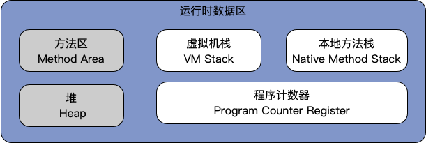
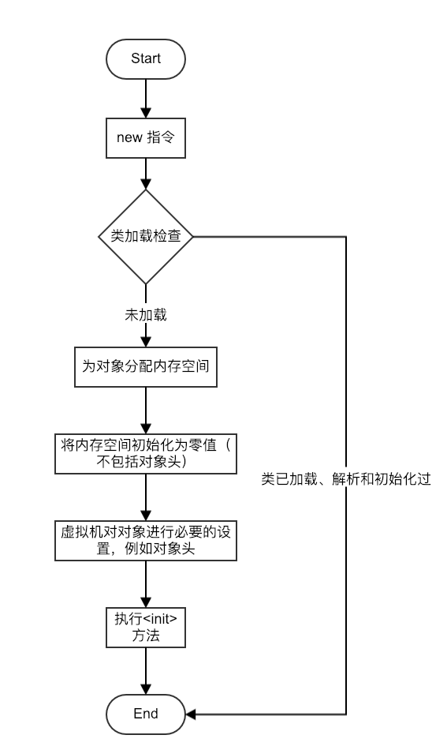
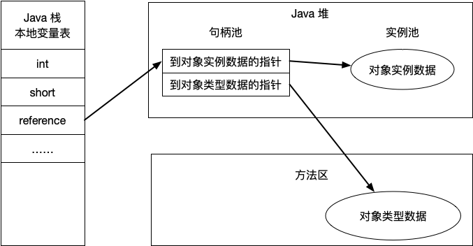
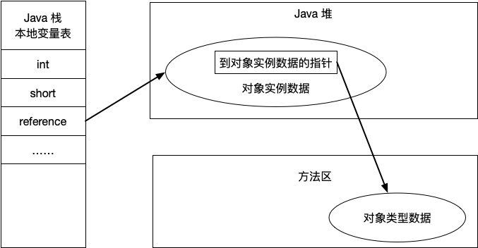

## 	第 1 章 Java 内存区域与内存溢出异常

[toc]

### 1.1 运行时数据区域



- 程序计数器：程序计数器是一块较小的内存空间，它可以看作是当前线程所执行的字节码的行号指示器。在虚拟机的概念模型里，字节码解释器就是通过改变这个计数器的值来选取下一条需要执行的字节码指令。由于 Java 虚拟机的多线程是通过线程轮流切换并分配处理器执行时间的方式来实现的，为了线程切换后能恢复到正确的执行位置，每条线程都需要有一个独立的程序计数器，独立存储互不影响。
- 虚拟机栈：与程序计数器一样，虚拟机栈也是线程私有的，它的生命周期与线程相同。虚拟机栈描述的是 Java 方法执行的内存模型：每个方法在执行的同时会创建一个栈帧（Stack Frame）用于存储局部变量表、操作数栈、动态链接、方法出口等信息。每个方法从调用直至执行完成，就对应着一个栈帧在虚拟机中入栈到出栈的过程。
- 本地方法栈：与虚拟机栈发挥的作用相似，不过本地方法栈则是为虚拟机使用到的 Native 方法服务。
- 堆：Java 堆是虚拟机所管理的内存中最大的一块。Java 堆是被所有线程共享的一块内存区域，用于存放对象实例（所有的对象实例以及数组）。Java 堆是垃圾收集器管理的主要区域，由于垃圾收集器基于分代收集算法，所以 Java 堆还可以细分为：新生代和老年代；在细致一点的有 Eden 空间、From Survivor 空间、To Survivor 空间等。
- 方法区：与 Java 堆一样，也是线程共享的内存区域，它用于存储已被虚拟机加载的类信息、常亮、静态变量、即时编译后的代码等数据。
- 运行时常量池：运行时常量池是方法区的一部分。Class 文件中除了有类的版本、字段、方法、接口等描述信息外，还有一项信息是常量池，用于存放编译期生成的各种字面量和符号引用，这部分内容将在类加载后进入方法区的常量池中存放。
- 直接内存：直接内存（Direct Memory）并不是虚拟机运行时数据区的一部分，也不是 Java 虚拟机规范中定义的内存区域。在 JDK1.4中 NIO 类，引入了一种基于通道（Channel）与缓冲区（Buffer）的 I/O 方式，它可以使用 Native 函数库直接分配堆外内存，然后通过一个存储在 Java 堆中的 DirectByteBuffer 对象作为这块内存的引用进行操作。这样能在一些场景中显著提高性能（避免了在 Java 堆和 Native 堆中来回复制数据）。直接内存的分配不会受到 Java 堆大小的限制，但受到机器总内存大小以及处理器寻址空间的限制。

### 1.2 HotSpot 虚拟机对象探秘

#### 1.2.1 对象创建

内存分配方式：

- 指针碰撞（Bump the Pointer）：假设Java 堆内存是规整的，已使用的内存与未使用的内存使用一个指针作为分界点指示器区分。在堆上分配内存，就是移动分界点的指针即可。
- 空闲列表（Free List）：如果Java 堆上的已使用的内存与未使用的内存相互交错，并不规整。就无法使用指针碰撞的方式来分配内存了，虚拟机就必须维护一份内存使用情况的列表，在分配内存是从列表中找出一块足够大的内存划分给对象。

内存空间是否规整，取决于使用哪种垃圾收集方式。使用带有Compact 过程的收集器（如 Serial、ParNew 等），系统采用的是指针碰撞，而使用基于Mark-Sweep 算法的收集器（如 CMS）时，通常采用空闲列表方式。

内存分配时的线程安全问题——不同线程间在分配对象时对堆内存存在竞争，两种解决方式：

1. 对分配内存空间的动作进行同步处理——采用 CAS 及失败重试方式保证更新操作的原子性
2. 把内存分配的动作按照线程划分在不同的空间之中进行，即每个线程在 Java 堆中预先分配一小块内存，称为本地线程分配缓冲（Thread Local Allocation Buffer，TLAB）。哪个线程要分配内存就在哪个线程的 TLAB 上分配，只有 TLAB 用完并分配新的 TLAB 时，才使用同步锁定。虚拟机可以通过 -XX:+/-UseTLAB 参数来设定是否使用本地线程分配缓冲

对象创建的流程：



> 虚拟机对对象进行必要设置完成后，从虚拟机的角度来看，一个新的对象已经产生了。但从 Java 程序的角度来看，对象的创建才刚刚开始——<init>方法还没有执行，所有字段都还是零。一般来说（由字节码中是否跟随 invokespecial 指令所决定），执行 new 指令之后会接着执行<init>方法，把对象按照程序的意愿进行初始化。

#### 1.2.2 对象的内存布局

在 HotSpot 虚拟机中，对象在内存中存储的布局可以分为：

- 对象头：包括两部分信息

  - 第一部分用于存储对象自身的运行时数据，如哈希码（HashCode）、GC 分代年龄、锁状态标志、线程持有的锁、偏向锁 ID、偏向时间戳等，这个部分数据成为 “Mark Word”。

    | 存储内容                              | 标志位 | 状态                 |
    | ------------------------------------- | ------ | -------------------- |
    | 对象哈希码、对象分代年龄              | 01     | 未锁定               |
    | 指向锁记录的指针                      | 00     | 轻量级锁定           |
    | 指向重量级锁的指针                    | 10     | 锁膨胀（重量级锁定） |
    | 空、不需要记录信息                    | 11     | GC 标记              |
    | 偏向线程 ID、偏向时间戳、对象分代年龄 | 01     | 可偏向               |

  - 第二部分是类型指针，即对象指向它的类型数据的指针，虚拟机通过这个指针来确定这个对象是哪个类的实例。并不是所有的虚拟机实现都必须在对象数据上保留类型指针。Java 数组，还必须在对象头中记录数组的长度信息（来辅助确定Java 对象的大小）。

- 实例数据：对象真正存储的有效信息，也是在程序代码中所定义的各种类型的字段内容（包括从父类中继承的）。

- 对齐填充：并不是必然存在的，也没有特别的含义，它仅仅起着占位符的作用。

#### 1.2.3 对象的访问定位

建立对象是为了使用对象，Java 程序需要通过栈上的 reference 数据来操作堆上的具体对象。由于虚拟机并未具体规定如何通过 reference 这个引用来定位、访问堆上的对象，具体实现由虚拟机自己决定。目前的两种主流实现方式：

- 句柄访问：Java 堆中将划分出一块内存来作为句柄池，reference 中存储的就是对象的句柄地址，而句柄地址包含了对象实例数据与类型数据各自的具体地址信息。

  

- 直接指针访问：Java 堆对象的布局中就必须考虑如何放置访问类型数据相关的信息，而 reference 中存储的直接就是对象地址。

  

这两种访问方式各有优势：

- 句柄访问的最大的好处就是 reference 中存储的是稳定的句柄地址，在对象被移动时只会改变句柄中的实例数据指针，而 reference 本身不需要修改；
- 直接指针访问最大好处即使速度更快，它节省了一次指针定位的时间开销，积少成多也是一项可观的执行成本，针对 HotSpot 虚拟机而言，它使用的正是这种方式。

### 1.3 OutOfMemoryError 异常

在 Java 虚拟机的规范描述中，除了程序计数器外，虚拟机内存的其他几个运行时区域都有可能发生 OutOfMemoryError 异常的可能。

#### 1.3.1 Java 堆溢出

Java 堆用于存储对象，只要不断创建对象并保证对象不被垃圾收集器回收，那么在对象数量到达最大堆得容量限制后就会产生溢出异常。

```java
/**
 * Java 堆溢出
 * VM Args：-Xms20m -Xmx20m -XX:+HeapDumpOnOutOfMemoryError
 */
public class HeapOOM {

    static class OOMObject {
    }

    public static void main(String[] args) {
        List<OOMObject> list = new ArrayList<>();

        while (true) {
            list.add(new OOMObject());
        }
    }

}
```

运行结果：

```java
java.lang.OutOfMemoryError: Java heap space
Dumping heap to java_pid8787.hprof ...
Heap dump file created [27905413 bytes in 0.088 secs]
Exception in thread "main" java.lang.OutOfMemoryError: Java heap space
	at java.util.Arrays.copyOf(Arrays.java:3210)
	at java.util.Arrays.copyOf(Arrays.java:3181)
	at java.util.ArrayList.grow(ArrayList.java:265)
	at java.util.ArrayList.ensureExplicitCapacity(ArrayList.java:239)
	at java.util.ArrayList.ensureCapacityInternal(ArrayList.java:231)
	at java.util.ArrayList.add(ArrayList.java:462)
	at com.leexm.jvm.demo.HeapOOM.main(HeapOOM.java:22)
```

#### 1.3.2 虚拟机栈和本地方法栈溢出

```java
/**
 * 虚拟机栈和本地方法栈溢出
 * VM Args：-Xss256k
 */
public class JavaVMStackSOF {

    private int stackLength = 1;

    public void stackLeak() {
        stackLength++;
        stackLeak();
    }

    public static void main(String[] args) {
        JavaVMStackSOF oom = new JavaVMStackSOF();
        try {
            oom.stackLeak();
        } catch (Throwable e) {
            System.out.println("stack length:" + oom.stackLength);
            throw e;
        }
    }

}
```

运行结果：

```java
stack length:1889
Exception in thread "main" java.lang.StackOverflowError
	at com.leexm.jvm.demo.JavaVMStackSOF.stackLeak(JavaVMStackSOF.java:15)
	at com.leexm.jvm.demo.JavaVMStackSOF.stackLeak(JavaVMStackSOF.java:16)
	at com.leexm.jvm.demo.JavaVMStackSOF.stackLeak(JavaVMStackSOF.java:16)
	at com.leexm.jvm.demo.JavaVMStackSOF.stackLeak(JavaVMStackSOF.java:16)
	at com.leexm.jvm.demo.JavaVMStackSOF.stackLeak(JavaVMStackSOF.java:16)
```

#### 1.3.3 方法区和运行时常量池溢出
