## 第 2 章 垃圾收集器与内存分配策略

垃圾收集（Garbage Collection，简称 GC）需要完成3件事情：

- 哪些内容需要回收
- 什么时候回收
- 如何回收

针对 Java 运行时的各个内存区域：

其中程序计数器、虚拟机栈、本地方法栈3个区域随线程而生，随线程而灭；栈中的栈帧随着方法的进入和退出而有条不紊的执行着出栈和入栈操作，每个栈帧中分配多少内存基本上是在类结构确定下来时就已知的，因此这几个区域的内存回收具有确定性，方法或线程结束时，内存自然就随着回收了。Java 堆和方法区则不一样，垃圾收集器所关注正是这部分区域。

### 2.1 对象是否存活

- 引用计数算法（Reference Counting）：给对象中添加一个引用计数器，每当对象被引用，计数值就加1；当引用失效，计数值就减1；任何时候计数值为0的对象就是不可能再被使用的。引用计数算法实现简单、判定效率也高，在大部分情况下它都是一个不错的算法。但主流的 Java 虚拟机都没使用该算法，其中最主要原因是它很难解决对象之间循环引用的问题。

- 可达性分析算法：通过一系列称为“GC Roots”的对象作为起始点，从这些节点开始向下搜索，搜索所走过的路径称为引用链（Reference Chain），当一个对象到 GC Roots 没有任何引用链相连时，则证明此对象时不可用的。

  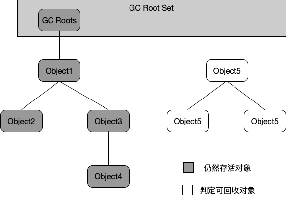

  在 Java 语言中，可作为 GC Roots 的对象包括下面几种：

  - 虚拟机栈（栈帧中的本地变量表）中引用的对象
  - 方法区中类静态属性引用的对象
  - 方法区中常量引用的对象
  - 本地方法栈中 JNI（即一般所说的 Native 方法） 引用的对象

无论是通过引用计数算法判断对象的引用数量，还是通过可达性分析算法判断对象的引用链是否可达，判断对象是否存活都与“引用”有关，引用可分为以下几种：

- 强引用：程序代码之中普遍存在的，类似“Object obj = new Object()” 这类的引用，只要引用还存在，垃圾收集器永远不会回收掉被引用的对象。
- 软引用：用来描述一些还有用但非必要的对象，对于软引用关联着的对象，在系统将要发生内存溢出异常之前，将会把这些对象列进回收范围之中进行第二次回收。如果这次回收还没有足够的内存，才会抛出内存溢出异常。
- 弱引用：用来描述非必需对象的，但是它的强度比软应用更弱一些，被弱引用关联的对象只能生存到下一次垃圾收集发生之前。
- 虚引用：最弱的一种引用关系，一个对象是否有虚引用的存在，完全不会对其生存时间构成影响，也无法通过一个虚引用来取得一个对象实例。为一个对象设置虚引用的唯一目的是能在这个对象被垃圾收集器回收时收到一个系统通知。

#### 2.1.1 对象回收

即使在可达性分析算法中不可达的对象，也并非是“非死不可”的，这个时候它们暂时处于“缓刑”阶段，要真正宣告一个对象死亡，至少要经历两次标记过程：

如果对象在进行可达性分析后发现没有与 GC Roots 相连接的引用链，那它将会被第一次标记并且进行一次筛选，筛选的条件是此对象是否有必要执行 finalize() 方法。当对象没有覆盖 finalize() 方法，或者 finalize() 方法已经被虚拟机调用过，虚拟机将这两种情况都视为“没有必要执行”。

如果一个对象被判定有必要执行 finalize() 方法，那么这个对象将会被放置在一个叫做 F-Queue 的队列之中，并在稍后由一个虚拟机自动建立的，低优先级的 Finalizer 线程去执行它。finalize() 方法是对象逃脱被回收的最后一次机会，稍后 GC 将对 F-Queue 中的对象进行第二次小规模的标记，如果对象要在 finalize() 中成功拯救自己——只要重新与引用链上任何一个对象建立关联即可，譬如把自己（this 关键字）赋值给某个类变量或者对象的成员变量，那在第二次标记时它将被移除出“即将回收”的集合；如果对象这时候还没有逃脱，那基本上就会被回收了。

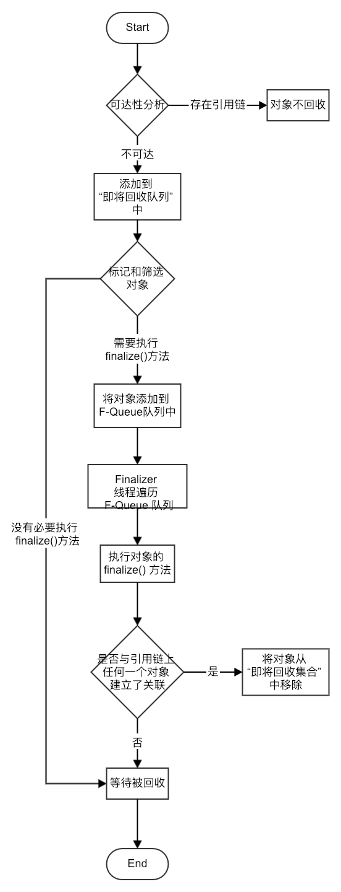

#### 2.1.2 回收方法区

Java 虚拟器规范不要求虚拟机在方法区实现垃圾收集，而且在方法区进行垃圾收集的“性价比”一般比较低。在堆中，尤其是在新生代中，常规应用进行一次垃圾收集一般可以回收70%~95%的空间，而永久代的垃圾收集效率远低于此。

永久代的垃圾收集主要回收两部分内容：**废弃常量**和**无用的类**

***无用的类*** 的判定条件：

- 该类所有的实例已经被回收，也就是 Java 堆中不存在该类的任何实例；
- 加载该类的 ClassLoader 已经被回收；
- 该类对应的 java.lang.Class 对象没有在任何地方被引用，无法在任何地方通过反射访问该类的方法。

虚拟机可以对满足上述3个条件的无用的类进行回收，而不是像对象一样不使用了就必然会回收。HotSpot 虚拟机提供了 -Xnoclassgc 参数来控制，还可以使用 -verbose:class 以及 -XX:+TraceClassLoadin、 -XX:+TraceClassUnLoading 查看类加载和卸载信息（其中  -verbose:class、 -XX:+TraceClassLoading 可以在Product 版的 HotSpot 虚拟机中使用，-XX:+TraceClassUnLoading 只有 FastDebug 版才支持）。

### 2.2 垃圾收集算法

#### 2.2.1 标记—清除算法

标记—清除算法（Mark-Sweep）是最基础的算法，算法分“标记”和“清除”两个阶段：首先标记出所有需要回收的对象，在标记完成后统一回收。

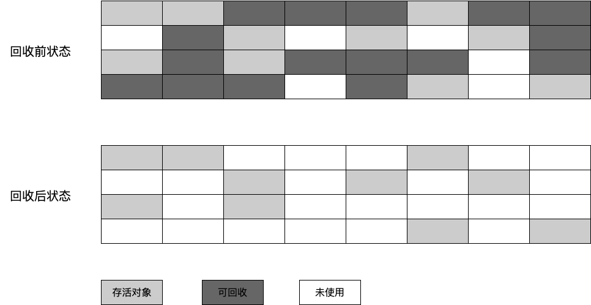

该算法的不足：

- 效率问题：标记和清除两个过程的效率不高
- 空间问题：回收之后会产生大量的不连续内存碎片，碎片太多导致以后在程序运行过程中需要分配较大对象时，无法找到足够的连续内存而不得不触发另一次垃圾收集动作。

#### 2.2.2 复制算法

复制（Copying）算法：为了解决效率问题而出现，它可将内存按容量划分为大小相等的两块，每次只使用其中的一块，当这一块的内存用完了，就将还存活的对象复制到另外一块上面，然后把已使用过的内存空间一次清理掉。这样使得每次都是对半个内存空间进行回收，内存分配不用考虑内存碎片等复杂情况，只要移动堆顶指针，按顺序分配内存即可，实现简单、运行高效。

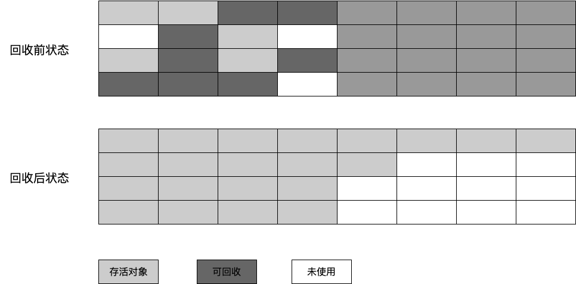

现代商用虚拟机都是采用这种算法改进型来回收新生代：将内存分为一块较大的 **Eden** 空间和两块较小的 **Survivor** 空间，每次使用 Eden 和其中的一块 Survivor。当垃圾回收时，将 Eden 和 Survivor 中还存活着的对象一次性复制到另外一个 Survivor 空间上，最后清理掉 Eden 和 Survivor 空间。HotSpot 虚拟机模式 Eden 和 Survivor 的大小比例是 ***8:1***。

垃圾回收时，不能保证另一个 Survivor 空间一定可以容得下还存活的对象，所以当 Survivor 空间不够用时，需要依赖其他内存进行分配担保，这些对象直接通过分配担保机制进入老年代。

#### 2.2.3 标记—整理算法

复制收集算法在对象存活率较高时不合适，所以在老年代中不能直接使用该算法。针对 ***老年代*** 的特点，提出了“标记—整理”（Mark—Compact）算法：标记过程与“标记—清除”算法一样，但后续步骤不是直接对可回收对象进行清理，而是让所有存活的对象都向一端移动，然后直接清理掉端边界以外的内存。

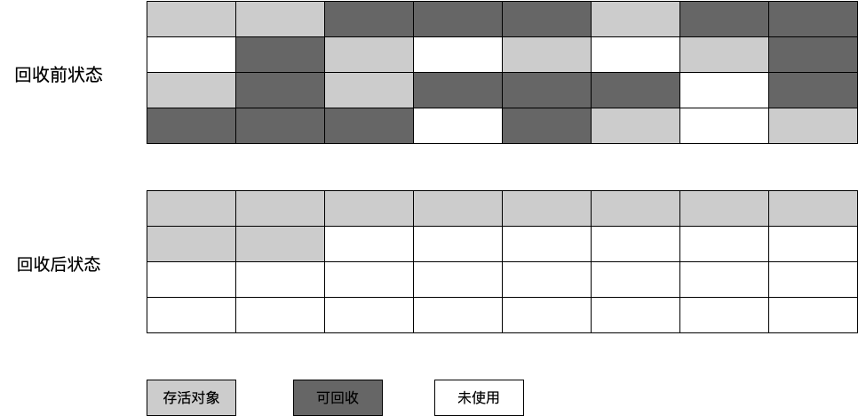

#### 2.2.4 分代收集算法

当前商业虚拟机都是采用“分代收集”（Generational Collection）算法。根据对象存活周期的不同将内存划分为几块，新生代和老年代，各自采用合适的垃圾收集算法。新生代中，可采用复制算法；老年代（对象存活率高，没有额外空间对它进行担保），使用“标记—清理”或者“标记—整理”算法。

#### 2.2.5 HotSpot 的算法实现

GC 停顿：可达性分析工作必须在一个能确保一致性的快照中进行——这里的“一致性”的意思是指整个分析期间整个执行系统看起来就像被冻结在某个时间点上，不可以出现分析过程中对象引用关系还在不断变化的情况，该点不满足的话分析结果准确性就无法得到保证，这点是导致 GC 时必须停顿所有 Java 执行线程（“Stop the world”）的一个重要原因。

HotSpot 使用 OopMap 的数据结构来记录对象的引用。

安全点：HotSpot 在“特定的位置”记录每条指令产生的 OopMap 信息。程序执行时并非所有地方都能停顿下来开始 GC，只有在达到安全点时才能停顿。

线程可以通过 **抢占式中断** 或者 **主动式中断** 方式停顿在安全点。

安全区域：安全点概念的放大。

### 2.3 垃圾收集器

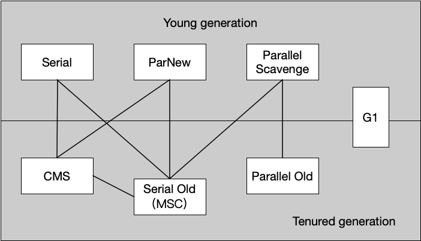

图中展示了7中作用于不同分代的收集器，如果两个收集器之间存在连线，说明它们可以搭配使用。

#### 2.3.1 Serial 收集器

Serial 收集器是最基本、历史最悠久的收集器，是一个单线程收集器。它会使用一个 CPU 或一条收集线程去完成垃圾收集工作，并且在同时必须暂停其他所有的工作线程，直到它完成收集工作。除了上述缺点，Serial 收集器也有优于其他收集器的地方：简单高效。是在 Client 模式下运行的虚拟机的一个很好的选择。

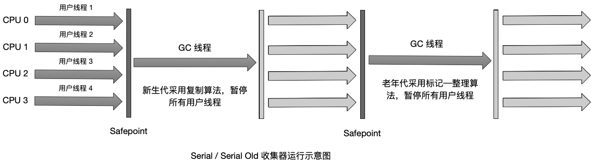

#### 2.3.2 Serial Old收集器

Serial Old 收集器是 Serial收集器的老年代版本，同样也是一个单线程收集器，使用“标记—整理”算法。

#### 2.3.3 ParNew 收集器

ParNew 收集器其实就是 Serial 收集器的多线程版本，除了使用多条线程进行垃圾收集之外，其余行为包括 Serial 收集器可用的控制参数（例如：-XX:SurvivorRatio、-XX:PretenureSizeThreshold）、收集算法、回收策略等都与 Serial 收集器完全一样，是许多运行在 Server 模式下的虚拟机中首选的新生代收集器。

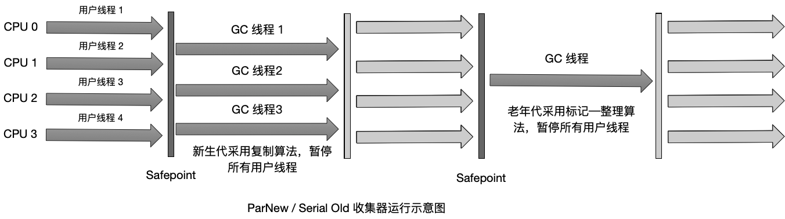

#### 2.3.4 Parallel Scavenge 收集器

Parallel Scavenge 收集器是一个新生代收集器，它也是使用复制算法的收集器，又是并行的多线程收集器。Parallel Scavenge 收集器的关注点与其他收集器不同：其他收集器是尽可能地缩短垃圾收时用户线程的停顿时间，而它的目标是达到一个可控制的吞吐量。所谓的吞吐量是 CPU 用于运行用户代码的时间与 CPU 总消耗时间的比值，即 $吞吐量 = 运行用户代码时间 / (运行用户代码时间 + 垃圾收集时间)$ 。

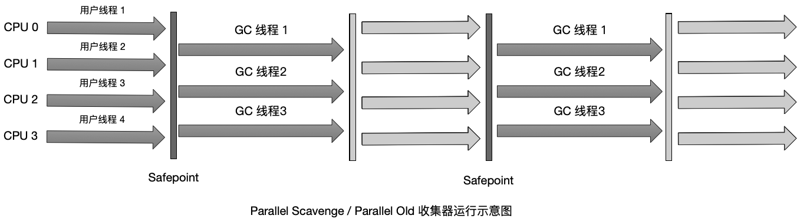

#### 2.3.5 Parallel Old 收集器

Parallel Old 收集器是 Parallel Scavenge 收集器的老年代版本，使用多线程和“标记—整理”算法。

#### 2.3.6 CMS 收集器

CMS（Concurrent Mark Sweep）收集器是一种以获取最短回收停顿时间为目标的收集器，使用“标记—清除”算法。

它的垃圾回收过程可分为：

- 初始标记（CMS initial mark）：仅仅只是标记下 GC Roots 能直接关联到的对象，速度很快；
- 并发标记（CMS concurrent mark）：进行 GC Roots Tracing 的过程；
- 重新标记（CMS remark）：修正并发标记期间因用户程序继续运行而导致标记产生变动的那一部分对象的标记记录，这个时间的停顿比初始标记长，但远比并发标记的时间短；
- 并发清除（CMS concurrent sweep）

其中 开始标记 和 重新标记这两个步骤仍然需要“Stop the World”。

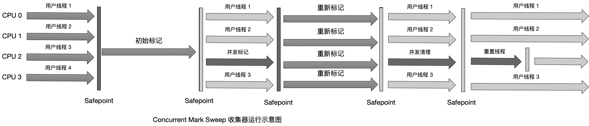

优点：并发收集、低停顿。

缺点：

- CMS 收集器对 CPU 资源非常敏感。
- CMS 收集器无法处理浮动垃圾（Floating Garbage），可能出现“Concurrent Mode Failure”失败而导致另一次 Full GC 的产生。
- CMS 收集器是基于“标记—清除”算法实现，垃圾收集结束会有大量空间碎片产生。

#### 2.3.7 G1 收集器

G1(Garbage-First) 收集器是一款面向服务器应用的垃圾收集器，是当今收集器技术发展的最前沿成果之一。G1具备以下特点：

- 并行与并发：G1能充分利用多 CPU、多核环境下的硬件优势，使用多个 CPU 来缩短 Stop-The-World停顿时间，部分其他收集器原本需要停顿 Java 线程执行的 GC 动作，G1收集器仍然可以通过并发的方式让 Java 线程继续执行。
- 分代收集：分代的概念在 G1 中依然保留，它能够采用不同的方式去处理新创建的对象和已经存活了一段时间、熬过多次 GC 的就对象。
- 空间整合：基于“标记—整理”算法实现的。G1运行期间不会产生内存空间碎片，收集后能提供规整的可用内存。这种特性有利于程序长时间运行，分配大对象是不会因为无法提供连续内存空间而提前触发下一次 GC。
- 可预测停顿：与 CMS 收集器相比，G1除了追求低停顿外，还能建立可预测的停顿时间模型，能让使用者明确指定在一个长度为 M 毫秒的时间片段内，消耗在垃圾收集上的时间不得超过 N 毫秒。

使用 G1收集器时，Java 堆得内存布局与其他收集器有很大差别，它将整个 Java 堆划分为多个大小相等的独立区域（Region），虽然还保留有新生代和老年代的概念，但新生代和老年代不在是物理隔离的，它们都是一部分 Region（不需要连续） 的集合。

G1收集器跟踪各个 Region 里面的垃圾堆积的价值大小（回收所获得的空间大小以及回收所需要时间的经验值），在后台维护一个有限列表，每次根据允许的收集时间，优先回收价值最大的 Region（这个也是 Garbage-First 名称的由来），而不是在整Java 堆上进行全区域的垃圾回收。

G1收集器中，Region 之间的对象引用以及其他收集器中的新生代与老年代之间对象引用，虚拟机都是使用 Remember Set 来避免全堆扫描的。G1的每个 Region 都有一个与之对象 Remember Set，虚拟机发现程序在对 Reference 类型进行写操作时，会产生一个 Write Barrier 暂时中断写操作，检查 Reference 引用的对象是否处于不同的 Region 之间（在分代的例子中就是检查是否老年代中的对象引用了新生代中的对象），如果是，便通过 GardTable 把相关引用信息记录到被引用对象所属的 Region 的 Remember Set 之中。当进行内存回收时，在 GC Roots 的枚举范围中加入 Remember Set 即可保证不对全堆扫描也不会有遗漏。

G1收集器的运作大致可划分为以下步骤：

- 初始标记：仅仅是标记下 GC Roots 能直接关联到的对象，并修改 TAMS（Next Top at Mark Start）的值，让下一阶段用户程序并发运行时，能在正确可用的 Region 中创建新对象，这阶段需要停顿线程，但耗时很短。
- 并发标记：从 GC Roots 开始进行对堆中的对象进行可达性分析
- 最终标记：为了修正在并发标记期间因用户线程继续运行而导致标记产生变动的那一部分标记记录，虚拟机将这段时间对象变化记录在线程 Remember Set Logs 里面，最终标记阶段需要把 Remember Set Logs 的数据合并到 Remember Set 中，这阶段需要停顿线程。
- 筛选回收：首先对各个 Region 的回收价值和成本进行排序，根据用户所期望的 GC 停顿时间来制定回收计划。

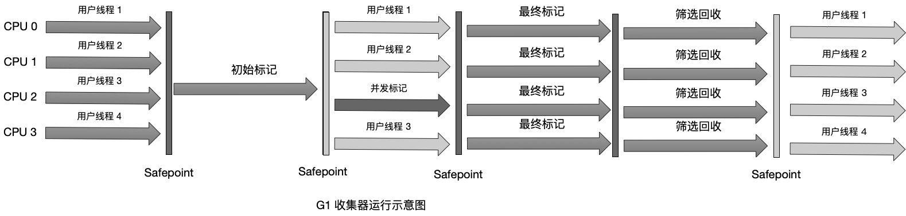

#### 2.3.8 垃圾收集器参数总结

| 参数                           | 描述                                                         |
| ------------------------------ | ------------------------------------------------------------ |
| UseSerialGC                    | 虚拟机运行在 Client 模式下的默认值，打开此开关后，使用 Serial + Serial Old 的收集器组合进行内存回收 |
| UseParNewGC                    | 打开此开关后，使用 ParNew + Serial Old 的收集器组合进行内存回收 |
| UseConcMarkSweepGC             | 打开此开关后，使用 ParNew + CMS + Serial Old 的收集器组合进行内存回收。Serial Old 收集器将作为 CMS 收集器出现 Concurrent Mode Failure 失败后的后备收集器使用 |
| UseParallelGC                  | 虚拟机运行在 Server 模式下的默认值，打开此开关后，使用 Parallel Scavenge +   Serial Old（PS MarkSweep）的收集器组合进行内存回收 |
| UseParallelOldGC               | 打开此开关后，使用 Parallel Scavenge + Parallel Old 的收集器组合进行内存回收 |
| SurvivorRatio                  | 新生代中 Eden 区域与 Survivor 区域的容量比值，默认为8，代表 Eden:Survivor=8:1 |
| PretenureSizeThreshold         | 直接晋升到老年代的对象大小，设置这个参数后，大于这个参数的对象将直接在老年代分配 |
| MaxTenuringThreshold           | 晋升到老年代的对象年龄。每个对象在坚持过一次 Minor GC 之后，年龄就增加1，当超过这个参数值时就进入老年代 |
| UseAdaptiveSizePolicy          | 动态调整 Java 堆中各个区域的大小以及进入老年代的年龄         |
| HandlePromotionFailure         | 是否允许分配担保失败，即老年代的剩余空间不足以应付新生代的整个 Eden 和 Survivor 区的所有对象都存活的极端情况 |
| ParallelGCThreads              | 设置并行 GC 时内存回收的线程数                               |
| GCTimeRatio                    | GC 时间占总时间的比率，默认值时99，即允许1%的 GC 时间。仅在使用 Parallel Scavenge 收集器时生效 |
| MaxGCPauseMillis               | 设置 GC 的最大停顿时间。仅在使用 Parallel Scavenge 收集器时生效 |
| CMSInitiatingOccupancyFraction | 设置 CMS 收集器在老年代空间被使用多少后触发垃圾收集，默认值为68%，仅在使用 CMS 收集器时生效 |
| UseCMSCompactAtFullCollection  | 设置 CMS 收集器在完成垃圾收集后是否要进行一次内存碎片整理，仅在使用 CMS 收集器时生效 |
| CMSFullGCsBeforeCompaction     | 设置 CMS 收集器在进行若干次垃圾收集后在启动一次内存碎片整理，仅在使用 CMS 收集器时生效 |

### 2.4 内存分配与回收策略

Java 技术体系中所提倡的自动内存管理最终可以归纳为：给对象分配内存以及回收分配给对象的内存。

对象的内存分配，往大方向讲，就是在堆上分配（但也可能经过 JIT 编译后被拆散为标量类型并间接地栈上分配），对象主要在新生代的 Eden 区上，如果启动了本地线程分配缓冲（TLAB），将按线程优先在 TLAB 上分配。少数情况下也可能会直接分配在老年代中，分配的规则并不是百分之百固定的，其细节取决于当前使用的是哪一种垃圾收集器组合，还有虚拟机中与内存相关的参数的设置。

分配规则：

- 对象优先在 Eden 分配：大多数情况下，对象在新生代 Eden 区中分配，当 Eden 区没有足够空间进行分配时，虚拟机将发起一次 Minor GC。
- 大对象直接进入老年代：所谓大对象是指需要连续内存空间的 Java 对象，最典型的大对象就是那张很长的字符串以及数组。大对象对虚拟机的内存分配是个坏消息（尤其是那些生存时间很短的大对象），经常出现大对象容易导致内存还有不少空间时就提前触发垃圾收集以获取足够的连续空间来分配它们。虚拟机提供了           ***-XX:PretenureSizeThreshold*** 参数，令大于这个设置值得的对象直接在老年代分配，以避免在 Eden 区以及两个 Survivor 区之间发生大量的内存复制。
- 长期存活的对象将进入老年代：虚拟机给每一个对象定义了一个对象年龄计数器，如果对象在 Eden 分配并经过一次 Minor GC 后仍然存活，并且能被 Survivor 容纳的话，将被移动到 Survivor 空间中，将对象年龄设为1。对象在 Survivor 区中每经历一次 Minor GC，年龄就增加1，当它的年龄增加在一定程度（默认为15），就将会被晋升到老年代中。对象晋升老年代的阈值，可以通过参数 ***-XX:MaxTenuringThreshold*** 设置。
- 动态对象年龄判定：为了能更好地适应不同程序的内存状况，虚拟机并不是永远地要求对象的年龄必须达到了 MaxTenuringThreshold 才能晋升老年代。如果 Survivor 空间中相同年龄所有对象大小的总和大于 Survivor 空间的一半，年龄大于或等于该年龄的对象就可以直接进入老年代，无须等到MaxTenuringThreshold中要求的年龄。

空间分配担保：在发生 Minor GC 之前，虚拟机会先检查老年代最大可用的连续空间是否大于新生代所有对象总空间，如果这个条件成立，那么 Minor GC 可以确保是安全的。如果不成立，则虚拟机会查看 ***HandlePromotionFailure*** 设置值是否允许担保失败。如果允许，那么会继续检查老年代最大可用的连续空间是否大于历次晋升到老年代对象的平均大小，如果大于，将尝试进行一次 Minor GC，尽管这次 Minor GC 是有风险的；如果小于，或者 ***HandlePromotionFailure*** 设置值不允许冒险，那这时要改为进行一次 Full GC。