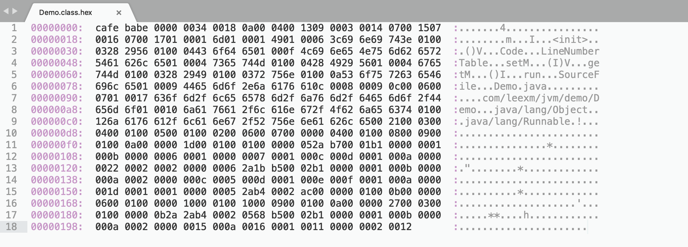
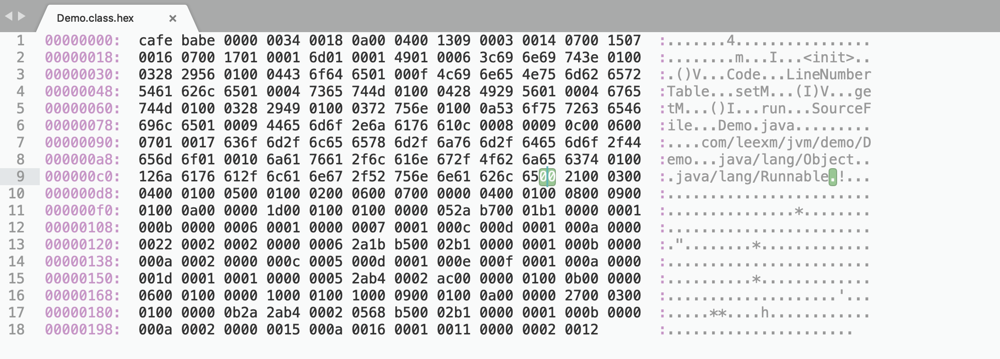
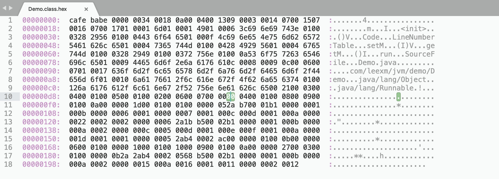

## 第 4 章 类文件结构

### 4.1 Class 文件结构

Class 文件是一组以8位字节为基础单位的二进制流，各个数据项目严格按照顺序紧凑地排列在一起，中间没有任何分隔符。这种结构中只有两种数据类型：无符号数和表。

无符号数属于基本数据类型，以 u1、u2、u4、u8分别代表1个字节、2个字节、4个字节和8个字节的无符号数，无符号数可以用来描述数字、索引引用、数量值或者按照 UTF-8编码构成字符串值。

表是由多个无符号数或者其他表作为数据项构成的复合数据类型，所有表都习惯性地以*“_info”*结尾。

**Class 文件格式**

| 类型           | 名称                | 数量                    |
| -------------- | ------------------- | ----------------------- |
| u4             | magic               | 1                       |
| u2             | minor_version       | 1                       |
| u2             | major_version       | 1                       |
| u2             | constant_pool_count | 1                       |
| cp_info        | constant_pool       | constant_pool_count - 1 |
| u2             | access_flags        | 1                       |
| u2             | this_class          | 1                       |
| u2             | super_class         | 1                       |
| u2             | interfaces_count    | 1                       |
| u2             | interfaces          | interfaces_count        |
| u2             | fields_count        | 1                       |
| field_info     | fields              | fields_count            |
| u2             | methods_count       | 1                       |
| method_info    | methods             | methods_count           |
| u2             | attributes_count    | 1                       |
| attribute_info | attributes          | attributes_count        |

为了方便讲解，使用下面代码进行解析

```java
package com.leexm.jvm.demo;

/**
 * @author: leexm
 * @date: 2019/2/26 22:55
 */
public class Demo implements Runnable {

    private int m;

    public void setM(int m) {
        this.m = m;
    }

    public int getM() {
        return m;
    }

    @Override
    public void run() {
        m = m * 2;
    }

}
```

上述代码编译后的 class 文件



#### 4.1.1 魔数与 Class 文件

- magic：表示魔数，并且魔数占用了4个字节，魔数到底是做什么的呢？它其实就是表示一下这个文件的类型是一个Class文件，而不是一张JPG图片，或者AVI的电影。而Class文件对应的魔数是0xCAFEBABE。
- minor_version：表示 Class 文件的次版本号，并且此版本号是u2类型的无符号数表示。
- major_version 表示 Class 文件的主版本号，并且主版本号是u2类型的无符号数表示。

major_version 和 minor_version 主要用来表示当前的虚拟机是否接受当前这种版本的Class文件。不同版本的Java编译器编译的Class文件对应的版本是不一样的。高版本的虚拟机支持低版本的编译器编译的 Class文件结构。比如Java SE 6.0对应的虚拟机支持 Java SE 5.0的编译器编译的Class文件结构，反之则不行。

>对照上述图片，可以查出该 class 文件的 此版本号： 0x0000；主版本号：0x0034即52，即 JDK 1.8编译的文件

#### 4.1.2 常量池

主次版本号之后的是常量池入口。常量池可以理解为 Class 文件之中的资源仓库，它是 Class 文件结构中与其他项目关联最多的数据类型。由于常量池中的常量数量不是固定的，所以常量池入库有一个 u2 类型的数据，代表常量池容量计数值（这个数据计数下标是从1而不是0开始的，与 Java 语言的差异）。

- constant_pool_count：常量池计数值

常量池主要存放两大常量：字面量和符号引用。其中字面量主要包括字符串，final常量的值或者某个属性的初始值等等；而符号引用主要包括类和接口的全限定名称，字段的名称以及描述符，方法的名称以及描述符（描述符的概念，放到下面说字段表以及方法表的时候再说）。常量池中每一项都是一个表。

| 类型                             | 标志 | 描述                     |
| -------------------------------- | ---- | ------------------------ |
| CONSTANT_Utf8_info               | 1    | UTF-8编码的字符串        |
| CONSTANT_Integer_Info            | 3    | 整形字面量               |
| CONSTANT_Float_info              | 4    | 浮点型字面量             |
| CONSTANT_Long_info               | 5    | 长整形字面量             |
| CONSTANT_Double_info             | 6    | 双精度浮点型字面量       |
| CONSTANT_Class_info              | 7    | 类或接口的符号引用       |
| CONSTANT_String_info             | 8    | 字符串类型字面量         |
| CONSTANT_Fieldref_info           | 9    | 字段的符号引用           |
| CONSTANT_Methodref_info          | 10   | 类中方法的符号引用       |
| CONSTANT_InterfaceMethodref_info | 11   | 接口中方法的符号引用     |
| CONSTANT_NameAndType_info        | 12   | 字段或方法的部分符号引用 |
| CONSTANT_MethodHandle_info       | 15   | 表示方法句柄             |
| CONSTANT_MethodType_info         | 16   | 标识方法类型             |
| CONSTANT_InvokeDynamic_info      | 18   | 表示一个动态方法调用点   |

上述常量均有自己的结构，结如下：

```c
CONSTANT_Utf8_info {
    u1 tag;				// 值为 1
    u2 length;			// UTF-8 编码的字符串占用的字节数
    u1 bytes[length];	// 长度为 length 的 UTF-8编码的字符串
}

CONSTANT_Integer_info {
    u1 tag;		// 值为 3
    u4 bytes;	// 按照高位在前存储的 int 值
}

CONSTANT_Float_info {
    u1 tag;		// 值为 4
    u4 bytes;	// float 值
}

CONSTANT_Long_info {
    u1 tag;				// 值为 5
    u4 high_bytes;		// 高位字节
    u4 low_bytes;		// 低位字节
}

CONSTANT_Double_info {
    u1 tag;				// 值 6
    u4 high_bytes;		// 高位字节
    u4 low_bytes;		// 低位字节
}

CONSTANT_Class_info {
    u1 tag;				// 值 7
    u2 name_index;		// 指向全限定名常量项的索引
}

CONSTANT_String_info {
    u1 tag;				// 值 8
    u2 string_index;	// 指向字符串字面量的索引
}

CONSTANT_Fieldref_info {
    u1 tag;						// 值 9
    u2 class_index;				// 指向声明字段的类或接口描述符 CONSTANT_Class_info 的索引值
    u2 name_and_type_index;		// 指向字段描述符 CONSTANT_NameAndType_info 的索引项
}

CONSTANT_Methodref_info {
    u1 tag;						// 值 10
    u2 class_index;				// 指向声明方法的类描述符 CONSTANT_Class_info 的索引值
    u2 name_and_type_index;		// 指向名称及类型描述符 CONSTANT_NameAndType_info 的索引项
}

CONSTANT_InterfaceMethodref_info {
    u1 tag;						// 值 11
    u2 class_index;				// 指向声明方法的接口描述符 CONSTANT_Class_info 的索引值
    u2 name_and_type_index;		// 指向名称及类型描述符 CONSTANT_NameAndType_info 的索引项
}

CONSTANT_NameAndType_info {
    u1 tag;						// 值 12
    u2 name_index;				// 指向该字段或方法名称常量项的索引
    u2 descriptor_index;		// 指向该字段或方法描述符常量项的索引
}

CONSTANT_MethodHandle_info {
    u1 tag;					// 值 15
    u1 reference_kind;		// 值必须在[1， 9]，它决定了方法句柄的类型。方法句柄类型的值表示方法句柄的							 //字节码行为
    u2 reference_index;		// 值必须是对常量池的有效索引
}

CONSTANT_MethodType_info {
    u1 tag;						// 值16
    u2 descriptor_index;		// 值必须是对常量池的有效索引，常量池在该索引处的项必须是 											// CONSTANT_Utf8_info 结构，表示方法的描述符
}

CONSTANT_InvokeDynamic_info {
    u1 tag;							// 值 18
    u2 bootstrap_method_attr_index;	// 值必须是对当前 Class 文件中引导方法表的 														// bootstrap_methods[] 数组的有效索引
    u2 name_and_type_index;			// 值必须是对常量池的有效索引，常量池在该索引处的项必须是 											// CONSTANT_NameAndType_info 结构，表示方法名和方法描述符
}
```


> 继续分析 Demo.class 文件：
>
> constant_pool_count：0x018，可知常量池数量是 24 - 1 = 23，即有23个常量。
>
> 各个常量紧随constant_pool_count之后，逐个分析各个常量：（使用 \# 后面跟数字来表示第几个常量）
>
> \#1，tag：0x0a，即10，可知该常量是 CONSTANT_Methodref_info 类型的；
>
> ​	class_index : 0x0004，即4，可知该常量指向常量池的第4个常量
>
> ​	name_and_type_index：0x0013，即19，可知该常量指向常量池的第19个常量
>
> ```
> #1 {
> 	tag:10;						// CONSTANT_Methodref_info
> 	class_index:#4;
> 	name_and_type_index:#19;
> }
> 
> 按照以上思路继续分析
> 
> #2 {
> 	tag:9;						// CONSTANT_Fieldref_info
> 	class_index:#3;
> 	name_and_type_index:#20;	
> 
> }
> 
> #3 {
> 	tag:7;						// CONSTANT_Class_info
> 	name_index:#21;
> }
> 
> #4 {
> 	tag:7;
> 	name_index:#22;
> }
> 
> #5 {
> 	tag:7;
> 	name_index:#23;
> }
> 
> #6 {
> 	tag:1;						// CONSTANT_Utf8_info
> 	length:1;					// 0x0001
> 	bytes:m;					// 0x006d，转字符即 m
> 
> }
> 
> #7 {
> 	tag:1;
> 	length:1;	
> 	bytes:I;					// 0x49，转字符即 l
> }
> 
> #8 {
> 	tag:1;
> 	length:6;
> 	bytes:<init>;				// 0x3c 0x69 0x6e 0x69 0x74 0x3e，这个6个转字符为<init>
> }
> 
> #9 {
> 
> 	tag:1;
> 	length:3;
> 	bytes:()V;
> }
> 
> #10 {
> 	tag:1;
> 	length:4;
> 	bytes:Code;
> 
> }
> 
> #11 {
> 	tag:1;
> 	length:15;
> 	bytes:LineNumberTable;
> 
> }
> 
> #12 {
> 	tag:1;
> 	length:4;
> 	bytes:setM
> }
> 
> #13 {
> 	tag:1;
> 	length:4;
> 	bytes:(I)V;
> 
> }
> 
> #14 {
> 	tag:1;
> 	length:4;
> 	bytes:getM;
> }
> 
> #15 {
> 	tag:1;
> 	length:3;
> 	bytes:()I;
> }
> 
> #16 {
> 	tag:1;
> 	length:3;
> 	bytes:run;
> }
> 
> #17 {
> 	tag:1;
> 	length:10;
> 	bytes:SourceFile;
> }
> 
> #18 {
> 	tag:1;
> 	length:9;
> 	bytes:Demo.java;
> }
> 
> #19 {
> 	tag:12;
> 	name_index:#8;
> 	descriptor_index:#9;
> }
> 
> #20 {
> 	tag:12;
> 	name_index:#6;
> 	descriptor_index:#7;
> }
> 
> #21 {
> 	tag:1;
> 	length:23;
> 	bytes:com/leexm/jvm/demo/Demo;
> }
> 
> #22 {
> 	tag:1;
> 	length:16;
> 	bytes:java/lang/Object;
> }
> 
> #23 {
> 	tag:1;
> 	length:18;
> 	bytes:java/lang/Runnable;
> }
> ```

#### 4.1.3 访问标识

在常量池结束之后，紧跟着的两个字节代表访问标志(access_flags)，这个标志用于识别一些类或者接口的访问信息，包括：这个 Class 是类还是接口，是否定义为 public 类型，是否定义为 abstract 类型；如果是类的话，是否被声明为 final 等。

| 标志名称       | 标志值 | 含义                                                         |
| -------------- | ------ | ------------------------------------------------------------ |
| ACC_PUBLIC     | 0x0001 | 是否为 public 类型                                           |
| ACC_FINAL      | 0x0010 | 类是否被声明为 final                                         |
| ACC_SUPER      | 0x0020 | 是否允许使用 invokespecial 字节码指令的新语义，在 JDK1.2之后的类都会带有该标识 |
| ACC_INTERFACE  | 0x0200 | 标识是一个接口                                               |
| ACC_ABSTRACT   | 0x0400 | 是否为 abstract 类型，对于接口或者抽象类来说，此标志值为真，其他值为假 |
| ACC_SYNTHETIC  | 0x1000 | 标识这个类并非由用户代码产生的                               |
| ACC_ANNOTATION | 0x2000 | 标识是一个注释                                               |
| ACC_ENUM       | 0x4000 | 标识是一份枚举                                               |



> 继续分析Demo.class 文件。
>
> access_flags：0x0021，0x0021=0x0020|0x0001，即 ACC_PUPLIC 和 ACC_SUPER 都是真

#### 4.1.4 类索引、父类索引与接口索引集合

类索引和父类索引都是一个 u2 类型的数据；而接口索引集合是一组 u2 类型的数据集合，Class 文件中由这三项数据来确定这个类的继承关系。

- this_class：表示类的常量池索引，指向常量池中CONSTANT_Class_info的常量

- super_class：表示超类的索引，指向常量池中CONSTANT_Class_info的常量

- interface_counts：表示接口的数量

- interfaces[interface_counts]：表示接口表，它里面每一项都指向常量池中CONSTANT_Class_info常量

> 继续分析Demo.class 文件。
>
> this_class: 0x0003，即指向常量池 \#3，根据之前分析的常量池，\#3 指向 \#21，常量 \#21即 com/leexm/jvm/demo/Demo
>
> super_class: 0x0004，即指向常量池 \#4，\#4 指向 \#22，\#22 即 java/lang/Object
>
> interface_counts: 0x0001，即接口的数量是1个
>
> interfaces: 0x0005，即指向常量池 \#5，\#5 指向 \#23，\#23 即 java/lang/Runnable

#### 4.1.5 字段表集合

字段表（field_info）用于描述接口或类中声明的变量，字段（field）包括类级别变量以及实例变量，但不包括在方法内部声明的局部变量。

```java
// 字段的数据结构
field_info {
    u2             access_flags;		// 修饰符
    u2             name_index;			// 字段的名称，对常量池的引用
    u2             descriptor_index;	// 描述符，对常量池的引用
    u2             attributes_count;	// 属性的数量
    attribute_info attributes[attributes_count];
}
```

描述一个字段的信息有：

- 字段的作用域，public、private、protected
- 是实例变量还是类级别变量，static 修饰符
- 可变性，final 修饰符
- 并发可见性，volatile 修饰符
- 是否被序列化，transient 修饰符
- 字段数据类型，基本数据类型、对象、数组
- 字段的名称

上述信息中，各个修饰符都是布尔值，使用标志位来表示。

*修饰符表*

| 标志名称       | 标志值 | 含义                                                         |
| -------------- | ------ | ------------------------------------------------------------ |
| ACC_PUBLIC     | 0x0001 | 字段是否 public                                              |
| ACC_PRIVATE    | 0x0002 | 字段是否 private                                             |
| ACC_PROTECTED  | 0x0004 | 字段是否 protected                                           |
| ACC_STATIC     | 0x0008 | 字段是否 static                                              |
| ACC_FINAL      | 0x0010 | 字段是否 final                                               |
| ACC_VOLATILE   | 0x0040 | 字段是否 volatile                                            |
| ACC_TRANSIENT  | 0x0080 | 字段是否 transient                                           |
| ACC_SYNTHTIC   | 0x1000 | 字段是否由编译器自动产生                                     |
| ACC_ENUM       | 0x4000 | 字段是否 enum                                                |

*描述符标识字符含义*

| 标识字符 | 含义                           |
| -------- | ------------------------------ |
| B        | 基本类型 byte                  |
| C        | 基本类型 char                  |
| D        | 基本类型 double                |
| F        | 基本类型 float                 |
| I        | 基本类型 int                   |
| J        | 基本类型 long                  |
| S        | 基本类型 short                 |
| Z        | 基本类型 boolean               |
| V        | 特殊类型 void                  |
| L        | 对象类型，如 Ljava/lang/Object |

对于数组类型，每一维度将使用一个前置的”[“字符来描述。如一个定义为”String\[][]“类型的二维数组，将被记录为”[[Ljava/lang/Object“，一个整型数组”int\[]“，将被记录为”[I“。

用描述符来描述方法时，按照先参数列表，后返回值的顺序描述，参数列表按照参数的严格顺序放在一组小括号"()"之内。如方法 void inc() 的描述符为 "()V"；方法 java.lang.String toString() 的描述符为 ”()Ljava/lang/String“。

> 继续分析Demo.class 文件
>
> fields_count: 0x0001，即有一个字段
>
> ```
> field: {
> 	access_flags: 0x0002;		// 即 private
> 	name_index: 0x0006;			// 指向常量#6，即 m
> 	descriptor_index: 0x0007;	// 指向常量#7，即字符 I，int 类型
> 	attributes_count: 0x0000;	// 属性信息长度是0，即没有额外的属性信息
> }
> ```
>
> 综上，Demo.java的类中只有一个字段，private int m。有没有额外的属性信息，可知 m = 0；关于属性信息将在下面分析属性表时在详细分析。

字段表集合中不会列出从父类或者接口中继承而来的字段，但有可能列出原来 Java 代码中不存在的字段，例如在内部类中为了保持对外部类的访问性，会自动添加指向外部类实例的字段。

#### 4.1.6 方法表集合

Class 文件存储格式中对方法的描述与对字段的描述几乎采用完全一致的方式。

```java
method_info {
    u2             access_flags;
    u2             name_index;
    u2             descriptor_index;
    u2             attributes_count;
    attribute_info attributes[attributes_count];
}
```

*修饰符*

| 标志名称         | 标志值 | 含义                             |
| ---------------- | ------ | -------------------------------- |
| ACC_PUBLIC       | 0x0001 | 方法是否 public                  |
| ACC_PRIVATE      | 0x0002 | 方法是否 private                 |
| ACC_PROTECTED    | 0x0004 | 方法是否 protected               |
| ACC_STATIC       | 0x0008 | 方法是否 static                  |
| ACC_FINAL        | 0x0010 | 方法是否 final                   |
| ACC_SYNCHRONIZED | 0x0020 | 方法是否为 synchronize           |
| ACC_BRIDGE       | 0x0040 | 方法是否是由编译器产生的桥接方法 |
| ACC_VARARGS      | 0x0080 | 方法是否接受不定参数             |
| ACC_NATIVE       | 0x0100 | 方法是否为 native                |
| ACC_ABSTRACT     | 0x0400 | 方法是否为 abstract              |
| ACC_STRICTFP     | 0x0800 | 方法是否为 strictfp              |
| ACC_SYNTHETIC    | 0x1000 | 方法是否是由编译器自动产生的     |

至于方法里的 Java 代码，经过编译器编译成字节码指令后，存放在方法属性表集合中一个名为”Code“的属性里面，属性表是 Class 文件格式中最具扩展性的一种数据项目，将会在下一节分析。

#### 4.1.7 属性表集合

在 Class 文件中，字段表、方法表都可以携带自己的属性表集合，以用于描述某些场景专有的信息。与 Class文件中其他数据项目要求严格的顺序、长度和内容不同，属性表集合的限制稍微宽松一些，不再要求各个属性表具有严格顺序，并且只要不与已有属性名重复即可。

*Java 虚拟机规范预定义的属性*

| 属性名称                                | 使用位置           | 含义                                                         |
| --------------------------------------- | ------------------ | ------------------------------------------------------------ |
| Code                                    | 方法表             | Java 代码编译成的字节码指令                                  |
| ConstantValue                           | 字段表             | final 关键字定义的常量值                                     |
| Deprecated                              | 类、方法表、字段表 | 被声明为 deprecated 的方法和字段                             |
| Exceptions                              | 方法表             | 方法抛出的异常                                               |
| EnclosingMethod                         | 类文件             | 仅当类为局部类或匿名类时才有的属性，标识该类所在的外围方法   |
| InnerClass                              | 类文件             | 内部类列表                                                   |
| LineNumberTable                         | Code 属性          | Java 源码的行号与字节码指令的对应关系                        |
| LocalVariableTable                      | Code 属性          | 方法的局部变量描述                                           |
| StackMapTable                           | Code 属性          | JDK 1.6中新增的，供新的类型检查验证器（Type Checker）检查和处理目标方法的局部变量和操作数栈所需要的类型是否匹配 |
| Signature                               | 类、方法表、字段表 | JDK 1.5中新增的，用于支持泛型情况下的方法签名，在 Java 语言中，任何类、接口、初始化方法或成员的泛型签名如果包含了类型变量（Type Variable）或参数化类型（Parameterized Types），则 Signature 属性会为他记录泛型签名信息。由于 Java 的泛型采用擦除法实现，在为了避免类型信息被擦除后导致签名混乱，需要这个属性记录泛型中的相关信息。 |
| SourceFile                              | 类文件             | 记录源文件名称                                               |
| SourceDebugExtension                    | 类文件             | JDK 1.6 中新增的，用于存储额外的调试信息。                   |
| Synthetic                               | 类、方法表、字段表 | 标识方法或字段为编译器自动生成的                             |
| LocalVariableTypeTable                  | 类                 | JDK 1.5新增的，它使用特征签名代替描述符，为了引入泛型语法之后能描述泛型参数化类型而添加 |
| RuntimeVariableAnnotation               | 类、方法表、字段表 | JDK 1.5新增的，为动态注解提供支持。用于指明哪些注解是运行时可见的 |
| RuntimeInvisibleAnnotation              | 类、方法表、字段表 | JDK 1.5新增的，用于指明哪些注解是运行时不可见的              |
| RuntimeVisibleParameter<br>Annotation   | 方法表             | JDK 1.5新增的，作用与RuntimeVariableAnnotation类似，只是作用对象为方法参数 |
| RuntimeInvisibleParameter<br>Annotation | 方法表             | JDK 1.5新增的，作用与RuntimeInvisibleAnnotation类似，只是作用对象为方法参数 |
| AnnotationDefault                       | 方法表             | JDK 1.5新增的，用于记录注解类元素的默认值                    |
| BootstrapMethods                        | 类文件             | JDK 1.7新增的，用于保存 invokedynamic 指令引用的引导方法限定符 |
| MethodParameters                        | 方法表             | JDK 1.8新增的，用于保存方法参数信息，例如参数的名称          |

对于每个属性，它的名称需要从常量池中引用一个 CONSTANT_Utf8_info 类型的常量来表示，结构如下：

```java
attribute_info {
    u2 attribute_name_index;	// 属性名称，指向常量池的 CONSTANT_Utf8_info 型常量
    u4 attribute_length;		// 属性个数
    u1 info[attribute_length];	// 属性信息
}
```

1. **Code 属性**

   Java 程序方法体中的代码经过 Javac 编译器处理后，最终变为字节码指令存储在 Code 属性内。Code 属性出现在方法表的属性集合中，但并非所有的方法表都必须存在这个属性，譬如接口或抽象类中的方法就不存在 Code 属性。
   ```java   
   Code_attribute {
       u2 attribute_name_index;	// 属性名称，指向常量池的 CONSTANT_Utf8_info 型常量
       u4 attribute_length;		// 属性值长度
       u2 max_stack;				// 操作数栈深度的最大值
       u2 max_locals;				// 局部变量表所需的存储空间
       u4 code_length;				// Java代码编译后生成的字节码指令的长度
       u1 code[code_length];		// 字节码指令集合，每个字节码指令u1类型
       u2 exception_table_length;
       {   u2 start_pc;
           u2 end_pc;
           u2 handler_pc;
           u2 catch_type;
       } exception_table[exception_table_length];
       u2 attributes_count;
       attribute_info attributes[attributes_count];
   }
   ```

   说明：

   - 属性表长度，由于属性名称与属性值长度一共为6字节，所以属性值的长度固定为整个属性表长度减去6个字节
   - max_locals 的单位是 ***Slot***，Slot 是虚拟机为局部变量分配内存所使用的最小单位。对于 byte、char、float、int、short、boolean 和 returnAddress 等长度不超过32位的数据类型，每个局部变量占用一个 Slot，而 double 和 long 类型需要两个 Slot
   - 方法参数（包括实例方法中的隐藏参数 this）、显示异常处理器的参数（Exception Handler Parameter，就是 try-catch 语句中 catch 块所定义的异常）、方法体中定义的局部变量都需要使用局部变量表来存放
   - 并不是方法中用到了多少个局部变量，就把这些变量所占 Slot 之和作为 max_locals 的值，原因是局部变量表中的 Slot 可以重用，当代码执行超过一个局部变量的作用域时，这个局部变量所占的 Slot 可以被其他局部变量所使用
   - 关于 code_length，虽然它是一个 u4 类型的长度值，理论上最大值可以达到 $2^{32}-1$，但是虚拟机规范中明确限制了一个方法不允许超过65535条字节码指令，即它实际只使用了 u2的长度，如果超过这个限制，Javac 编译器会拒绝编译
   - 字节码指令之后是方法的显示异常处理表集合，异常表对于 Code 属性来说并不是必须存在的。如果字节码在区间 [start_pc, end_pc) 出现了类型为 catch_type（指向常量池的 CONSTANT_Utf8_info 型常量） 或者其子类异常，则转到第 handler_pc 行继续处理。当 catch_type 的值为0时，任意异常情况都需要转到 handler_pc 处进行处理

2. **Exceptions 属性**

   Exceptions 属性的作用是列举出方法中可能抛出的受检查异常，也就是方法描述时在 throws 关键字后面列举的异常。

   ```java
   Exceptions_attribute {
       u2 attribute_name_index;
       u4 attribute_length;
       u2 number_of_exceptions;		// 异常的个数
       u2 exception_index_table[number_of_exceptions];		// 异常类型集合，指向常量池 																// CONSTANT_Utf8_info 类型常量
   }
   ```

3. **LineNumberTable 属性**

   LineNumberTable 属性用于描述 Java 源码行号与字节码执行行号（字节码的偏移量）之间的对应关系。它并不是运行时必需的属性，但默认会生产在 Class 文件之中，可以在 Javac 找中分别使用 -g:none 或 -g:lines 选项来取消或要求生成它。

   ```java
   LineNumberTable_attribute {
       u2 attribute_name_index;
       u4 attribute_length;
       u2 line_number_table_length;
       {   u2 start_pc;		// 字节码行号
           u2 line_number;		// Java 源码行号
       } line_number_table[line_number_table_length];
   }
   ```

4. **LocalVariableTable 属性**

   该属性用于描述栈帧中局部变量表中的变量与 Java 源码中定义的变量之间的关系，非运行时必需属性，默认会生成的，可以使用 -g:none 或 -g:vars选项来取消或要求生成这项信息。

   ```java
   LocalVariableTable_attribute {
       u2 attribute_name_index;
       u4 attribute_length;
       u2 local_variable_table_length;
       {   u2 start_pc;
           u2 length;
           u2 name_index;				// 变量名称，指向常量池 CONSTANT_Utf8_info 常量
           u2 descriptor_index;		// 变量描述符，指向常量池 CONSTANT_Utf8_info 常量
           u2 index;
       } local_variable_table[local_variable_table_length];
   }
   ```

   说明：

   - start_pc 和 length 属性分别代表了这个局部变量的生命周期开始的字节码偏移量及其作用范围覆盖的长度，两者结合起来就是这个局部变量在字节码之中的作用于范围
   - index 是这个局部变量在栈帧局部变量表中 Slot 的位置，当这个变量数据类型是64位类型时，它占用的 Slot 位 index 和 index+1两个

5. **LocalVariableTypeTable 属性**

   该属性是在 JDK 1.5引入泛型而新增的，与 LocalVariableTable 属性极为相似

   ```java
   LocalVariableTypeTable_attribute {
       u2 attribute_name_index;
       u4 attribute_length;
       u2 local_variable_type_table_length;
       {   u2 start_pc;
           u2 length;
           u2 name_index;			// 变量名称，指向常量池 CONSTANT_Utf8_info 常量
           u2 signature_index;		// 特征签名，指向常量池 CONSTANT_Utf8_info 常量
           u2 index;
       } local_variable_type_table[local_variable_type_table_length];
   }
   ```

   说明：对于非泛型来说，描述符和特征签名描述的信息是基本一致的，但是泛型引入后，由于描述符中泛型的参数化类型被擦除掉了，描述符就不能准确地描述泛型类型了，因此才定义了该属性

6. **SourceFile 属性**

   可选属性

   ```java
   SourceFile_attribute {
       u2 attribute_name_index;
       u4 attribute_length;
       u2 sourcefile_index;		// 执行常量池中 CONSTANT_Utf8_info 常量
   }
   ```

7. **ConstantValue 属性**

   ConstantValue 属性的作用是通知虚拟机自动为静态变量赋值，只用被 static 关键字修饰的变量才可以使用这个属性。对于非 static 类型的变量（即实例变量）的赋值是在实例构造器 \<init> 方法中进行的；而对于类变量，则有两种方式可以选择：在类构造器 \<cinit> 方法中或者使用 ConstantValue 属性。目前 Sun Javac 编译器的选择是：如果同时使用 final 和 static 来修饰的一个变量，并且这个变量是基本数据类型或 String 的话，就生成 ConstantValue 属性来进行初始化；如果没有被 fianl 修饰或者并非基本数据类型，则将会在 \<cinit> 方法中进行初始化。

   ```java
   ConstantValue_attribute {
       u2 attribute_name_index;
       u4 attribute_length;
       u2 constantvalue_index;		// 常量池中一个字面量常量的引用
   }
   ```

8. **InnerClasses 属性**

   该属性用于记录内部类与宿主类之间额关联，如果一个类中定义了内部类，那么编译器将会将它以及它所包含的内部类生成InnerClasses 属性。

   ```java
   InnerClasses_attribute {
       u2 attribute_name_index;
       u4 attribute_length;
       u2 number_of_classes;					// 内部类的个数
       {   u2 inner_class_info_index;			// 内部类，指向常量池 CONSTANT_Class_info常量
           u2 outer_class_info_index;			// 宿主类，指向常量池 CONSTANT_Class_info常量
           u2 inner_name_index;				// 内部类名称，执行常量；如果是内部类，则值是0
           u2 inner_class_access_flags;		// 内部类访问标识，类似于 access_flags
       } classes[number_of_classes];
   }
   ```

9. **Deprecated 及Synthetic 属性**

   这两个属性都属于标志类型的布尔属性，只存在有和没有的区别，没有属性的概念。

   Synthetic 属性代表此字段或方法并不是由 Java 源码直接产生的，而是由编译器自行添加的。在 JDK 1.5 之后，标识一个类、字段或者方法是由编译器自动产生的，也可以设置它的访问标志中 ACC_SYNTHETIC 标志位，其中最典型的例子就是Bridge Method。所有由非用户代码产生的类、方法以及字段都应当至少设置 Synthetic 属性和 ACC_SYNTHETIC 标志位中的一项，唯一例外的是实例构造器\<init>方法和类构造器\<cinit>方法。

   ```java
   Synthetic_attribute {
       u2 attribute_name_index;
       u4 attribute_length;
   }
   ```

   **注意：其中 attribute_length 数据项的值必须为0x00000000，因为没有任属性需要设置**

10. **StackMapTable 属性**

   是一个复杂的变长属性，位于 Code 属性的属性表中。这个属性会在虚拟机类加载的字节码验证阶段被新类型检查验证器（Type Checker）使用，目的在于代替以前比较消耗性能的基于数据流分析的类型推到验证器。

   StackMapTable 属性中包含零至多个栈映射帧，每个栈映射帧都是显示或隐式的地代表了一个字节码偏移量，用于表示执行到该字节码时局部变量表和操作数栈的验证类型。类型检查验证器会通过检查目标方法的局部变量和操作数栈所需要的类型来确定一段字节码指令是否符合逻辑约束。

   ```java
   StackMapTable_attribute {
       u2              attribute_name_index;
       u4              attribute_length;
       u2              number_of_entries;
       stack_map_frame entries[number_of_entries];
   }
   ```

11. **Signature 属性**

    该属性用于记录泛型签名信息

    ```java
    Signature_attribute {
        u2 attribute_name_index;
        u4 attribute_length;
        u2 signature_index;			// 指向常量池的 CONSTANT_Utf8_info 常量
    }
    ```

12. **BootstrapMethods 属性**

    Java 虚拟机规范中规定，如果一个类文件结构的常量池中有 CONSTANT_InvokeDynamic_info 类型的常量，那么这个类文件的属性表中必须存在一个明确的 BootstrapMethods 属性且只能有一个。

    ```java
    BootstrapMethods_attribute {
        u2 attribute_name_index;
        u4 attribute_length;
        u2 num_bootstrap_methods;
        {   u2 bootstrap_method_ref;		// 指向常量池 CONSTANT_MethodHandle_info 索引
            u2 num_bootstrap_arguments;
            u2 bootstrap_arguments[num_bootstrap_arguments];	// 对常量池中常量的索引
        } bootstrap_methods[num_bootstrap_methods];
    }
    ```

13. **MethodParameters 属性**

    作用于方法表，主要用于记录方法参数的信息，如名字

    ```java
    MethodParameters_attribute {
        u2 attribute_name_index;
        u4 attribute_length;
        u1 parameters_count;
        {   u2 name_index;				// 值为0；或者指向常量池中的 CONSTANT_Utf8_info 类型常量
            u2 access_flags;			// 标志位，可取值ACC_FINAL、ACC_SYNTHETIC、ACC_MANDATED
        } parameters[parameters_count];
    }
    ```

Class 文件的结构介绍完，继续分析 Demo.class文件。



> 上面已经分析完了字段表，接下来分下方法表
>
> methods_count: 0x0004，即有四个方法。
>
> ```
> m1 {
> 	access_flags: 0x0001;			// 即 public
> 	name_index: 0x0008;				// 指向常量#8，即 <init>
> 	descriptor_index: 0x0009;		// 指向常量#9，即()V
> 	attributes_count: 0x0001;		// 即1个属性信息
> 	attributes:[
> 		attributes[0]: {
> 			attribute_name_index: 0x000a;			// 指向常量#10，即Code属性
> 			attribute_length: 0x0000001d;			// 即29，后面连续29个u1类型都属于这个属性
> 			max_stack: 0x0001;						// 即操作数栈深度为1
> 			max_locals: 0x0001;						// 即局部变量表需要1个 Slot
> 			code_length: 0x00000005;				// 字节码指令数量是5
> 			code:[									// 字节码指令集合
> 				code[0]: 0x2a;						// aload_0指令
> 				code[1]: 0xb7;						// invokespecial
> 				code[2]: 0x00;						// nop
> 				code[3]: 0x01;						// aconst_null
> 				code[4]: 0xb1;						// return
> 			];
> 			exception_table_length: 0x0000;			// 没有声明异常
> 			// exception_tables;		
> 			attributes_count: 0x0001;
> 			attributes:[
> 				attributes[0]:{
> 					attribute_name_index: 0x000b;	// 常量#11，即LineNumberTable
> 					attribute_length: 0x00000006;	// 即6，即后面连续6个u1类型都属于这个属性
> 					line_number_table_length: 0x0001;	// 即1
> 					line_number_tables:[
> 						line_number_table[0]:{
> 							start_pc: 0x0000;
> 							line_number: 0x0007;
> 						}
> 					]
> 				}
> 			]
> 		}
> 	]
> }
> ```
>
> ```
> m2 {
> 	access_flags: 0x0001;			// 即 public
> 	name_index: 0x000c;				// 指向常量#12，即 setM
> 	descriptor_index: 0x000d;		// 指向常量#13，即(I)V
> 	attributes_count: 0x0001;		// 即1个属性信息
> 	attributes:[
> 		attributes[0]: {
> 			attribute_name_index: 0x000a;	       // 指向常量#10，即Code属性
> 			attribute_length: 0x00000022;	       // 即34
> 			max_stack: 0x0002;					   // 即操作数栈深度为2
> 			max_locals: 0x0002;			       	   // 即局部变量表需要2个 Slot
> 			code_length: 0x00000006;		   	   // 字节码指令数量是6
> 			code:[						      	   // 字节码指令集合
> 				code[0]: 0x2a;					   // aload_0指令
> 				code[1]: 0x1b;			 		   // iload_1
> 				code[2]: 0xb5;					   // putfield
> 				code[3]: 0x00;					   // nop
> 				code[4]: 0x02;					   // iconst_m1
> 				code[5]: 0xb1					   // return
> 			];
> 			exception_table_length: 0x0000;		   // 没有声明异常
> 			// exception_tables;		
> 			attributes_count: 0x0001;
> 			attributes:[
> 				attributes[0]:{
> 					attribute_name_index: 0x000b;		// 常量#11，即LineNumberTable
> 					attribute_length: 0x0000000a;	 	// 即10
> 					line_number_table_length: 0x0002;	// 即2
> 					line_number_tables:[
> 						line_number_table[0]:{
> 							start_pc: 0x0000;
> 							line_number: 0x000c;		// 即12		
> 						}
> 						line_number_table[1]:{
> 							start_pc: 0x0005;
> 							line_number: 0x000d;		// 即13		
> 						}
> 					]
> 				}
> 			]
> 		}
> 	]
> }
> ```
>
> ```
> m3 {
> 	access_flags: 0x0001;			// 即 public
> 	name_index: 0x000e;				// 指向常量#14，即 getM
> 	descriptor_index: 0x000f;		// 指向常量#15，即()I
> 	attributes_count: 0x0001;		// 即1个属性信息
> 	attributes:[
> 		attributes[0]: {
> 			attribute_name_index: 0x000a;			// 指向常量#10，即 Code属性
> 			attribute_length: 0x0000001d;			// 即29
> 			max_stack: 0x0001;						// 即操作数栈深度为1
> 			max_locals: 0x0001;						// 即局部变量表需要1个 Slot
> 			code_length: 0x00000005;		   	    // 字节码指令数量是5
> 			code:[									// 字节码指令集合
> 				code[0]: 0x2a;						// aload_0指令
> 				code[1]: 0xb4;						//getfield
> 				code[2]: 0x00;						// nop
> 				code[3]: 0x02;						// iconst_m1
> 				code[4]: 0xac;						// ireturn
> 			];
> 			exception_table_length: 0x0000;			// 没有声明异常
> 			// exception_tables;		
> 			attributes_count: 0x0001;
> 			attributes:[
> 				attributes[0]:{
> 					attribute_name_index: 0x000b;		// 常量#11，即LineNumberTable
> 					attribute_length: 0x00000006;	 	// 即6
> 					line_number_table_length: 0x0001;	// 即1
> 					line_number_tables:[
> 						line_number_table[0]:{
> 							start_pc: 0x0000;
> 							line_number: 0x0010;		// 即16
> 						}
> 					]
> 				}
> 			]
> 		}
> 	]
> }
> ```
>
> ```
> m4 {
> 	access_flags: 0x0001;				// 即 public
> 	name_index: 0x0010;					// 指向常量#16，即 run
> 	descriptor_index: 0x0009;			// 指向常量#9，即()V
> 	attributes_count: 0x0001;			// 即1个属性信息
> 	attributes:[
> 		attributes[0]: {
> 			attribute_name_index: 0x000a;			// 指向常量 \#10，即 Code属性
> 			attribute_length: 0x00000027;			// 即39
> 			max_stack: 0x0003;						// 即操作数栈深度为3
> 			max_locals: 0x0001;						// 即局部变量表需要1个 Slot
> 			code_length: 0x0000000b;		   	    // 字节码指令数量是11
> 			code:[						      	    // 字节码指令集合
> 				code[0]: 0x2a;					    // aload_0指令
> 				code[1]: 0x2a;			 		    // invokespecial
> 				code[2]: 0xb4;					    // getfield
> 				code[3]: 0x00;						// nop
> 				code[4]: 0x02;						// iconst_m1
> 				code[5]: 0x05;						// iconst_2
> 				code[6]: 0x68;						// imul
> 				code[7]: 0xb5;						// putfield
> 				code[8]: 0x00;						// nop
> 				code[9]: 0x02;						// iconst_m1
> 				code[10]: 0xb1;						// return
> 			];
> 			exception_table_length: 0x0000;			// 没有声明异常
> 			// exception_tables;		
> 			attributes_count: 0x0001;
> 			attributes:[
> 				attributes[0]:{
> 					attribute_name_index: 0x000b;		// 常量#11，即LineNumberTable
> 					attribute_length: 0x0000000a;	 	// 即10
> 					line_number_table_length: 0x0002;	// 即2
> 					line_number_tables:[
> 						line_number_table[0]:{
> 							start_pc: 0x0000;
> 							line_number: 0x0015;		// 即21
> 						}
> 						line_number_table[1]:{
> 							start_pc: 0x000a;			// 即10
> 							line_number: 0x0016;		// 即22
> 						}
> 					]
> 				}
> 			]
> 		}
> 	]
> }
> ```
>
> 方法表解析完毕！接下来分析属性表
>
> attributes_count: 0x0001;		// 即只有一个属性
>
> ```
> attribute_info:[
> 	attribute[0]:{
> 		attribute_name_index: 0x0011;	// 即常量#17，SourceFile属性
> 		attribute_length: 0x00000002;	// 即2
> 		sourcefile_index: 0x0012;		// 即常量#18，Demo.java
> 	}
> }
> ```
>
> 至此整个 Demo.class文件解析完毕！
>

### 4.2 Class 文件的解析

在 4.1章节，手动解析了 Class 文件结构。其实有各个现成的工具来帮助进行解析。比较有常用的有

- jlibclass bytecode viewer，[github 地址](https://github.com/ingokegel/jclasslib)
- jdk 自带的 javap

使用 javap -verbose Demo，来解析 Demo.class文件，结果如下

```
Classfile /Users/leexm/workspace/java/jvm/src/main/java/com/leexm/jvm/demo/Demo.class
  Last modified Feb 26, 2019; size 430 bytes
  MD5 checksum 3399fcca5b2ad49def85c36fb6a2c304
  Compiled from "Demo.java"
public class com.leexm.jvm.demo.Demo implements java.lang.Runnable
  minor version: 0
  major version: 52
  flags: ACC_PUBLIC, ACC_SUPER
Constant pool:
   #1 = Methodref          #4.#19         // java/lang/Object."<init>":()V
   #2 = Fieldref           #3.#20         // com/leexm/jvm/demo/Demo.m:I
   #3 = Class              #21            // com/leexm/jvm/demo/Demo
   #4 = Class              #22            // java/lang/Object
   #5 = Class              #23            // java/lang/Runnable
   #6 = Utf8               m
   #7 = Utf8               I
   #8 = Utf8               <init>
   #9 = Utf8               ()V
  #10 = Utf8               Code
  #11 = Utf8               LineNumberTable
  #12 = Utf8               setM
  #13 = Utf8               (I)V
  #14 = Utf8               getM
  #15 = Utf8               ()I
  #16 = Utf8               run
  #17 = Utf8               SourceFile
  #18 = Utf8               Demo.java
  #19 = NameAndType        #8:#9          // "<init>":()V
  #20 = NameAndType        #6:#7          // m:I
  #21 = Utf8               com/leexm/jvm/demo/Demo
  #22 = Utf8               java/lang/Object
  #23 = Utf8               java/lang/Runnable
{
  public com.leexm.jvm.demo.Demo();
    descriptor: ()V
    flags: ACC_PUBLIC
    Code:
      stack=1, locals=1, args_size=1
         0: aload_0
         1: invokespecial #1                  // Method java/lang/Object."<init>":()V
         4: return
      LineNumberTable:
        line 7: 0

  public void setM(int);
    descriptor: (I)V
    flags: ACC_PUBLIC
    Code:
      stack=2, locals=2, args_size=2
         0: aload_0
         1: iload_1
         2: putfield      #2                  // Field m:I
         5: return
      LineNumberTable:
        line 12: 0
        line 13: 5

  public int getM();
    descriptor: ()I
    flags: ACC_PUBLIC
    Code:
      stack=1, locals=1, args_size=1
         0: aload_0
         1: getfield      #2                  // Field m:I
         4: ireturn
      LineNumberTable:
        line 16: 0

  public void run();
    descriptor: ()V
    flags: ACC_PUBLIC
    Code:
      stack=3, locals=1, args_size=1
         0: aload_0
         1: aload_0
         2: getfield      #2                  // Field m:I
         5: iconst_2
         6: imul
         7: putfield      #2                  // Field m:I
        10: return
      LineNumberTable:
        line 21: 0
        line 22: 10
}
SourceFile: "Demo.java"
```

和之前的手动解析结果进行比对，手动解析是正确的。

参考：

\[1]: [*Java SE 8 Edition* 虚拟机规范](https://docs.oracle.com/javase/specs/jvms/se8/html/index.html)
