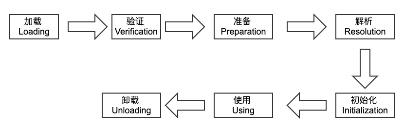
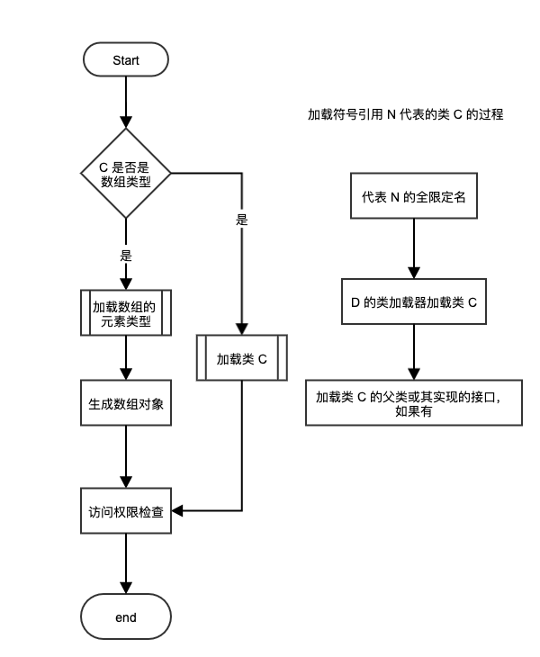
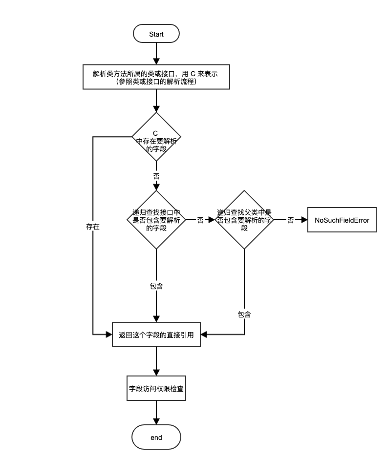
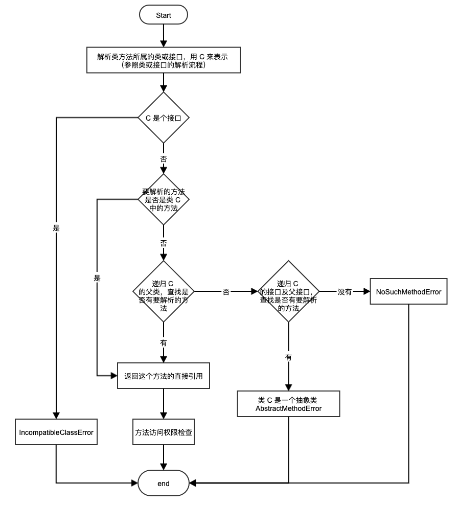
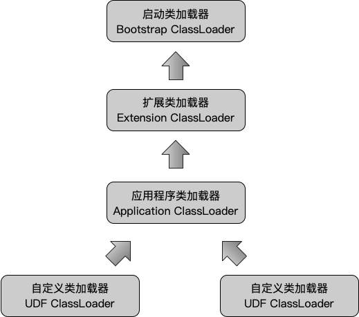

## 第 5 章 虚拟机类加载机制

虚拟机把描述类的数据从 Class 文件加载到内存，并对数据进行校验、转换解析和初始化，最终形成可以被虚拟机直接使用的 Java 类型，这就是虚拟机的类加载机制。在 Java 语言里，类型的加载、连接和初始化过程都是在程序运行期间完成的，这虽然会导致增加一些性能开销，但是会为 Java 应用程序提供更高的灵活性。Java 动态扩展的语言特性就是依赖运行期动态加载和动态连接这个特点实现的。

### 5.1 类加载的过程

类从被加载到虚拟机内存中，到卸载出内存为止，整个的生命周期流程：



其中验证、准备、解析3个部分统称为连接(Linking)。

#### 5.1.1 加载

在加载阶段，虚拟机需要完成以下3件事情：

- 通过一个类的全限定名来获取定义此类的二进制字节流
- 将这个字节流所代表的静态存储结构转化为方法区的运行时数据结构
- 在内存中生成一个代表这个类的 java.lang.Class 对象，作为方法区这个类的各种数据的访问入口

以上三条是虚拟机规范的规定，各个虚拟机可以灵活的实现。针对第一条，获取字节流但并未规定字节流的来源，因此可以有多种实现方案，例如：从zip包中读取（Jar、War 包等）、从网络获取（Apple 技术）、运行时计算生成（动态代理技术）、由其他文件生成（JSP的应用）等等。

与通过类加载器加载的普通类相比，数组类加载是由 Java 虚拟机直接创建的。但数组类与类加载器依然有密切的关系，因为数组类的元素类型最终还是通过类加载器加载。

一个数组类创建过程遵循以下规则：

- 如果数组的组件类型（指数组去掉一个维度的类型）是引用类型，那就递归加载这个组件类型。该数组的数组类将在加载该组件类型的类加载器的类名称空间上被标识
- 如果数组的组件类型不是引用类型（例如 int[] 数组），Java 虚拟机将会把该数组的数组类标记为与引导类加载器关联
- 数组类的可见性与它的组件类型的可见性一致，如果组件类型不是引用类型，那数组类的可见性将默认为 public

加载阶段完成后，虚拟机外部的二进制字节流就按照虚拟机所需的格式存储在方法区之中（方法区中的数据存储格式由虚拟机实现，虚拟机规范并未对此数据结构进行规定，可自行定义)。然后在内存中实例化一个 **java.lang.Class** 类的对象（并未明确规定是在 Java 堆中，HotSpot 就将该对象存放在方法区中），这个对象作为程序访问方法区中的这些类型数据的外部接口。

#### 5.1.2 验证

验证是连接阶段的第一步，目的是为了确保 Class 文件的字节流中的信息符合当前虚拟机的要求，并且不会危害虚拟机自身的安全。虚拟机规范对验证阶段的规则和约束有详细的说明，从整体上，验证阶段大致可划分成以下阶段：

- 文件格式验证：该阶段的主要作用是保证输入的字节流能正确地解析并存储于方法区之内，格式上符合描述一个 Java 类型信息的要求
- 元数据验证：对字节码描述的信息进行语义分析，以保证其描述的信息符合 Java 语言规范的要求
  - 这个类是否有父类（除了 java.lang.Object）
  - 这个类的父类是否继承了不允许被继承的类（被 final 修饰的类）
  - 如果这个类不是抽象类，是否实现了其父类或接口之中要求实现的所有方法
  - 类中的字段、方法是否与父类产生矛盾
  - …….
- 字节码验证：是整个验证过程中最复杂的一个阶段，主要目的是通过数据流和控制流分析，确定程序语义是合法的、符合逻辑的。在完成元数据验证后，这个阶段将对类的方法体进行校验分析，保证被校验类的方法在运行时不会做出危害虚拟机安全的事件，例如
  - 保证任意时刻操作数栈的数据类型与指令代码序列都能配合工作，例如：操作数栈放置了一个 int 类型的数据，使用时确按照 long 类型来载入本地变量表中
  - 保证跳转指令不会跳转到方法体以外的字节码指令上
  - 保证方法体中类型转换时有效的
- 符号引用验证：它发生在虚拟机将符号引用转化为直接引用的时候，这个转换动作将在连接的第三阶段——解析阶段发生。符号引用验证可以看做是对类自身以外（常量池中的各种符号引用）的信息进行匹配型性检查
  - 符号引用中通过字符串描述的全限定名是否能找到对应的类
  - 在指定类中是否存在符合方法的字段描述符以及简单名称所描述的方法和字段
  - 符号引用中的类、字段、方法的访问性是否可被当前类访问
  - ……….

对于虚拟机来说，验证阶段是一个非常重要，但不是必要（对程序运行期没有影响）的阶段。

#### 5.1.3 准备

准备阶段是正式为 ***类变量（被 static 修饰的变量）*** 分配内存并设置类变量初始值（初始值指的是数据类型的零值，如 int 类型是0，bolean 类型是 false）的阶段，这些变量所使用的内存都将在方法区进行分配。

注意特殊情况，如果类字段的字段属性表中存在 **ConstantValue** 属性，那在准备阶段变量值就会被初始化为 ConstantValue 属性所指定的值，如

```java
public static final int value = 123;
```

编译时 Javac 将会为 value 生成 ConstantValue 属性，在准备阶段虚拟机就会根据 ConstantValue 的设置将 value 赋值为123。

#### 5.1.4 解析

解析阶段是虚拟机将常量池内的符号引用替换为直接引用的过程。

- 符号引用：符号引用以一组符号来描述所引用的目标，符号可以是任何形式的字面量，只要使用时能无歧义地定位到目标即可。符号引用与虚拟机实现的内存布局无关，引用的目标并不一定已经加载到内存中。
- 直接引用：直接引用可以是直接指向目标的指针、相对偏移量或是一个能间接定位到目标的句柄。直接引用是和虚拟机实现的内存布局相关的，同一个符号引用在不同虚拟机实例上翻译出来的直接引用一般不会相同。如果有了直接引用，那引用的目标必定已经在内存中存在。

虚拟机规范并未规定解析阶段发生的具体时间，只要求了在执行 anewarray、checkcast、getfield、getstatic、instanceof、invokedynamic、invokeinterface、invokespecial、invokestatic、invokevirtual、ldc、ldc_w、multianewarray、new、putfield 和 putstatic 这16个用于操作符号引用的字节码指令之前，先对它们所使用的符号引用进行解析。所以虚拟机实现可以根据需要来判断到底是在类被加载器加载时就对常量池中的符号引用进行解析，还是等到一个符号引用将要被使用前才去解析它。

解析动作主要针对类或接口、字段、类方法、接口方法、方法类型、方法句柄和调用点限定符7类符号引用进行，分别对应于常量池的 CONSTANT_Class_info、CONSTANT_Fieldref_info、CONSTANT_Methodref_info、CONSTANT_InterfaceMethodref_info、CONSTANT_MethodType_info、CONSTANT_MethodHandle_info 和 CONSTANT_InvokeDynamic_info 7中常量类型。

1. **类或接口的解析**

   假设当前代码所处的类为 D，如果要把一个从未解析过的符号引用 N 解析为一个类或接口 C 的直接引用，那虚拟机完成整个解析的过程需要以下3个步骤：

   - 如果 C 不是一个数组类型，那虚拟机将会把代表 N 的全限定名传递给 D 的类加载器器去加载这个类 C。在加载过程中，由于元数据验证、字节码验证的需要，又可能触发其他相关类的加载动作，例如加载这个类的父类或实现的接口，一旦这个类加载过程出现了任何异常，解析过程就宣告失败
   - 如果 C 是一个数组类型，并且数组的元素类型为对象，也就是 N 的描述符会是类似”[Ljava/lang/Integer“的形式，那将会按照第1点的规则加载数组元素类型。如果 N 的描述符如前面所假设的形式，需要加载的元素类型就是”java.lang.Integer“，接着由虚拟机生成一个代表此数组维度和元素的数组对象
   - 如果上面的步骤没有出现任何异常，那么 C 在虚拟机中实现上已经成为一个有效的类或接口了，但在解析完成之前还要进行符号引用验证，确认 D 是否具备对 C 的访问权限，如果发现不具备访问权限，将抛出 java.lang.IllegalAccessError 异常

   

2. **字段解析**

   要解析一个未被解析过的字段符号引用，首先将会对字段表内 class_index 项中索引的 CONSTANT_Class_info 符号引用进行解析，也就是字段所属的类或接口的符号引用，如果在解析这个类或接口符号引用的过程中出现了任何异常，都会导致字段符号引用解析的失败。如果解析成功，那将这个字段所属的类或接口用 C 表示，虚拟机规范要求按照如下步骤对 C 进行后续字段的搜索：

   - 如果 C 本身就包含了简单名称和字段描述符都与目标相匹配的字段，则返回这个字段的直接引用，查找结束
   - 否则，如果 C 中实现了接口，将会按照继承关系从下往上递归搜索各个接口和它的父接口，如果接口中包含了简单名称和字段描述符都与目标相匹配的字段，则返回这个字段的直接引用，查找结束
   - 否则，如果 C 不是 java.lang.Object 的话，将会按照继承关系从下往上递归搜索其父类，如果在父类中包含了简单名称和字段描述符都与目标相匹配的字段，则返回这个字段的直接引用，查找结束
   - 否则，查找失败，抛出 java.lang.NoSuchFieldError异常
   - 查找成功，将会对这个字段进行权限验证，如果发现不具备对字段的访问权限，将抛出 java.lang.IllegalAccessError 异常

   

3. **类方法解析**

   类方法解析的第一步与字段解析一样，也需要先解析出类方法表的 class_index 项中索引的方法所属的类或接口的符号引用，如果解析成功，用 C 表示这个类，接下来的步骤：

   - 类方法和接口方法符号引用的常量类型定义是分开的，如果在类方法表中发现 class_index 中的索引的 C 是个接口，那就直接抛出 java.lang.IncompatibleClassChangError 异常
   - 如果通过了第一步，在 类 C 中查找是否有简单名称和描述符都与目标相匹配的方法，如果有则返回这个方法的直接引用，查找结束
   - 否则，在类 C 的父类中递归查找是否有简单名称和描述符都与目标相匹配的方法，如果有则返回这个方法的直接引用，查找结束
   - 否则，在类 C 实现的接口列表及它们的父接口之中递归查找是否有简单名称和描述符都与目标相匹配的方法，如果存在匹配的方法，说明类 C 是一个抽象类，这时查找结束，抛出 java.lang.AbstractMethodError 异常
   - 否则，宣告方法查找失败，抛出 java.lang.NoSuchMethodError
   - 最后查找成功，将会对这个方法进行权限验证，如果发现不具备对此方法的访问权限，将抛出 java.lang.IllegalAccessError异常

   

4. **接口方法解析**

   接口方法也需要先解析出接口方法表的 class_index 项中索引的方法所属的类或接口的符号引用，如果解析成功，用 C 表示这个接口，接下来的步骤：

   - 与类方法解析不同，如果在接口方法表中发现 class_index 中的索引 C 是个类而不是接口，那就直接抛出 java.lang.IncompatibleChangeError 异常
   - 否则，将在接口 C 中查找是否有简单名称和描述符都与目标相匹配的方法，如果有则返回这个方法的直接引用，查找结束
   - 否则，在接口 C 的父类中递归查找，直到 java.lang.Object 类（查找范围会包括 Object 类）为止，看是否有简单名称和描述符都与目标相匹配的方法，如果有则返回这个方法的直接引用，查找结束
   - 否则，宣告方法查找失败，抛出 java.lang.NoSuchMethodError 异常

   由于接口中的所有方法默认都是 public 的，所以不存在访问权限的问题。

   

#### 5.1.5 初始化

类初始化阶段是类加载过程的最后一步，前面的类加载过程中，除了在加载阶段用户应用程序可以通过自定义类加载器参与之外，其余动作完全由虚拟机主导和控制。到了初始化阶段，才真正开始执行类中定义的 Java 程序代码。

初始化阶段是执行类构造器 **\<clinit>()** 方法的过程。\<clinit>方法执行过程中一些可能会影响程序运行行为的特点和细节：

- \<clinit>() 方法是由编译器自动收集类中的所有类变量的赋值操作和静态语句块中的语句合并产生的，编译器收集的顺序是由语句在源文件中出现的顺序所决定的，静态语句块中只能访问到定义在静态语句块之前的变量，定义在它之后的变量，在前面的静态语句块中可以赋值，但是不能访问。

  ```java
  public class Test {
      static {
          i = 0;						// 给变量赋值可以正常编译通过
          System.out.print(i);		// 这句编译器会提示”非法向前引用“
      }
      static int i = 1;
  }
  ```

- \<clinit>() 方法与类的构造函数（或者说实例构造器 **\<init>()** 方法）不同，它不需要显示地调用父类构造器，虚拟机会保证在子类的 \<clinit>() 方法执行之前，父类的 \<clinit>() 方法已经执行完毕。因此在虚拟机中第一个被执行的 \<clinit>() 方法的类是 java.lang.Object。

- 由于父类的 \<clinit>() 方法先执行，也就意味着父类中定义的静态语句块要优先于子类的变量赋值操作。

  ```java
  public class Test {
  
      static class Parent {
          public static int A = 1;
          static {
              A = 2;
          }
      }
  
      static class Sub extends Parent {
          public static int B = A;
      }
  
      public static void main(String[] args) {
          System.out.println(Sub.B);				// 输出 2
      }
  
  }
  ```

- \<clinit>() 方法对于类或接口来说并不是必需的，如果一个类中没有静态语句块，也没有对变量的赋值操作，那么编译器可以不为这个类生成 \<clinit>() 方法。

- 接口中不能使用静态语句块，但任然有变量初始化的赋值操作，因此接口与类一样都会生成 \<clinit>() 方法。但接口与类不同的是，执行接口的 \<clinit>() 方法不需要先执行父接口的 \<clinit>() 方法。只有当父接口中定义的变量使用时，父接口才会初始化，另外，接口的实现类在初始化时也一样不会执行接口的 \<clinit>() 方法。

- 虚拟机会保证一个类的 \<clinit>() 方法在多线程环境中被正确地加锁、同步，如果多个线程同时去初始化一个类，那么只会有一个线程去执行这个类的 \<clinit>() 方法，其他线程都需要阻塞等待，直到活动线程执行 \<clinit>() 方法完毕。

  ```java
  public class Test {
  
      static class DeadLoop {
  
          static {
              // 如果不加 if 语句，编译器将会提示 "Initializer does not complete normally" 并拒绝编译
              if (true) {
                  System.out.println(Thread.currentThread() + " init DeadLoop class.");
                  while (true) {
                      // 死循环，模拟长耗时加载
                  }
              }
          }
      }
  
      public static void main(String[] args) {
          Runnable script = new Runnable() {
              @Override
              public void run() {
                  System.out.println(Thread.currentThread() + " start.");
                  DeadLoop deadLoop = new DeadLoop();
                  System.out.println(Thread.currentThread() + " run over.");
              }
          };
  
          Thread thread1 = new Thread(script);
          Thread thread2 = new Thread(script);
          thread1.start();
          thread2.start();
      }
  
  }
  
  输出结果：
  Thread[Thread-0,5,main] start.
  Thread[Thread-1,5,main] start.
  Thread[Thread-0,5,main] init DeadLoop class.
      
  可以看到另一条线程在阻塞等待
  ```

### 5.2 类加载器

虚拟机设计团队把类加载阶段中的 ”*通过一个类的全限定名来获取描述此类的二进制字节流*“ 这个动作放到 Java虚拟机外部去实现，以便让应用程序自己决定如何去获取所需要的类，实现这个动作的代码模块称为 ”**类加载器**“。

#### 5.2.1 类与类加载器

对于任意一个类，都需要由加载它的类加载器和这个类本身一同确定其在 Java 虚拟机中的唯一性，每一个类加载器，都拥有一个独立的类名称空间。

#### 5.2.2 双亲委派模型

从虚拟机的角度看，只存在两种不同的类加载器：

- 启动类加载器（Bootstrap Class Loader），这个类加载器使用 C++ 语言实现，是虚拟机自身的一部分
- 其他类加载器，这些类加载器都有 Java 语言实现，独立于虚拟机外部，并且全都继承抽象类 java.lang.ClassLoader

从 Java 开发人员角度看，还可以在分的细致些：

- 启动类加载器（Bootstrap ClassLoader）：负责将存在 \<JAVA_HOME>\lib 目录中的，或者被 -Xbootclasspath 参数所指定的路径中的，并且是虚拟机识别（仅按照文件名识别，如 rt.jar，名字不符合的类库即使放在 lib 目录中也不会被加载）类库加载到虚拟机内存中。启动类加载器无法被 Java 程序直接使用，用户在编写自定义类加载器时，如果需要把加载请求委派给引导类加载器，那直接使用 null 代替即可。

  ```java
  public ClassLoader getClassLoader() {
      ClassLoader cl = getClassLoader0();
      if (cl == null) {
          return null;
      }
      SecurityManager sm = System.getSecurityManager();
      if (sm != null) {
          ClassLoader ccl = ClassLoader.getCallerClassLoader();
          if (ccl != null && ccl != cl && !cl.isAncestor(ccl)) {
              sm.checkPermission(SecurityConstants.GET_CLASSLOADER_PERMISSION);
          }
      }
      return cl;
  }
  ```

- 扩展类加载器（Extension ClassLoader）：这个类加载器由 sum.misc.Launcher$ExtClassLoader 实现，它负责加载 \<JAVA_HOME>\lib\ext 目录中的，或者被 java.ext.dirs 系统变量所指定的路径中的所有类库，开发者可以直接使用扩展类加载器。

- 应用程序类加载器（Application ClassLoader）：这个类加载器由 sum.misc.Launcher$AppClasssLoader实现。由于这个类加载器是 ClassLoader 中的 getSystemClassLoader() 方法的返回值，所以一般也称它 *系统类加载器* 。它负责加载用户类路径（ClassPath）上所指定的类库，开发者可以直接使用这个类加载器，如果应用程序中没有自定义过自己的类加载器，一般情况下这个就是程序中默认的类加载器。

我们的应用程序都是由这3种类加载器互相配合进行加载的，如果有必要，还可以加入自己定义的类加载器。这些类加载器之间的关系，如下图：



图中展示的类加载器之间的这种层次关系，称为 ***类加载器的双亲委派模型（Parents Delegation Model）*** ，双亲委派模型要求除了顶层的启动类加载器外，其余的类加载器都应当有自己的父加载器。这里类加载器之间的父子关系一般不会以继承的方式实现，而是都使用组合（Composition）关系来复用父加载器的代码。

**双亲委派模型的工作过程：**如果一个类加载器收到了类加载请求，它首先不会自己去尝试加载这个类，而是把这个请求委派给父加载器去完成，每一个层次的类加载器都是如此，因此所有的加载请求最终都应该传送到顶层的启动类加载器中，只有当父加载器反馈自己无法完成这个加载请求（它的搜索范围中没有找到所需的类）时，子加载器才会尝试自己去加载。

双亲委派模型对于保证 Java 程序的稳定运行很重要，但它的实现却非常简单，实现双亲委派的代码都集中在 java.lang.ClassLoader 的 loadClass() 方法之中，如代码所示

```java
protected Class<?> loadClass(String name, boolean resolve) throws ClassNotFoundException {
    synchronized (getClassLoadingLock(name)) {			// 加锁
        // First, check if the class has already been loaded
        Class<?> c = findLoadedClass(name);
        if (c == null) {
            long t0 = System.nanoTime();
            try {
                if (parent != null) {
                    c = parent.loadClass(name, false);
                } else {
                    c = findBootstrapClassOrNull(name);
                }
            } catch (ClassNotFoundException e) {
                // ClassNotFoundException thrown if class not found
                // from the non-null parent class loader
            }

            if (c == null) {
                // If still not found, then invoke findClass in order to find the class.
                long t1 = System.nanoTime();
                c = findClass(name);

                // this is the defining class loader; record the stats
                sun.misc.PerfCounter.getParentDelegationTime().addTime(t1 - t0);
                sun.misc.PerfCounter.getFindClassTime().addElapsedTimeFrom(t1);
                sun.misc.PerfCounter.getFindClasses().increment();
            }
        }
        if (resolve) {
            resolveClass(c);
        }
        return c;
    }
}
```

先检查是否已经被加载过，若没有加载则调用父加载器的 loadClass() 方法；若父加载器为空，则默认使用启动类加载器作为父加载器。如果父加载器加载失败，则抛出 ClassNotFoundException 异常后，再调用自己的 findClass() 方法进行加载。
