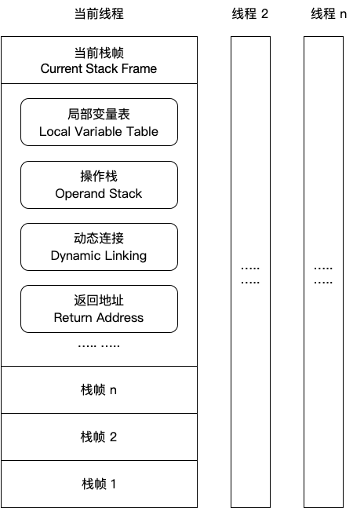
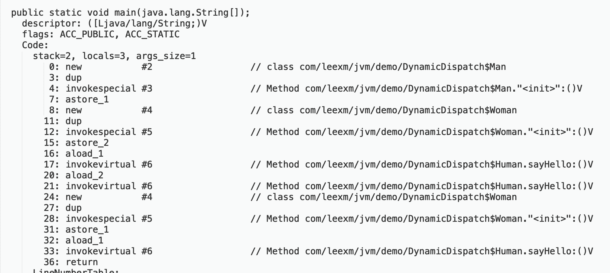

## 第 6 章 虚拟机字节码执行引擎

[toc]

执行引擎是 Java 虚拟机最核心的组成部分之一。在 Java 虚拟机规范中制定了虚拟机字节码执行引擎的概念模型，从外观上看，所有的 Java 虚拟机的执行引擎都是一致的：输入的是字节码文件，处理过程是字节码解析的等效过程，输出的是执行结果。接下来将主要从概念模型的角度来讲解虚拟机的方法调用和字节码执行。

### 6.1 运行时栈帧结构

栈帧（Stack Frame）是用于支持虚拟机进行方法调用和方法执行的数据结构，它是虚拟机运行时数据区中的虚拟机栈的栈元素。栈帧存储了方法的局部变量表、操作数栈、动态连接和方法返回地址等信息。每一个方法从调用开始至执行完成的过程，都对应着一个栈帧在虚拟机栈里面从入栈到出栈的过程。

一个线程中的方法调用链可能会很长，很多方法都同时处于执行状态。对于执行引擎来说，在活动线程中，只有位于栈顶的栈帧才是有效的，称为 *当前栈帧（Current Stack Frame）* ，与这个栈帧相关联的方法称为 *当前方法（Current Method）*。执行引擎运行的所有字节码指令都只针对当前栈帧进行操作。典型的栈帧结构图：



#### 6.1.1 局部变量表

局部变量表是一组变量值存储空间，用于存放方法参数和方法内部定义的局部变量。局部变量表的容量以 *Slot* 为最小单位，一个 Slot 可以存在一个32位以内的数据类型（boolean、byte、char、short、int、float、reference和 returnAddress 8种类型），对于64位数据类型，虚拟机会以高位对齐的方式为其分配两个连续的 Slot。不过由于局部变量表是建立在线程的堆栈上，是线程私有的数据，无论读写两个连续的 Slot 是否为原子操作，都不会引起数据安全问题。

在方法执行时，虚拟机是使用局部变量表完成参数值到参数变量列表的传递过程的，如果执行的是实例方法，那局部变量表中的第0位索引的 Slot 默认是用于传递方法所属对象实例的引用，在方法中可以通过关键字”this“来访问到这个隐含的参数。为了尽可能节省栈帧空间，局部变量表中的 Slot 是可以重用的，方法体中定义的变量，其作用域并不一定会覆盖整个方法，如果当前字节码 PC 计数器的值已经超出了某个变量的作用域，那这个变量对应的 Slot 就可以交给其他变量使用。

#### 6.1.2 操作数栈

操作数栈也称为操作栈，它是一个后入先出栈。同局部变量表一样，操作数栈的最大深度也在编译的时候写入到 Code 属性的 max_stacks 数据项中。

在一个方法刚刚开始执行的时候，这个方法的操作数栈是空的，在方法的执行过程中，会有各种字节码指令往操作数栈中写入和提取内容，也就是出栈\入栈操作。 操作数栈中的元素的数据类型必须与字节码指令的序列严格匹配，在编译程序代码的时候，编译器要严格保证这一点，在类检验阶段的数据流分析中还要再此验证这一点。

#### 6.1.3 动态连接

每个栈帧都包含一个指向运行时常量池中该栈帧所属方法的引用，持有这个引用是为了支持方法调用过程中的动态连接。Class 文件的常量池中存有大量的符号引用，字节码中的方法调用指令就是以常量池中指向方法的符号引用为参数。这些符号引用一部分会在类加载阶段或者第一次使用的时候就转化为直接引用，这种转化称为”静态解析“。另外一部分将在每一次运行期间转化为直接引用，这部分称为”动态连接“。关于这两个转化过程，将在下一节详细讲解。

#### 6.1.4 方法返回地址

当一个方法开始执行后，只有两种方式可以退出这个方法：

- 正常完成出口：执行引擎遇到任意一个方法返回的字节码指令，这时候可能会有返回值传递给上层的方法调用者，是否有返回值以及返回值的类型基于返回码指令。
- 异常完成出口：在方法执行过程中遇到了异常，并且这个异常没有在方法体内得到处理，无论是 Java 虚拟机内部产生的异常，还是代码中使用 athrow 字节码指令产生的异常，只要在本方法的异常表中没有搜索到匹配的异常处理器，就会导致方法退出。一个方法使用异常完成出口，是不会给它的调用者产生任何返回值的。

方法退出的过程实际上等同于把当前栈帧出栈，因此退出时可能执行的操作有：

- 恢复上层方法的局部变量表和操作数栈
- 把返回值（如果有的话）压入调用者的操作数栈中
- 调整 PC 计数器的值以指向方法调用指令后面的一条指令

#### 6.1.5 附加信息

虚拟机规范允许具体的虚拟机实现增加一些规范里没有描述的信息到栈帧之中，例如与调试相关的信息。在实际开发中，一般会把动态连接、方法返回地址、附加信息归为一类，称为栈帧信息。

### 6.2 方法调用

方法调用不等同于方法执行，方法调用阶段唯一的任务就是确定被调用方法的版本（即调用哪一个方法），暂时还不涉及方法内部的具体运行过程。

#### 6.2.1 解析

上一小节中提到了静态解析和动态解析的问题，其中静态解析成成立的前提：方法在程序真正运行之前就有一个可确定的调用版本，并且这个方法的调用版本在运行期是不可改变的。

在 Java 语言中符合”编译期可知，运行期不可变“这个要求的方法有静态方法和私有方法两大类。前者与类型直接关联，后者在外部不可被访问，决定了它们不可能有其他版本存在，因此它们适合在类加载阶段进行解析。

在 Java 虚拟机中提供了5条方法调用字节码指令：

- invokestatic：调用静态方法
- invokespecial：调用实例构造器\<init>方法、私有方法和父类方法
- invokevirtual：调用所有虚方法
- invokeinterface：调用接口方法，会在运行时再确定一个实现此接口的对象
- invokedynamic：先在运行时动态解析出调用点限定符所引用的方法，然后再执行该方法。

前4条调用指令，分派逻辑是固化在 Java 虚拟机内部的，而invokedynamic指令的分派逻辑是由用户所设定的引导方法决定的。

只要能被invokestatic、invokespecial指令调用的方法，都可以在解析阶段中确定唯一的版本，符合这个条件的有静态方法、私有方法、实例构造器、父类方法4类，它们在类加载的时候就会把符号引用解析为该方法的直接引用。

#### 6.2.2 分派

##### 6.2.2.1 静态分派

```java
public class StaticDispatch {

    static abstract class Human {
    }

    static class Man extends Human {
    }

    static class Woman extends Human {
    }

    public void sayHello(Human guy) {
        System.out.println("hello, guy!");
    }

    public void sayHello(Man guy) {
        System.out.println("hello, man!");
    }

    public void sayHello(Woman guy) {
        System.out.println("hello, lady!");
    }

    public static void main(String[] args) {
        Human man =  new Man();
        Human woman = new Woman();
        StaticDispatch dispatch = new StaticDispatch();
        dispatch.sayHello(man);
        dispatch.sayHello(woman);
    }

}

输出：
hello, guy!
hello, guy!
```

把上面代码中的”Human“称为变量的静态类型（Static Type），或者叫做外观类型（Apparent Type），后面的“Man”则称为变量的实际类型（Actual Type），静态类型和实际类型在程序中都可以发生一些变化，区别是静态类型的变化仅仅在使用时发生，变量本身的静态类型不会被改变，并且最终的静态类型在编译期可知的；而实际类型变化的结果在运行期才确定，编译器在编译程序的时候并不知道一个对象的实际类型是什么。

```java
// 实际类型变化
Human man = new Man();
man = new Woman();
```

```java
// 静态类型变化
dispatch.sayHello((Man) man);
dispatch.sayHello((Woman) man);
```

`main()`里面的两次` sayHello()`方法调用，在方法接收者已经确定是对象“dispatch”的前提下，使用哪个重载版本，就完全取决于 *传入参数的数量和类型*。在编译阶段，Javac 编译器会根据参数的静态类型决定使用哪个重载版本，所以选择了` sayHello(Human)`作为调用目标，并把这个方法的符号引用写到`main()`方法里的两天`invokevirtual`指令参数中。

***静态分派***：所有依赖静态类型来定位方法执行版本的分派动作。静态分派的典型应用是方法重载。静态分派发生在编译阶段，因此确定静态分派的动作实际上不是由虚拟机来执行的。

##### 6.2.2.2 动态分派

动态分派和多态性的另外一个重要体现——重写（Override）有这密切的关系。

```java
public class DynamicDispatch {

    static abstract class Human {
        protected abstract void sayHello();
    }

    static class Man extends Human {
        @Override
        protected void sayHello() {
            System.out.println("man say hello.");
        }
    }

    static class Woman extends Human {
        @Override
        protected void sayHello() {
            System.out.println("woman say hello.");
        }
    }

    public static void main(String[] args) {
        Human man =  new Man();
        Human woman = new Woman();
        man.sayHello();
        woman.sayHello();
        man = new Woman();
        man.sayHello();
    }

}

运行结果：
man say hello.
woman say hello.
woman say hello.
```

我们使用 javap 命令输出这段代码的字节码：



解读：

0 ~ 15行的字节码是准备动作，作用是建立 man 和 woman 的内存空间、调用 Man 和 Woman 类型的实例构造器，将这两个实例的引用存放在索引1、2的局部变量表 Slot 之中，对应的代码

```java
Human man =  new Man();
Human woman = new Woman();
```

接下来的16 ~ 21 句是关键部分，16、20两句分别把刚刚创建的两个对象的引用压到栈顶，这两个对象是将要执行的 sayHello() 方法的所有者，称为接受者（Receiver）；17 和 21 句是方法的调用指令，这两条调用指令从字节码角度来看是完全一样的，但是这两句指令最终执行的目标方法并不相同。原因要从 invokevirtual 指令的多态查找过程说起：

1. 找到操作数栈顶的第一个元素所指向的对象的实际类型，记作 C
2. 如果在类型 C 中找到与常量中的描述符和简单名称都相符的方法，则进行访问权限校验，如果通过则返回这个方法的直接引用，查找过程结束；如果不通过，则返回 java.lang.IllegalAccessError 异常
3. 否则，按照继承关系从下往上依次对 C 的各个父类进行第 2 步的搜索和验证过程。
4. 如果始终没有找到合适的方法，则抛出 java.lang.AbstractMethodError 异常。

由于 invokevirtual 指令执行的第一步就是在运行期确定接收者的实际类型，所以两次调用中的 invokevirtual 执行令把常量池中的类方法符号引用解析到不同的直接引用上，这个过程是 Java 语言中方法重写的本质。

动态分派：在运行期根据实际类型确定方法执行版本的分派过程。

##### 6.2.2.3 单分派与多分派

方法的接收者与方法的参数统称为方法的宗量，根据分派基于多少种宗量，划分为单分派和多分派。

单分派：根据一个宗量对目标方法进行选择

多分派：根据多于一个宗量对目标方法进行选择

```java
public class Dispatch {

    static class QQ {
    }

    static class _360 {
    }

    public static class Father {
        public void hardChoice(QQ arg) {
            System.out.println("father choose qq.");
        }

        public void hardChoice(_360 arg) {
            System.out.println("father choose 360.");
        }
    }

    public static class Son extends Father {
        @Override
        public void hardChoice(QQ arg) {
            System.out.println("son choose qq.");
        }

        @Override
        public void hardChoice(_360 arg) {
            System.out.println("son choose 360.");
        }
    }

    public static void main(String[] args) {
        Father father = new Father();
        Father son = new Son();
        father.hardChoice(new _360());
        son.hardChoice(new QQ());
    }

}

输出结果：
father choose 360.
son choose qq.
```

Java 中静态分派的方法调用，首先确定调用者的静态类型是什么，然后根据要调用的方法参数的静态类型（声明类型）确定所有重载方法中要调用哪一个，需要根据这两个宗量来编译，所以静态分派属于多分派。

Java 中动态分派的方法调用，在运行期间，虚拟机会根据调用者的实际类型调用对应的方法， 秩序根据这一个宗量就可以确定要调用的方法，所以动态分派属于单分派。

Java 是一门“静态多分派、动态单分派”的语言。

##### 6.2.2.4 虚拟机动态分派的实现

由于动态分派是非常频繁的动作，而且动态分派的方法版本选择过程需要运行时在类的方法元数据中搜索合适的目标方法，因此虚拟机使用 *虚方法表（Virtual Method Table，也称 vtable，与此对应的，在 invokeinterface 执行时也会用到接口方法表 ——Interface Method Table，itable）* 来进行优化以提高性能。

虚方法表中存放着各个方法的实际入口地址。如果某个方法在子类中没有被重写，那么子类的虚方法表里面的地址入口和父类相同方法的地址入口是一致的，都指向父类的实现入口。如果子类重写了该方法，则子类方法表中的地址将会替换为指向子类实现版本的入口地址。

虚方法表一般在类加载的连接阶段进行初始化，准备了类的变量初始值后，虚拟机会把该类的虚方法表也初始化完毕。为了程序实现的方便，具有相同签名的方法，在父类、子类的虚方法表中都应当具有一样的索引序号。