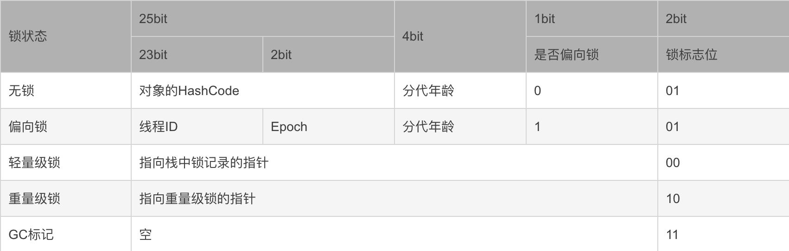
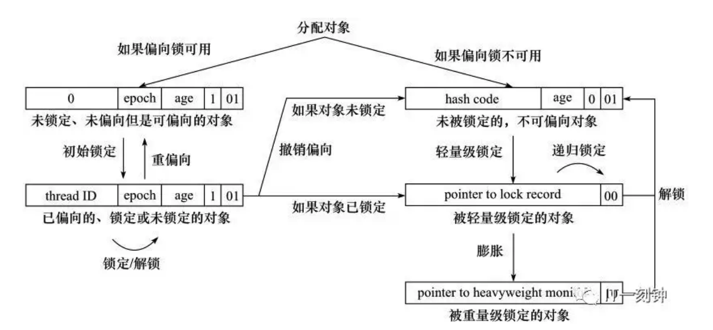
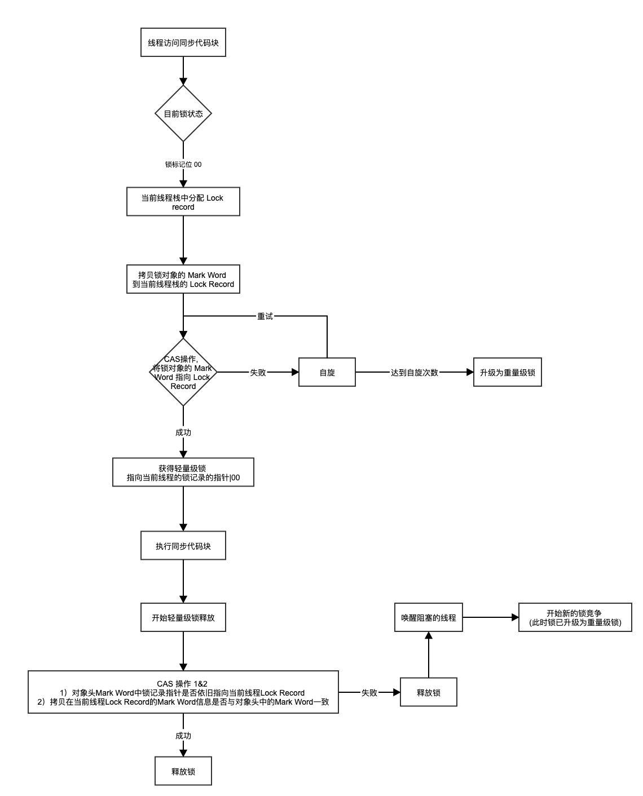
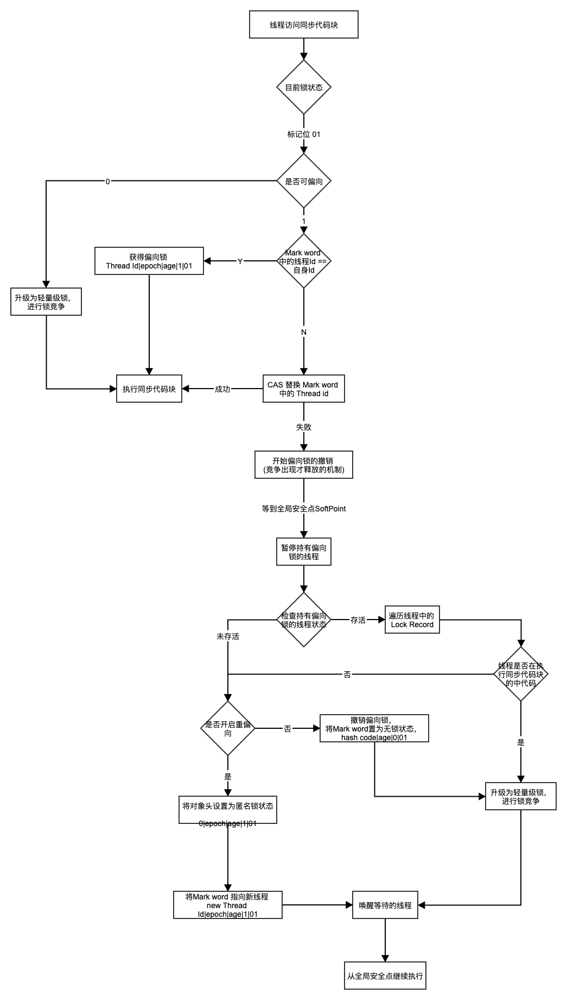
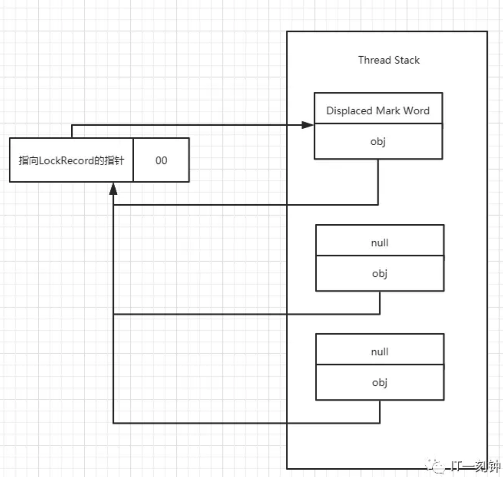

## 第 7 章 synchronized 锁

**synchronized** 关键字的使用方式就不多讲解了，我们知道 synchronized 关键字加锁的本质是对锁对象进行加锁。

JVM 分配在内存中的对象由：对象头、实例数据、对齐填充字节组成，

其中对象头由：Mark Word、指向类的指针、数组的长度（如果是数组对象的话）组成。**synchronized** 加锁机制和对象头中 Mark Word 密切相关。

### 7.1 Mark Word 的组成



其中无锁和偏向锁的锁标志位都是 01，使用前面的1bit的用于区分是无锁状态还是偏向锁状态。

### 7.2 synchronized 锁

synchronized锁状态的分类：

- 重量级锁

  重量级锁是通过互斥量（Mutex）来实现的，即一个线程进入了 synchronized 同步块，在未完成任务时会阻塞后面的线程。之所以称之为重量级锁，是因为Java 线程是映射到操作系统的原生线程上，如果要阻塞或唤醒一个线程，都需要依靠操作系统从当前用户态转到内核态中，这种转换耗费很多时间，开销大。

- 轻量级锁

  轻量级锁是通过 CAS 机制实现，即如果锁被其他线程占用，当前线程会通过自旋来获取锁，从而避免用户态与内核态的转换。

  轻量级锁并不是用来取代重量级锁的，而是在没有大量线程竞争的情况下，减少系统互斥量的使用，降低性能损耗。

- 偏向锁

  偏向锁是通过记录第一次进入同步代码块的线程 Id 来实现的，如果下一次要进入同步代码块的线程与记录的线程 Id 相同，则线程已经占有锁，可以直接进入到同步代码块，不用执行 CAS。

- 无锁

|    锁    |                             优点                             |                      缺点                      |                适用场景                |
| :------: | :----------------------------------------------------------: | :--------------------------------------------: | :------------------------------------: |
|  偏向锁  | 加锁和解锁不需要额外的消耗，和执行非同步方法相比仅存在纳秒级的差距 | 如果线程间存在锁竞争，会带来额外的锁撤销的消耗 | 适用于只用一个线程访问同步代码块的场景 |
| 轻量级锁 |           竞争的线程不会阻塞，提高了程序的响应速度           |     始终得不到锁的线程，使用自旋会消耗 CPU     |     同步代码块执行耗时非常短的场景     |
| 重量级锁 |                线程竞争不使用自旋，不消耗 CPU                |             线程阻塞，响应时间缓慢             |    追求吞吐量，同步执行速度慢的场景    |

### 7.3 锁的升级

当 JVM启用了偏向锁模式（Jdk6 以上默认开启），新创建的对象的 Mark Word 是未锁定、未偏向但可偏向状态。

#### 7.3.1 对象头中的 Mark Word 不同锁状态下的内存情况：

- 未锁定、未偏向但是可偏向的对象

  
  
- 已偏向的、锁定的或未锁定的对象

  

- 未被锁定的且不可偏向对象

  

- 被轻量级锁定的对象

  

- 被重量级锁定的对象

  

#### 7.3.2 锁升级

- 偏向锁 --> 无锁不可偏向状态/轻量级锁状态

  当第一个线程尝试进入同步块时，发现Mark Word中线程ID为0，则会使用CAS将自己的线程ID设置到Mark Word中。并且，在当前线程栈中由高到低顺序找到可用的Lock Record，将线程ID记录下。完成这些，此线程就获取了锁对象的偏向锁。
  当该偏向线程再次进入同步块时，发现锁对象偏向的就是当前线程，会往当前线程的栈中添加一条Displaced Mark Word为空的Lock Record中，用来统计重入的次数，然后继续执行同步块代码，因为线程栈是私有的，不需要CAS指令进行操作，所以在偏向锁模式下，同一个线程，只会执行一个CAS，之后获取释放锁只需要对Lock Record做操作，性能损耗基本可以忽略。
  当另外一个线程试图进入同步块时，发现Mark Word中线程ID与自己不相符，这个时候就会引发偏向锁的撤销，变成无锁不可偏向状态或轻量级锁状态。

- 无锁不可偏向状态 --> 轻量级锁状态

  当锁对象变成无锁不可偏向状态时，多个线程运行到同步块以后，会检查锁对象状态值标志是否加锁，如果没有锁，就把锁对象的Mark Word信息拷贝存储到当前线程栈桢中Lock Record里，然后通过CAS尝试把对象的Mark Word的值改变成一个指向自己线程的指针。如果成功，则当前线程获得锁对象的轻量级锁，其他线程的CAS就会失败，因为锁对象的Mark Word已经变成一个新的指针了，必须等待线程释放锁，此时其他线程则通过自旋来竞争锁。当获取锁的线程执行完毕释放锁的时候，会将Lock Record里面之前拷贝的值还原到锁对象的Mark Word中。

- 轻量级锁状态 --> 重量级锁状态

  当自旋次数超过JVM预期上限，会影响性能，所以竞争的线程就会把锁对象的Mark Word指向重锁，所谓的重锁，实际上就是一个堆上的monitor对象，即重量级锁的状态下，对象的Mark Word为指向一个堆中monitor对象的指针。
  然后所有的竞争线程放弃自旋，逐个插入到monitor对象里的一个队列尾部，进入阻塞状态。
  当成功获取轻量级锁的线程执行完毕，尝试通过CAS释放锁时，因为Mark Word已经指向重锁，导致轻量级锁释放失败，这时线程就会知道锁已经升级为重量级锁， 它不仅要释放当前锁，还要唤醒其他阻塞的线程来重新竞争锁。

**锁只能升级，不能降级**

锁升级的大致流程图如下：



#### 7.3.3 轻量级锁的获取及锁升级过程



> 注：当超过自旋阈值，竞争的线程就会把锁对象Mark Word指向重量级锁，导致Mark Word中的值发生了变化，当原持有轻量级锁的线程执行完毕，尝试通过CAS释放锁时，因为Mark Word已经指向重锁，不再是指向当前线程Lock Record的指针，于是解锁失败，这时原持有轻量级锁的线程就会知道锁已经升级为重量级锁。

轻量级锁升级为重量级的过程：


#### 7.3.4 偏向锁的获取及锁升级过程



偏向锁升级为轻量级锁的过程：

- 在线程安全点，原持有偏向锁的线程的栈中分配锁记录，lock record
- 将对象头中的 Mark word 拷贝到原线程的锁记录中（注意：此时 Mark word 已经是无锁状态）
- CAS 修改对象头的 Mark word，此时线程持有的锁已经由偏向锁升级成轻量级锁

### 7.4 锁的重入计数

```java
synchronized(obj){
    synchronized(obj){
        synchronized(obj){
        }
    }
}
```

假设锁的状态是轻量级锁，如图反应了Mark Word和线程栈中Lock Record的关系，右边线程栈中包含3个指向当前锁对象的Lock Record。其中栈中最高位的Lock Record为第一次获取锁时分配的，其中Displaced Mark word为锁对象加锁前的Mark Word，而之后的锁重入，则会在线程栈中分配一个Displaced Mark word为null的Lock Record，用来重入计数。

每次释放锁的时候则会删除对应的Lock Record。

