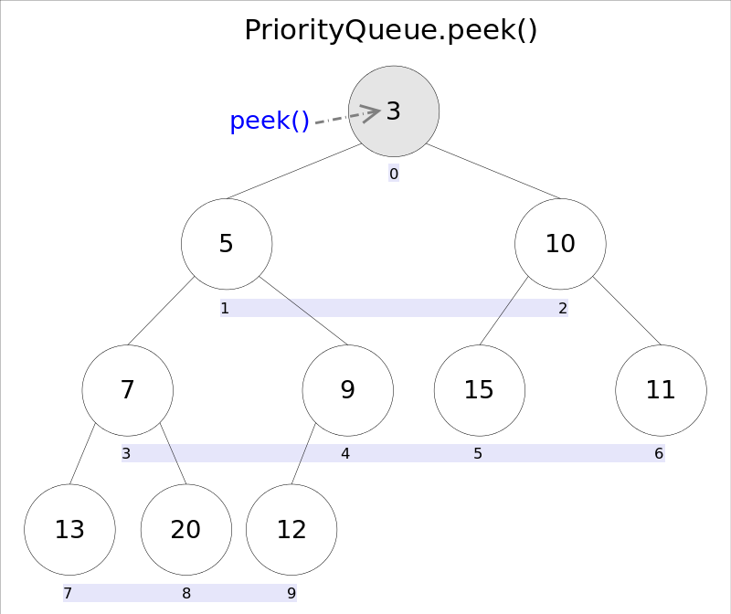
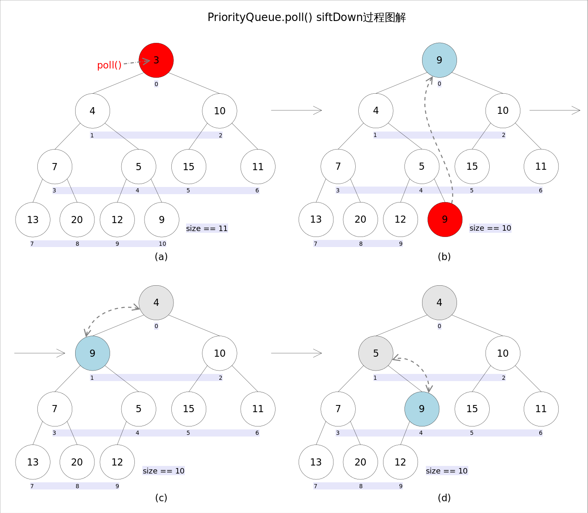

## 第 11 章 PriorityQueue 和 PriorityBlockingQueue

### 11.1 PriorityQueue

***优先队列***，优先队列的作用是能保证每次取出的元素都是队列中权值最小的**（Java的优先队列每次取最小元素，C\++的优先队列每次取最大元素）。这里牵涉到了大小关系，**元素大小的评判可以通过元素本身的自然顺序（*natural ordering*），也可以通过构造时传入的比较器**（*Comparator*，类似于C\++的仿函数）。

Java中*PriorityQueue*实现了*Queue*接口，不允许放入`null`元素；其通过堆实现，具体说是通过完全二叉树（*complete binary tree*）实现的**小顶堆**（任意一个非叶子节点的权值，都不大于其左右子节点的权值），也就意味着可以通过数组来作为*PriorityQueue*的底层实现。


上图中我们给每个元素按照层序遍历的方式进行了编号，如果你足够细心，会发现父节点和子节点的编号是有联系的，更确切的说父子节点的编号之间有如下关系：

`leftNo = parentNo*2+1`

`rightNo = parentNo*2+2`

`parentNo = (nodeNo-1)/2`

通过上述三个公式，可以轻易计算出某个节点的父节点以及子节点的下标。这也就是为什么可以直接用数组来存储堆的原因。

*PriorityQueue*的`peek()`和`element`操作是常数时间，`add()`, `offer()`, 无参数的`remove()`以及`poll()`方法的时间复杂度都是*log(N)*。

#### 11.1.1 方法剖析

#####  add()和offer()

`add(E e)`和`offer(E e)`的语义相同，都是向优先队列中插入元素，只是`Queue`接口规定二者对插入失败时的处理不同，前者在插入失败时抛出异常，后则则会返回`false`。对于*PriorityQueue*这两个方法其实没什么差别。


新加入的元素可能会破坏小顶堆的性质，因此需要进行必要的调整。

```Java
public boolean offer(E e) {
    if (e == null) //不允许放入null元素
        throw new NullPointerException();
    modCount++;
    int i = size;
    if (i >= queue.length)
        grow(i + 1); // 自动扩容
    size = i + 1;
  	// 队列原来为空，这是插入的第一个元素
    if (i == 0)
        queue[0] = e;
    else
        siftUp(i, e);// 调整
    return true;
}
```
上述代码中，扩容函数`grow()`类似于`ArrayList`里的`grow()`函数，就是再申请一个更大的数组，并将原数组的元素复制过去，这里不再赘述。需要注意的是`siftUp(int k, E x)`方法，该方法用于插入元素`x`并维持堆的特性。

```Java
//siftUp()
private void siftUp(int k, E x) {
    while (k > 0) {
        int parent = (k - 1) >>> 1;// parentNo = (nodeNo-1)/2
        Object e = queue[parent];
        if (comparator.compare(x, (E) e) >= 0)//调用比较器的比较方法
            break;
        queue[k] = e;
        k = parent;
    }
    queue[k] = x;
}
```

新加入的元素`x`可能会破坏小顶堆的性质，因此需要进行调整。调整的过程为：**从`k`指定的位置开始，将`x`逐层与当前点的`parent`进行比较并交换，直到满足`x >= queue[parent]`为止**。注意这里的比较可以是元素的自然顺序，也可以是依靠比较器的顺序。

##### element()和peek()

`element()`和`peek()`的语义完全相同，都是获取但不删除队首元素，也就是队列中权值最小的那个元素，二者唯一的区别是当方法失败时前者抛出异常，后者返回`null`。根据小顶堆的性质，堆顶那个元素就是全局最小的那个；由于堆用数组表示，根据下标关系，`0`下标处的那个元素既是堆顶元素。所以**直接返回数组`0`下标处的那个元素即可**。



代码也就非常简洁：

```Java
public E peek() {
    if (size == 0)
        return null;
    return (E) queue[0];//0下标处的那个元素就是最小的那个
}
```

##### remove()和poll()

`remove()`和`poll()`方法的语义也完全相同，都是获取并删除队首元素，区别是当方法失败时前者抛出异常，后者返回`null`。由于删除操作会改变队列的结构，为维护小顶堆的性质，需要进行必要的调整。

代码如下：

```Java
public E poll() {
    if (size == 0)
        return null;
    int s = --size;
    modCount++;
    E result = (E) queue[0];//0下标处的那个元素就是最小的那个
    E x = (E) queue[s];
    queue[s] = null;
    if (s != 0)
        siftDown(0, x);//调整
    return result;
}
```

上述代码首先记录`0`下标处的元素，并用最后一个元素替换`0`下标位置的元素，之后调用`siftDown()`方法对堆进行调整，最后返回原来`0`下标处的那个元素（也就是最小的那个元素）。重点是`siftDown(int k, E x)`方法，该方法的作用是**从`k`指定的位置开始，将`x`逐层向下与当前点的左右孩子中较小的那个交换，直到`x`小于或等于左右孩子中的任何一个为止**。

```Java
private void siftDown(int k, E x) {
    int half = size >>> 1;
    while (k < half) {
    	  // 首先找到左右孩子中较小的那个，记录到c里，并用child记录其下标
        int child = (k << 1) + 1; //leftNo = parentNo * 2 +1 
        Object c = queue[child];
        int right = child + 1;
        if (right < size &&
            comparator.compare((E) c, (E) queue[right]) > 0)
            c = queue[child = right];
        if (comparator.compare(x, (E) c) <= 0)
            break;
        queue[k] = c;//然后用c取代原来的值
        k = child;
    }
    queue[k] = x;
}
```

##### remove(Object o)

`remove(Object o)`方法用于删除队列中跟`o`相等的某一个元素（如果有多个相等，只删除一个），该方法不是*Queue*接口内的方法，而是*Collection*接口的方法。由于删除操作会改变队列结构，所以要进行调整；又由于删除元素的位置可能是任意的，所以调整过程比其它函数稍加繁琐。具体来说，`remove(Object o)`可以分为2种情况：1. 删除的是最后一个元素。直接删除即可，不需要调整。2. 删除的不是最后一个元素，从删除点开始以最后一个元素为参照调用一次`siftDown()`即可。此处不再赘述。


具体代码如下：
```Java
public boolean remove(Object o) {
    int i = indexOf(o);
    if (i == -1)
      	return false;
    else {
      	removeAt(i);
      return true;
    }
}

private E removeAt(int i) {
    // assert i >= 0 && i < size;
    modCount++;
    int s = --size;
    if (s == i) // removed last element
        queue[i] = null;
    else {
        E moved = (E) queue[s];
        queue[s] = null;
        siftDown(i, moved);
        if (queue[i] == moved) {
            siftUp(i, moved);
            if (queue[i] != moved)
                return moved;
        }
    }
    return null;
}
```

### 11.2 PriorityBlockingQueue

和 PriorityQueue 一样，PriorityBlockingQueue 也是一个无限容量(有最大容量限制)的队列，由于容量是无限的所以 put 等入队操作其实不存在阻塞，只要内存足够都能够立即入队成功，当然多个入队操作的线程之间还是存在竞争唯一锁的互斥访问。虽然PriorityBlockingQueue 逻辑上是无界的，但是尝试添加元素时还是可能因为资源耗尽而抛出 OutOfMemoryError。

PriorityBlockingQueue 数据结构和 PriorityQueue 是一样的，都是使用数组实现平衡二叉树(小的在上，大的在下，最小堆)。与 PriorityQueue 不同的是，PriorityBlockingQueue 实现了线程安全。

```java
public class PriorityBlockingQueue<E> extends AbstractQueue<E> implements BlockingQueue<E>, 
 																							java.io.Serializable {
    private static final long serialVersionUID = 5595510919245408276L;

    /**
     * 默认数组的初始容量
     */
    private static final int DEFAULT_INITIAL_CAPACITY = 11;

    /**
     * 数组的最大容量，减 8 是因为某些 JVM 实现会在数组中保存对象头信息
     */
    private static final int MAX_ARRAY_SIZE = Integer.MAX_VALUE - 8;

    /**
     * 元素数组
     * 父子下标的位置算法和 PriorityQueue 中的一致
     */
    private transient Object[] queue;

    /**
     * 优先级队列中的元素个数
     */
    private transient int size;

    /**
     * 比较器，如果优先级队列使用元素的自然顺序排序，则为 null.
     */
    private transient Comparator<? super E> comparator;

    /**
     * 用于所有公共操作的锁
     */
    private final ReentrantLock lock;

    /**
     * Condition for blocking when empty
     */
    private final Condition notEmpty;

    /**
     * 用于分配的自旋锁，通过CAS获取
     */
    private transient volatile int allocationSpinLock;                                  
}
```

以上是 PriorityBlockingQueue 的主要属性。

主要方法:

```java
/**
 * 尝试扩容
 */
private void tryGrow(Object[] array, int oldCap) {
    lock.unlock(); // must release and then re-acquire main lock 必须释放并重新获取主锁。
    Object[] newArray = null;
    if (allocationSpinLock == 0 &&
        // CAS 获取扩容的能力，标记我要扩容了
        UNSAFE.compareAndSwapInt(this, allocationSpinLockOffset, 0, 1)) {
        try {
            int newCap = oldCap + ((oldCap < 64) ?
                                   (oldCap + 2) : // 如果容量比较小扩的多一些。
                                   (oldCap >> 1));// 本身已经超过64了，每次只扩张一半
            // 超出了最大限制
          	if (newCap - MAX_ARRAY_SIZE > 0) {
                int minCap = oldCap + 1;
              	// 已经最大了，抛出 OutOfMemoryError
                if (minCap < 0 || minCap > MAX_ARRAY_SIZE)
                    throw new OutOfMemoryError();
                newCap = MAX_ARRAY_SIZE; // 否则扩容到允许的最大限制
            }
          	// 扩容成功，并且当前的源数组没有被其他线程扩容
            if (newCap > oldCap && queue == array)
                newArray = new Object[newCap]; // 创建一个新的数组
        } finally {
            allocationSpinLock = 0; // 扩容完成，还原标记
        }
    }
    if (newArray == null)
        Thread.yield(); // 正好有另一个线程已经在扩容了，放弃CPU
    // 真正要开始扩容才获取锁
  	lock.lock();
  	// 新数组已经申请好，并且当前并没有被其他线程扩容
    if (newArray != null && queue == array) {
        queue = newArray; // 改变当前数组指向新的数组
        System.arraycopy(array, 0, newArray, 0, oldCap); // 拷贝元素
    }
}

public boolean add(E e) {
  	return offer(e);
}

public boolean offer(E e) {
    if (e == null)
        throw new NullPointerException();
    final ReentrantLock lock = this.lock;
    lock.lock();
    int n, cap;
    Object[] array;
  	// 数组元素已满，尝试扩容
    while ((n = size) >= (cap = (array = queue).length))
        tryGrow(array, cap);
    try {
        Comparator<? super E> cmp = comparator;
        if (cmp == null)
            siftUpComparable(n, e, array);
        else
            siftUpUsingComparator(n, e, array, cmp);
        size = n + 1;
      	// 唤醒可能阻塞的消费线程
        notEmpty.signal();
    } finally {
        lock.unlock();
    }
    return true;
}

private static <T> void siftUpComparable(int k, T x, Object[] array) {
    Comparable<? super T> key = (Comparable<? super T>) x;
    while (k > 0) {
        int parent = (k - 1) >>> 1;
        Object e = array[parent];
        if (key.compareTo((T) e) >= 0)
            break;
        array[k] = e;
        k = parent;
    }
    array[k] = key;
}

private static <T> void siftUpUsingComparator(int k, T x, Object[] array, Comparator<? super T> cmp) {
    while (k > 0) {
      	// 父节点下标
        int parent = (k - 1) >>> 1;
        Object e = array[parent];
      	// 元素 x 大于父节点，那它就应该成为该父节点的子节点，跳出循环
        if (cmp.compare(x, (T) e) >= 0)
            break;
      	// 父节点下移
        array[k] = e;
      	// 从父节点往上查找合适的位置
        k = parent;
    }
  	// 将 x 插入到比它小或者相等的父节点下方（作为其子节点）
    array[k] = x;
}

public E take() throws InterruptedException {
    final ReentrantLock lock = this.lock;
    lock.lockInterruptibly();
    E result;
    try {
      	// 队列为空的情况下，通过 notEmpty 阻塞等待
        while ( (result = dequeue()) == null)
            notEmpty.await();
    } finally {
        lock.unlock();
    }
    return result;
}

public E poll(long timeout, TimeUnit unit) throws InterruptedException {
    long nanos = unit.toNanos(timeout);
    final ReentrantLock lock = this.lock;
    lock.lockInterruptibly();
    E result;
    try {
        while ( (result = dequeue()) == null && nanos > 0)
            nanos = notEmpty.awaitNanos(nanos);
    } finally {
        lock.unlock();
    }
    return result;
}

private E dequeue() {
    int n = size - 1;
  	// 队列空
    if (n < 0)
        return null;
    else {
        Object[] array = queue;
      	// 最小堆，取第一个元素
        E result = (E) array[0];
        E x = (E) array[n];
      	// 将最后一个元素置空
        array[n] = null;
        Comparator<? super E> cmp = comparator;
        // 最后一个元素重新入队
      	if (cmp == null)
            siftDownComparable(0, x, array, n);
        else
            siftDownUsingComparator(0, x, array, n, cmp);
        // 修改容量
      	size = n;
        return result;
    }
}

public boolean remove(Object o) {
    final ReentrantLock lock = this.lock;
    lock.lock();
    try {
        int i = indexOf(o);
        if (i == -1)
            return false;
        removeAt(i);
        return true;
    } finally {
        lock.unlock();
    }
}

private void removeAt(int i) {
    Object[] array = queue;
    int n = size - 1;
  	// 如果移除的是最后一个元素，直接置空移除就好
    if (n == i)
        array[i] = null;
    else {
      	// 暂存最后一个元素
        E moved = (E) array[n];
      	// 将最后一个有效元素的位置置空
        array[n] = null;
        Comparator<? super E> cmp = comparator;
        // 尝试将最后一个元素覆盖i位置，并向下降级来调整位置
      	if (cmp == null)
            siftDownComparable(i, moved, array, n);
        else
            siftDownUsingComparator(i, moved, array, n, cmp);
        // 如果向下无可调整，那就需要向上冒泡再次尝试调整
      	if (array[i] == moved) {
            if (cmp == null)
                siftUpComparable(i, moved, array);
            else
                siftUpUsingComparator(i, moved, array, cmp);
        }
    }
    size = n;
}

private static <T> void siftDownUsingComparator(int k, T x, Object[] array, int n, 
                                                	Comparator<? super T> cmp) {
    if (n > 0) {
        int half = n >>> 1;
        while (k < half) {
            int child = (k << 1) + 1;
            Object c = array[child];
            int right = child + 1;
            if (right < n && cmp.compare((T) c, (T) array[right]) > 0)
                c = array[child = right];
            if (cmp.compare(x, (T) c) <= 0)
                break;
            array[k] = c;
            k = child;
        }
        array[k] = x;
    }
}
```