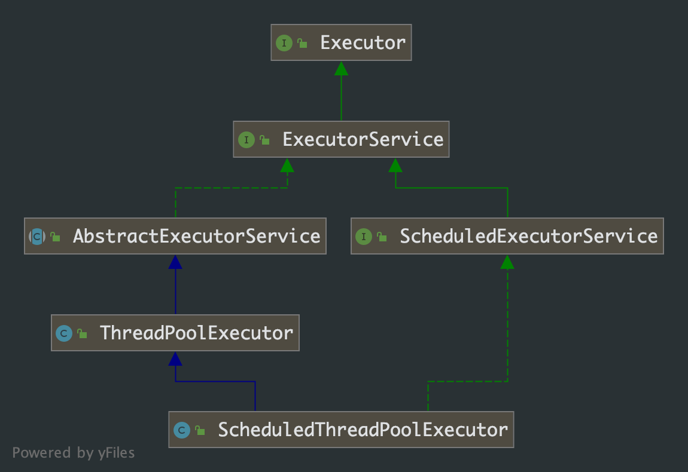

## 第 13 章 线程池之— ScheduleExecutorService

首先看下怎么使用

```java
public class ScheuleExecutor {

    public static void main(String[] args) throws InterruptedException {
        // 为了方便，直接使用工厂类 Executors
      	ScheduledExecutorService executors = Executors.newScheduledThreadPool(2);

        long time1 = System.currentTimeMillis();

        executors.schedule(() -> System.out.println(String.format("A:%d", (System.currentTimeMillis() - time1) / 1000)),
                2, TimeUnit.SECONDS);

        Future<Integer> future = executors.schedule(() -> {
            System.out.println(String.format("B:%d", (System.currentTimeMillis() - time1) / 1000));
            return 10;
        }, 2, TimeUnit.SECONDS);

        executors.scheduleAtFixedRate(() -> {
                    try {
                        TimeUnit.SECONDS.sleep(ThreadLocalRandom.current().nextInt(3));
                    } catch (InterruptedException e) {
                        e.printStackTrace();
                    }
                    System.out.println(String.format("C:%d", (System.currentTimeMillis() - time1) / 1000));
                },
                4, 3, TimeUnit.SECONDS);

        executors.scheduleWithFixedDelay(() -> {
                    try {
                        TimeUnit.SECONDS.sleep(ThreadLocalRandom.current().nextInt(3));
                    } catch (InterruptedException e) {
                        e.printStackTrace();
                    }
                    System.out.println(String.format("D:%d", (System.currentTimeMillis() - time1) / 1000));
                },
                4, 3, TimeUnit.SECONDS);

        try {
            System.out.println(future.get());
        } catch (ExecutionException e) {
            e.printStackTrace();
        }

        TimeUnit.SECONDS.sleep(200);

        executors.shutdown();
        try {
            if(!executors.awaitTermination(10, TimeUnit.SECONDS)){
                executors.shutdownNow();
            }
        } catch (InterruptedException ignore) {
            executors.shutdownNow();
        }
    }

}
```

类图关系：

主要方法：

简单总结下：

- ScheduledThreadPoolExecutor 适用于延时执行，或者周期性执行的任务调度；ScheduledThreadPoolExecutor 在实现上继承了ThreadPoolExecutor，所以依然可以将 ScheduledThreadPoolExecutor 当成 ThreadPoolExecutor 来使用，但是ScheduledThreadPoolExecutor 的功能要强大得多，因为 ScheduledThreadPoolExecutor 可以根据设定的参数来周期性调度运行
- schedule(Runnable, long, TimeUnit)，延时一段时间之后运行一个 Runnable，只运行一次
- schedule(Callable, long, TimeUnit)，延时一段时间之后运行一个 Callable — 有返回值，只运行一次
- 如果想要延时一段时间，然后根据设定的参数周期执行 Runnable，那么可以选择第三个和第四个方法。第三个方法和第四个方法的区别在于：第三个方法严格按照规划的时间路径来执行，比如周期为 2，延时为 0，那么执行的序列为 0，2，4，6，8....；而第四个方法将在上次执行完成之后再次执行。比如上面的执行序列 0，2，4，6，8...，如果第2秒没有被调度执行，而在第三秒的时候才被调度，那么下次执行的时间不是 4，而是 5，以此类推

### 源码解读

```java
public ScheduledFuture<?> schedule(Runnable command, long delay, TimeUnit unit) {
    if (command == null || unit == null)
      	throw new NullPointerException();
    RunnableScheduledFuture<?> t = decorateTask(command,
                										new ScheduledFutureTask<Void>(command, null, triggerTime(delay, unit)));
    delayedExecute(t);
    return t;
}

public <V> ScheduledFuture<V> schedule(Callable<V> callable, long delay, TimeUnit unit) {
    if (callable == null || unit == null)
      	throw new NullPointerException();
    RunnableScheduledFuture<V> t = decorateTask(callable,
                                     new ScheduledFutureTask<V>(callable, triggerTime(delay, unit)));
    delayedExecute(t);
    return t;
}

public ScheduledFuture<?> scheduleAtFixedRate(Runnable command, long initialDelay, long period, 
                                              TimeUnit unit) {
    if (command == null || unit == null)
      	throw new NullPointerException();
    if (period <= 0)
      	throw new IllegalArgumentException();
    ScheduledFutureTask<Void> sft = new ScheduledFutureTask<Void>(command, 
                                                                  null,
                                                                  triggerTime(initialDelay, unit), 					
                                                                  unit.toNanos(period));
    RunnableScheduledFuture<Void> t = decorateTask(command, sft);
    sft.outerTask = t;
    delayedExecute(t);
    return t;
}

public ScheduledFuture<?> scheduleWithFixedDelay(Runnable command, long initialDelay, long delay,
                                                 TimeUnit unit) {
    if (command == null || unit == null)
      	throw new NullPointerException();
    if (delay <= 0)
      	throw new IllegalArgumentException();
    ScheduledFutureTask<Void> sft = new ScheduledFutureTask<Void>(command, 
                                                                  null, 
                                                                  triggerTime(initialDelay, unit), 
                                                                  /** 
                                                                   * 这个地方使用 -delay
                                                                   * 使用正负来区分 atFixed 还是 withFixed
                                                                   */
                                                                  unit.toNanos(-delay));
    RunnableScheduledFuture<Void> t = decorateTask(command, sft);
    sft.outerTask = t;
    delayedExecute(t);
    return t;
}

protected <V> RunnableScheduledFuture<V> decorateTask(Runnable runnable, RunnableScheduledFuture<V> task) {
  	return task;
}

/**
 * 计算任务被调用的时间
 */
private long triggerTime(long delay, TimeUnit unit) {
  	return triggerTime(unit.toNanos((delay < 0) ? 0 : delay));
}

/**
 * 上面的构造方法都会调用到这个方法
 */
private void delayedExecute(RunnableScheduledFuture<?> task) {
    // 如果线程池不是在 RUNNING 状态，则拒绝任务
    if (isShutdown())
        reject(task);
    else {
        // 将 task 添加到队列中
        super.getQueue().add(task);
        // 如果线程池不是 RUNNING 状态，从队列中删除任务并取消任务
        if (isShutdown() && !canRunInCurrentRunState(task.isPeriodic()) && remove(task))
            task.cancel(false);
        else
            // 确保线程池启动
            ensurePrestart();
    }
}

void ensurePrestart() {
    int wc = workerCountOf(ctl.get());
    if (wc < corePoolSize)
      	addWorker(null, true);
    else if (wc == 0)
      	addWorker(null, false);
}
```

通过源码，我们知道前两个提交任务的方法基本差不多，后两个提价任务的方法也基本差不多。涉及到 `ScheduledFutureTask` 这个关键类和 `delayedExecute` 这个关键方法。

```java
private class ScheduledFutureTask<V> extends FutureTask<V> implements RunnableScheduledFuture<V> {

    /** Sequence number to break ties FIFO */
    private final long sequenceNumber;

  	// task 任务被调度的时间
    private long time;

    // 周期性 task 的调度间隔周期
    private final long period;

    /** 
     * 这个属性，执行 task 自己
     * 在周期性 task 重新入队时使用，reExecutePeriodic() 方法中
     */
    RunnableScheduledFuture<V> outerTask = this;

  	/**
  	 * 延迟队列中 task 的下标，用来支持快速取消任务
  	 */
    int heapIndex;

    ScheduledFutureTask(Runnable r, V result, long ns) {
        super(r, result);
        this.time = ns;
      	// 一次性任务的调度周期为 0
        this.period = 0;
        this.sequenceNumber = sequencer.getAndIncrement();
    }

    ScheduledFutureTask(Runnable r, V result, long ns, long period) {
        super(r, result);
        this.time = ns;
        this.period = period;
        this.sequenceNumber = sequencer.getAndIncrement();
    }

    ScheduledFutureTask(Callable<V> callable, long ns) {
        super(callable);
        this.time = ns;
        this.period = 0;
        this.sequenceNumber = sequencer.getAndIncrement();
    }

  	/**
  	 * 获取 task 任务被调度时间的延迟数据
  	 */
    public long getDelay(TimeUnit unit) {
        return unit.convert(time - now(), NANOSECONDS);
    }

  	/**
  	 * ScheduledFutureTask 间的比较方法
  	 * ScheduledFutureTask 任务是需要添加到优先级队列的，需要排序
  	 */
    public int compareTo(Delayed other) {
        if (other == this)
            return 0;
        if (other instanceof ScheduledFutureTask) {
            ScheduledFutureTask<?> x = (ScheduledFutureTask<?>)other;
            long diff = time - x.time;
            if (diff < 0)
                return -1;
            else if (diff > 0)
                return 1;
          	// 如果被调度的时间一直，则比较它们的生层序列
            else if (sequenceNumber < x.sequenceNumber)
                return -1;
            else
                return 1;
        }
        long diff = getDelay(NANOSECONDS) - other.getDelay(NANOSECONDS);
        return (diff < 0) ? -1 : (diff > 0) ? 1 : 0;
    }

    /**
  	 * 判断是否是周期性任务
  	 */
    public boolean isPeriodic() {
        return period != 0;
    }
}
```

****

***问题： 线程池是如何调度周期性任务的？***

这个问题可以拆解成两个问题：

- 周期性任务是如何实现周期性重复调用的？
- 线程池是如何在延迟时间内调用应该被触发的任务的？

我们先来分析第一个问题：**周期性任务是如何实现周期性重复调用的？**

`ScheduledFutureTask` 的 `run` 方法，是它的核心方法。我们从 `run` 方法入手分析：

```javascript
private class ScheduledFutureTask<V> extends FutureTask<V> implements RunnableScheduledFuture<V> {
    
  	/**
  	 * 以指定的时间单位 unit 返回此对象的剩余延迟
     * 返回值 小于等于0 表示延迟已经结束
     */
  	public long getDelay(TimeUnit unit) {
      	return unit.convert(time - now(), NANOSECONDS);
    }
  
  	public void run() {		
        boolean periodic = isPeriodic();
        // 判断当前任务是否还可以执行
        if (!canRunInCurrentRunState(periodic))
            cancel(false);
        else if (!periodic)
            // 非周期性任务，直接调用 run 方法
            ScheduledFutureTask.super.run();
        // runAndSet 方法会直接调用 task 的 run 方法，完成周期任务的执行
        else if (ScheduledFutureTask.super.runAndReset()) {
            // 设置下一次执行的时间
            setNextRunTime();
            /**
             * 这个方法会再次将当前对象放入队列，以备下次执行
             * outerTask 指向自己
             */
            reExecutePeriodic(outerTask);
        }
    }

    /**
     * 设置周期性任务下一次被调度的时间
     * 注意这里 period 是负数的情况，负数来源就是 scheduleWithFixedDelay 方法中转的
     */
    private void setNextRunTime() {
        long p = period;
        if (p > 0)
          time += p;
        else
          time = triggerTime(-p);
    }

    /**
     * 将周期性任务重新入队
     */
    void reExecutePeriodic(RunnableScheduledFuture<?> task) {
        if (canRunInCurrentRunState(true)) {
            super.getQueue().add(task);
            if (!canRunInCurrentRunState(true) && remove(task))
                task.cancel(false);
            else
                ensurePrestart();
        }
    }
}

public class FutureTask<V> implements RunnableFuture<V> {
    protected boolean runAndReset() {
        if (state != NEW || !UNSAFE.compareAndSwapObject(this, runnerOffset, null, Thread.currentThread()))
            return false;
        boolean ran = false;
        int s = state;
        try {
            Callable<V> c = callable;
            if (c != null && s == NEW) {
                try {
                    c.call(); // don't set result
                    ran = true;
                } catch (Throwable ex) {
                    setException(ex);
                }
            }
        } finally {
            runner = null;
            s = state;
            if (s >= INTERRUPTING)
                handlePossibleCancellationInterrupt(s);
        }
        return ran && s == NEW;
    }
}
```

到这里，我们已经分析明白周期性任务周期性执行的原因——周期性任务 run 方法内部在被调用后会被再次添加到任务队列中。

我们来分析第二个问题：**线程池是如何知道延迟多久后调度任务的？**

```java
public class Executors {
    public static ScheduledExecutorService newScheduledThreadPool(int corePoolSize) {
        return new ScheduledThreadPoolExecutor(corePoolSize);
    }
}

public class ScheduledThreadPoolExecutor extends ThreadPoolExecutor implements ScheduledExecutorService {
    public ScheduledThreadPoolExecutor(int corePoolSize) {
      	super(corePoolSize, Integer.MAX_VALUE, 0, NANOSECONDS, new DelayedWorkQueue());
    }
}
```

通过代码我们知道 `ScheduledThreadPoolExecutor` 与我们一般使用的 `ThreadPoolExecutor`线程池，最大的不同就在于阻塞队列的不同，所以我们分析的重点就是  `ScheduledThreadPoolExecutor` 线程池使用了 `DelayedWorkQueue`队列的哪些特性？

```java
/**
 * 删除了部分方法
 */
static class DelayedWorkQueue extends AbstractQueue<Runnable> implements BlockingQueue<Runnable> {
  	
  	// 初始数组容量
    private static final int INITIAL_CAPACITY = 16;
  
  	// 使用数组保存任务
    private RunnableScheduledFuture<?>[] queue = new RunnableScheduledFuture<?>[INITIAL_CAPACITY];
  
    private final ReentrantLock lock = new ReentrantLock();
    private int size = 0;
  	// 用于标记当前是否有线程在排队（仅用于取元素时）
    private Thread leader = null;
    private final Condition available = lock.newCondition();

  	/**
  	 * 这个方法是扩容使用，每次扩容 50%，最大到 Integer.MAX_VALUE。
  	 */
    private void grow() {
        int oldCapacity = queue.length;
        int newCapacity = oldCapacity + (oldCapacity >> 1); // grow 50%
        if (newCapacity < 0) // overflow
            newCapacity = Integer.MAX_VALUE;
        queue = Arrays.copyOf(queue, newCapacity);
    }

    private int indexOf(Object x) {
        if (x != null) {
            if (x instanceof ScheduledFutureTask) {
                int i = ((ScheduledFutureTask) x).heapIndex;
                if (i >= 0 && i < size && queue[i] == x)
                    return i;
            } else {
                for (int i = 0; i < size; i++)
                    if (x.equals(queue[i]))
                        return i;
            }
        }
        return -1;
    }

    public boolean remove(Object x) {
        final ReentrantLock lock = this.lock;
        lock.lock();
        try {
            int i = indexOf(x);
            if (i < 0)
                return false;

            setIndex(queue[i], -1);
            int s = --size;
            RunnableScheduledFuture<?> replacement = queue[s];
            queue[s] = null;
            if (s != i) {
                siftDown(i, replacement);
                if (queue[i] == replacement)
                    siftUp(i, replacement);
            }
            return true;
        } finally {
            lock.unlock();
        }
    }
	
  	public boolean add(Runnable e) {
      	return offer(e);
    }
  
  	/**
  	 * 将任务添加到队列中
  	 */
    public boolean offer(Runnable x) {
        // 不允许插入 null 值
      	if (x == null)
            throw new NullPointerException();
        RunnableScheduledFuture<?> e = (RunnableScheduledFuture<?>)x;
        final ReentrantLock lock = this.lock;
        lock.lock();
        try {
            int i = size;
          	// 容量不足，则扩容
            if (i >= queue.length)
                grow();
            size = i + 1;
          	// 队列为空，则放在第一位
            if (i == 0) {
                queue[0] = e;
                setIndex(e, 0);
            } else {
                siftUp(i, e);
            }
          	// 如果当前是第一个入队的元素或者以前的 head 元素被当前元素替代了
            if (queue[0] == e) {
              	// 剥夺 leader 的领导权，由于是非公平锁，唤醒的不一定是 leader 线程，所以需要重置为 null
                leader = null;
                // 唤醒 leader，更换 head
              	available.signal();
            }
        } finally {
            lock.unlock();
        }
        return true;
    }
  
    private void setIndex(RunnableScheduledFuture<?> f, int idx) {
        if (f instanceof ScheduledFutureTask)
          ((ScheduledFutureTask)f).heapIndex = idx;
    }

  	/**
  	 * 获取队列的头节点
  	 */
    public RunnableScheduledFuture<?> take() throws InterruptedException {
        final ReentrantLock lock = this.lock;
        lock.lockInterruptibly();
        try {
            for (;;) {
              	// 获取，不移除head
                RunnableScheduledFuture<?> first = queue[0];
                // 队列为空，阻塞等待，直到被生产者唤醒
              	if (first == null)
                    available.await();
                else {
                  	// 获取剩余延时时间
                    long delay = first.getDelay(NANOSECONDS);
                    // 已经到期，元素出队并返回
                  	if (delay <= 0)
                        return finishPoll(first);
                    first = null;
                  	/**
                     * 已经有 leader 在等待了，无限期等待 leader 醒来通知
                     * 注意：这里是无限阻塞
                     */
                    if (leader != null)
                        available.await();
                    // 当前线程成为 leader
                  	else {
                        Thread thisThread = Thread.currentThread();
                        leader = thisThread;
                        try {
                          	/**
                          	 * 当前线程等待 header 元素剩余的延迟时间结束
                          	 * 注意：这里阻塞时间是 剩余延迟时间。和上面的不同
                          	 */
                            available.awaitNanos(delay);
                        } finally {
                          	// 交出 leader 权限
                            if (leader == thisThread)
                                leader = null;
                        }
                    }
                }
            }
        } finally {
          	// 队列不为空，并且没有 leader，唤醒其它可能等待的消费线程
            if (leader == null && queue[0] != null)
                available.signal();
            lock.unlock();
        }
    }
  	
  	/**
  	 * f 元素出队，并让队列最后一个元素重新入队
  	 */
  	private RunnableScheduledFuture<?> finishPoll(RunnableScheduledFuture<?> f) {
      int s = --size;
      RunnableScheduledFuture<?> x = queue[s];
      queue[s] = null;
      if (s != 0)
        	siftDown(0, x);
      setIndex(f, -1);
      return f;
    }
  
  	private void siftUp(int k, RunnableScheduledFuture<?> key) {
        while (k > 0) {
            int parent = (k - 1) >>> 1;
            RunnableScheduledFuture<?> e = queue[parent];
            if (key.compareTo(e) >= 0)
                break;
            queue[k] = e;
            setIndex(e, k);
            k = parent;
        }
        queue[k] = key;
        setIndex(key, k);
    }

    private void siftDown(int k, RunnableScheduledFuture<?> key) {
        int half = size >>> 1;
        while (k < half) {
            int child = (k << 1) + 1;
            RunnableScheduledFuture<?> c = queue[child];
            int right = child + 1;
            if (right < size && c.compareTo(queue[right]) > 0)
                c = queue[child = right];
            if (key.compareTo(c) <= 0)
                break;
            queue[k] = c;
            setIndex(c, k);
            k = child;
        }
        queue[k] = key;
        setIndex(key, k);
    }

}
```

解读源码，`DelayedWorkQueue`的出入对逻辑和 PriorityBlockingQueue 原理上是一致(具体相关的看之前的文章)。结合 `ThreadPoolExecutor`的分析，我们知道 `runWorker` 方法会调用队列的 `take`方法，再结合这里的分析，我们就知道线程在获取任务时，会在队列上阻塞直到剩余延迟时间到了。