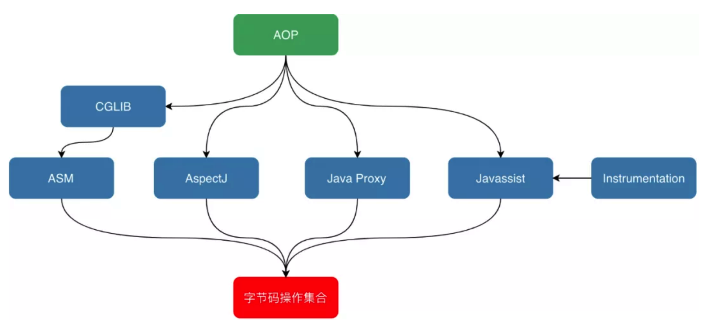
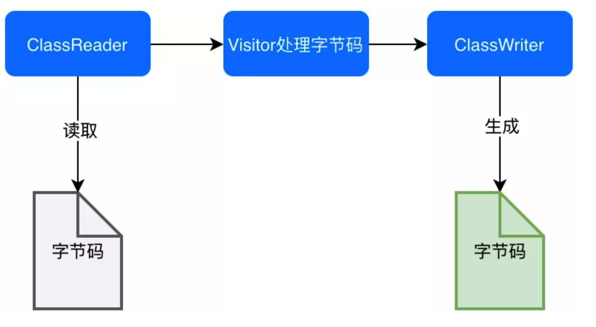

## 第 17 章 Java字节码增强技术

### 17.1 字节码增强技术

Java字节码增强是指在Java 字节码生成之后，对其进行修改，增强其功能，这种方式相当于对应用程序的二进制文件进行修改。Java 字节码增强主要是为了减少冗余代码，提高性能等。

实现字节码增强的主要步骤：

- 修改字节码

  在内存获取到原来的字节码，然后通过一些工具(如 ASM、Javaasit)来修改它的byte 数组，得到一个新的byte 数组

- 使修改后的字节码生效

  - 自定义 ClassLoader 来加载修改后的字节码
  - 替换掉原来的字节码：在 JVM 加载用户的 Class 时，拦截并返回修改后的字节码；或者在运行时，使用Instrumentation.redefineClasses 方法替换掉原来的字节码

### 17.2 ASM

对于需要手动修改字节码的需求，可以使用 ASM，它可以直接生成 `.class`字节码文件，也可以在类加载如 JVM 之前动态修改类行为。如下图:

ASM的应用场景有AOP(Cglib就是基于 ASM)、热部署、修改其他jar包中的类等。

#### 17.2.1 ASM 的 API

ASM  Core API不需要把整个类的整个结构读取进来，就可以用流式的方法来处理字节码文件。好处是非常节约内存，但是编程难度较大。然而处于性能考虑，一般情况下编程都使用Core API。在 Core API中有以下几个关键类：

- ClassReader：用于读取已经编译好的`.class`文件
- ClassWriter：用于重新构建编译后的类，如修改类名、属性以及方法，也可以生成新的类的字节码文件
- 各种 Visitor类：如上所述，Core API 根据字节码从上到下依次处理，对于字节码文件中不同的区域有不同的 Visitor，不如用于访问方法的 MethodVisitor、用于访问变量的 FieldVisitor、用于访问注解的 AnnotationVisitor等
- ClassAdapter：该类也实现了ClassVisitor 接口，它将对它的方法调用委托给另一个 ClassVisitor 对象。

ASM  Tree API可以类比解析XML文件中的DOM方式，把整个类的结构读取到内存中，缺点是消耗内存多，但是编程比较简单。TreeApi不同于CoreAPI，TreeAPI通过各种Node类来映射字节码的各个区域，类比DOM节点，就可以很好地理解这种编程方式。

ASM是一个强大的框架，利用它我们可以做到：

- 获得 class 文件的详细信息，包括类名、父类名、接口、成员名、方法名、方法参数名、局部变量名、元数据等
- 对 class 文件进行动态修改，如增加、删除、修改类方法，在某个方法里添加指令等
- CGLIB(动态代理)是对 ASM的封装，简化了ASM的操作，降低了ASM的使用门槛

[ASM 学习](https://blog.csdn.net/zhushuai1221/article/details/52169218)

### 17.2 Javaasist

Javassist 是强调源代码层次操作字节码的框架，操作起来很容易入手。

优势：

- 操作简单，容易上手
- 性能高于反射

缺点：

- 性能相对 ASM会低一些
- 不支持 continue 和 break 表达，不支持内部类和匿名类，因此在有些场景是不适合的

Javassist 常用类的说明：

- CtClass(compile-time class)：编译时类信息，它是一个class文件在代码中的抽象表现形式，可以通过一个类的全限定名来获取一个CtClass对象，用来表示这个类文件。
- ClassPool：ClassPool是一张保存CtClass信息的HashTable，key为类的全限定名称，value为类名对应的CtClass对象。当我们需要对某个类进行修改时，就是通过pool.getCtClass(“className”)方法从pool中获取到相应的CtClass。
- CtMethod、CtField：这两个比较好理解，对应的是类中的方法和属性，可以用于定义或者修改一些方法和字段。

**AOP 底层技术比较**

| AOP 底层技术        | 功能             | 性能                                        | 面向接口编程 | 编程难度                                          |
| ------------------- | ---------------- | ------------------------------------------- | ------------ | ------------------------------------------------- |
| 直接改写 class 文件 | 完全控制类       | 无明显性能代价                              | 不要求       | 高，要求对 class 文件结构和Java 字节码有深刻了解  |
| JDK Instrument      | 完全控制类       | 无论是否改写，每个类装入时都要执行 hook程序 | 不要求       | 高，要求对 class 文件结构和 Java 字节码有深刻了解 |
| JDK Proxy           | 只能改写 method  | 反射引入性能代价                            | 要求         | 低                                                |
| ASM                 | 几乎能完全控制类 | 无明显性能代价                              | 不要求       | 中，能操作需要改写部分的 Java 字节码              |

