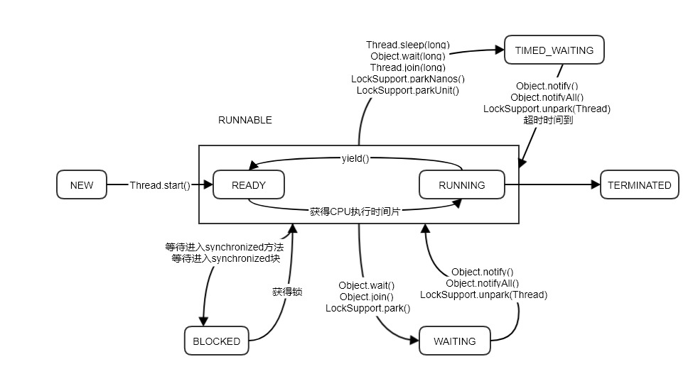
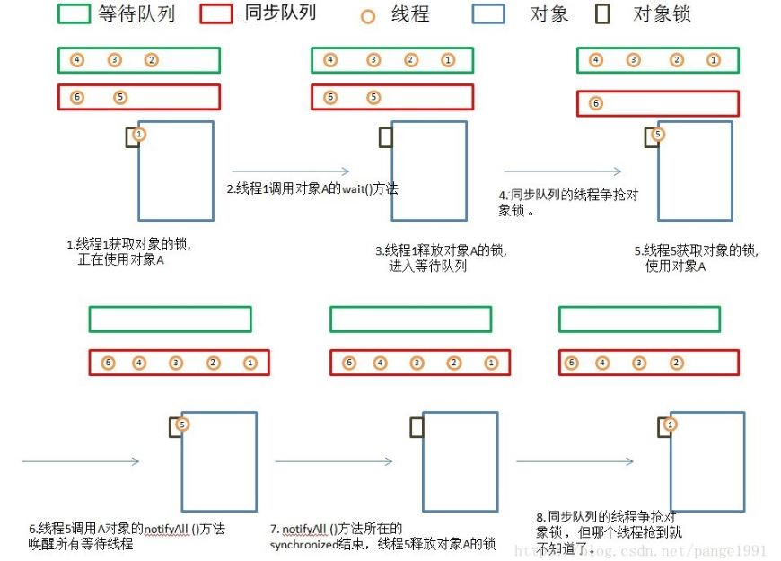

## 第1章 线程的基础知识

[TOC]

### 进程和线程

> 线程是一个操作系统级别的概念，JAVA语言（包括其他编程语言）本身不创建线程；而是调用操作系统层提供的接口创建、控制、销毁线程实例。
>
> 进程（Process）是计算机中的程序关于某数据集成上的一次运行活动，是操作系统资源分配和调度的基本单位，是操作系统结构的基础。

- 不同的操作系统它们所支持的线程的底层实现和操作效果也是不尽相同的。不过一个操作系统支持的线程至少会有四种状态：就绪、执行、阻塞和终结。线程在这四种状态下切换，都是要消耗不少 CPU 计算能力的。
- 线程分为用户线程和系统线程
- 一个进程（即一个应用程序）下的所有线程，都是共享这个进程中的资源

### Java中的线程状态及状态间的切换

Java线程的状态，在类Stat中定义

```java
public enum State {
        NEW,
        RUNNABLE,
        BLOCKED,
        WAITING,
        TIMED_WAITING,
        TERMINATED;
    }
```

- NEW：新创建的一个线程，线程还没有开始执行，即还没调用线程的 start() 方法
- RUNNABLE：Java线程中将就绪（ready）和运行中（running）两种状态笼统的成为“运行”。线程对象创建后，其他线程调用了该线程对象的start()方法。该状态的线程位于可运行线程池中，等待被线程池调度选中，获取CPU的使用权，此时处于就绪状态（ready）。就绪状态的线程在获得CPU时间片后变为运行中状态（running）
- BLOCKED：表示线程阻塞（等待进入synchronized修饰的代码块或方法），暂停执行
- WAITING：线程等待状态，是无时间限制的等待状态。需要其他线程做出一些特定操作，例如通知或中断
- TIMED_WAITING：线程等待状态，是有时间限制的等待状态，可以在指定的时间内自行返回
- TERMINATED：线程执行完毕



### 线程的基本方法

#### run() 和 start() 方法

把需要处理的代码放到 run() 方法中，start()方法启动线程将自动调用 run() 方法，这个由java的内存机制规定的。并且 run() 方法必需是 public 访问权限，返回值类型为 void。

#### sleep() 方法

使当前线程（即调用该方法的线程）暂停执行一段时间，让其他线程有机会继续执行，但它并不释放对象锁。也就是说如果有synchronized同步块，其他线程仍然不能访问共享数据。注意该方法要捕捉异常。 
例如有两个线程同时执行(没有synchronized)一个线程优先级为 **MAX_PRIORITY**，另一个为 **MIN_PRIORITY**，如果没有 Sleep() 方法，只有高优先级的线程执行完毕后，低优先级的线程才能够执行；但是高优先级的线程 sleep(500) 后，低优先级就有机会执行了。

总之，sleep() 可以使低优先级的线程得到执行的机会，当然也可以让同优先级、高优先级的线程有执行的机会。

#### join() 方法

join() 或者 join(long millis)，当前线程里调用其它线程的 join() 方法，当前线程进入 TIME_WAITING状态，当前线程不释放已经持有的对象锁。线程 thread 执行完毕或者 millis 时间到，当前线程进入就绪状态。

#### yield() 方法

yield()，当前线程调用此方法则当前线程放弃获得的 CPU 时间片，由运行状态变成就绪状态。作用：让相同优先级的线程获得执行的机会，但有可能还是当前线程争夺到 CPU 时间片

#### suspend() 和 resume() 方法

suspend() 线程挂起 和 resume() 继续执行，这是一对相反的操作。被废弃的方法，不推荐使用。suspend() 导致线程暂停，并不会释放任何锁资源。而且对于被挂起的线程，从它的线程状态上看，居然是 Runnable 状态，影响对系统当前状态的判断。

#### wait()、notify() 和 notifyAll() 方法

这三个方法用于协调多个线程对共享数据的存取，所以必须在 **synchronized** 语句块内使用。synchronized 关键字用于保护共享数据，阻止其他线程对共享数据的获取，但是这样程序的流程就很不灵活了，如何才能在当前线程还没退出 synchronized 数据块时让其他线程也有机会访问共享数据呢？此时就用这三个方法来灵活控制。 

wait() 方法使当前线程暂停执行并释放对象锁，让其他线程可以进入获得对象锁，而当前线程则被放入锁对象的等待队列中。当调用 notify() 方法后，将从对锁象的等待队列中随机唤醒一个线程放入锁对象的同步队列中参与锁对象的争夺；如果锁对象的等待队列中没有线程，则 notify() 不起作用。 notifyAll() 则唤醒等待队列中的全部线程。  注意 这三个方法都是 **java.lang.Object ** 的方法。

##### Object 中 wait()、notify() 和 notifyAll() 方法调度过程



**注意：**从上面两张图，我们可知 object.wait()等方法，线程进入监视器 monitor 锁的等待队列中，线程处于 waiting 状态。调用 object.notify()方法，线程进入同步队列中，争抢 monitor 锁，处于 blocked 状态。

synchronized 方法或方法块的调用，线程进入同步队列，线程处于 blocked 状态。