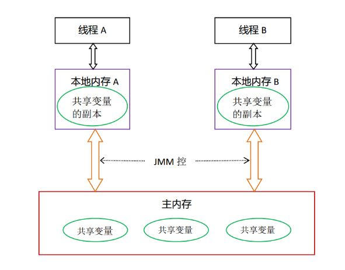

## 第 2 章 Java内存模型以及volatile关键字

[TOC]

### 2.1 Java 内存区域 与 Java 内存模型

#### 2.1.1 Java 内存区域


Java 虚拟机在运行程序时会把其自动管理的内存划分为以上几个区域，每个区域都各自的用途以及创建销毁的时机。

- 方法区（Method Area）

  方法区属于线程共享的内存区域，又称 Non-Heap（非堆），主要用于存储已被虚拟机加载的类信息、常量、静态变量、即时编译器编译后的代码等数据，根据 Java 虚拟机规范的规定，当方法区无法满足内存分配需求时，将抛出 OutOfMemoryError 异常。值得注意的是在方法区中存在一个叫运行时常量池（Runtime Constant Pool）的区域，它主要用于存放编译器生成的各种字面量和符号引用，这些内容将在类加载后存放到运行时常量池中，以便后续使用。

- 堆（Java Heap）

  堆也是属于线程共享的内存区域，它在虚拟机启动时创建，是 Java 虚拟机所管理的内存中最大的一块，主要用于存放对象实例，几乎所有的对象实例都在这里分配内存，注意堆是垃圾收集器管理的主要区域，因此很多时候也被称做 GC 堆，如果在堆中没有内存来用于实例分配，并且堆也无法再扩展时，将会抛出OutOfMemoryError 异常。

- 程序计数器（Program Counter Register）

  属于线程私有的数据区域，是一小块内存空间，主要代表当前线程所执行的字节码行号指示器。字节码解释器工作时，通过改变这个计数器的值来选取下一条需要执行的字节码指令，分支、循环、跳转、异常处理、线程恢复等基础功能都需要依赖这个计数器来完成。

- 虚拟机栈（Java Virtual Machine Stacks）

  属于线程私有的数据区域，与线程同时创建，总数与线程关联，代表 Java 方法执行的内存模型。每个方法执行时都会创建一个栈桢来存储方法的的变量表、操作数栈、动态链接方法、返回值、返回地址等信息。每个方法从调用直到结束就对应一个栈桢在虚拟机栈中的入栈和出栈过程，如下图：

  

- 本地方法栈（Native Method Stacks）

  本地方法栈属于线程私有的数据区域，这部分主要与虚拟机用到的 native 方法相关，一般情况下，我们无需关心此区域。

#### 2.1.2  Java 内存模型 （JMM）

Java内存模型（即 Java Memory Model，简称 JMM）本身是一种抽象的概念，并不真实存在，它描述的是一组规则或规范，通过这组规范定义了程序中各个变量（包括实例字段，静态字段和构成数组对象的元素）的访问方式。 用来屏蔽不同硬件和操作系统的内存访问差异，期望 Java 程序在各种平台上都能实现一致的内存访问效果。



- 主内存

  主要存储的是 Java 实例对象，所有线程创建的实例对象都存放在主内存中，不管该**实例对象是成员变量还是方法中的局部变量**，当然也包括了共享的类信息、常量、静态变量。由于是共享数据区域，多条线程对同一个变量进行访问可能会出现线程安全问题。

- *本地内存*

  主要存储当前方法的所有本地变量信息（本地内存中存储着主内存中的变量副本拷贝），每个线程只能访问自己的本地内存，即线程中的本地变量对其它线程是不可见的，就算是两个线程执行的是同一段代码，它们也会各自在自己的本地内存中创建属于当前线程的本地变量，当然也包括了字节码行号指示器、相关 native 方法的信息。注意由于本地内存是每个线程的私有数据，线程间无法相互访问，因此存储在本地内存的数据不存在线程安全问题。

#### 2.1.3 主内存、本地内存的数据存储类型及操作方式

根据 Java 虚拟机规范，对于一个实例对象而言：

- 方法的局部变量，如果是基本数据类型（boolean、byte、short、char、int、long、float、double），则直接存储在本地内存的栈帧结构中
- 方法的局部变量，如果是引用类型，那么该对象的引用会存储在本地内存的栈帧中，而对象的实例将存储在主内存中
- 成员变量，不管它是基本数据类型、包装类型（Integer、Double等）还是引用类型，都会被存储在 heap 中，即存储在主内存中
- 类变量，存储在主内存中

需要注意的是，在主内存中的实例对象可以被多线程共享，倘若两个线程同时调用了同一个对象的同一个方法，那么两条线程会将要操作的数据拷贝一份到自己的本地内存中，执行完成操作后才刷新到主内存。

### 2.2 原子性、可见性、有序性

#### 2.2.1 原子性（Atomicity）

原子性是指一个操作时不可中断的，要么不执行，要执行的话就一定执行成功。在 Java 中**基本数据类型**的变量的赋值和读取是原子性的操作。

```java
x = 10; //原子的
y = x;	//非原子的
x++;	//非原子的
x = x + 1;	//非原子的
```

#### 2.2.2 可见性（visibility）

可见性是指当多线程访问同一个共享变量是，若某个线程修改了该变量的值，其他线程能够立即知道修改的值。例如下面的代码

```java
i = 0;  	//共享变量
i = i + 1; 	//线程1的操作
j = i;		//线程2的操作
```

我们假设执行线程1，后执行线程2。一般会认为就 j == 1，但事实却不一定。

1. 创建线程的时候，由于编译器优化或者硬件优化的缘故，变量 i 被缓存在Cache中或者寄存器中，内存结构如下：

   

2. 当执行一次线程1之后，CPU 缓存中i变为了1，并把 Cache 中的1刷到了内存中，内存结构如下：

   

由于在线程启动的时候已经把 i 的值读到了CPU 的 Cache 中，所以在执行 j = i 的时候，给 j 赋的值是 0，而不是 1。所以上述的并发设计是不具备可见性的，因为在线程1 修改了 i 的时候，线程2 并没有立刻就能读到。

#### 2.2.3 有序性（ordering）

产生有序性问题是因为程序在执行时，可能会进行指令重排，重排后的指令与原指令的顺序未必一致。为什么要指令重排？指令重排可以提升 CPU 的性能，虽然会带来乱序问题但也是值得的。

> 指令重排可以保证串行语义一致，但是没有无法保证多线程之间的语义也是一致的

#### 2.2.4 指令重排

计算机在执行程序时，为了提高性能，编译器和处理器的常常会对指令做重排，一般分以下3种：

- 编译器优化的重排

  编译器在不改变单线程程序语义的前提下，可以重新安排语句的执行顺序。

- 指令并行的重排

  现代处理器采用了指令级并行技术来将多条指令重叠执行。如果不存在数据依赖性（即后一个执行的语句无需依赖前面执行的语句的结果），处理器可以改变语句对应的机器指令的执行顺序。

- 内存系统的重排

  由于处理器使用缓存和读写缓存区，这使得加载（load）和存储（store）操作看上去可能是在乱序执行，因为三级缓存的存在，导致内存与缓存的数据同步存在时间差。

其中编译器优化的重排属于编译器重排，指令并行的重排和内存系统的重排属于处理器重排，在多线程环境中，这些重排优化可能会导致程序出现内存可见性问题。

```java
//线程1:
context = loadContext(); //语句1
inited = true; //语句2
//线程2:
while (!inited) {
	sleep()
}
doSomethingWithConfig(context);
```

由于语句2可能会在语句1之前运行，所以可能会在 context 还没有被初始化的时候，就开始执行doSomethingWithConfig(context) 了。 在 Java 中可以使用 volatile 关键字来对 inited 进行修饰，从而保证语句1  happen-before 语句2。

### 2.3 Java 内存模型对于原子性、可见性和有序性的解决方案

在 Java 内存模型中提供一套解决方案来解决原子性、可见性和有序性问题：

- 原子性问题
  - Java 虚拟机对基本数据类型的读写是原子操作的
  - synchronizd 关键字或者重入锁（ReenterLock）来保证方法级别或者代码块级别的原子操作
- 可见性问题
  - 单线程：不存在内存可见性问题；
  - 多线程：Java 通过**volatile**、**synchronized**字实现可见性
    - **volatile**：volatile 保证变量新值立即被同步回主存，同时使其他线程的本地内存中 volatile 修饰的变量副本值失效，从而使得后续读取 volatile 变量要从主存再次刷新
    - **synchronized**：对变量进行解锁前，将对应变量同步回主内存
- 有序性问题
  - **volatile**：通过禁止重排序实现有序性
  - **synchronized**：通过声明临界区，保证线程互斥访问，实现有序性

除了靠 **sychronized** 和 **volatile** 关键字来保证原子性、可见性以及有序性外，Java 内存模型内部还定义一套 ***happens-before*** 规则来保证多线程环境下两个操作间的原子性、可见性以及有序性。

**happen-before 规则**：

如果 A happen-before B，那么 A 的所有操作完成后并产生结果才会执行 B 操作，可以说 A 所做的任何操作对 B 都是可见的。

- 程序顺序规则：单线程内保证语义的串行性；
- volatile 规则：volatile 修饰的变量的写操作，happen-before 后面对该变量的读操作。这就保证了 volatile 修饰的变量的可见性；
- 锁规则：对一个锁的 unlock 操作，happen-before 后面对该锁的 lock 操作；
- 线程启动规则：一个线程的 start() 方法，happen-before 该线程的每一个操作；
- 线程终止规则：线程的所有操作都 happen-before 对该线程的终止检测，可以通过 Thread.join() 方法结束、Thread.isAlive() 的返回值等手段检测到线程已经终止执行；
- 线程中断规则：对线程 interrupt() 方法的调用 happen-before 被中断线程的代码检测到中断时事件的发生；
- 对象终结规则：一个对象的初始化完成（构造函数执行结束）happen-before 它的 finalize() 方法；
- 传递性：A 操作先于 B 操作，B 操作先于 C 操作，A 操作必然先于 C 操作；

### 2.4 synchronized 关键字

关键字 ***synchronized*** 的作用是实现线程间的同步。它的工作是对同步的代码加锁，使得每一次只能有一个线程进入同步块，从而保证线程间的安全性。

- 指定加锁对象：对给定的对象加锁，进入同步代码块前要获得给定对象的锁。
- 直接作用于实例方法：相当于对当前实例加锁，进入同步代码块前要获得当前实例的锁。
- 直接作用于静态方法：相当于对当前类加锁，进入同步代码块前要获得当前类的锁。

synchronized 关键字除了用于线程同步、确保线程安全外，还可以保证线程间的可见性和有序性。

### 2.5 volatile 关键字

#### 2.5.1 volatile 变量具有可见性

简言之，被 volatile 关键字修饰的变量在修改后，将会强制被刷到内存中，且该变量在其它 CPU 中的 Cache 将会失效，从而保证线程在修改变量值后，其它线程能立马读到。

使用 2.1.2 中程序，使用 volatile 修饰变量 i

```java
volatile i = 0;  	//共享变量
i = i + 1; 	//线程1的操作
j = i;		//线程2的操作
```

- 第1步，线程1读取内存 i 的值

  

- 第2步，执行  i = i + 1 ，并把结果刷回内存，CPU2 中的缓存失效，然后 CPU2 更新缓存，把 i 值赋值给 j，并写回内存

  

这样就保证了 i 的操作是具备可见性的了，所以线程1修改了i之后，线程2能立刻读到修改后的值。

#### 2.5.2 volatile 变量不具有原子性

**volatile** 可以理解为一个轻量级的 **synchronized**，但是 volatile 变量不具备原子性。synchronized 对比 volatile 实现的是锁，锁提供了两个重要的特性：*互斥性*（mutualexclusion） 和*可见性*（visibility）。正是互斥保证了操作的原子性。

那么什么时候使用 volatile，什么时候使用 synchronized 呢？

- 当变量只需要具备可见性的时候使用 volatile，例如：对变量的写操作不依赖于该变量当前值；
- 当变量需要同时具备原子性和可见性的时候，就使用 synchronized。
- 在使用 volatile 和 synchronized 都可以的时候，优先使用 volatile，因为 volatile 的同步机制性能要高于锁的性能。

```java
public class Counter {

    private int counter = 0;		// 这里是 counter 是实例变量
    private CountDownLatch countDownLatch = null;

    public Counter(CountDownLatch countDownLatch) {
        this.countDownLatch = countDownLatch;
    }

    public void increase() {
        try {
            Thread.sleep(2);
        } catch (InterruptedException e) {
            e.printStackTrace();
        }
      	/**
      	 * 注意：这个操作是分三步完成的，读值、+1、写值，++操作就不是原子操作
      	 * 如果 counter 是方法内定义的局部变量，++操作就没问题
      	 */
        counter++;
        countDownLatch.countDown();
    }

    public int getCounter() {
        return counter;
    }

    public static void main(String[] args) throws InterruptedException {
        CountDownLatch countDownLatch = new CountDownLatch(2000);
        Counter counter = new Counter(countDownLatch);
        for (int i = 0; i < 2000; i++) {
            Thread thread = new Thread(new Runnable() {
                @Override
                public void run() {
                    counter.increase();
                }
            });
            thread.start();
        }
        countDownLatch.await();
        System.out.println(counter.getCounter());
    }

}
```

运行上述代码，结果是1992。代码很好理解，是很常见的线程不安全的实例。使用 volatile 修饰 counter 变量

```java
private volatile int counter = 0;
```

重新运行上述代码，发现结果依然不是2000，这就很好的说明了 volatile 不具备原子性。

上述代码要如何修改呢？

- 给 increase() 方法加上 synchronized

  ```java
  public synchronized void increase() {
          try {
              Thread.sleep(2);
          } catch (InterruptedException e) {
              e.printStackTrace();
          }
          counter++;
          countDownLatch.countDown();
      }
  ```

- 使用 Java 提供的具备原子操作的基本类型

  ```java
  public class Counter {
  
      private AtomicInteger counter = new AtomicInteger(0);
      private CountDownLatch countDownLatch = null;
  
      public Counter(CountDownLatch countDownLatch) {
          this.countDownLatch = countDownLatch;
      }
  
      public void increase() {
          try {
              Thread.sleep(2);
          } catch (InterruptedException e) {
              e.printStackTrace();
          }
          counter.incrementAndGet();
          countDownLatch.countDown();
      }
  
      public int getCounter() {
          return counter.get();
      }
  
      public static void main(String[] args) throws InterruptedException {
          CountDownLatch countDownLatch = new CountDownLatch(2000);
          Counter counter = new Counter(countDownLatch);
          for (int i = 0; i < 2000; i++) {
              Thread thread = new Thread(new Runnable() {
                  @Override
                  public void run() {
                      counter.increase();
                  }
              });
              thread.start();
          }
          countDownLatch.await();
          System.out.println(counter.getCounter());
      }
  
  }
  ```

#### 2.5.3 volatile 变量一定程度上具有有序性

在使用了 volatile 关键字之后，将会禁用指令重排，从而保证有序性。 当程序执行到 volatile 变量的读取或写操作时，将会保证该操作前面的语句都已经执行完成且结果对后边代码具有可见性；该操作后边的代码都没有执行。以下面的代码块为例：

```java
x = 2; //语句1
y = 0; //语句2
flag = true; //语句3
x = 4; //语句4
y = -1; //语句5
```

- flag 变量没有被 volatile 关键字修饰时由于指令重排的原因，我们可以得到下面依赖关系：

  

  我们可以看出： 语句1执行完之后才可以执行语句4； 语句2执行完之后才可以执行语句5； 其它执行的顺序不一定。

- flag 变量被 volatile 关键字修饰后由于 volatile 禁用了指令重排，我们可以得到下面依赖关系：

  

  我们可以看出： 语句1和语句2的顺序不一定； 语句1和语句2都执行完之后执行语句3； 语句3执行完之后才执行语句4和语句5； 语句4和语句5谁先执行不一定。

### 2.6 volatile关键字的实现原理

Java 内存模型为了实现 volatile 变量的内存语义，会限制编译器重排和指令重排，来实现了volatile 变量的写操作 happen-before 读操作。

对 volatile 修饰的变量进行写操作的时候，汇编指令会多出Lock前缀，Lock前缀在多核处理器下的作用：

- 将当前处理器缓存行的数据写回主存；
- 令其他 CPU 里缓存该内存地址的数据无效；

针对编译器重排，Java 内存模型指定了 volatile 的重排序规则，规定了哪些操作不能进行编译器重排：


在讲解处理器重排前，先来了解下内存屏障。内存屏障也称之为内存栅栏，是一组处理器指令，用于实现对内存操作顺序限制，有如下几种：

- LoadLoad 屏障

  执行顺序：Load1—>Loadload—>Load2

  Load2 以及后序的 Load 指令在加载数据之前，都能访问到 Load1 加载的数据。

- LoadStore 屏障

  执行顺序： Load1—>LoadStore—>Store2

  Store2 以及后序的 Store 指令在存储数据之前，都能访问到 Load1 加载的数据。

- StoreStore 屏障

  执行顺序：Store1—>StoreStore—>Store2
  Store2 以及后序的 Store 指令在存储数据之前，都能访问到 Store1 操作所存储的数据。

- StoreLoad 屏障

  执行顺序: Store1—> StoreLoad—>Load2
  Load2 以及后序的 Load 指令在加载数据之前，都可以访问到 Store1 操作所存储的数据。

针对处理器重排，编译器在生成字节码时，通过在指令序列中插入内存屏障指令来禁止特定类型的处理器重排序，以实现 volatile 内存语义。volatile底层通过内存屏障指令实现：


- 在每个 volatile 变量写操作之前插入 StoreStore 屏障，之后插入 StoreLoad 屏障；
  - 之前插入 StoreStore 屏障：禁止 volatile 写之前的写操作与其重排序，保证之前的所有写操作都写回主存，对 volatile 写可见；
  - 之后插入 StoreLoad 屏障：禁止 volatile 写之后的读写操作与其重排序，实现 volatile 写结果对后续操作可见；
- 在每个 volatile 变量读操作之后，接连插入 LoadLoad 屏障，LoadStore 屏障；
- - 插入LoadLoad屏障：禁止 volatile 变量读之后的读操作与其重排序；
  - 插入LoadStore屏障：禁止 volatile 变量读之后的写操作与其重排序；
  - 通过插入两次内存屏障，实现 volatile 读结果对后续操作可见；

### 2.7 volatile 的内存语义

volatile 实际上就是使用内存屏障的来实现可见性和有序性的：

- 有序性：它会确保指令重排时，使用内存屏障保证 volatile 变量操作前的操作都已经完成了，且在volatile变量操作完成后，才会执行后边的代码
- 可见性：CPU每次在修改 volatile 变量值之后，它会强制把数据从缓存刷到内存中去，才算本次操作完成
- 可见性：volatile 变量值修改后，它会导致其他 CPU 中的缓存失效
