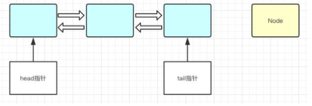
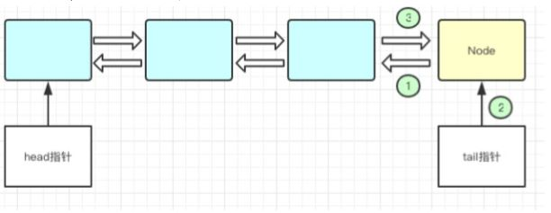
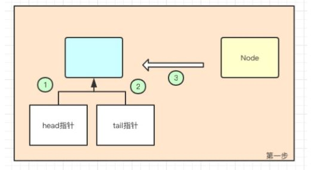
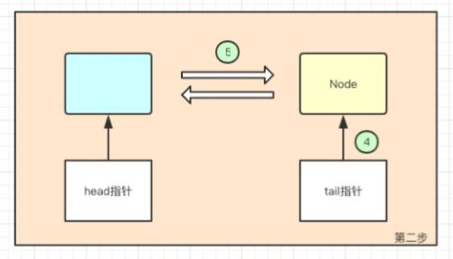
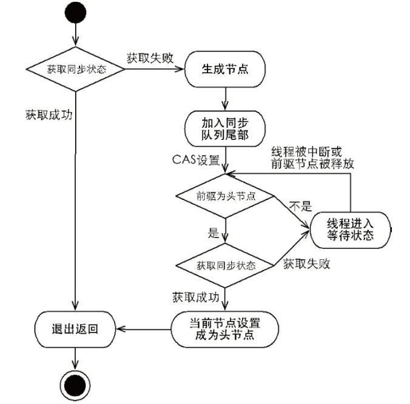

## 第 4 章 LockSupport 和 AbstractQueuedSynchronizer

[TOC]

### 4.1 LockSupport

sun.misc.Unsafe 类，该类提供了面向操作系统直接操作内存和 CPU 的方法，例如分配内存和阻塞线程等等。但时该类在使用时是不安全的，所以 jdk 在不同的场景下对它做了不同的包装。

java.util.concurrent.locks.LockSupport 类就是对 sun.misc.Unsafe 类进行了一些封装，主要提供一些锁的基础操作。

LockSupport阻塞线程的机制与 Object 的wait和notify是不一样的：

- 调用API层面的区别

  LockSupport 的 park 和 unpark 方法可以用“线程”作为该方法的参数，语义更合乎逻辑。 Object 的wait和notify是由监视器对象来调用的，对线程来说它的阻塞和唤醒是被动的，不能准确的控制某个指定的线程，要么随机唤醒（notify）、要么唤醒全部（notifyAll）。

- 实现原理的区别

  Object 的 wait 和 notify 以及 synchronized 都是通过占用和释放该对象的监视器来实现锁的获取和释放。LockSupport 不使用对象的监视器，每次执行 park 时会消耗1个许可，每次执行 unpark 时会获得1个许可。

  > 如果查看Unsafe的C++源码会发现，这个许可 ，其实就是一个 _counter 变量。 当执行 park 的时候，若 _counter 值大于0则立马返回并把 _counter 的值设置为0，线程不会阻塞；若 _counter 值等于0，则阻塞当前线程。可以理解这个过程将会消耗一个许可，若没有许可被消耗，则阻塞。 当执行 unpark 的时候，将会把 _counter 的值设置为1。可以理解这个过程是是给线程添加一个许可，且多次调用也只会添加一个许可。_counter 为1的时候表示许可可用，为0的时候表示许可不可用。

#### 4.1.1 LockSupport 类的核心字段

```java
public class LockSupport {
    private LockSupport() {} // Cannot be instantiated.

    // 给线程t设置阻塞对象，告诉t是谁阻塞了它。
    private static void setBlocker(Thread t, Object arg) {
        UNSAFE.putObject(t, parkBlockerOffset, arg);
    }

    // 若许可不可用，则使许可可用。若线程因为调用了park而阻塞，则它将阻塞状态解除。
    public static void unpark(Thread thread) {
        if (thread != null)
            UNSAFE.unpark(thread);
    }
    
    // 如果许可可用，则使用该许可，并立刻返回；否则阻塞当前线程，并告诉线程是谁阻塞了它。
    public static void park(Object blocker) {
        Thread t = Thread.currentThread();
        setBlocker(t, blocker);
        UNSAFE.park(false, 0L);
        setBlocker(t, null);
    }
    
    // 如果许可可用，则使用该许可，并立刻返回；否则阻塞当前线程nanos纳秒，并告诉线程是谁阻塞了它。
    public static void parkNanos(Object blocker, long nanos) {
        if (nanos > 0) {
            Thread t = Thread.currentThread();
            setBlocker(t, blocker);
            UNSAFE.park(false, nanos);
            setBlocker(t, null);
        }
    }

    // 如果许可可用，则使用该许可，并立刻返回；否则阻塞当前线程直到deadline，并告诉线程是谁阻塞了它。
    public static void parkUntil(Object blocker, long deadline) {
        Thread t = Thread.currentThread();
        setBlocker(t, blocker);
        UNSAFE.park(true, deadline);
        setBlocker(t, null);
    }

    // 获取是谁阻塞了线程t
    public static Object getBlocker(Thread t) {
        if (t == null)
            throw new NullPointerException();
        return UNSAFE.getObjectVolatile(t, parkBlockerOffset);
    }

    // 如果许可可用，则使用该许可，并立刻返回；否则阻塞当前线程。
    public static void park() {
        UNSAFE.park(false, 0L);
    }

    // 如果许可可用，则使用该许可，并立刻返回；否则阻塞当前线程nanos纳秒。
    public static void parkNanos(long nanos) {
        if (nanos > 0)
            UNSAFE.park(false, nanos);
    }

    // 如果许可可用，则使用该许可，并立刻返回；否则阻塞当前线程直到deadline。与parkNanos相比，这里的时间是绝对时间戳。
    public static void parkUntil(long deadline) {
        UNSAFE.park(true, deadline);
    }

    static final int nextSecondarySeed() {
        int r;
        Thread t = Thread.currentThread();
        if ((r = UNSAFE.getInt(t, SECONDARY)) != 0) {
            r ^= r << 13;   // xorshift
            r ^= r >>> 17;
            r ^= r << 5;
        }
        else if ((r = java.util.concurrent.ThreadLocalRandom.current().nextInt()) == 0)
            r = 1; // avoid zero
        UNSAFE.putInt(t, SECONDARY, r);
        return r;
    }

    private static final sun.misc.Unsafe UNSAFE;
    
    // Thread中parkBlocker的内存偏移量， parkBlocker用来存放该线程阻塞时是被哪个对象阻塞的。
    private static final long parkBlockerOffset;
    private static final long SEED;
    private static final long PROBE;
    private static final long SECONDARY;
    static {
        try {
            UNSAFE = sun.misc.Unsafe.getUnsafe();
            Class<?> tk = Thread.class;
            parkBlockerOffset = UNSAFE.objectFieldOffset
                (tk.getDeclaredField("parkBlocker"));
            SEED = UNSAFE.objectFieldOffset
                (tk.getDeclaredField("threadLocalRandomSeed"));
            PROBE = UNSAFE.objectFieldOffset
                (tk.getDeclaredField("threadLocalRandomProbe"));
            SECONDARY = UNSAFE.objectFieldOffset
                (tk.getDeclaredField("threadLocalRandomSecondarySeed"));
        } catch (Exception ex) { throw new Error(ex); }
    }
}
```

### 4.2 AbstractQueuedSynchronizer

队列同步器 AbstractQueuedSynchronizer（AQS），简称同步器，是用来构建锁或者其他同步组件的基础框架。它使用一个 int 成员变量表示同步状态，通过内置的 FIFO 队列来完成资源获取线程的排队工作。

同步器的主要使用方式是继承，子类通过继承同步器并实现它的抽象方法来管理同步状态。子类推荐被定义为自定义组件的静态内部类，同步器自身没有实现任何同步接口，它仅仅是定义了若干同步状态获取和释放的方法来供自定义同步组件使用，同步器既支可以持独占式地获取同步状态，也可以支持共享式地获取同步状态，这样就可以方便实现不同类型的同步组件（ReentrantLock、ReentrantReadWriteLock 和 CountDownLatch 等）。

同步器是实现锁（也可以是任意同步组件）的关键，在锁的实现中聚合同步器，利用同步器实现锁的语义。锁是面向使用者的，它定义了使用者与锁交互的接口，隐藏了内部实现细节；同步器面向的是锁的实现者，它简化了锁的实现方式，屏蔽了同步状态管理、线程排队、等待与唤醒等底层操作。锁和同步器很好的隔离了使用者和实现者所需关注的领域。

#### 4.2.1 同步器的接口和示例

同步器是基于模板方法模式的，使用者需要继承同步器并重写指定的方法，随后将同步器组合在自定义同步组件的实现中，并调用同步器提供的模板方法。

重写同步器指定的方法时，需要使用同步器提供的如下3个方法来访问或修改同步状态：

- getState()：获取当前同步状态
- setState(int newState)：设置当前同步状态
- compareAndSetState(int expect, int update)：使用 CAS 设置当前状态

**同步器可重写的方法**

|                    方法                     |                             描述                             |
| :-----------------------------------------: | :----------------------------------------------------------: |
|    protected boolean tryAcquire(int arg)    | 独占式获取同步状态，实现该方法需要查询当前状态并判断同步状态是否符合预期，然后再进行 CAS 设置同步状态 |
|    protected boolean tryRelease(int arg)    | 独占式释放同步状态，等待获取同步状态的线程将有机会获取同步状态 |
|   protected int tryAcquireShared(int arg)   | 共享式获取同步状态，返回大于等于0的值，表示获取成功；反之，获取失败 |
| protected boolean tryReleaseShared(int arg) |                      共享式释放同步状态                      |
|    protected boolean isHeldExclusively()    | 当前同步器是否在独占模式下被线程占用，一般该方法表示是否被当前线程占用 |

**同步器提供的模板方法**

|                        方法                        |                             描述                             |
| :------------------------------------------------: | :----------------------------------------------------------: |
|               void acquire(int arg)                | 独占式获取同步状态，如果当前线程获取同步状态成功，则由该方法返回；否则，线程将会进入同步等待队列等待，该方法将会调用重写的 tryAcquire(int arg) 方法 |
|         void acquireInterruptibly(int arg)         | 与 acquire(int arg) 相同，但是该方法响应中断，当前线程未获取到同步状态而进入同步队列中，如果当前线程被中断，则该方法会抛出 InterruptedException 并返回 |
|    boolean tryAcquireNanos(int arg, long nanos)    | 在 acquireInterruptibly(int arg) 基础上增加了超时限制，如果当前线程在超时时间内没有获得到同步状态，那么将会返回 false；如果获取到，则返回 true |
|            void acquireShared(int arg)             | 共享式获取同步状态，如果当前线程未获取到同步状态，将会进入同步队列等待，与独占式获取的主要区别是在同一时刻可以有多个线程获得同步状态 |
|      void acquireSharedInterruptibly(int arg)      |        与 acquireShared(int arg) 相同，该方法响应中断        |
| boolean tryAcquireSharedNanos(int arg, long nanos) | 在 acquireSharedInterruptibly(int arg) 的基础上增加了超时限制 |
|              boolean release(int arg)              | 独占式的释放同步状态，该方法会在释放同步状态之后，将同步队列中第一个节点包含的线程唤醒 |
|           boolean releaseShared(int arg)           |                     共享式的释放同步状态                     |
|       Collection<Thread> getQueuedThreads()        |                获取等待在同步队列上的线程集合                |

使用同步器实现一个独占锁 Mutex，代码如下

```java
public class Mutex implements Lock {
    /**
     * 静态内部类自定义同步器
     */
    private static class Sync extends AbstractQueuedSynchronizer {
        @Override
        protected boolean isHeldExclusively() {
            return super.getState() == 1;
        }

        @Override
        protected boolean tryAcquire(int arg) {
            if (super.compareAndSetState(0, 1)) {
                super.setExclusiveOwnerThread(Thread.currentThread());
                return true;
            }
            return false;
        }

        @Override
        protected boolean tryRelease(int arg) {
            if (super.getState() == 0) {
                throw new IllegalMonitorStateException();
            }
            super.setExclusiveOwnerThread(null);
            super.setState(0);
            return true;
        }

        final ConditionObject newCondition() {
            return new ConditionObject();
        }
    }

    // 仅需将操作代理到sync上即可
    private final Sync sync = new Sync();

    @Override
    public void lock() {
        sync.acquire(1);
    }

    @Override
    public void lockInterruptibly() throws InterruptedException {
        sync.acquireInterruptibly(1);
    }

    @Override
    public boolean tryLock() {
        return sync.tryAcquire(1);
    }

    @Override
    public boolean tryLock(long time, TimeUnit unit) throws InterruptedException {
        return sync.tryAcquireNanos(1, unit.toNanos(time));
    }

    @Override
    public void unlock() {
        sync.release(1);
    }

    @Override
    public Condition newCondition() {
        return sync.newCondition();
    }
}
```

上述实现了一个独占式的同步组件，它在同一时刻只允许一个线程占有锁。其内部定义了一个内部类，该内部类继承 AbstractQueuedSynchronizer 并实现独占式获取和释放同步状态。在使用 Mutex 时并不需要直接和同步器打交道，而是使用 Mutex 提供的方法。测试代码如下：

```java
public class MutexTest {
    private static final Mutex mutex = new Mutex();

    private static int counter;

    public static void main(String[] args) throws InterruptedException {
        Thread thread1 = new Thread(new CountThread());
        Thread thread2 = new Thread(new CountThread());
        thread1.start();
        thread2.start();
        thread1.join();
        thread2.join();
        System.out.println(counter);
    }

    static class CountThread implements Runnable {
        @Override
        public void run() {
            for (int i = 0; i < 15000; i++) {
                mutex.lock();
                try {
                    counter++;
                } finally {
                    mutex.unlock();
                }
            }
        }
    }
}
```

### 4.3 AbstractQueuedSynchronizer 实现分析

> AbstractQueuedSynchronizer 是 java.util.concurrent 包的核心

相关概念

- 独占锁
  资源最多同时只能被一个线程占用
- 共享锁
  资源同时可以被多个线程占用
- 公平锁
  线程按照提交的顺序依次去获取资源，按照一定的优先级来，FIFO
- 非公平锁
  线程获取资源的顺序是无序的

#### 4.3.1 同步队列

AbstractQueuedSynchronizer 依赖内部的同步队列（一个FIFO的双向队列）来完成同步状态的管理，当前线程同步获取同步状态失败时，同步器会将当前线程以及等待信息构造成一个节点（Node）并将其加入到同步队列中，同时会阻塞当前线程（线程是通过自旋来等待而不是睡眠）；当同步状态被释放时，会把首节点中的线程唤醒，使其再次尝试获取同步状态。

#### 4.3.2 AbstractQueuedSynchronizer.Node 类

 Node 这个类就是个用来实现同步队列的数据结构，它是双向队列中的一个节点，数据结构大致如下：

```
      +------+  prev +-----+       +-----+
 head |      | <---- |     | <---- |     |  tail
      +------+       +-----+       +-----+
```

> 图中没有把next指向描述出来。

Node类的关键字段：

- SHARED：共享模式的节点常量

- EXCLUSIVE：独占模式的节点常量

- waitStatus：当前节点/线程的等待状态，该变量会有下面几个值：

  | 状态      | 值   | 说明                                                         |
  | --------- | ---- | ------------------------------------------------------------ |
  | CANCELLED | 1    | 由于在同步队列中等待的线程出现等待超时或者被中断了，需要从同步队列中取消等待，节点进入该状态将不会变化 |
  | SIGNAL    | -1   | 后继节点的线程处于等待状态，而当前节点的线程如果释放了同步状态或者被取消，将会通知后继节点，使后继节点的线程得以运行 |
  | CONDITION | -2   | 节点在等待队列中，节点线程等待在 Condition 上，当其他线程对 Condition 调用了 signal() 方法后，该节点将会从等待队列中转移到同步队列中，加入到对同步状态的获取中 |
  | PROPAGATE | -3   | 表示下一次共享式同步状态获取将会无条件地被传播下去           |
  | INITIAL   | 0    | 初始状态                                                     |

- prev：等待队列中，该节点的上一个节点

- next：等待队列中，该节点的下一个节点

- thread：节点包含的的线程

```java
public abstract class AbstractQueuedSynchronizer extends AbstractOwnableSynchronizer implements java.io.Serializable {
	...
    static final class Node {
        // 分享锁模式
        static final Node SHARED = new Node();
        // 独占锁模式
        static final Node EXCLUSIVE = null;

        // 线程取消状态
        static final int CANCELLED =  1;
        // thread执行成功，等待unpack
        static final int SIGNAL    = -1;
        // thread位于condition queue队列中，等待唤醒
        static final int CONDITION = -2;
        
        static final int PROPAGATE = -3;
		// 等待状态
        volatile int waitStatus;
		// 前驱节点
        volatile Node prev;
        
		// 后续节点
        volatile Node next;

        // 将当前节点入队的线程对象
        volatile Thread thread;

        Node nextWaiter;

        final boolean isShared() {
            return nextWaiter == SHARED;
        }

        final Node predecessor() throws NullPointerException {
            Node p = prev;
            if (p == null)
                throw new NullPointerException();
            else
                return p;
        }

        Node() {    // Used to establish initial head or SHARED marker
        }

        Node(Thread thread, Node mode) {     // Used by addWaiter
            this.nextWaiter = mode;
            this.thread = thread;
        }

        Node(Thread thread, int waitStatus) { // Used by Condition
            this.waitStatus = waitStatus;
            this.thread = thread;
        }
    }
    ...
```

Node 节点的相关的入队操作

```java
private Node addWaiter(Node mode) {
    Node node = new Node(Thread.currentThread(), mode);
    // Try the fast path of enq; backup to full enq on failure
    Node pred = tail;
    if (pred != null) {
        node.prev = pred;
        if (compareAndSetTail(pred, node)) {
            pred.next = node;
            return node;
        }
    }
    enq(node);
    return node;
}

private Node enq(final Node node) {
    for (;;) {
        Node t = tail;
        if (t == null) { // Must initialize
            if (compareAndSetHead(new Node()))
                tail = head;
        } else {
            node.prev = t;
            if (compareAndSetTail(t, node)) {
                t.next = node;
                return t;
            }
        }
    }
}

private final boolean compareAndSetHead(Node update) {
    return unsafe.compareAndSwapObject(this, headOffset, null, update);
}

private final boolean compareAndSetTail(Node expect, Node update) {
    return unsafe.compareAndSwapObject(this, tailOffset, expect, update);
}
```

当队列不为空时，节点添加到队列前，队列状态如下图所示：



节点加入队列的过程如下图所示：



当队列为空时，首次加入节点会进行一些初始化（即 enq 方法中的 if 分支），之后再执行 node 节点入队，具体的操作过程可以看下图：





出对操作

```java
private void setHead(Node node) {
    head = node;
    node.thread = null;
    node.prev = null;
}
```

#### 4.3.3 独占式同步状态的实现

##### 4.3.3.1 独占模式的获取

```java
public final void acquire(int arg) {
    if (!tryAcquire(arg) && acquireQueued(addWaiter(Node.EXCLUSIVE), arg))
        selfInterrupt();
}
```

上述代码主要完成了同步状态获取、节点构造、加入同步队列以及在同步队列中自旋等待的相关工作，这块的流程如下图：



- 先通过 tryAcquire	来尝试获取同步状态，如果能获取到的话就返回；否则加入到队列中，并阻塞线程；
- 线程退出阻塞的时候，通过	Thread.interrupted() 来判断线程是否是因为被中断才退出 park 的，若是的话，则中断当前线程。

```java
// 线程节点之前已经加入到队列中了，该方法将要阻塞该线程，在退出阻塞的时，返回该线程是否是被中断退出的。
final boolean acquireQueued(final Node node, int arg) {
    boolean failed = true;
    try {
        boolean interrupted = false;
        // 自旋锁，等待前面的节点释同步状态
        for (;;) {
            // 获取该节点的前继节点
            final Node p = node.predecessor();
            
            // 如果前继节点是头节点，可以直接去尝试获取同步状态；如果没有其它线程干扰，肯定能够获取到
            if (p == head && tryAcquire(arg)) {
                // 前继节点出队，当前的node设置为head
                setHead(node);
                p.next = null; // help GC
                failed = false;
                return interrupted;
            }
            
            // 去除前面被取消的(CANCELLED)的线程
            // 若前继节点没有没被取消，则表示当前线程可以被park										    // park当前线程，park结束时检查是否被interrupt，若是则设置interrupted为true，跳出循环后中断线程
            if (shouldParkAfterFailedAcquire(p, node) && parkAndCheckInterrupt())
                interrupted = true;
        }
    } finally {
        // 若线程失败，则取消获取同步状态
        if (failed)
            cancelAcquire(node);
    }
}

// 去除前面被取消的(CANCELLED)的线程，若前继节点没有没被取消,则表示当前线程可以被park
private static boolean shouldParkAfterFailedAcquire(Node pred, Node node) {
    int ws = pred.waitStatus;
    if (ws == Node.SIGNAL)
        // 前继节点已经成功执行，等待释放锁，所以当前的线程可以安全的park 
        return true;
    if (ws > 0) {
        // 前继节点的线程已经被取消，所以跳过已经被取消的节点，并一直往前跳过所有连续的被取消节点
        do {
            node.prev = pred = pred.prev;
        } while (pred.waitStatus > 0);
        pred.next = node;
    } else {
        // 当前继节点的waitStatus既不是SIGNAL也不是CANCELLED，需要设置waitStatus的值为SIGNAL，并返回false，继续自旋
        compareAndSetWaitStatus(pred, ws, Node.SIGNAL);
    }
    return false;
}
```

##### 4.3.3.2 独占模式的释放

释放独占模式，解除线程阻塞；该过程中会唤醒队列中后继节点的线程。

```java
// 释放独占锁，该方法一般会被子类调用，例如java.util.concurrent.locks.ReentrantLock#unlock方法
public final boolean release(int arg) {
    if (tryRelease(arg)) {
        Node h = head;
        if (h != null && h.waitStatus != 0)
            // 唤醒后继节点的线程
            unparkSuccessor(h);
        return true;
    }
    return false;
}

private void unparkSuccessor(Node node) {
    // node节点已经执行完成，不用加锁了，所以可以把等待状态设置为0
    int ws = node.waitStatus;
    if (ws < 0)
        compareAndSetWaitStatus(node, ws, 0);

    // 唤醒node节点的后继节点线程
    Node s = node.next;
    if (s == null || s.waitStatus > 0) {
        s = null;
        for (Node t = tail; t != null && t != node; t = t.prev)
            if (t.waitStatus <= 0)
                s = t;
    }
    if (s != null)
        LockSupport.unpark(s.thread);
}
```

#### 4.3.4 共享式同步状态的实现

##### 4.3.4.1 共享模式的获取

```java
public final void acquireShared(int arg) {
    // 尝试获取共享模式，若无许可则进入等待
    if (tryAcquireShared(arg) < 0)
        doAcquireShared(arg);
}

// 该方法和独占模式acquireQueued方法很像，主要的区别就是在setHeadAndPropagate中，如果当前节点获取到了许可，且还有多余的许可，则继续让后继节点获取许可并唤醒他们，并一直往后传递下去。
private void doAcquireShared(int arg) {
    final Node node = addWaiter(Node.SHARED);
    boolean failed = true;
    try {
        boolean interrupted = false;
        for (;;) {
            // 获取到前继节点	
            final Node p = node.predecessor();
            // 如果前继节点就是head节点的话
            if (p == head) {
                // 尝试获取共享模式
                int r = tryAcquireShared(arg);
                if (r >= 0) {
                    // 设置当前节点为head节点	
                    setHeadAndPropagate(node, r);
                    p.next = null; // help GC
                    // 判断退出xxxx的时候，是否是被interrupt掉的
                    if (interrupted)
                        selfInterrupt();
                    failed = false;
                    return;
                }
            }
            
            // 去除前面被取消的（CANCELLED）的线程													// 若前继节点没有没被取消，则表示当前线程可以被park											// park当前线程，park结束时检查是否被interrupt，若是则设置interrupted为true，跳出循环后中断线程	
            if (shouldParkAfterFailedAcquire(p, node) && parkAndCheckInterrupt())
                interrupted = true;
        }
    } finally {
        if (failed)
            cancelAcquire(node);
    }
}

private void setHeadAndPropagate(Node node, int propagate) {
    Node h = head; // Record old head for check below
    setHead(node);

    if (propagate > 0 || h == null || h.waitStatus < 0 ||
        (h = head) == null || h.waitStatus < 0) {
        Node s = node.next;
        if (s == null || s.isShared())
            doReleaseShared();
    }
}
```

##### 4.3.4.2 共享模式的释放 

```java
// 当tryReleaseShared返回true的时候会把一个或多个线程从共享模式中唤醒
public final boolean releaseShared(int arg) {
    // tryReleaseShared由子类实现
    if (tryReleaseShared(arg)) {
        doReleaseShared();
        return true;
    }				
    return	false;
}

private void doReleaseShared() {
    for (;;) {
        Node h = head;
        // 若队列里有线程节点
        if (h != null && h != tail) {
            int ws = h.waitStatus;
            // 线程状态为SIGNAL的时候，才可以唤醒后继节点的线程
            if (ws == Node.SIGNAL) {
                // 重置Node的状态为0，unpark该节点	
                if (!compareAndSetWaitStatus(h, Node.SIGNAL, 0))
                    continue;
                unparkSuccessor(h);
            } else if (ws == 0 && !compareAndSetWaitStatus(h, 0, Node.PROPAGATE))
               	// 如果线程状态为0则更新状态为PROPAGATE，让后继节点传播唤醒操作，失败重试	
                continue;
        }
        // head变化了,说明该节点被唤醒了，则继续唤醒后边的节点
        if (h == head)
            break;
    }
}
```