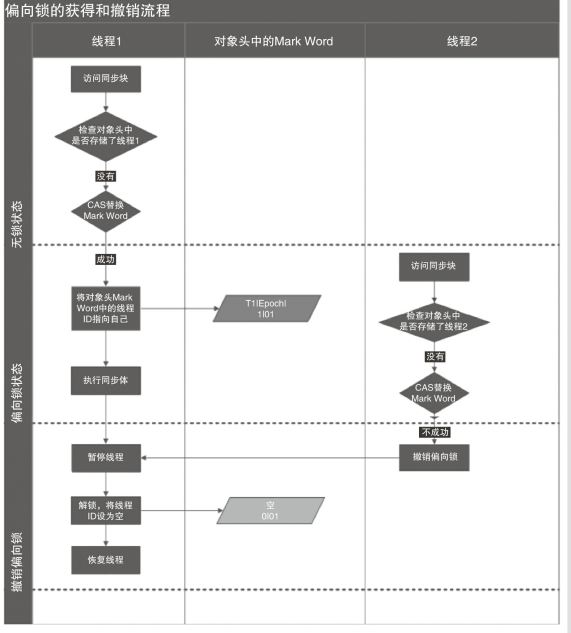

## 第 5 章  synchronized、 ReentrantLock 和 ReentrantReadWriteLock

[TOC]

ReentrantLock 是基于 AQS 设计的可重入锁，synchronized 是基于对象监视器实现的可重入锁。使用了它们后，代码都会具有原子性（atomicity）和可见性 （visibility）。
可重入锁也被称为递归锁，指同一个线程内，外层代码锁未被释放时，内层代码也可以获取到锁，递归就是一种很常见的场景。下面就是可重入锁的一种使用场景：

```java
public class Demo {
    Lock lock = new Lock();
    public void outer(){
        lock.lock();
        inner();
        lock.unlock();
    }				
    public void inner(){
        lock.lock();
        //do something 
        lock.unlock();
    } 
}
```

ReentrantLock 和 synchronized 在并发编程中，有着相同的语义，但是它们实现的原理存在着较大的差异，在设计的思想上更是有着很多不同之处。

### 5.1 synchronized 语义原理

关键字 synchronized 的作用是实现线程同步。它的工作是对同步的代码加锁，使得每次只能有一个线程进入同步代码，从而保证了线程间的安全。synchronized 的用法有如下几种：

- 对象级别加锁：相当于对当前实例对象加锁，进入同步代码块前要获得当前实例的锁

  ```java
  //变量 
  int	count = 0; 
  synchronized(count){
      //... 
  }
  // 实例方法
  public synchronized	void method(){
      //... 
  }
  // 当前对象实例
  synchronized(this){
      //... 
  }
  ```

- 类级别加锁：相当于对当前类加锁，进入同步代码前要获得当前类的锁

  ```java
  // 共享变量，
  static int count = 0;
  // 获取共享变量的锁
  synchronized(count){
      //... 
  }
  // 类方法
  public synchronized	static void method(){
      //... 
  }
  // 类加载器
  synchronized(Demo2.class){
      //... 
  } 
  // 或者
  synchronized(this.getClass()){
      //...
  }
  ```

#### 5.1.1 理解 Java 对象头和 Monitor

在 JVM 中，对象在内存中的布局分为三块区域：对象头、实例变量和填充数据，如图：


- 实例变量：存放类的属性数据信息，包括父类的属性信息，如果是数组的实例部分还包括数组的长度，这部分内存按4字节对齐。
- 填充数据：由于虚拟机要求对象起始地址必须是8字节的整数倍。填充数据不是必须存在的，仅仅是为了字节对齐，这点了解即可。

而对于 Java 的对象头，它是实现 synchronized 的锁对象的基础。一般而言，synchronized 使用的锁对象是存储在 Java 对象头里的，JVM 中采用2个字节存储对象头（如果对象是数组类型则会分配3个字节，多出的一个字节记录数组的长度），其主要结构是由 ***Mark Word*** 和 ***Class Metadata Address*** 组成：

| 虚拟机位数 |       头对象结构       |                             说明                             |
| :--------: | :--------------------: | :----------------------------------------------------------: |
|  32/64bit  |       Mark Word        |      存储对象的 hashcode、锁、分代年龄或者GC标志等信息       |
|  32/64bit  | Class Metadata Address | 类型指针，指向对象的类元数据，JVM 通过这个指针确定该对象是哪个类的实例 |
|  32/64bit  |      Array Length      |              数组的长度，如果当前对象是数组的话              |

其中Mark Word在默认情况下存储着对象的 hashCode、分代年龄、锁标记位等信息，以下是32位虚拟机的 Mark Word 默认存储结构：

|  锁状态  |     25bit     |     4bit     | 1bit是否是偏向锁 | 2bit 锁标志位 |
| :------: | :-----------: | :----------: | :--------------: | :-----------: |
| 无锁状态 | 对象 hashCode | 对象分代年龄 |        0         |      01       |

在运行期间，Mark Word 里存储的数据会随着锁标志位的变化而变化。Mark Word 可能变化存储为以下4种数据结构：

在64位虚拟机，Mark Word 是64bit大小，其存储结构：

其中轻量级锁和偏向锁是 Java 6 为了减少获得锁和释放锁带来的性能消耗引入的。我们重点分析下重量级锁也就是通常所说的 synchronized 的对象锁，锁标志位为10，其中指针指向的 monitor 对象（也称为管程或监视器锁）的起始地址。每个对象都存在着一个 monitor 对象与之关联，对象与其 monitor 之间的关系存在多种实现方式，如 monitor 可以与对象一起创建和销毁，或者当线程试图获取对象锁时自动生成，当一个 monitor 被某个线程持有后，它便处于锁定状态。在 Java 虚拟机中，monitor 是由 ObjectMonitor 实现的，其主要数据结构如下（位于 HotSpot 虚拟机源码 ObjectMonitor.hpp 文件，C++实现的）：
```c++
ObjectMonitor() {
    _header       = NULL;
    _count        = 0; //记录个数
    _waiters      = 0,
    _recursions   = 0;
    _object       = NULL;
    _owner        = NULL;
    _WaitSet      = NULL; //处于wait状态的线程，会被加入到_WaitSet
    _WaitSetLock  = 0;
    _Responsible  = NULL;
    _succ         = NULL;
    _cxq          = NULL;
    FreeNext      = NULL;
    _EntryList    = NULL; //处于等待锁block状态的线程，会被加入到该列表
    _SpinFreq     = 0;
    _SpinClock    = 0;
    OwnerIsThread = 0;
  }
```

ObjectMonitor 中有两个队列，***_WaitSet*** 和 ***_EntryList***，用来保存 ObjectWaiter 对象列表（每个等待锁的线程都会被封装成 ObjectWaiter 对象），***_Owner*** 指向持有 ObjectMonitor 对象的线程。当多个线程同时访问同一段同步代码时，会首先进入 ***_EntryList*** 集合，当线程获取到对象的 monitor 后进入到 _Owner 区域并把 monitor 中的 owner 变量设置为当前线程同时 monitor 中的计数器 count 加1；若线程调用 wait() 方法，将释放当前持有的 monitor，owner 变量恢复为 null，count 自减1，同时该线程进入 _WaitSet 集合中等待被唤醒。若当前线程执行完毕也将释放 monitor 并复位变量的值，以便其他线程进入获取 monitor。过程如下图所示：

可以看出，monitor 对象存在于每个 Java 对象的对象头中（存储的指针的指向），synchronized 锁便是通过这种方式获取锁的，也是为什么 Java 中任意对象可以作为锁使用的原因，同时也是 notify/notifyAll/wait 等方法存在于顶级对象 Object 中的原因。

#### 5.1.2 synchronized 的底层原理

```java
/**
 * 同步代码块
 */
public void method1() {
    synchronized(this) {
        System.out.println("method1 start");
    }
}

/**
 * 同步方法
 */
public synchronized void method2() {
    System.out.println("method2 start");
}
```

反编译上述代码，我们可以看到字节码如下：

```java
public void method1();
    descriptor: ()V
    flags: (0x0001) ACC_PUBLIC
    Code:
      stack=2, locals=3, args_size=1
         0: aload_0
         1: dup
         2: astore_1
         3: monitorenter
         4: getstatic     #2                  // Field java/lang/System.out:Ljava/io/PrintStream;
         7: ldc           #5                  // String method1 start
         9: invokevirtual #4                  // Method java/io/PrintStream.println:(Ljava/lang/String;)V
        12: aload_1
        13: monitorexit
        14: goto          22
        17: astore_2
        18: aload_1
        19: monitorexit
        20: aload_2
        21: athrow
        22: return
      Exception table:
         from    to  target type
             4    14    17   any
            17    20    17   any
      LineNumberTable:
        line 7: 0
        line 8: 4
        line 9: 12
        line 10: 22
      StackMapTable: number_of_entries = 2
        frame_type = 255 /* full_frame */
          offset_delta = 17
          locals = [ class SyncTest, class java/lang/Object ]
          stack = [ class java/lang/Throwable ]
        frame_type = 250 /* chop */
          offset_delta = 4
          
public synchronized void method2();
    descriptor: ()V
    flags: (0x0021) ACC_PUBLIC, ACC_SYNCHRONIZED
    Code:
      stack=2, locals=1, args_size=1
         0: getstatic     #2                  // Field java/lang/System.out:Ljava/io/PrintStream;
         3: ldc           #6                  // String method2 start
         5: invokevirtual #4                  // Method java/io/PrintStream.println:(Ljava/lang/String;)V
         8: return
      LineNumberTable:
        line 13: 0
        line 14: 8
```

通过字节码我们可以知道，同步代码块的实现使用的是 ***monitorenter*** 和 ***monitorexit*** 指令。

关于 monitorenter

- 若 monitor 的计数器得值为0，则该线程成功获得 monitor，然后将计数器得值设置为1，该线程成为了monitor 的所有者，获取锁成功； 
- 若monitor 的计数器得值不为0，且该线程已经拥有了 monitor 的所有权，该线程只是重新进入该代码块，重入时计数器的值加1； 
- 若 monitor 的计数器的值不为0，且其它线程已经占用了 monitor，则该线程进入阻塞状态，直到 monitor 的计数器的值为0时，再重新尝试获取 monitor； 

> 值得注意的是编译器将会确保无论方法以何种方式完成，方法中调用过的每条 monitorenter 指令都有执行其对应 monitorexit 指令，而无论这个方法是正常结束还是异常结束。为了保证在方法异常完成时 monitorenter 和 monitorexit 指令依然可以正确配对执行，编译器会自动产生一个异常处理器，这个异常处理器声明可处理所有的异常，它的目的就是用来执行 monitorexit 指令。从字节码中也可以看出多了一个monitorexit 指令，它就是异常结束时被执行的释放 monitor 的指令。

关于monitorexit 

- 指令执行的时候，monitor 的计数器的值减1，当减1后为计数器的值为 0 的时候，线程将释放 monitor。其它被这个 monitor 阻塞的线程开始尝试获取该 monitor 的所有权；
- object 的 wait/notify 方法是依赖 monitor 的，所以只能在同步代码块或者方法中才能调用 wait/notify 等方法，否则会抛出异常。执行 monitorexit 必须是某个已经取得 monitor 所有权的线程； 

synchronized 同步方法（method2）

从字节码中可以看出，synchronized 修饰的方法并没有 monitorenter 指令和 monitorexit 指令，取而代之的确实是 ***ACC_SYNCHRONIZED*** 标识，该标识指明了该方法是一个同步方法，虚拟机通过该标识来辨别一个方法是否为同步方法，若是，则进入方法的时候会做和 monitorenter 一样的事情，当退出方法的时候将会作出和 monitorexit 一样的事情。

### 5.2 锁的升级和对比

Java 6 为了减少获得锁和释放锁带来的性能消耗，引入了“偏向锁”和“轻量级锁”。在Java 6 中，锁一共有4中状态，级别从低到高依次是：无锁状态、偏向锁状态、轻量级锁状态和重量级锁状态，这几个状态会随着竞争情况逐渐升级。锁可以升级但不能降级，这种升级却不能降级的策略，目的是为了提高获得锁和释放锁的效率。

#### 5.2.1 偏向锁

研究发现，大多数情况下锁不仅不存在多线程竞争，而且总是由同一个线程多次获得，为了让线程获得锁的代价更低而引入了偏向锁。当一个线程访问同步代码块并获得锁时，会在对象头和栈帧中的锁记录存储锁偏向的线程ID，以后该线程在进入和退出同步代码块时不需要进行 CAS 操作来加锁和解锁，只需要简单地测试下对象头的 Mark Word 里是否存储着指向当前线程的偏向锁。如果测试成功，表示线程已经获得了锁。如果测试失败，则需要再测试下 Mark Word 中偏向锁的标识是否设置成1（表示当前是偏向锁）：如果没有设置，则使用 CAS 竞争锁；如果设置了，则尝试使用 CAS 将对象头的偏向锁指向当前线程。

- 偏向锁的撤销：

  偏向锁使用一种等到竞争出现才释放的机制，所以当其他线程尝试竞争偏向锁时，持有偏向锁的线程才会释放偏向锁。偏向锁的撤销，需要等到全局安全点（这个时间点上没有正在执行的字节码）。它会首先暂停拥有偏向锁的线程，然后检查持有偏向锁的线程是否还活着，如果线程不处于活动状态，则将对象头设置成无锁状态；如果线程仍然活着，拥有偏向锁的线程会被执行，遍历偏向对象的锁记录，栈中的锁记录和对象头的 Mark Word 要么重新偏向于其他线程，要么恢复到无锁或者标记对象不适合作为偏向锁，最后唤醒暂停的线程。下图中线程1演示了偏向锁的初始化的流程，线程2演示了偏向锁的撤销流程：


  

#### 5.2.2 轻量级锁

- 轻量级锁加锁

  线程在执行同步代码块之前，虚拟机会先在当前线程的栈帧中创建用于存储锁记录的空间，并将对象头中的 Mark Word 复制到锁记录中（官方称之为 Displaced Mark Word）。然后线程尝试使用 CAS 将对象头记录中的 Mark Word 替换为指向锁记录的指针。如果成功，当前线程获得锁；如果失败，表示其他线程竞争锁，当前线程便尝试使用自旋来获取锁。

- 轻量级锁解锁

  轻量级锁解锁时，会使用原子的 CAS 操作将 Displaced Mark Word 替换回对象头，如果成功，则表示没有竞争发生。如果失败，表示当前锁存在竞争，锁就会膨胀成重量级锁。

  

  
  
  
  
  因为锁的自旋会消耗 CPU，为了避免无用的自旋（比如获得锁的线程被阻塞了），一旦锁升级成重量级锁，就不会恢复到轻量级锁状态。当锁处于这个状态下，其他线程试图获取锁时，都会被阻塞住，当持有锁的线程释放锁之后会唤醒这些线程，被唤醒的线程就会进行新一轮的锁的竞争。

#### 5.2.3 锁竞争的优缺点对比

| 锁   | 优点 | 缺点 | 适用场景 |
| :----: | :----: | :----: | :--------: |
| 偏向锁 | 加锁和解锁不需要额外的消耗，和执行非同步代码相比仅存在纳秒级的差距 | 如果线程间存在锁竞争，会带来额外的锁撤销的消耗 | 适用于只有一个线程访问同步代码块场景 |
| 轻量级锁 | 竞争的线程不会阻塞，提高了程序的响应速度 | 如果始终得不到锁的竞争线程，使用自旋会消耗CPU | 追求响应时间，同步代码块执行速度非常快 |
| 重量级锁 | 线程竞争不使用自旋，不会消耗CPU | 线程阻塞，响应速度缓慢 | 追求吞吐量，同步代码块执行时间较长 |

### 5.3 ReentrantLock 解析

#### 5.3.1 Lock 接口

前面我们详谈过解决多线程同步问题的关键字 synchronized，synchronized 属于隐式锁，即锁的持有与释放都是隐式的，我们无需干预。在Java 1.5中，官方在 concurrent 并发包中加入了 Lock 接口，该接口中提供了 lock() 方法和 unLock() 方法对显式加锁和显式释放锁操作进行支持，简单了解一下代码编写，如下：

```java
Lock lock = new ReentrantLock();
lock.lock();
try {
    //临界区......
} finally {
    lock.unlock();
}
```

在 finally 块中释放锁，保证在获取锁之后最终能够释放锁。不要将获取锁的过程写在 try 块中，因为如果在获取锁时发生异常，异常抛出的同时，也会导致锁无故释放。

Lock 接口提供了 synchronized 不具备的特性：

- 尝试非阻塞地获取锁：当前线程尝试获取锁，如果这一时刻锁没有被其他线程获取到，则成功获取并持有锁
- 能被中断地获取锁：与 synchronized 不同，获取到锁的线程能够响应中断，当获取到锁的线程被中断时，中断异常将会抛出，同时锁会释放
- 超时获取：在指定的截止时间之前获取锁，如果截止时间到了仍旧无法获取锁，则返回

Lock 的 API 接口：

| 方法名 | 描述 |
| :--: | :--:|
| void lock() | 获取锁，调用该方法的当前线程将会获取锁，当锁获得后，从该方法返回 |
| void lockInterruptibly() throws InterruptedException | 可中断地获取锁，和 lock() 方法的不同之处在于该方法会响应中断，即在锁的获取中可以中断当前线程 |
| boolean tryLock() | 尝试非阻塞的获取锁，调用该方法后立刻返回，如果能够获取则返回 true，反之返回 false |
| boolean tryLock(Long time, TimeUnit unit) throws InterruptedException | 超时获取锁，当前线程在一下3种情况下会返回：<br/>1、当前线程在超时时间内获得了锁<br/>2、当前线程在超时时间内被中断了<br/>3、超时时间结束，返回false |
| void unLock() | 释放锁 |
| Condition new Condition() | 获取等待通知组件，该组件和当前的锁绑定，当前线程只有获得了锁，才能调用该组件的 await() 方法；而调用后，当前线程将释放锁 |

#### 5.3.2 ReetrantLock 重入锁

ReetrantLock本身也是一种支持重进入的锁，即该锁可以支持一个线程对资源重复加锁，同时也支持公平锁与非公平锁。阅读 ReentrantLock源码时主要就是查看它三个静态内部类的实现	，以及***公平锁***和***非公平锁***的实现差异。

***内部类***：

主要有这三个静态内部 类 java.util.concurrent.locks.ReentrantLock.Sync 、java.util.concur rent.locks.ReentrantLock.NonfairSync 以 及 java.util.concurrent.locks.ReentrantLock.FairSync。Sync 类是另外两个的父类，NonfairSync 类实现的是非公平锁，FairSync 类实现的是公平锁。

- Sync

  Sync类是一个抽象类，它主要声明了 lock 抽象方法，实现了获取非公平锁的方法 nonfairTryAcquire，以及释放锁的方法 tryRelease。

  ```java
  abstract static class Sync extends AbstractQueuedSynchronizer {
      private static final long serialVersionUID = -5179523762034025860L;
  
      abstract void lock();	// 子类需要实现该方法
  
      /**
       * 尝试获取非公平锁
       */
      final boolean nonfairTryAcquire(int acquires) {
          final Thread current = Thread.currentThread();
          int c = getState();
          if (c == 0) {
              // 重入次数是0，锁未被占用，则直接占用该锁
              if (compareAndSetState(0, acquires)) {
                  setExclusiveOwnerThread(current);
                  return true;
              }
          }
          else if (current == getExclusiveOwnerThread()) { // 锁已经被当前线程占用
              int nextc = c + acquires;	// 重入次数 + acquires
              if (nextc < 0) // 重入次数超出 int 类型的范围
                  throw new Error("Maximum lock count exceeded");
              setState(nextc);	// 更新重入次数
              return true;
          }
          // 锁已经被其他线程占用
          return false;
      }
  
      /**
       * 尝试释放锁，当重入计数器 state 值变为0后，表示以及没有锁的占用了
  	 */
      protected final boolean tryRelease(int releases) {
          int c = getState() - releases;
          // 判断当前线程是否持有锁
          if (Thread.currentThread() != getExclusiveOwnerThread())
              throw new IllegalMonitorStateException();
          boolean free = false;
          if (c == 0) {	// 检查重入计数器的值是否为0，是则将锁的持有者置空
              free = true;
              setExclusiveOwnerThread(null);
          }
          setState(c);	// 更新重入计数器
          return free;
      }
  
      /**
       * 判断当前线程是否持有该锁
       */
      protected final boolean isHeldExclusively() {
          return getExclusiveOwnerThread() == Thread.currentThread();
      }
  
      final ConditionObject newCondition() {
          return new ConditionObject();
      }
  
      /**
       * 获取持有该锁的线程
       */
      final Thread getOwner() {
          return getState() == 0 ? null : getExclusiveOwnerThread();
      }
  
      /**
       * 获得当前线程重入该锁的次数
       */
      final int getHoldCount() {
          return isHeldExclusively() ? getState() : 0;
      }
  
      /**
     	 * 判断该锁是否被占用
       */
      final boolean isLocked() {
          return getState() != 0;
      }
  
      /**
       * Reconstitutes the instance from a stream (that is, deserializes it).
       */
      private void readObject(java.io.ObjectInputStream s)
          throws java.io.IOException, ClassNotFoundException {
          s.defaultReadObject();
          setState(0); // reset to unlocked state
      }
  }
  ```

- NonfairSync

  非公平锁的实现，主要是实现了lock方法。

  ```java
  static final class NonfairSync extends Sync {
      private static final long serialVersionUID = 7316153563782823691L;
  
      /**
       * 获取锁，判断下锁是否已经被其他线程持有，没有则当前线程直接占用该锁；否则，进入阻塞
       */
      final void lock() {
          if (compareAndSetState(0, 1))	// CAS 判断锁是否已经被占用
              // 没有
              setExclusiveOwnerThread(Thread.currentThread());	// 直接占用该锁
          else
              acquire(1);		// 锁已经被其他线程持有，调用 AQS 尝试获取锁以及进入阻塞
      }
  
      protected final boolean tryAcquire(int acquires) {
          return nonfairTryAcquire(acquires);
      }
  }
  ```

- FairSync

  公平锁的实现

  ```java
  static final class FairSync extends Sync {
      private static final long serialVersionUID = -3000897897090466540L;
  	
      /**
       * 由于需要判断是否公平，所以和 NonfairSync#lock() 的实现稍有不同，并没有在 AQS 的 state
       * 值为0时，立马获取到锁
       */
      final void lock() {
          acquire(1);
      }
  
      /**
       * 除了多调用了 hasQueuedPredecessors 方法外，其它和 nonfairTryAcquire 几乎一样
       */
      protected final boolean tryAcquire(int acquires) {
          final Thread current = Thread.currentThread();
          int c = getState();		// 获取到重入次数
          if (c == 0) {
              /**
               * 查看是否有比当前线程等待更久的线程（即当前线程节点是否有前置节点），有就返回 true 				         
               * 没有就返回 false，和 nonfairTryAcquire 相比，只多出了这一块
               * hasQueuedPredecessors() 这里体现了公平性
               */
              if (!hasQueuedPredecessors() &&
                  compareAndSetState(0, acquires)) {
                  setExclusiveOwnerThread(current);
                  return true;
              }
          }
          else if (current == getExclusiveOwnerThread()) {
              int nextc = c + acquires;
              if (nextc < 0)
                  throw new Error("Maximum lock count exceeded");
              setState(nextc);
              return true;
          }
          return false;
      }
  }
  ```

### 5.4 ReentrantReadWriteLock 解析

ReentrantLock 实现了一种标准的互斥锁：每次最多只有一个线程能持有锁，互斥是一种保守的加锁策略。而读写锁在同一时刻可以允许多个线程访问：一个资源可以被多个读操作访问，或者被一个写操作访问，但两者不能同时进行，读写锁保证了写操作对读操作的可见性。读写锁除了可以显著的提升并发性外，还简化了读写交互场景的编程方式。

读写锁的特性：

|    特性    |                             说明                             |
| :--------: | :----------------------------------------------------------: |
| 公平性选择 | 支持非公平（默认）和公平的锁获取方式，吞吐量还是非公平优于公平 |
|   重进入   | 该锁支持重进入，以读写线程为例：读线程在获取读锁之后，能够再次获取读锁；而写线程在获取了写锁之后能够再次获取写锁，同时也可以获取读锁 |
|   降级锁   |  遵循获取写锁、获取读锁在释放写锁的次序，写锁能够降级为读锁  |

#### 5.4.1 读写锁的接口和示例

```java
public interface ReadWriteLock {
    Lock readLock();
    Lock writeLock();
}
```

ReadWriteLock 接口暴露了两个 Lock 对象，一个用于读操作，另一个用于写操作。要读取由 ReadWriteLock 保护的数据，必须首先获得读锁，当需要修改数据，必须首先获得写锁。读锁和写锁看上去互相独立，但它们只是读写锁对象的不同的视图。

ReentrantReadWriteLock，是 ReadWriteLock 的实现，除了接口方法外，还提供了一些便于外界监控其内部工作状态的方法：

|          方法           |                             描述                             |
| :---------------------: | :----------------------------------------------------------: |
| int getReadLockCount()  | 返回当前读锁被获取的次数，该次数不等于获取读锁线程的线程数（可能一个存在重入） |
| int getReadHoldCount()  |                  返回当前线程获取读锁的次数                  |
| boolean isWriteLocked() |                      判断写锁是否被获取                      |
| int getWriteHoldCount() |                   返回当前写锁被获取的次数                   |

通过读写锁实现一个线程安全的 Map，实现如下：

```java
public class ReadWriteMap<K, V> {
    private final Map<K, V> map;
    private final ReadWriteLock lock = new ReentrantReadWriteLock();
    private final Lock r = lock.readLock();
    private final Lock w = lock.writeLock();
    
    public ReadWriteMap(Map<K, V> map) {
        this.map = map;
    }
    
    public V put(K key, V value) {
        w.lock();
        try {
            return map.put(key, value);
        } finally {
            w.unlock();
        }
    }
    // 重写其他的Map的写方法，按照put方法的方式实现
    
    public V get(Object key) {
        r.lock();
        try {
            return map.get(key);
        } finally {
            r.unlock();
        }
    }
    // 重写其他的Map的读方法，按照get方法的方式实现
}
```

#### 5.4.2 ReentrantReadWriteLock 读写状态设计

读写锁同样是以来自定义同步器来实现同步功能，而读写状态就是同步器的同步状态。ReentrantLock 中自定义同步器的实现，同步状态表示锁被一个线程重复获取的次数，而读写锁的自定义同步器需要在同步状态（一个整形变量）上维护多个读线程和一个写线程的状态，使得该状态的设计成为读写锁实现的关键。

如果在一个整形变量上维护多种状态，就一定需要 ***按位分割***  使用这个变量，读写锁将变量切分成两个部分，高16位表示读，低16位表示写，划分方式如下图：

上图同步状态表示一个线程已经获取了写锁，且重入了两次，同时也连续获取了两次的读锁。通过位运算来计算读写状态。假设当前的同步状态是 S，则写状态等于 S&0x0000FFFF（将高16位全部抹去）；读状态等于 S>>16（右移16位）。当写状态增加1时，等于 S+1；当读状态增加1时，等于 S+(1<<16)。

#### 5.4.3 写锁的获取与释放

写锁是一个支持重入的排他锁。如果当前线程已经获得了写锁，则增加写状态。如果当前线程在获取写锁时，读锁已经被获取或者该线程不是已经获取写锁的线程，则当前线程进入等待状态，获取写锁的代码如下:

```java
protected final boolean tryAcquire(int acquires) {
    Thread current = Thread.currentThread();
    int c = getState();
    int w = exclusiveCount(c);
    if (c != 0) {
        // 若存在读锁或者当前线程不是已经获取写锁的线程
        if (w == 0 || current != getExclusiveOwnerThread())
            return false;
        if (w + exclusiveCount(acquires) > MAX_COUNT)
            throw new Error("Maximum lock count exceeded");
        // Reentrant acquire
        setState(c + acquires);
        return true;
    }
    if (writerShouldBlock() ||
        !compareAndSetState(c, c + acquires))
        return false;
    setExclusiveOwnerThread(current);
    return true;
}
```

从代码中可以看到：增加了对读锁存在的判断。原因就在于：读写锁要确保写锁的操纵对读锁可见。只有等其他线程都已经释放了读锁，写锁才能被当前线程获取，而一旦写锁被获取了，则其他线程的读写访问都将被阻塞。

#### 5.4.4 读锁的获取与释放

读锁是一个支持重入的共享锁，能够被多个线程同时获取。在写锁没有被获取的情况下，读锁总能获取成功；一旦写锁被获取，则线程将进入等待状态。

#### 5.4.5 锁降级

锁降级指的是写锁降级成读锁。锁降级是指把持住（当前拥有的）写锁，在获取读锁，随后释放写锁的过程。接下来看一个锁降级的示例。因为数据不常变化，所以多个线程可以并发地进行数据处理，当数据变更后，如果当前线程感知到数据地变化，则进行数据变更的工作，同时其他处理线程被阻塞直到当前线程完成数据变更，代码如下：

```java
public void processData() {
    readLock.lock();
    if (!update) {
        // 先释放读锁
        readLock.unlock();
        // 锁降级从写锁获取到开始
        writeLock.lock();
        try {
            if (!update) {
                update = true;
            }
            readLock.lock();
        } finally {
            writeLock.unlock();
        }
        // 锁降级完成，写锁降级成读锁
    }
    try {
        // do something
    } finally {
        readLock.unlock();
    }
}
```

锁降级中读锁的获取是否有必要？***有必要***。主要是为了保证数据的可见性，如果当前线程不获取读锁而是直接释放写锁，假设此刻另一个线程（记作线程T）获取了写锁并修改了数据，那么当前线程无法感知线程T的数据更新。如果当前线程获取了读锁，即遵循锁降级的步骤，则线程T将会被阻塞，直到当前线程使用数据并释放读锁之后，线程T才能获取写锁进行数据更新。

读写锁不支持锁的升级，同样也是为了保证数据的可见性。