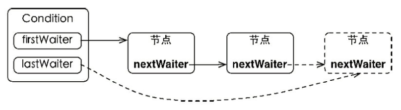
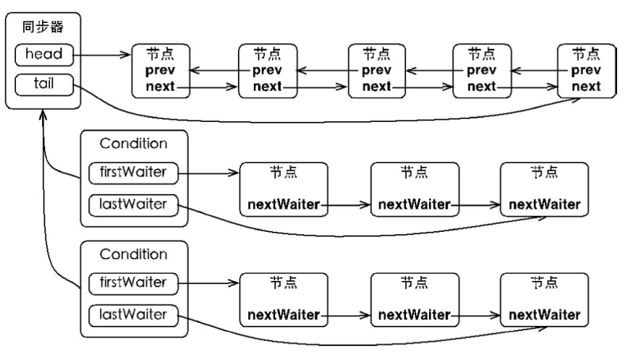
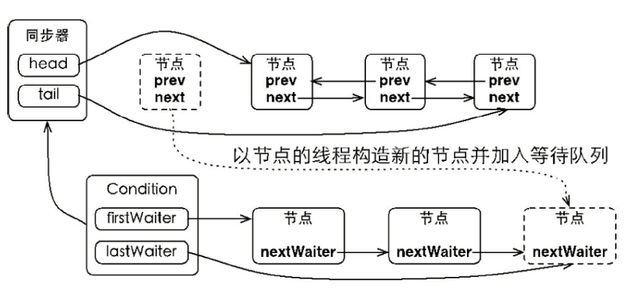
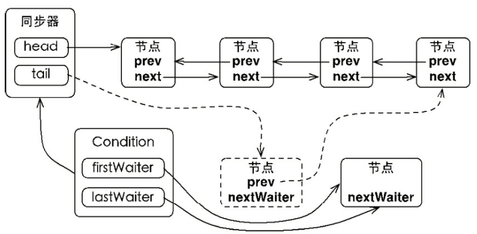

## 第 6 章 Condition

[TOC]

### 6.1 Condition 接口

任意一个 Java 对象，都拥有一组监视器方法（定义在 Java.lang.Object 上），主要包括 wait()、wait(long timeout)、notify() 和 notifyAll() 方法，这些方法与 synchronized 关键字配合，可以实现 ***等待/通知*** 模式。Condition 接口也提供了类似 Object 的监视器方法，与 Lock 配合可以实现 ***等待/通知***  模式，但是两者在使用方式以及功能特性上还是有差别的。

Object 监视器方法与 Condition 接口的对比：

| 对比项                                             | Object Monitor Methods      | Condition                                                    |
| -------------------------------------------------- | --------------------------- | ------------------------------------------------------------ |
| 前置条件                                           | 获取对象的锁                | 调用 Lock.lock() 获取锁<br/>调用 Lock.newCondition() 获取 Condition 对象 |
| 调用方式                                           | 直接调用，如：object.wait() | 直接调用，如：condition.await()                              |
| 等待队列个数                                       | 一个                        | 多个                                                         |
| 当前线程释放锁并进入等待状态                       | 支持                        | 支持                                                         |
| 当前线程释放锁并进入等待状态，在等待状态下响应中断 | 不支持                      | 支持                                                         |
| 当前线程释放锁并进入超时等待状态                   | 支持                        | 支持                                                         |
| 当前线程释放锁并进入超时等待状态，指定超时时间     | 不支持                      | 支持                                                         |
| 唤醒等待队列中的一个线程                           | 支持                        | 支持                                                         |
| 唤醒等待队列中的全部线程                           | 支持                        | 支持                                                         |

```java
public interface Condition {

 /**
  * 使当前线程进入等待状态直到被通知(signal)或中断
  * 当其他线程调用singal()或singalAll()方法时，该线程将被唤醒
  * 当其他线程调用interrupt()方法中断当前线程
  * await()相当于synchronized等待唤醒机制中的wait()方法
  */
 void await() throws InterruptedException;

 //当前线程进入等待状态，直到被唤醒，该方法不响应中断要求
 void awaitUninterruptibly();

 //调用该方法，当前线程进入等待状态，直到被唤醒或被中断或超时
 //其中nanosTimeout指的等待超时时间，单位纳秒
 long awaitNanos(long nanosTimeout) throws InterruptedException;

  //同awaitNanos，但可以指明时间单位
  boolean await(long time, TimeUnit unit) throws InterruptedException;

 //调用该方法当前线程进入等待状态，直到被唤醒、中断或到达某个时
 //间期限(deadline),如果没到指定时间就被唤醒，返回true，其他情况返回false
  boolean awaitUntil(Date deadline) throws InterruptedException;

 //唤醒一个等待在Condition上的线程，该线程从等待方法返回前必须
 //获取与Condition相关联的锁，功能与notify()相同
  void signal();

 //唤醒所有等待在Condition上的线程，该线程从等待方法返回前必须
 //获取与Condition相关联的锁，功能与notifyAll()相同
  void signalAll();
}
```

下面使用 Condition实现一个阻塞的有界队列：当队列为空时，队列获取操作将会阻塞，直到队列中有元素；当队列已满时，队列的插入操作将会阻塞，直到队列出现“空位”。

```java
public class BoundedQueue<T> {
    private Object[] items;
    // 添加的下标、删除的下表 和 当前元素的数量
    private int addIndex, removeIndex, count;
    private Lock lock = new ReentrantLock();
    private Condition notEmpty = lock.newCondition();
    private Condition notFull = lock.newCondition();

    public BoundedQueue(int size) {
        items = new Object[size];
    }

    /**
     * 添加一个元素，如果数组满，则添加线程进入等待状态，直到有“空位”出现
     * @param t
     * @throws InterruptedException
     */
    public void add(T t) throws InterruptedException {
        lock.lock();
        try {
            while (count == items.length) {
                notFull.await();
            }
            items[addIndex] = t;
            if (++addIndex == items.length) {
                addIndex = 0;
            }
            ++count;
            notEmpty.signal();
        } finally {
            lock.unlock();
        }
    }

    /**
     * 删除一个元素，如果数组为空，则删除线程进入等待状态，直到有新添加的元素
     * @return
     * @throws InterruptedException
     */
    public T remove() throws InterruptedException {
        lock.lock();
        try {
            while (count == 0) {
                notEmpty.await();
            }
            Object item = items[removeIndex];
            if (++removeIndex == items.length) {
                removeIndex = 0;
            }
            --count;
            notFull.signal();
            return (T) item;
        } finally {
            lock.unlock();
        }
    }
}
```

以添加方法 add(T t) 为例进行说明：首先需要获得锁，目的是确保数组修改的可见性和排他性。当数组计数器等于数组长度时，表示数组已满，则调用 notFull.await()。当前线程随之释放锁并进入等待状态。如果数组计数器不等于数组长度，表示数组未满，则添加元素到数组中，同时通知等待在 notEmpty 上的线程，数组中已经有新元素可以获取了。

### 6.2 Condition 实现分析

ConditionObject 是同步器 AbstractQueuedSynchronized 的内部类，前面我们分析过 AQS 中存在两种队列，一种是同步队列，一种是等待队列，而等待队列就是对于 Condition 而言的。注意在使用 Condition 前必须获得锁，同时在 Condition 的等待队列上的节点与前面同步队列的节点是同一个类即 Node，其节点的 waitStatus 的值为 CONDITION。在实现类 ConditionObject 中有两个节点分别是 firstWaiter 和 lastWaiter，firstWaiter 代表等待队列第一个等待节点，lastWaiter 代表等待队列最后一个等待节点。

#### 6.2.1 等待队列

等待队列是一个 FIFO 的队列，在队列中的每个节点都包含了一个线程引用，该线程是在 Condition 对象上等待的线程，如果一个线程调用了 condition.await() 方法，那么该线程将会释放锁、构造节点 Node 对象然后添加到等待队列的尾部并进入等待状态。



Condition 增加节点的过程中并没有使用 CAS 操作，原因在于调用 await() 方法的线程必定是获取了锁的线程，也就是说该过程是由锁来保证线程安全的。在 Object 的监视器模型上，一个对象拥有一个同步队列和一个等待队列，而并发包中的 Lock (更确切的说法是 同步器) 拥有一个同步队列和多个等待队列，其对应关系如下图所示：



如上图所示，Condition 的实现是同步器的内部类，因此每个 Condition 实例都能够访问同步器提供的方法，相当于每个 Condition 都拥有所属同步器的引用。

#### 6.2.2 等待

调用 Condition 的 await() 方法，会使当前线程进入等待队列并释放锁，同时线程状态变成等待状态。当从 await() 方法返回时，当前线程一定获取了 Condition的相关锁。如果从队列的角度看，当调用 await() 方法，相当于同步队列的首节点（获取了锁的节点）移动到了 Condition 的等待队列中。

```java
public final void await() throws InterruptedException {
    //判断线程是否被中断
    if (Thread.interrupted())
        throw new InterruptedException();
    //创建新节点加入等待队列并返回
    Node node = addConditionWaiter();
    //释放当前线程锁即释放同步状态
    int savedState = fullyRelease(node);
    int interruptMode = 0;
    //判断节点是否在同步队列(SyncQueue)中,即是否被唤醒
    while (!isOnSyncQueue(node)) {
        //挂起线程
        LockSupport.park(this);
        //判断是否被中断唤醒，如果是退出循环。
        if ((interruptMode = checkInterruptWhileWaiting(node)) != 0)
            break;
    }
    //被唤醒后执行自旋操作争取获得锁，同时判断线程是否被中断
    if (acquireQueued(node, savedState) && interruptMode != THROW_IE)
        interruptMode = REINTERRUPT;
    // clean up if cancelled
    if (node.nextWaiter != null) 
        //清理等待队列中不为CONDITION状态的节点
        unlinkCancelledWaiters();
    if (interruptMode != 0)
        reportInterruptAfterWait(interruptMode);
}
```

如果从队列角度去看，当前线程加入 Condition 的等待队列，该过程如下图所示：

`await()`方法主要做了3件事，一是调用`addConditionWaiter()`方法将当前线程封装成node节点加入等待队列，二是调用`fullyRelease(node)`方法释放同步状态并唤醒后继节点的线程。三是调用`isOnSyncQueue(node)`方法判断节点是否在同步队列中，注意是个while循环，如果同步队列中没有该节点就直接挂起该线程，需要明白的是如果线程被唤醒后就调用`acquireQueued(node, savedState)`执行自旋操作争取锁，即当前线程节点从等待队列转移到同步队列并开始努力获取锁。

#### 6.2.3 通知

调用 condition.signal() 方法，将会唤醒在等待队列中等待时间最长的节点即首节点，在唤醒节点之前，会将节点移动到同步队列中，过程如下图:

```java
public final void signal() {
   //判断是否持有独占锁，如果不是抛出异常
   if (!isHeldExclusively())
          throw new IllegalMonitorStateException();
      Node first = firstWaiter;
      //唤醒等待队列第一个节点的线程
      if (first != null)
          doSignal(first);
 }

private void doSignal(Node first) {
     do {
         //移除等待队列中的第一个节点，
         //如果后继节点为null，那么说没有其他节点将尾节点也设置为null
         if ((firstWaiter = first.nextWaiter) == null)
             lastWaiter = null;
         first.nextWaiter = null;
         //如果被通知节点没有进入到同步队列并且等待队列还有不为空的节点，则继续循环通知后续节点
     } while (!transferForSignal(first) && (first = firstWaiter) != null);
}

final boolean transferForSignal(Node node) {
    //尝试唤醒节点，设置waitStatus为0，即初始化状态
    //如果设置失败，说明当期节点的waitStatus已不为CONDITION状态，那么只能是结束状态了，因此返回false
    //返回doSignal()方法中继续唤醒其他节点的线程，注意这里并不涉及并发问题，所以CAS操作失败只可能是预期值不为CONDITION，而不是多线程设置导致预期值变化，毕竟操作该方法的线程是持有锁的。
    if (!compareAndSetWaitStatus(node, Node.CONDITION, 0))
        return false;

    //加入同步队列并返回前驱节点p
    Node p = enq(node);
    int ws = p.waitStatus;
    //判断前驱节点是否为结束节点(CANCELLED=1)或者在设置前驱节点状态为Node.SIGNAL状态失败时，唤醒被通知节点代表的线程
    if (ws > 0 || !compareAndSetWaitStatus(p, ws, Node.SIGNAL))
        //唤醒node节点的线程
        LockSupport.unpark(node.thread);
    return true;
}
```

`signal()`方法做了两件事：

- 判断当前线程是否持有独占锁，没有就抛出异常，从这点也可以看出只有独占模式采用等待队列，而共享模式下是没有等待队列的，也就没法使用 Condition。
- 唤醒等待队列的第一个节点，即执行`doSignal(first)`

`doSignal(first)` 方法中做了两件事：

- 从等待队列移除被唤醒的节点，然后重新维护等待队列的 firstWaiter 和 lastWaiter 的指向；

- 将从等待队列移除的节点加入同步队列（在 `transferForSignal()` 方法中完成的），如果进入到同步队列失败并且等待队列还有不为空的节点，则继续循环唤醒后续其他节点的线程。

到此整个 `signal()` 的唤醒过程就很清晰了，即 `signal()` 被调用后，先判断当前线程是否持有独占锁，如果有那么唤醒当前 Condition 等待队列的首节点的线程，并将该节点从等待队列移动到同步队列中。如果加入同步队列失败，那么继续循环唤醒等待队列中的其他节点的线程；如果成功，那么如果其前驱节点已结束或者设置前驱节点状态为 Node.SIGNAL 状态失败，则通过 `LockSupport.unpark()` 唤醒被通知节点代表的线程，到此 signal() 任务完成，注意被唤醒后的线程，将从前面 await() 方法中的 while 循环中退出，因为此时该线程的节点已在同步队列中，那么`while (!isOnSyncQueue(node))`将不在符合循环条件，进而调用 AQS 的`acquireQueued()`方法加入获取同步状态的竞争中，这就是等待唤醒机制的整个流程实现原理。