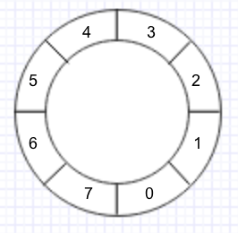
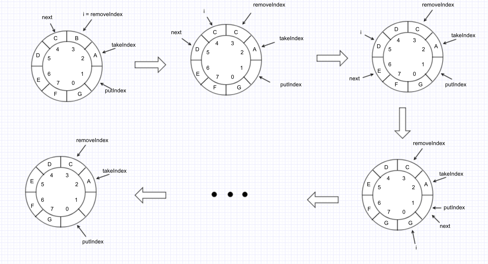

## 第7章 Java中的阻塞队列

[TOC]

### 7.1 阻塞队列

***阻塞队列***（BlockingQueue）是一个支持两个附加操作的队列。这两个附加的操作支持阻塞的插入和移除方法。

- 阻塞的插入：当队列满时，队列会阻塞插入元素的线程，直到队列不满
- 阻塞的移除：当队列为空时，获取元素的线程会等待，直到队列非空为止

```java
public interface BlockingQueue<E> extends Queue<E> {
    /**
     * 将指定的元素添加到此队列中（如果立即可行），在成功时返回 true，
     * 其他情况则抛出 IllegalStateException
     */
    boolean add(E e);
    
    /**
     * 添加元素，队列未满时，返回 true，否则返回 false。
     * 有界队列的元素的入队操作，推荐使用该方法，而不是 add 方法
     */
    boolean offer(E e);
    
    /**
     * 阻塞式的添加操作，一直到队列有空位供元素入队
     */
    void put(E e) throws InterruptedException;
    
    /**
     * 带超时限制的阻塞式添加操作
     */
    boolean offer(E e, long timeout, TimeUnit unit) throws InterruptedException;
    
    /**
     * 移除（队首）元素操作，一直阻塞直到队列中有可用元素
     */
    E take() throws InterruptedException;
    
    /**
     * 带超时限制的移除操作
     */
    E poll(long timeout, TimeUnit unit) throws InterruptedException;
    
    /**
     * 返回在无阻塞的理想情况下（不存在内存或资源约束）此队列能接受的元素数量；如果没有内部限制，
     * 则返回 Integer.MAX_VALUE。
     */
    int remainingCapacity();
    
    /**
     * 移除特定元素，如果队列中存在一个或多个元素与之等价，则返回 true
     */
    boolean remove(Object o);
    
    /**
     * 队列是否包含特定元素，包含则返回 true
     */
    public boolean contains(Object o);
    
    /**
     * 移除此队列中所有可用的元素，并将它们添加到给定 collection 中，比通过 poll 方法效率更高
     */
    int drainTo(Collection<? super E> c);
    
    /**
     * 最多从此队列中移除给定数量的可用元素，并将这些元素添加到给定 collection 中
     */
    int drainTo(Collection<? super E> c, int maxElements);
}
```

Java 中的阻塞队列：

- ArrayBlockingQueue：一个由数组结构组成的有界阻塞队列
- LinkedBlockingQueue：一个由链表结构组成的有界队列
- PriorityBlockingQueue：一个支持优先级排序的无界阻塞队列
- DelayQueue：一个使用优先级队列实现的无界阻塞队列
- SynchronousQueue：一个不存储元素的阻塞队列
- LinkedTransferQueue：一个由链表结构组成的无界阻塞队列
- LinkedBlockingDeque：一个由链表结构组成的双向阻塞队列

### 7.2 ArrayBlockingQueue

ArrayBlockingQueue 队列是一个用数组实现有界阻塞队列，按照 FIFO 原则对元素排序。默认情况下不保证线程公平的访问此队列，当队列可用时所有线程都可以争夺队列的访问资格，不保证先阻塞的线程一定先访问队列。ArrayBlockingQueue 也提供了公平式的访问，但这通常会降低吞吐量。

#### 7.2.1 ArrayBlockingQueue 简单实用的例子

```java
public class ArrayBlockingQueueTest {

    public static void main(String[] args) {
        BlockingQueue<String> queue = new ArrayBlockingQueue<>(10);
        new Thread(new Producer("A", queue)).start();
        new Thread(new Producer("B", queue)).start();
        new Thread(new Consumer("甲", queue)).start();
        new Thread(new Consumer("乙", queue)).start();
    }

    static class Producer implements Runnable {
        private BlockingQueue<String> queue = null;
        private String name;

        public Producer(String name, BlockingQueue<String> queue) {
            this.name = name;
            this.queue = queue;
        }

        @Override
        public void run() {
            int i = 0;
            while (i < 300) {
                try {
                    String temp = "产品 A" + i;
                    queue.put(temp);
                    System.out.println("生产者:" + name + ", 生产了产品" + temp);
                } catch (InterruptedException e) {
                    e.printStackTrace();
                }
                i++;
            }
        }
    }

    static class Consumer implements Runnable {
        private String name;
        private BlockingQueue<String> queue = null;

        public Consumer(String name, BlockingQueue<String> queue) {
            this.name = name;
            this.queue = queue;
        }

        @Override
        public void run() {
            int i = 0;
            while (i < 1000) {
                try {
                    TimeUnit.MILLISECONDS.sleep(200);
                    String temp = queue.take();
                    System.out.println("消费者" + name + "，消费了产品：" + temp);
                } catch (InterruptedException e) {
                    e.printStackTrace();
                }
                i++;
            }
        }
    }
}
```

#### 7.2.2 ArrayBlockingQueue 实现原理详解

```java
public class ArrayBlockingQueue<E> extends AbstractQueue<E>
        implements BlockingQueue<E>, java.io.Serializable {
        
    private static final long serialVersionUID = -817911632652898426L;

    /** 
     * 存储元素的数组
     */
    final Object[] items;

    /** 
     * 获取数据的索引，主要用于take，poll，peek，remove 方法
     */
    int takeIndex;

    /** 
     * 添加数据的索引，主要用于 put, offer, or add 方法 
     */
    int putIndex;

    /** 
     * 队列中元素的个数
     */
    int count;

    /** 
     * 控制并发访问的锁
     */
    final ReentrantLock lock;

    /** 
     * notEmpty 条件对象，用于通知 take 方法队列已有元素，可执行获取操作
     */
    private final Condition notEmpty;

    /** 
     * notFull 条件对象，用于通知 put 方法队列未满，可执行添加操作
     */
    private final Condition notFull;

    /**
     * 迭代器
     */
    transient Itrs itrs = null;
    
    ...
 }
```

ArrayBlockingQueue内部的数组结构可以理解为环形数组，



**添加元素的方法：**

```java
public boolean add(E e) {
    return super.add(e);		// 内部实现是调用了offer(E e)方法
}

public boolean offer(E e) {
    checkNotNull(e);		// 检查是否为 null
    final ReentrantLock lock = this.lock;
    lock.lock();		// 加锁
    try {
        // 判断队列是否已满
        if (count == items.length)
            return false;
        else {
            enqueue(e);		// 添加元素到队列
            return true;
        }
    } finally {
        lock.unlock();
    }
}

public void put(E e) throws InterruptedException {
    checkNotNull(e);
    final ReentrantLock lock = this.lock;
    lock.lockInterruptibly();
    try {
        // 如果队列已满，将当前调用线程挂起，添加到 notFull 条件队列中等待唤醒
        while (count == items.length)
            notFull.await();
        enqueue(e);
    } finally {
        lock.unlock();
    }
}

public boolean offer(E e, long timeout, TimeUnit unit)
    throws InterruptedException {

    checkNotNull(e);
    long nanos = unit.toNanos(timeout);
    final ReentrantLock lock = this.lock;
    lock.lockInterruptibly();
    try {
        while (count == items.length) {
            if (nanos <= 0)
                return false;
            nanos = notFull.awaitNanos(nanos);
        }
        enqueue(e);
        return true;
    } finally {
        lock.unlock();
    }
}

/**
 * 入队操作
 */
private void enqueue(E x) {
    // assert lock.getHoldCount() == 1;
    // assert items[putIndex] == null;
    final Object[] items = this.items;
    items[putIndex] = x;	// 通过 putIndex 索引对数组进行赋值
    if (++putIndex == items.length)
        putIndex = 0;		// 注意数组的环形结构，数组下标的处理
    count++;
    // 唤醒调用 take() 方法的线程，执行元素获取操作
    notEmpty.signal();
}
```

**移除元素的方法：**

```java
public E poll() {
    final ReentrantLock lock = this.lock;
    lock.lock();
    try {
        // 队列不为空，移除队列头元素；为空，返回 null
        return (count == 0) ? null : dequeue();
    } finally {
        lock.unlock();
    }
}

public E take() throws InterruptedException {
    final ReentrantLock lock = this.lock;
    lock.lockInterruptibly();
    try {
        // 如果队列为空，将当前调用线程挂起，添加到 notEmpty 条件队列中等待唤醒
        while (count == 0)
            notEmpty.await();
        return dequeue();
    } finally {
        lock.unlock();
    }
}

private E dequeue() {
    // assert lock.getHoldCount() == 1;
    // assert items[takeIndex] != null;
    final Object[] items = this.items;
    @SuppressWarnings("unchecked")
    E x = (E) items[takeIndex];		// 获取要删除的元素
    items[takeIndex] = null;
    // takeIndex 索引加1，注意下标的处理
    if (++takeIndex == items.length)
        takeIndex = 0;
    count--;
    if (itrs != null)
        itrs.elementDequeued();		// 同时更新迭代器中的元素数据
    notFull.signal();		// 删除了元素说明队列有空位，唤醒 notFull 条件对象添加线程，执行添加操作
    return x;
}

public boolean remove(Object o) {
    if (o == null) return false;
    final Object[] items = this.items;
    final ReentrantLock lock = this.lock;
    lock.lock();
    try {
        if (count > 0) {
            final int putIndex = this.putIndex;
            int i = takeIndex;
            do {
                if (o.equals(items[i])) {
                    removeAt(i);
                    return true;
                }
                if (++i == items.length)
                    i = 0;
            } while (i != putIndex);
        }
        return false;
    } finally {
        lock.unlock();
    }
}

/**
 * 根据索引删除元素，实际是把索引之后的元素往前移动一位
 */
void removeAt(final int removeIndex) {
    // assert lock.getHoldCount() == 1;
    // assert items[removeIndex] != null;
    // assert removeIndex >= 0 && removeIndex < items.length;
    final Object[] items = this.items;
    // 先判断要删除的元素是否为当前队列头元素
    if (removeIndex == takeIndex) {
        // 如果是，直接删除
        items[takeIndex] = null;
        if (++takeIndex == items.length)
            takeIndex = 0;
        count--;
        if (itrs != null)
            itrs.elementDequeued();
    } else {
       	// 如果要删除的元素不在队列头部，那么只需循环迭代把删除元素后面的所有元素往前移动一个位置
      	// 获取下一个要被添加的元素的索引，作为循环判断结束条件
        final int putIndex = this.putIndex;
        for (int i = removeIndex;;) {
            int next = i + 1;
            if (next == items.length)
                next = 0;
            if (next != putIndex) {
                items[i] = items[next];		// 将后面的元素前移一位
                i = next;
            } else {
                items[i] = null;	// 在 removeIndex 索引之后元素前移动完毕后清空最后一个元素
                this.putIndex = i;
                break;		// 结束循环
            }
        }
        count--;
        if (itrs != null)
            itrs.removedAt(removeIndex);		// 更新迭代器数据
    }
    notFull.signal();		// 唤醒 notFull 等待队列中的的线程
}
```

removeAt 的过程如下图： 

### 7.3 LinkedBlockingQueue

LinkedBlockingQueue 是一个由链表实现的有界队列阻塞队列，但大小默认值为 Integer.MAX_VALUE，所以我们在使用 LinkedBlockingQueue 时建议手动传值，为设置成我们所需的大小，避免队列过大造成机器负载或者内存爆满等情况。其构造函数如下

```java
/** 
 * 默认大小为 Integer.MAX_VALUE
 */
public LinkedBlockingQueue() {
    this(Integer.MAX_VALUE);
}

/**
 * 创建指定大小为 capacity 的阻塞队列
 */
public LinkedBlockingQueue(int capacity) {
    if (capacity <= 0) throw new IllegalArgumentException();
    this.capacity = capacity;
    last = head = new Node<E>(null);
}

/**
 * 创建大小默认值为 Integer.MAX_VALUE 的阻塞队列并将集合 C 中的元素添加到阻塞队列
 */
public LinkedBlockingQueue(Collection<? extends E> c) {
    this(Integer.MAX_VALUE);
    final ReentrantLock putLock = this.putLock;
    putLock.lock(); // Never contended, but necessary for visibility
    try {
        int n = 0;
        for (E e : c) {
            if (e == null)
                throw new NullPointerException();
            if (n == capacity)
                throw new IllegalStateException("Queue full");
            enqueue(new Node<E>(e));
            ++n;
        }
        count.set(n);
    } finally {
        putLock.unlock();
    }
}
```

#### 7.3.1 LinkedBlockingQueue 实现原理详解

```java
public class LinkedBlockingQueue<E> extends AbstractQueue<E>
        implements BlockingQueue<E>, java.io.Serializable {
    private static final long serialVersionUID = -6903933977591709194L;

    /**
     * 节点类，用于存储数据
     */
    static class Node<E> {
        E item;

        /**
         * One of:
         * - the real successor Node
         * - this Node, meaning the successor is head.next
         * - null, meaning there is no successor (this is the last node)
         */
        Node<E> next;

        Node(E x) { item = x; }
    }

    /** 
     * 阻塞队列大小，默认是 Integer.MAX_VALUE
     */
    private final int capacity;

    /** 
     * 队列中元素的个数
     */
    private final AtomicInteger count = new AtomicInteger();

    /**
     * 队列的头节点，头节点作为标识是不存储数据的，即 head.item == null
     */
    transient Node<E> head;

    /**
     * 队列的尾节点，尾节点的 next 永远为空，即 last.next == null
     */
    private transient Node<E> last;

    /** 
     * 获取并移除元素时使用的锁，如take, poll, etc
     */
    private final ReentrantLock takeLock = new ReentrantLock();

    /** 
     * notEmpty条件对象，当队列没有数据时用于挂起执行删除的线程 
     */
    private final Condition notEmpty = takeLock.newCondition();

    /** 
     * 添加元素时使用的锁如 put, offer, etc
     */
    private final ReentrantLock putLock = new ReentrantLock();

    /** 
     * notFull条件对象，当队列数据已满时用于挂起执行添加的线程
     */
    private final Condition notFull = putLock.newCondition();
}
```

从上述可看成，每个添加到LinkedBlockingQueue队列中的数据都将被封装成Node节点，添加的链表队列中，其中head和last分别指向队列的头结点和尾结点。与ArrayBlockingQueue不同的是，LinkedBlockingQueue内部分别使用了takeLock 和 putLock 对并发进行控制，也就是说，添加和删除操作并不是互斥操作，可以同时进行，这样也就可以大大提高吞吐量。这里再次强调如果没有给LinkedBlockingQueue指定容量大小，其默认值将是Integer.MAX_VALUE，如果存在添加速度大于删除速度时候，有可能会内存溢出，这点在使用前希望慎重考虑。至于LinkedBlockingQueue的实现原理图与ArrayBlockingQueue是类似的，除了对添加和移除方法使用单独的锁控制外，两者都使用了不同的Condition条件对象作为等待队列，用于挂起take线程和put线程。

**添加元素方法：**

```java
public void put(E e) throws InterruptedException {
    if (e == null) throw new NullPointerException();
    int c = -1;
    Node<E> node = new Node<E>(e);
    final ReentrantLock putLock = this.putLock;
    final AtomicInteger count = this.count;
    putLock.lockInterruptibly();
    try {
        while (count.get() == capacity) {
            notFull.await();
        }
        enqueue(node);
        c = count.getAndIncrement();
        if (c + 1 < capacity)
            notFull.signal();
    } finally {
        putLock.unlock();
    }
    if (c == 0)
        signalNotEmpty();
}

public boolean offer(E e) {
    // 添加元素为null直接抛出异常
    if (e == null) throw new NullPointerException();
    final AtomicInteger count = this.count;
    // 判断队列是否已满
    if (count.get() == capacity)
        return false;
    int c = -1;
    Node<E> node = new Node<E>(e);
    final ReentrantLock putLock = this.putLock;
    putLock.lock();
    try {
        // 再此判断队列是否已满
        if (count.get() < capacity) {
            // 添加元素
            enqueue(node);
            c = count.getAndIncrement();
            // 如果队列没有满，唤醒下一个添加进程，执行添加操作
            if (c + 1 < capacity)
                notFull.signal();
        }
    } finally {
        putLock.unlock();
    }
    // 由于存在添加锁和消费锁，而消费锁和添加锁都会持续唤醒等待线程，因此count肯定会变化。
    // 这里的if条件表示如果队列中还有1条数据
    if (c == 0)
        signalNotEmpty();	// 如果还存在数据那么就唤醒消费锁
    // 添加成功返回true，否则返回false
    return c >= 0;
}

public boolean offer(E e, long timeout, TimeUnit unit) throws InterruptedException {
    if (e == null) throw new NullPointerException();
    long nanos = unit.toNanos(timeout);
    int c = -1;
    final ReentrantLock putLock = this.putLock;
    final AtomicInteger count = this.count;
    putLock.lockInterruptibly();
    try {
        // 如果队列已满，则执行超时等待
        while (count.get() == capacity) {
            if (nanos <= 0)
                return false;
            nanos = notFull.awaitNanos(nanos);
        }
        enqueue(new Node<E>(e));
        c = count.getAndIncrement();
        if (c + 1 < capacity)
            notFull.signal();
    } finally {
        putLock.unlock();
    }
    if (c == 0)
        signalNotEmpty();
    return true;
}
```

**移除元素方法：**

```java
public E take() throws InterruptedException {
    E x;
    int c = -1;
    // 当前队列的大小
    final AtomicInteger count = this.count;
    final ReentrantLock takeLock = this.takeLock;
    takeLock.lockInterruptibly();
    try {
        // 如果队列没有数据，当前线程将被添加到条件对象的等待队列中
        while (count.get() == 0) {
            notEmpty.await();
        }
        // 如果存在数据直接删除并返回该数据
        x = dequeue();
        // 队列大小减1
        c = count.getAndDecrement();
        if (c > 1)
            // 还有数据就唤醒后续的消费线程
            notEmpty.signal();
    } finally {
        takeLock.unlock();
    }
    // 满足条件，唤醒条件对象上等待队列中的添加线程
    if (c == capacity)
        signalNotFull();
    return x;
}

public E poll() {
    final AtomicInteger count = this.count;
    // 如果队列为空，直接返回 null
    if (count.get() == 0)
        return null;
    E x = null;
    int c = -1;
    final ReentrantLock takeLock = this.takeLock;
    takeLock.lock();
    try {
        // 队列是否为空
        if (count.get() > 0) {
            // 队列不为空，直接删除队列的 头节点元素
            x = dequeue();
            c = count.getAndDecrement();
            // 如果队列未空，继续唤醒等待在条件对象notEmpty上的消费线程
            if (c > 1)
                notEmpty.signal();
        }
    } finally {
        takeLock.unlock();
    }
    // 判断c是否等于capacity，这是因为如果满说明NotFull条件对象上可能存在等待的添加线程
    if (c == capacity)
        signalNotFull();
    return x;
}

/**
 * remove方法删除指定的对象
 * 因为remove方法删除的数据的位置不确定，为了避免造成并非安全问题，所以需要对2个锁同时加锁
 */
public boolean remove(Object o) {
    if (o == null) return false;
    // 同时对putLock和takeLock加锁
    fullyLock();
    try {
        // 循环查找要删除的元素
        for (Node<E> trail = head, p = trail.next;
             p != null;
             trail = p, p = p.next) {
            // 找到要删除的节点
            if (o.equals(p.item)) {
                unlink(p, trail);		// 直接删除
                return true;
            }
        }
        return false;
    } finally {
        fullyUnlock();
    }
}

private E dequeue() {
    // 获取头节点
    Node<E> h = head;
    // 获取头节点的下一个节点，即需要被删除的节点
    Node<E> first = h.next;
    h.next = h; // help GC，节点的 next 指向自身，即可以被 gc 回收
    head = first;	// 更新头节点
    E x = first.item;	// 获取删除节点的值
    // 清空数据，因为first变成头结点是不能带数据的，这样也就删除队列的带数据的第一个节点
    first.item = null;
    return x;
}
```

### 7.4 ArrayBlockingQueue 与 LinkedBlockingQueue 的异同

通过上述的分析，对于 ArrayBlockingQueue 和 LinkedBlockingQueue 的基本使用以及内部实现原理我们已较为熟悉了，这里我们就对它们两间的区别来个小结：

1. 队列大小有所不同，ArrayBlockingQueue是有界的初始化必须指定大小，而LinkedBlockingQueue可以是有界的也可以是无界的(Integer.MAX_VALUE)，对于后者而言，当添加速度大于移除速度时，在无界的情况下，可能会造成内存溢出等问题。
2. 数据存储容器不同，ArrayBlockingQueue采用的是数组作为数据存储容器，而LinkedBlockingQueue采用的则是以Node节点作为连接对象的链表。
3. 由于ArrayBlockingQueue采用的是数组的存储容器，因此在插入或删除元素时不会产生或销毁任何额外的对象实例，而LinkedBlockingQueue则会生成一个额外的Node对象。这可能在长时间内需要高效并发地处理大批量数据的时，对于GC可能存在较大影响。
4. 两者的实现队列添加或移除的锁不一样，ArrayBlockingQueue实现的队列中的锁是没有分离的，即添加操作和移除操作采用的同一个ReenterLock锁，而LinkedBlockingQueue实现的队列中的锁是分离的，其添加采用的是putLock，移除采用的则是takeLock，这样能大大提高队列的吞吐量，也意味着在高并发的情况下生产者和消费者可以并行地操作队列中的数据，以此来提高整个队列的并发性能。
