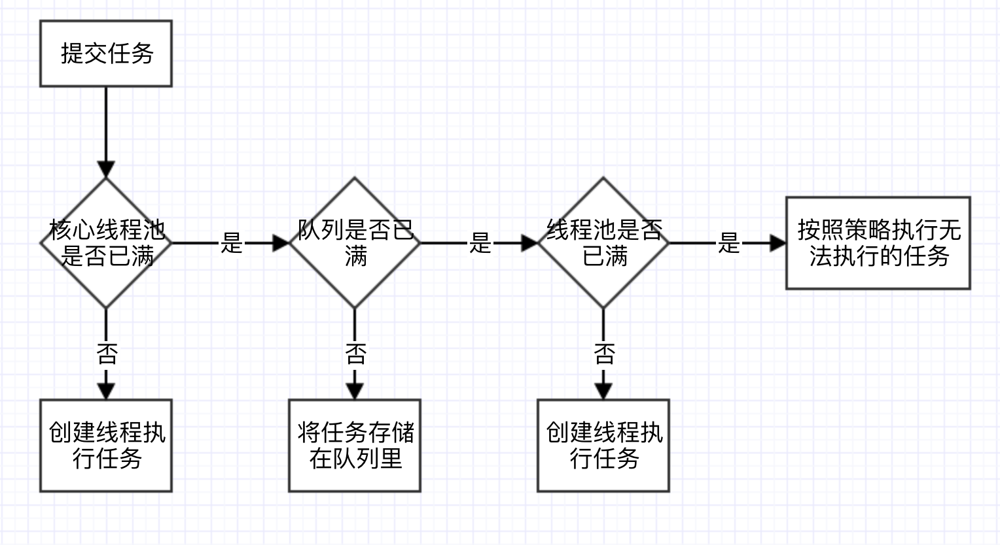
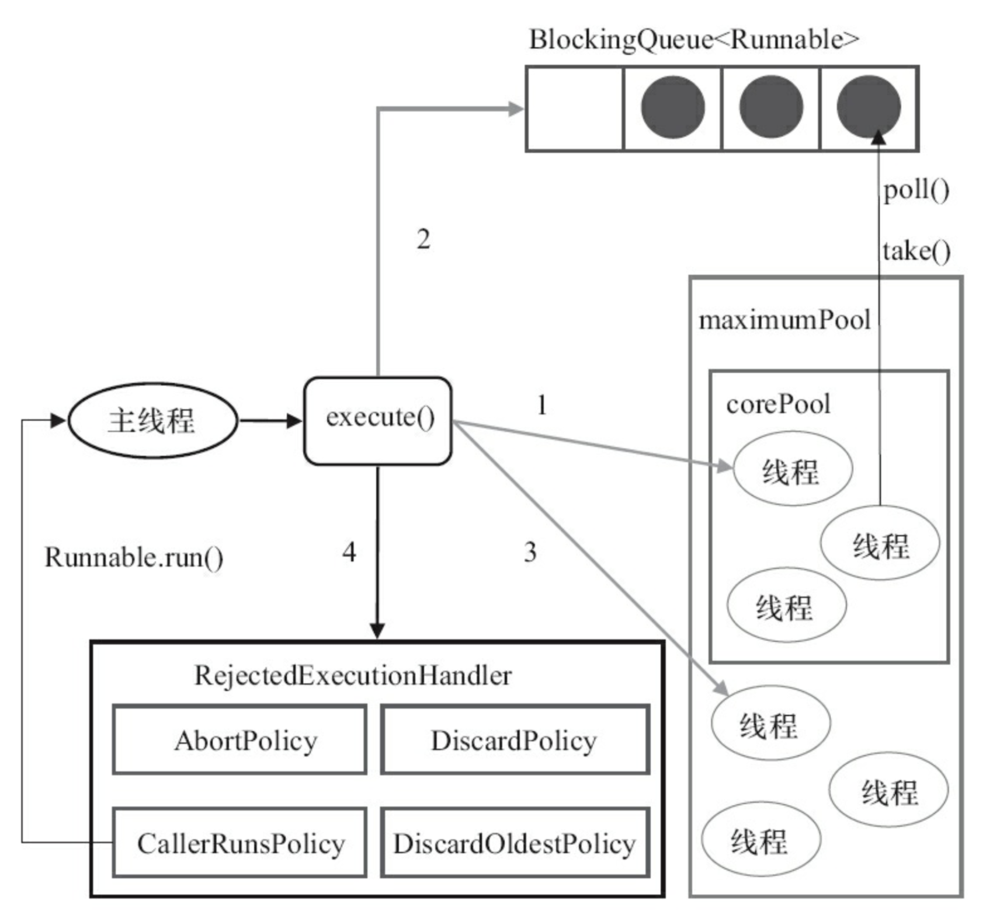
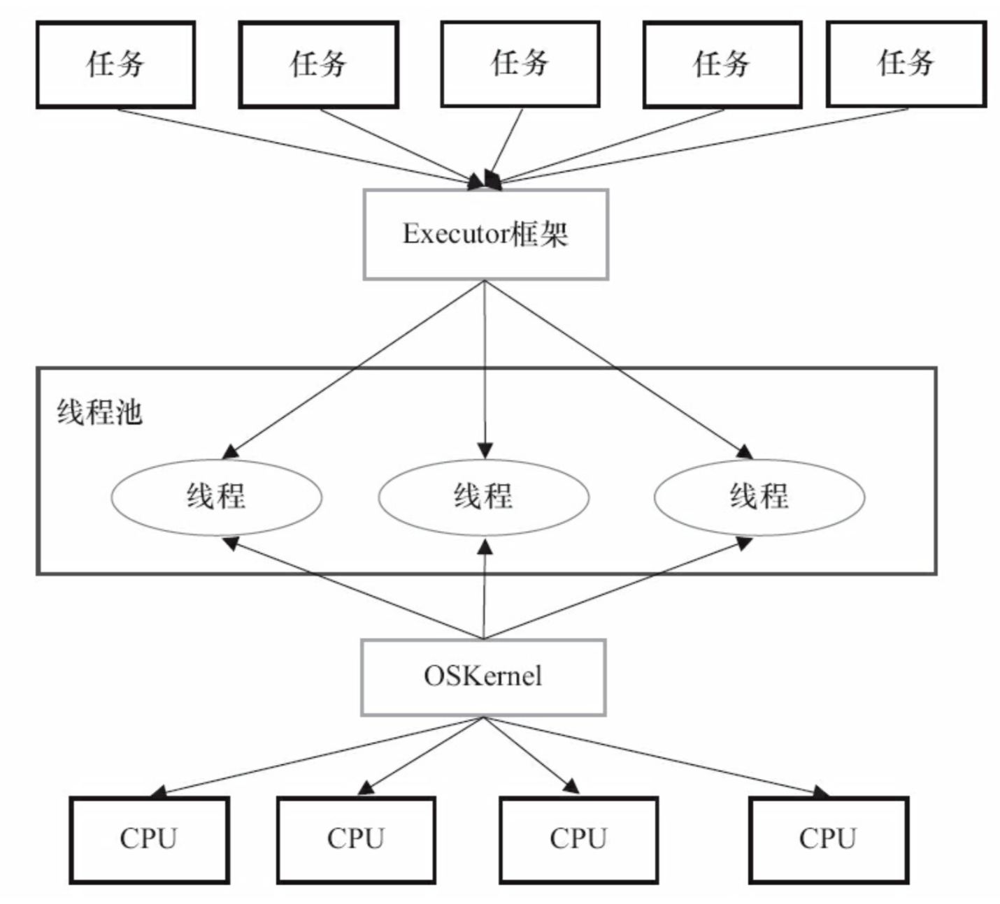
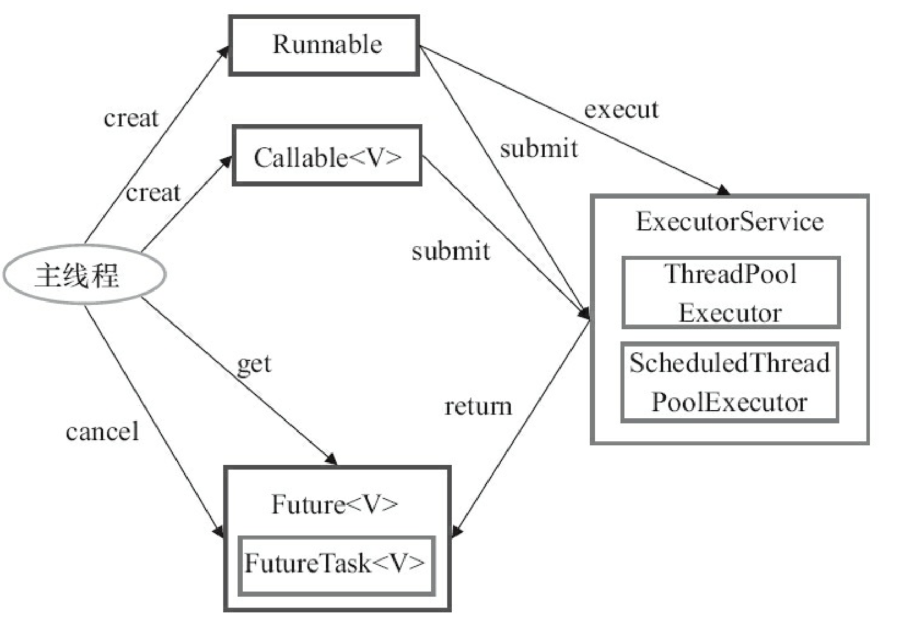
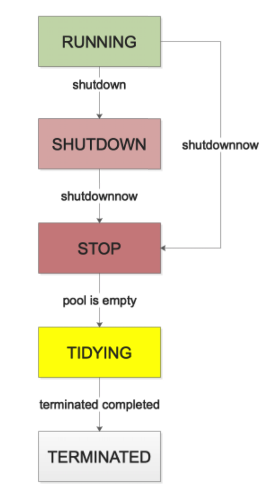

## 第8章 Java 线程池和Executor框架

[TOC]

### 8.1 线程池的实现原理

在开发过程中，合理地使用线程可以带来以下的好处：

- 降低资源消耗：通过重复利用已创建的线程降低线程创建和销毁造成的消耗；
- 提高响应速度：当任务到达时，任务可以不需要等到线程创建就能立即执行；
- 提高线程的可管理性：线程是稀缺资源，如果无限制地创建，不仅会消耗系统资源，还会降低系统的稳定性，使用线程池可以进行统一分配、调优和监控。

**线程池的处理流程：**



**ThreadPoolExecutor 执行 execute() 方法示意图：**



1. 如果当前运行的线程少于 *corePoolSize*，则创建新线程来执行任务（注意，执行这一步需要获取全局的锁）；
2. 如果运行的线程等于或多于 *corePoolSize*，则将任务加入 *BlockingQueue*；
3. 如果无法将任务加入到 *BlockingQueue*（队列已满），则创建新的线程来处理任务（注意，执行这一步需要获取全局的锁）；
4. 如果创建新线程将使当前运行的线程超出 *maximumPoolSize*，任务将被拒绝，并调用 *RejectedExecutionHandler.rejectedExecution()* 方法。

*ThreadPoolExecutor* 采取上述步骤的总体设计思路，是为了在执行 *execute()* 方法时，尽可能地避免获取全局锁（那将会是一个严重的可伸缩瓶颈）。在 *ThreadPoolExecutor* 完成预热之后（当前运行的线程数大于等于 *corePoolSize*），几乎所有的 *execute()* 方法调用都是执行*步骤2*，而*步骤2*不需要获取全局锁。

### 8.2 线程池的使用

#### 8.2.1 线程池创建

```java
/**
 * 线程池构造方法之一
 */
public ThreadPoolExecutor(int corePoolSize,
                              int maximumPoolSize,
                              long keepAliveTime,
                              TimeUnit unit,
                              BlockingQueue<Runnable> workQueue,
                              ThreadFactory threadFactory,
                          RejectedExecutionHandler handler){
    .....
}
```

创建线程池时的参数：

- *corePoolSize*：基本线程数，当提交一个任务到线程池时，线程池会创建一个线程来执行任务，即使其他空闲的基本线程能够执行任务也会创建线程，等到需要执行的任务数大于线程池基本大小时就不再创建了。如果调用了线程池的 *prestartAllCoreThreads()* 方法，线程池会提前创建并启动所有基本线程。

- *maximumPoolSize*：线程池最大数量，线程池允许创建的最大线程数。如果队列满了，并且已创建的线程数小于最大线程数，则线程池会再创建新的线程执行任务。注意：如果使用了无界队列，这个参数就没有效果了。

- *BlockingQueue*：任务队列，用于保存等待执行的任务的阻塞队列

- *ThreadFactory*：用于设置创建线程的工厂类，可以通过线程工厂给每个创建出来的线程设置更有意义的名字。

- *RejectedExecutionHandler*：饱和策略，当队列和线程池都满了，说明线程池处于饱和状态，那么必须采取一种策略处理提交的新任务。这个策略默认情况下是 *AbortPolicy*，表示无法处理新任务时抛出异常。

  - AbortPolicy：直接抛出异常

  - CallerRunsPolicy：只用调用者所在的线程来运行任务

  - DiscardOldestPolicy：丢弃队列里最近的一个任务，并执行当前任务

  - DiscardPolicy：不处理，丢弃掉

    当然，也可以根据应用场景需要来实现 *RejectedExecutionHandler* 接口自定义策略，如记录日志或持久化存储不能处理的任务

- keepAliveTime：线程活动保持时间，线程池的工作线程空闲后，保持存活的时间，用于非核心线程。如果任务很多，并且每个任务执行的时间比较短，可以调大时间，提高线程的利用率。

- TimeUnit：线程活动时间保持单位

#### 8.2.2 向线程池提交任务

- *execute* 提交的任务，但是 *execute* 方法没有返回值，所以无法判断任务知否被线程池执行成功。

  ```java
  threadsPool.execute(new Runnable() {
      @Override
      public void run() {
          .....
      }
  })
  ```

-  *submit* 方法来提交任务，它会返回一个 **future**， 那么我们可以通过这个 **future** 来判断任务是否执行成功，通过 **future** 的 *get* 方法来获取返回值，*get* 方法会阻塞住直到任务完成，而使用 *get(long timeout, TimeUnit unit)* 方法则会阻塞一段时间后立即返回，这时有可能任务没有执行完。

  ```java
  Future<Object> future = executor.submit(returnValueTask);
  try {
      Object a = future.get();
  } catch (InterruptedException e) {
      // 处理中断异常
  } catch (ExecutionException e) {
      // 无法执行任务异常
  } finally {
      // 关闭线程池
      executor.shutdown();
  }
  ```


#### 8.2.3 关闭线程池

以通过调用线程池的 *shutdown()* 或 *shutdownNow()* 方法来关闭线程池，但是它们的实现原理不同：

- *shutdown()*：是将线程池的状态设置成 **SHUTDOWN** 状态，然后中断所有没有正在执行任务的线程。
- *shutdownNow()*：是遍历线程池中的工作线程，然后逐个调用线程的 *interrupt()* 方法来中断线程，所以无法响应中断的任务可能永远无法终止。*shutdownNow()* 会首先将线程池的状态设置成 **STOP**，然后尝试停止所有的正在执行或暂停任务的线程，并返回等待执行任务的列表。

只要调用了这两个关闭方法的其中一个，*isShutdown()* 方法就会返回 **true**。当所有的任务都已关闭后，才表示线程池关闭成功，这时调用 *isTerminaed()* 方法会返回 **true**。至于我们应该调用哪一种方法来关闭线程池，应该由提交到线程池的任务特性决定，通常调用 *shutdown()* 来关闭线程池，如果任务不一定要执行完，则可以调用 *shutdownNow()*。

#### 8.2.4 合理的配置线程池

要想合理的配置线程池，就必须首先分析任务特性，可以从以下几个角度来进行分析：

1. 任务的性质：CPU密集型任务，IO密集型任务和混合型任务；
2. 任务的优先级：高，中和低；
3. 任务的执行时间：长，中和短；
4. 任务的依赖性：是否依赖其他系统资源，如数据库连接；

任务性质不同的任务可以用不同规模的线程池分开处理。

- CPU密集型任务配置尽可能少的线程数量，如配置 **Ncpu+1** 个线程的线程池。
- IO密集型任务则由于需要等待IO操作，线程并不是一直在执行任务，则配置尽可能多的线程，如 **2*Ncpu**。
- 混合型的任务，如果可以拆分，则将其拆分成一个CPU密集型任务和一个IO密集型任务，只要这两个任务执行的时间相差不是太大，那么分解后执行的吞吐率要高于串行执行的吞吐率，如果这两个任务执行时间相差太大，则没必要进行分解。

> 我们可以通过Runtime.getRuntime().availableProcessors()方法获得当前设备的CPU个数。

优先级不同的任务可以使用优先级队列 *PriorityBlockingQueue* 来处理。它可以让优先级高的任务先得到执行，需要注意的是如果一直有优先级高的任务提交到队列里，那么优先级低的任务可能永远不能执行。

执行时间不同的任务可以交给不同规模的线程池来处理，或者也可以使用优先级队列，让执行时间短的任务先执行。

依赖数据库连接池的任务，因为线程提交SQL后需要等待数据库返回结果，如果等待的时间越长CPU空闲时间就越长，那么线程数应该设置越大，这样才能更好的利用CPU。

#### 8.2.4 线程池的监控

线程池里有一些属性在监控线程池的时候可以使用

- *taskCount*：线程池需要执行的任务数量；
- *completedTaskCount*：线程池在运行过程中已完成的任务数量，小于等于 *taskCount*；
- *largestPoolSize*：线程池里曾经创建的最大线程数量。通过这个数据可以知道线程池是否曾经满过。如果该数值等于线程池的最大大小，则表示线程池曾经满过
- *getPoolSize*：线程池的线程数量。如果线程池不销毁的话，线程池里的线程不会自动销毁，所以这个数据只增不减
- *getActiveCount*：获取活动的线程数

通过扩展线程池进行监控。通过继承线程池并重写线程池的 *beforeExecute*，*afterExecute* 和 *terminated* 方法，可以在任务执行前，执行后和线程池关闭前干一些事情。如监控任务的平均执行时间，最大执行时间和最小执行时间等。

#### 8.2.5 线程池的拒绝策略

***Java 中的拒绝策略***:

- CallerRunsPolicy—调用者运行策略

  ```java
  public static class CallerRunsPolicy implements RejectedExecutionHandler {
    	public CallerRunsPolicy() { }
  
      public void rejectedExecution(Runnable r, ThreadPoolExecutor e) {
          if (!e.isShutdown()) {
            	r.run();
          }
      }
  }
  ```

  **功能**：当触发拒绝策略时，只要线程池没有关闭，就由提交任务的当前线程处理。
  **使用场景**：一般在不允许失败的、对性能要求不高、并发量较小的场景下使用，因为线程池一般情况下不会关闭，也就是提交的任务一定会被运行，但是由于是调用者线程自己执行的，当多次提交任务时，就会阻塞后续任务执行，性能和效率自然就慢了。

- AbortPolicy—中止策略

  ```java
  public static class AbortPolicy implements RejectedExecutionHandler {
      public AbortPolicy() { }
  
      public void rejectedExecution(Runnable r, ThreadPoolExecutor e) {
          throw new RejectedExecutionException("Task " + r.toString() + " rejected from " + e.toString());
      }
  }
  ```

  **功能**：当触发拒绝策略时，直接抛出拒绝执行的异常，中止策略的意思也就是打断当前执行流程

  **使用场景**：这个就没有特殊的场景了，但是一点要正确处理抛出的异常。ThreadPoolExecutor 中默认的策略就是 AbortPolicy，ExecutorService 接口的默认的都是这个。

  >但是请注意，ExecutorService 中的线程池实例队列都是无界的，也就是说把内存撑爆了都不会触发拒绝策略。当自己自定义线程池实例时，使用这个策略一定要处理好触发策略时抛的异常，因为他会打断当前的执行流程。

- DiscardPolicy—丢弃策略

  ```java
  public static class DiscardPolicy implements RejectedExecutionHandler {
      public DiscardPolicy() { }
  
      public void rejectedExecution(Runnable r, ThreadPoolExecutor e) {
      }
  }
  ```

  **功能**：直接静悄悄的丢弃这个任务，不触发任何动作

  **使用场景**：如果你提交的任务无关紧要，你就可以使用它 。因为它就是个空实现，会悄无声息的吞噬你的的任务。所以这个策略基本上不用了。

- DiscardOldestPolicy—弃老策略

  ```java
  public static class DiscardOldestPolicy implements RejectedExecutionHandler {
      public DiscardOldestPolicy() { }
  
      public void rejectedExecution(Runnable r, ThreadPoolExecutor e) {
          if (!e.isShutdown()) {
              e.getQueue().poll();
              e.execute(r);
          }
      }
  }
  ```

  **功能**：如果线程池未关闭，就弹出队列头部的元素，然后尝试执行

  **使用场景**：这个策略还是会丢弃任务，丢弃时也是毫无声息，但是特点是丢弃的是老的未执行的任务，而且是待执行优先级较高的任务。

***第三放中的拒绝策略***：

- dubbo 中的线程拒绝策略

  ```java
  public class AbortPolicyWithReport extends ThreadPoolExecutor.AbortPolicy {
      protected static final Logger logger = LoggerFactory.getLogger(AbortPolicyWithReport.class);
  
      private final String threadName;
  
      private final URL url;
  
      private static volatile long lastPrintTime = 0;
  
      private static Semaphore guard = new Semaphore(1);
  
      public AbortPolicyWithReport(String threadName, URL url) {
          this.threadName = threadName;
          this.url = url;
      }
  
      @Override
      public void rejectedExecution(Runnable r, ThreadPoolExecutor e) {
          // 告警日志信息
        	String msg = String.format("Thread pool is EXHAUSTED!" +
                          " Thread Name: %s, Pool Size: %d (active: %d, core: %d, max: %d, largest: %d), Task: %d (completed: %d)," +
                          " Executor status:(isShutdown:%s, isTerminated:%s, isTerminating:%s), in %s://%s:%d!",
                  threadName, e.getPoolSize(), e.getActiveCount(), e.getCorePoolSize(), e.getMaximumPoolSize(), e.getLargestPoolSize(),
                  e.getTaskCount(), e.getCompletedTaskCount(), e.isShutdown(), e.isTerminated(), e.isTerminating(),
                  url.getProtocol(), url.getIp(), url.getPort());
          // 输出告警日志
        	logger.warn(msg);
        	// 输出当前线程堆栈的详情
          dumpJStack();
        	// 抛出拒绝执行异常
          throw new RejectedExecutionException(msg);
      }
  
      private void dumpJStack() {
         //省略实现
      }
  }
  ```

- Netty 中的线程池拒接策略：

  ```java
  private static final class NewThreadRunsPolicy implements RejectedExecutionHandler {
      NewThreadRunsPolicy() {
          super();
      }
  
      public void rejectedExecution(Runnable r, ThreadPoolExecutor executor) {
          try {
              final Thread t = new Thread(r, "Temporary task executor");
              t.start();
          } catch (Throwable e) {
              throw new RejectedExecutionException("Failed to start a new thread", e);
          }
      }
  }
  ```

  Netty 中的实现很像 JDK 中的 CallerRunsPolicy，不同的是，CallerRunsPolicy 是直接在调用者线程执行的任务，而 Netty 是新建了一个线程来处理的。所以，Netty 的实现相较于调用者执行策略的使用面就可以扩展到支持高效率高性能的场景了。但是也要注意一点，Netty 的实现里，在创建线程时未做任何的判断约束，也就是说只要系统还有资源就会创建新的线程来处理，直到new不出新的线程了。才会抛创建线程失败的异常。

### 8.3 Executor 框架简介


在 HotSpot VM 的线程模型中，Java 线程（java.lang.Thread）被一对一映射为本地操作系统线程。Java 线程启动时会创建一个本地操作系统线程；当该 Java 线程终止时，这个操作系统线程也会被回收。操作系统会调度所有线程并将它们分配给可用的 CPU。

在上层，Java 多线程程序通常把应用分解为若干个任务，然后使用用户级的调度器（Executor 框架）将这些任务映射到固定数量的线程；在底层，操作系统内核将这些线程映射到硬件处理器上，不受应用程序的控制。



- Executor 接口：它是 Executor 框架的基础，它将任务的提交与任务的执行分离开来
- ThreadPoolExecutor 是线程池的核心实现类，用来执行被提交的任务
- ScheduledThreadPoolExecutor 是一个实现类，可以在给定的延迟后运行命令，或者定期执行命令。它比Timer更灵活，功能更强大
- Future 接口和实现 Future 接口的 FutureTask 类，代表异步计算的结果
- Runnable 接口和 Callable 接口的实现类，都可以被 ThreadPoolExecutor 或 ScheduledThreadPoolExecutor 执行

### 8.4 线程池之——ThreadPoolExecutor

```java
public class ThreadPoolExecutor extends AbstractExecutorService {
   	/**
   	 * 原子变量，高三位表示线程池的状态，低 29 位表示线程池中的现有线程数
   	 */
    private final AtomicInteger ctl = new AtomicInteger(ctlOf(RUNNING, 0));
    // 表示线程池线程数的bit数
    private static final int COUNT_BITS = Integer.SIZE - 3;
  	/*
     * 最大的线程数量，数量是完全够用了
     * 0001 1111 1111 1111 1111 1111 1111 1111
     */
    private static final int CAPACITY   = (1 << COUNT_BITS) - 1;

    // runState is stored in the high-order bits
  	// 1110 0000 0000 0000 0000 0000 0000 0000
    private static final int RUNNING    = -1 << COUNT_BITS;
  	// 0000 0000 0000 0000 0000 0000 0000 0000
    private static final int SHUTDOWN   =  0 << COUNT_BITS;
  	// 0010 0000 0000 0000 0000 0000 0000 0000
    private static final int STOP       =  1 << COUNT_BITS;
  	// 0100 0000 0000 0000 0000 0000 0000 0000
    private static final int TIDYING    =  2 << COUNT_BITS;
  	// 0110 0000 0000 0000 0000 0000 0000 0000
    private static final int TERMINATED =  3 << COUNT_BITS;

    /**
     * ~CAPACITY = 1110 0000 0000 0000 0000 0000 0000 0000
     * 与操作，即可获取高三位对应的数据。线程池中用来获取线程池的状态
     */
    private static int runStateOf(int c)     { return c & ~CAPACITY; }
  	// 获取线程池中线程的数量
    private static int workerCountOf(int c)  { return c & CAPACITY; }
    // 用来组装线程池的状态和线程数量，成为ctl
    private static int ctlOf(int rs, int wc) { return rs | wc; }

    /*
     * Bit field accessors that don't require unpacking ctl.
     * These depend on the bit layout and on workerCount being never negative.
     */
    private static boolean runStateLessThan(int c, int s) {
        return c < s;
    }

    private static boolean runStateAtLeast(int c, int s) {
        return c >= s;
    }
		
  	/**
  	 * 判断线程池是否处在运行状态
  	 */
    private static boolean isRunning(int c) {
        return c < SHUTDOWN;
    }
}
```

关于线程池的五种状态：

- RUNNING，运行状态，值也是最小的为负数，刚创建的线程池就是此状态
- SHUTDOWN，停工状态，不在接收新任务，已经接收的任务会继续执行
- STOP，停止状态，不在接收新任务，已经接收还没有执行的任务也不会执行
- TIDYING，清空状态，所有任务都停止了，工作的线程也全部结束了
- RMINATED，终止状态，线程池已销毁

它们之间的流转关系：



**提交任务——execute/submit**

线程池有两种方式提交任务——execute 和 submit 方法，两种的区别我们不讨论。通过跟踪源码，submit 提交的方式最终调用的还是 execute 方法。

```java
public void execute(Runnable command) {
    if (command == null)
      	throw new NullPointerException();
  	// 获取 ctl
    int c = ctl.get();
  	// 检查当前线程数量是否达到核心线程数的限制(注意线程本身是不区分核心还是非核心)
    if (workerCountOf(c) < corePoolSize) {
        /**
         * 如果核心线程数未达到，会直接添加一个核心线程
         * 提交任务后，会优先启动核心线程处理
         */
      	if (addWorker(command, true))
          	return;
      	// 如果添加任务失败，刷新ctl，进入下一步
        c = ctl.get();
    }
  	
  	// 检查线程池是否是运行状态，然后队列添加任务，注意 offer 是不会阻塞的
    if (isRunning(c) && workQueue.offer(command)) {
        // 任务成功添加到等待队列，再次刷新 ctl
      	int recheck = ctl.get();
      	// 如果线程池不是运行状态，则将刚添加的任务从队列移除并执行拒绝策略
        if (!isRunning(recheck) && remove(command))
          	reject(command);
      	// 判断当前线程数量，如果线程数量为0，则添加一个非核心线程，并且不指定首次执行任务
        else if (workerCountOf(recheck) == 0)
          	addWorker(null, false);
    }
  	// 添加非核心线程，指定首次执行任务，如果添加失败，执行异常策略
    else if (!addWorker(command, false))
     	 reject(command);
}

private boolean addWorker(Runnable firstTask, boolean core) {
    // 相当于goto，我们自己编程时不建议使用
  	retry:
    for (;;) {
        int c = ctl.get();
        int rs = runStateOf(c);
				/** 
				 * 如果线程池的状态到了 SHUTDOWN 或者之上的状态时候，只有一种情况还需要继续添加线程：
         * 那就是线程池已经 SHUTDOWN，但是队列中还有任务在排队, 而且不接受新任务（所以firstTask必须为null）
         * 这里还继续添加线程的初衷是，加快执行等待队列中的任务，尽快让线程池关闭
         */
        if (rs >= SHUTDOWN && !(rs == SHUTDOWN && firstTask == null && !workQueue.isEmpty()))
          	return false;
        for (;;) {
            int wc = workerCountOf(c);
          	// core参数，如果线程数超过理论最大容量，如果 core 是 true 跟最大核心线程数比较，否则跟最大线程数比较
            if (wc >= CAPACITY || wc >= (core ? corePoolSize : maximumPoolSize))
              	return false;
            // 通过CAS自旋，增加线程数+1，增加成功跳出双层循环，继续往下执行
          	if (compareAndIncrementWorkerCount(c))
              	break retry;
            c = ctl.get();
          	// 检测当前线程状态，如果发生了变化，则继续回到retry，重新开始循环
            if (runStateOf(c) != rs)
              	continue retry;
        }
    }
		
  	// 走到这里，说明我们已经成功的将线程数+1了，但是真正的线程还没有被添加
    boolean workerStarted = false;
    boolean workerAdded = false;
    Worker w = null;
    try {
      	// 添加线程，Worker 是继承了 AQS，实现了 Runnable 接口的包装类
      	w = new Worker(firstTask);
      	final Thread t = w.thread;
        if (t != null) {
          	// 到这里开始加锁
          	final ReentrantLock mainLock = this.mainLock;
          	mainLock.lock();
            try {
                int rs = runStateOf(ctl.get());
								/**
                 * 检查线程状态
                 * 只有当线程池处于 RUNNING
                 * 或者处于 SHUTDOWN 并且 firstTask==null 的时候，这时候创建 Worker 来加速处理队列中的任务
                 */
                if (rs < SHUTDOWN || (rs == SHUTDOWN && firstTask == null)) {
                    // 线程只能被start一次
                  	if (t.isAlive())
                        throw new IllegalThreadStateException();
                    // workers 是一个 HashSet，添加我们新增的 Worker
                  	workers.add(w);
                    int s = workers.size();
                    if (s > largestPoolSize)
                        largestPoolSize = s;
                    // 添加成功标记位
                  	workerAdded = true;
                }
            } finally {
                mainLock.unlock();
            }
          	// 添加 worker 成功，则启动它
            if (workerAdded) {
                t.start();
                workerStarted = true;
            }
        }
    } finally {
      	if (!workerStarted)
        		addWorkerFailed(w);
    }
    return workerStarted;
}
```

分析完 execute 和 addWorker 总结：

- execute 方法虽然没有加锁，但是在 addWorker 方法内部，加锁了，这样可以保证不会创建超过我们预期的线程数，这样做到了在最小的范围内加锁，尽量减少锁竞争
- 可以看到，core 参数，只是用来判断当前线程数是否超量的时候跟 corePoolSize 还是 maxPoolSize 比较，Worker 本身无核心或者非核心的概念

**执行任务处理**

```java
// Worker 的 run 方法调用的是 ThreadPoolExecutor 的 runWorker 方法
public void run() {
  	runWorker(this);
}

final void runWorker(Worker w) {
    Thread wt = Thread.currentThread();
    // 取出需要执行的任务
    Runnable task = w.firstTask;
    w.firstTask = null;
    w.unlock(); // allow interrupts
    boolean completedAbruptly = true;
    try {
      		/**
      		 * 线程继续执行任务，除了以下两种情况
           * 1、如果 task 是 null
           * 2、或者从队列中取不出任务(注意 getTask 方法会阻塞)
           */
          while (task != null || (task = getTask()) != null) {
              // 这个 lock 在这里是为了如果线程被中断，那么会抛出 InterruptedException，而退出循环，结束线程
              w.lock();
              // 判断线程是否需要中断
              if ((runStateAtLeast(ctl.get(), STOP) ||
                   (Thread.interrupted() && runStateAtLeast(ctl.get(), STOP))) && !wt.isInterrupted())
                  wt.interrupt();
              try {
                  // 任务开始执行前的 hook 方法
                  beforeExecute(wt, task);
                  Throwable thrown = null;
                  try {
                      task.run();
                  } catch (RuntimeException x) {
                      thrown = x; throw x;
                  } catch (Error x) {
                      thrown = x; throw x;
                  } catch (Throwable x) {
                      thrown = x; throw new Error(x);
                  } finally {
                      // 任务开始执行后的 hook 方法
                      afterExecute(task, thrown);
                  }
            } finally {
                task = null;
                w.completedTasks++;
                w.unlock();
            }
        }
      	completedAbruptly = false;
    } finally {
      // Worker退出
      processWorkerExit(w, completedAbruptly);
    }
}

private Runnable getTask() {
    boolean timedOut = false; // Did the last poll() time out?

    for (;;) {
        int c = ctl.get();
        int rs = runStateOf(c);

        /**
         * 如果是 SHUTDOWN 及以上状态，两种情况下 return null，并将 worker 数量减1，两种情况是
         * 线程池状态是 STOP 及以上 或者 队列是空的
         */
        if (rs >= SHUTDOWN && (rs >= STOP || workQueue.isEmpty())) {
            decrementWorkerCount();
            return null;
        }

        int wc = workerCountOf(c);

        // 注意这里的allowCoreThreadTimeOut参数，字面意思是否允许核心线程超时，即如果我们设置为false，那么只有当线程数wc大于corePoolSize的时候才会超时
        //更直接的意思就是，如果设置allowCoreThreadTimeOut为false，那么线程池在达到corePoolSize个工作线程之前，不会让闲置的工作线程退出
        boolean timed = allowCoreThreadTimeOut || wc > corePoolSize;
        // 确认超时，将 Worker 数-1，然后返回
        if ((wc > maximumPoolSize || (timed && timedOut)) && (wc > 1 || workQueue.isEmpty())) {
            if (compareAndDecrementWorkerCount(c))
                return null;
            continue;
        }

        try {
            // 从队列中取任务，根据 timed 选择是有时间期限的等待还是无时间期限的等待
            Runnable r = timed ? workQueue.poll(keepAliveTime, TimeUnit.NANOSECONDS) : workQueue.take();
            if (r != null)
                return r;
            timedOut = true;
        } catch (InterruptedException retry) {
            timedOut = false;
        }
    }
}
```

总结：

- **线程池的线程是如何做到复用的**：

  线程池中的线程在循环中尝试取任务执行，这一步会被阻塞，如果设置了 allowCoreThreadTimeOut 为 true，则线程池中的所有线程都会在 keepAliveTime 时间超时后还未取到任务而退出。或者线程池已经 STOP，那么所有线程都会被中断，然后退出。

- **线程池是如何做到高效并发的**：

  - 线程池状态和工作线程数量的变更。这个由一个AtomicInteger变量 ctl来解决原子性问题
  - 向工作 workers 容器中添加新的 Worker 的时候，这个线程池本身已经加锁了
  - 工作线程 Worker 从等待队列中取任务的时候，这个由工作队列本身来保证线程安全，比如 LinkedBlockingQueue 等