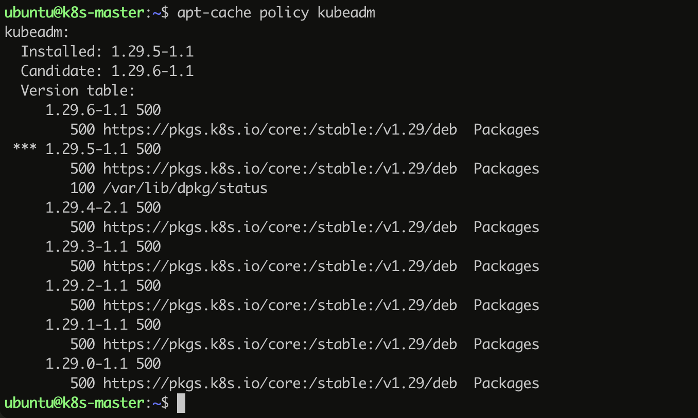

# kubernetest 部署

## 集群

虚拟机：ubuntu 24.04

|   Roles    | Cpu  | Memory | Disk |
| :--------: | :--: | :----: | :--: |
| K8s-master |  2   |   4G   | 30G  |
| K8s-worker |  1   |   2G   | 10G  |

## docker 安装

```
sudo apt install -y docker.io

# 启动 docker 服务
sudo service docker start
# 当前用户加入docker 组，需要退出系统重新登陆才生效
sudo usermod -aG docker ${USER}

# cgroud 驱动改成 systemd
cat <<EOF | sudo tee /etc/docker/daemon.json
{
  "exec-opts": ["native.cgroupdriver=systemd"],
  "log-driver": "json-file",
  "log-opts": {
    "max-size": "100m"
  },
  "storage-driver": "overlay2"
}
EOF

sudo systemctl enable docker
sudo systemctl daemon-reload
sudo systemctl restart docker
```

## cri-dockerd 安装

由于 kubernetetes 从 1.24 版本后不在直接支持 dockerd 运行时，所以需要安装 cri-dockerd 来支持 docker 运行时。

```
# 换成自己系统对应的版本
wget https://github.com/Mirantis/cri-dockerd/releases/download/v0.3.14/cri-dockerd-0.3.14.amd64.tgz

tar -xf cri-dockerd-0.3.14.amd64.tgz
sudo mv cri-dockerd/cri-dockerd  /usr/bin/
rm -rf  cri-dockerd  cri-dockerd-0.3.14.amd64.tgz

# 配置启动项
cat <<EOF | sudo tee /etc/systemd/system/cri-docker.service
[Unit]
Description=CRI Interface for Docker Application Container Engine
Documentation=https://docs.mirantis.com
After=network-online.target firewalld.service docker.service
Wants=network-online.target
Requires=cri-docker.socket

[Service]
Type=notify
ExecStart=/usr/bin/cri-dockerd --pod-infra-container-image=registry.k8s.io/pause:3.9 --container-runtime-endpoint fd://
ExecReload=/bin/kill -s HUP $MAINPID
TimeoutSec=0
RestartSec=2
Restart=always
StartLimitBurst=3
StartLimitInterval=60s
LimitNOFILE=infinity
LimitNPROC=infinity
LimitCORE=infinity
TasksMax=infinity
Delegate=yes
KillMode=process

[Install]
WantedBy=multi-user.target
EOF

cat <<EOF | sudo tee /etc/systemd/system/cri-docker.socket
[Unit]
Description=CRI Docker Socket for the API
PartOf=cri-docker.service

[Socket]
ListenStream=%t/cri-dockerd.sock
SocketMode=0660
SocketUser=root
SocketGroup=docker

[Install]
WantedBy=sockets.target
EOF

sudo systemctl daemon-reload
sudo systemctl enable cri-docker
sudo systemctl restart cri-docker
systemctl status cri-docker
```

## kubeadm、kubelet、kubectl 安装

配置相关系统项

```
cat <<EOF | sudo tee /etc/modules-load.d/k8s.conf
br_netfilter
EOF

cat <<EOF | sudo tee /etc/sysctl.d/k8s.conf
net.bridge.bridge-nf-call-ip6tables = 1
net.bridge.bridge-nf-call-iptables = 1
net.ipv4.ip_forward = 1
EOF

sudo sysctl --system

# 关闭 swap
sudo swapoff -a
sudo sed -ri '/\sswap\s/s/^#?/#/' /etc/fstab
```

```
sudo apt install -y apt-transport-https ca-certificates curl

curl -fsSL https://pkgs.k8s.io/core:/stable:/v1.29/deb/Release.key | sudo gpg --dearmor -o /etc/apt/keyrings/kubernetes-apt-keyring.gpg

echo 'deb [signed-by=/etc/apt/keyrings/kubernetes-apt-keyring.gpg] https://pkgs.k8s.io/core:/stable:/v1.29/deb/ /' | sudo tee /etc/apt/sources.list.d/kubernetes.list

sudo apt update
```

```
# 查看 kubeadm 版本
apt-cache policy kubeadm
```



这里可以看到相关的版本，我选择安装 1.29.5-1.1 版本

```
# 安装指定的版本号
sudo apt install -y kubeadm=1.29.5-1.1 kubelet=1.29.5-1.1 kubectl=1.29.5-1.1

# 锁定这三个软件的版本，免意外升级导致版本错误
sudo apt-mark hold kubeadm kubelet kubectl
```

## 初始化 kubernetes 集群

### 镜像处理

```
# 查看需要的镜像资源
kubeadm config images list --kubernetes-version v1.29.5
```


这些镜像，由于某些原因可能无法直接拉取，可以从阿里云镜像获取。以  ***registry.k8s.io/kube-apiserver:v1.29.5*** 为例，其在阿里云上的对应镜像是 ***registry.aliyuncs.com/google_containers/kube-apiserver:v1.29.5***。其他镜像类似，将 *registry.k8s.io* 替换为 *registry.aliyuncs.com/google_containers* 即可。然后使用 docker tag 将镜像名称改回来

```
docker tag registry.aliyuncs.com/google_containers/kube-apiserver:v1.29.5 registry.k8s.io/kube-apiserver:v1.29.5
```

再利用 docker save 将所有需要的镜像导出到 tar 文件中，docker load 命令加载导出的 tar 文件，这样所需要的镜像就可以使用了。

### 安装 master 节点

再 master 节点执行命令

```
sudo kubeadm init --kubernetes-version=v1.29.5 --pod-network-cidr=10.244.0.0/16 --cri-socket unix:///run/cri-dockerd.sock
```

因为我们已经提前把镜像下载到了本地，所以kubeadm的安装过程很快就完成了，它还会提示出接下来要做的工作：

```
mkdir -p $HOME/.kube
sudo cp -i /etc/kubernetes/admin.conf $HOME/.kube/config
sudo chown $(id -u):$(id -g) $HOME/.kube/config
```

另外还有一个很重要的 ***kubeadm join*** 提示，其他节点要加入集群必须要用指令里的token和ca证书，所以这条命令务必拷贝后保存好。

安装完成后，你就可以使用 `kubectl version`、`kubectl get node` 来检查Kubernetes的版本和集群的节点状态了：

```
kubectl version
kubectl get node
```


你会注意到Master节点的状态是 *NotReady*(由于我已经安装了网络插件，worker 节点也操作，我的输出都是 *Ready*)，这是由于还缺少网络插件，集群的内部网络还没有正常运作。

### Flannel网络插件

我们这里选择 flannel

```
wget https://raw.githubusercontent.com/flannel-io/flannel/master/Documentation/kube-flannel.yml
kubectl apply -f kube-flannel.yml
```

再次执行 kubectl get node，此时 master 的状态就是 Ready 了

### 安装 worker 节点

在 worker 节点执行，执行安装 master 输出的 join 命令即可

```
kubeadm join 192.168.64.5:6443 --cri-socket unix:///run/cri-dockerd.sock --token 7ucvir.46fuak5ta9utl1ep --discovery-token-ca-cert-hash sha256:8459d838dae9e7524d568a78c3641d708e66881e405d44086ae3a79e5813f22d
```

至此，我们的集群就搭建好了

## 安装相关组件

利用 helm 来安装相关组件

```
# helm 的安装
sudo snap install helm --classic
```

### dashboard 安装

```
helm repo add kubernetes-dashboard https://kubernetes.github.io/dashboard/
helm upgrade --install kubernetes-dashboard kubernetes-dashboard/kubernetes-dashboard --create-namespace --namespace kubernetes-dashboard --set kong.admin.tls.enabled=false

# 使用 kubectl edit svc 命令编辑服务，将 type 由 ClusterIP 修改为 NodePort
kubectl edit svc kubernetes-dashboard-kong-proxy -n kubernetes-dashboard

# 查看 Service 暴露的端口
kubectl get svc -n kube-dashboard
```


kubernetes-dashboard-kong-proxy 的端口 32090 就是我们访问的端口

```
# 为 Kubernetes 仪表板生成令牌
cat <<EOF | tee dashboard-user.yaml
apiVersion: v1
kind: ServiceAccount
metadata:
  name: admin-user
  namespace: kube-system
---
apiVersion: rbac.authorization.k8s.io/v1
kind: ClusterRoleBinding
metadata:
  name: admin-user
roleRef:
  apiGroup: rbac.authorization.k8s.io
  kind: ClusterRole
  name: cluster-admin
subjects:
- kind: ServiceAccount
  name: admin-user
  namespace: kube-system
EOF

# 创建账号
kubectl apply -f dashboard-user.yml

# 生成令牌
kubectl -n kube-system create token admin-user

# 创建长期token
cat <<EOF | tee dashboard-user-token.yaml
apiVersion: v1
kind: Secret
metadata:
  name: admin-user
  namespace: kube-system
  annotations:
    kubernetes.io/service-account.name: "admin-user"
type: kubernetes.io/service-account-token
EOF

kubectl apply -f dashboard-user-token.yaml

# 查看token
kubectl get secret admin-user -n kube-system -o jsonpath={".data.token"} | base64 -d
```

### ingress-nginx-controller 网关安装

#### 部署模式

- Deployment + LoadBalancer模式

  这种模式适合公有云环境，大部分公有云，都会为LoadBalancer的Service自动创建一个负载均衡器，通常还绑定了公网地址。只要把域名解析指向该地址，就实现了集群服务的对外暴露。此方案确定需要在公有云上部署。

  

- Deployment+NodePort模式

使用Deployment模式部署Ingress Controller，并创建对应的服务，但是type为NodePort。这样，Ingress就会暴露在集群节点ip的特定端口上。由于Nodeport暴露的端口是随机端口，一般会在前面再搭建一套负载均衡器来转发请求。该方式一般用于宿主机是相对固定IP地址。

  缺点：

  1. NodePort方式暴露Ingress虽然简单方便，但是NodePort多了一层转发，在请求量级很大时可能对性能会有一定影响;

  2. 请求节点会是类似http://www.a.com:3008，其中3008是Ingress Nginx的svc暴露出来的Nodeport端口，看起来不太专业；

     

- DaemonSet+HostNetwork+NodeSelector模式

  使用DaemonSet结合Nodeselector来部署Ingress Controller到特定的Node上，然后使用HostNetwork直接把该Pod与宿主机Node的网络打通，直接使用宿主机的80/433端口就能访问服务。这时Ingress Controller所在的Node机器就是流量入口。

  优点：该方式整个请求链路最简单，性能相对NodePort减少一层转发，因此性能更好；

  缺点：由于直接利用宿主机节点的网络和端口，一个Node只能部署一个Ingress Controller的pod；

  

#### helm 方式安装

```
# 添加nginx-ingress-controller repo
helm repo add ingress-nginx https://kubernetes.github.io/ingress-nginx
helm repo update
helm search repo ingress-nginx
```


```
# 下载 helm 相关的 Chart 包
helm pull ingress-nginx/ingress-nginx --version 4.10.1
```

#### 相关配置修改

这里我们选择 ***DaemonSet+HostNetwork+NodeSelector*** 部署模式

修改 ingress-value 中 values.yaml 文件

```bash
......省略......
controller:
  name: controller
  enableAnnotationValidations: false
  image:
    chroot: false
    registry: registry.k8s.io
    image: ingress-nginx/controller
....再省略...........
    patch:
      enabled: true
      image:
        registry: registry.k8s.io
        image: ingress-nginx/kube-webhook-certgen
        tag: v1.4.1
        #digest: sha256:44d1d0e9f19c63f58b380c5fddaca7cf22c7cee564adeff365225a5df5ef3334   注释掉
        pullPolicy: IfNotPresent
```

对立面涉及镜像的处理，通 kubeadm 处理类似

| K8s镜像                                                      | 阿里云镜像                                                   |
| ------------------------------------------------------------ | ------------------------------------------------------------ |
| registry.k8s.io:ingress-nginx/controller:v1.10.1             | registry.aliyuncs.com/google_containers/controller:v1.10.1   |
| registry.k8s.io/ingress-nginx/opentelemetry:v20230721-3e2062ee5 | registry.aliyuncs.com/google_containers/opentelemetry:v20230721-3e2062ee5 |
| registry.k8s.io/ingress-nginx/kube-webhook-certgen:v1.4.1    | registry.aliyuncs.com/google_containers/kube-webhook-certgen:v1.4.1 |

- 修改 hostNetwork 的值为 `true`

```
# since CNI and hostport don't mix yet. Can be deprecated once https://github.com/kubernetes/kubernetes/issues/23920
  # is merged
  hostNetwork: true
  ## Use host ports 80 and 443
  ## Disabled by default
```

- nodeSelector 添加标签 `ingress: "true"`，用于部署 ingrss-controller 到指定节点

```
## Ref: https://kubernetes.io/docs/concepts/scheduling-eviction/assign-pod-node/
##
nodeSelector:
  kubernetes.io/os: linux
  ingress: "true"
```

- dnsPolicy 的值为 `ClusterFirstWithHostNet`

```
# to keep resolving names inside the k8s network, use ClusterFirstWithHostNet.
dnsPolicy: ClusterFirstWithHostNet
```

- kind 类型为 `DaemonSet`

```
# -- Use a `DaemonSet` or `Deployment`
kind: DaemonSet
# -- Annotations to be added to the controller Deployment or DaemonSet
```

- 修改 nodePort

```
    type: NodePort
.........省略，这里有俩个nodePorts修改.......
    nodePorts:
      # -- Node port allocated for the external HTTP listener. If left empty, the service controller allocates one from the configured node port range.
      http: "80"
      # -- Node port allocated for the external HTTPS listener. If left empty, the service controller allocates one from the configured node port range.
      https: "443"
```

这里修改为80和443端口。

> [!IMPORTANT]
>
> */etc/kubernetes/manifests/kube-apiserver.yaml*  中的内容还需要修改。编辑该文件需要 root 权限，使用 sudo vim 编辑该文件。
>
> 不使用 sudo，打开该文件将看到空白的文件内容。
>
> spec.containers.command  节点增加 **- --service-node-port-range=1-65535** 命令。再使之生效
>
> sudo systemctl daemon-reload && sudo systemctl restart kubelet

#### 执行安装

```
# 创建一个命名空间
kubectl create ns ingress-nginx

# 给指定节点打标签，调度ingress-ontroller pod指定节点
kubectl label node k8s-worker ingress=true

# helm 安装，再下载的 ingress-nginx下执行
helm install ingress-nginx -n ingress-nginx .
```

### metrics 安装

```
wget https://github.com/kubernetes-sigs/metrics-server/releases/latest/download/components.yaml
```

修改相关配置，需要在Metrics Server的Deployment对象里，加上一个额外的运行参数 `--kubelet-insecure-tls`，也就是这样：

```
apiVersion: apps/v1
kind: Deployment
metadata:
  name: metrics-server
  namespace: kube-system
spec:
  ... ... 
  template:
    spec:
      containers:
      - args:
        - --kubelet-insecure-tls
        ... ... 
```

因为Metrics Server默认使用TLS协议，要验证证书才能与kubelet实现安全通信，而我们的实验环境里没有这个必要，加上这个参数可以让我们的部署工作简单很多（生产环境里就要慎用）。

镜像也提前下载并导入集群中，镜像的下载问题参看上面的步骤

```
kubectl apply -f components.yaml
kubectl get pod -n kube-system
```


现在有了Metrics Server插件，我们就可以使用命令 `kubectl top` 来查看Kubernetes集群当前的资源状态了。它有**两个子命令，`node` 查看节点的资源使用率，`pod` 查看Pod的资源使用率**。


