# HTTPS介绍

## 通俗的例子
一个聊天的例子：A和B之间互发消息
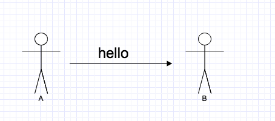

假如这时有个捣蛋的人，截获了聊天内容
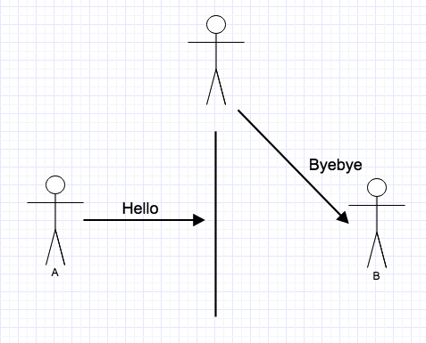

上面使用明文传输的内容，一旦被截获就没有任何安全性可言。 
安全：聊天内容只有A和B两个人能懂，即使消息被截获第三方也无法理解聊天内容。

改进聊天的场景：
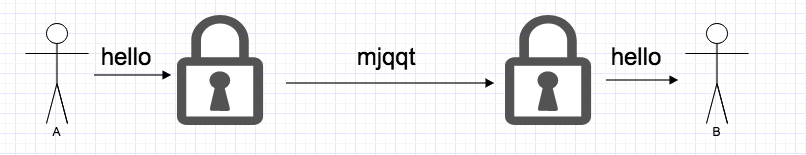

密码相关的：

- 密码：算法(加密、解密算法)——对明文进行可逆混淆的操作；秘钥(加解密使用的参数)
- 对称加密——加解密使用的秘钥(字母、数字、字符串等)是一样的

在客户端和服务器模式下：
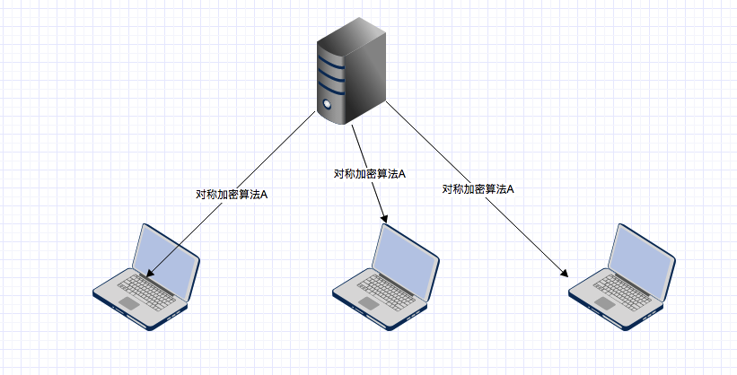

这种情况下，虽然使用了加密，但服务器与所有的客户端使用的都是同样的加密算法(算法和秘钥)，等同于没有加密。
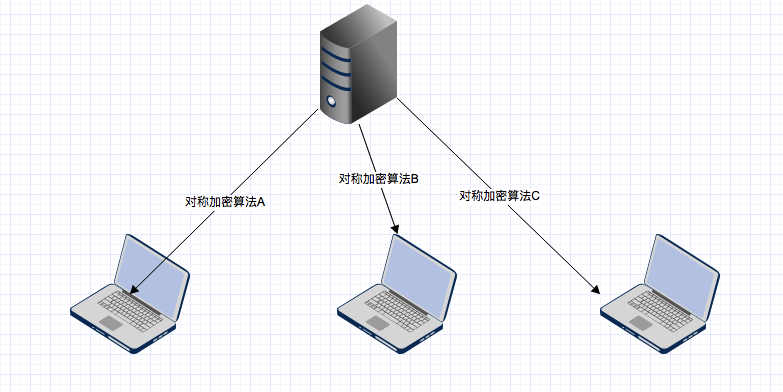
服务器与每个客户端使用不同的秘钥进行加密。

成千上万的客户端与服务器进行连接，加密秘钥必然是两者建立连接时协商确定的。
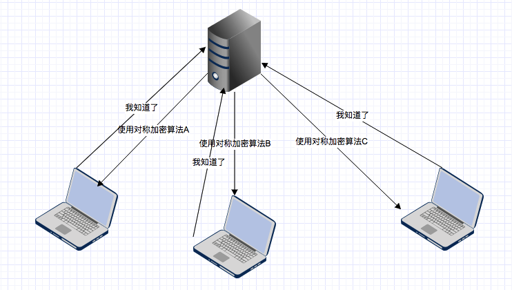
秘钥如何协商？协商的过程是没有加密的，还是会被中间人拦截。那我们再对这个协商过程进行对称加密就好了，那对协商过程加密的加密还是没有加密，怎么办？

- 非对称加密：与对称加密算法不同，非对称加密算法需要两个密钥：公开密钥（publickey）和私有密钥（privatekey）。公开密钥与私有密钥是一对，如果用公开密钥对数据进行加密，只有用对应的私有密钥才能解密；如果用私有密钥对数据进行加密，那么只有用对应的公开密钥才能解密。加解密时间长、速度慢。
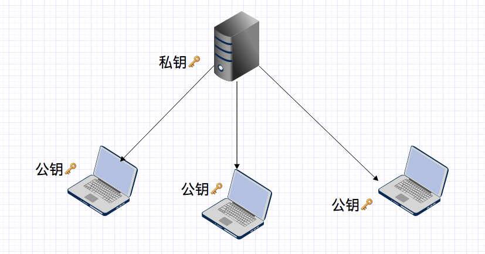

如何得到公钥，从服务器请求公钥？
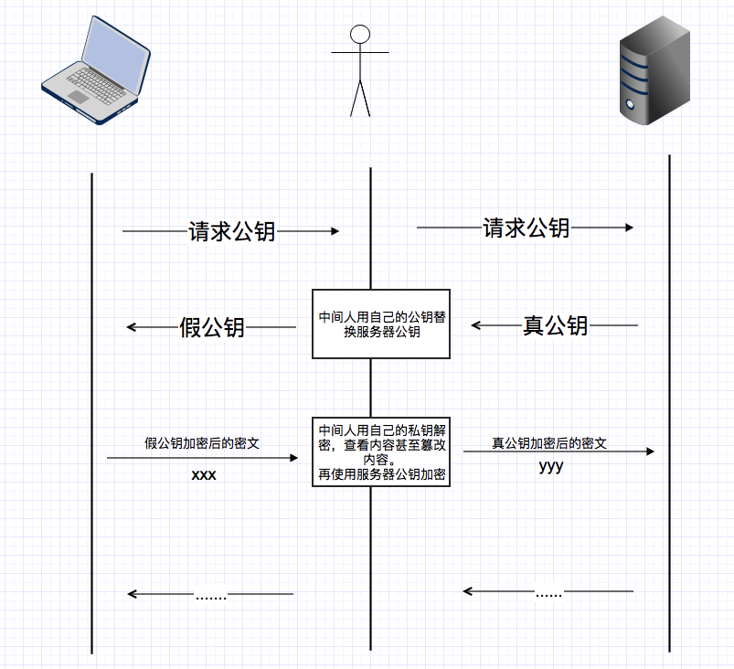
服务器直接将公钥传递给客户端这个过程本身就是不安全的，始终都面临公钥被掉包的问题。如何防止公钥被掉包——即客户端确认收到的公钥就是请求的服务器的公钥，而不是其他第三方的公钥？为了解决这个问题，引入了双方都信任的第三方，由第三方来“托管”服务器的公钥。

第三方机构使用它的私钥对我们的公钥进行加密，给网站管理者颁布一个数字证书，网站管理者将数组帧证书上传的自己的服务器，在客户端请求时再将数据证书传递给客户端。客户端再使用第三方机构的公钥进行解密。

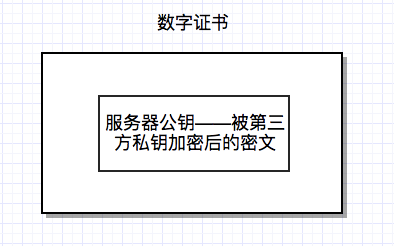
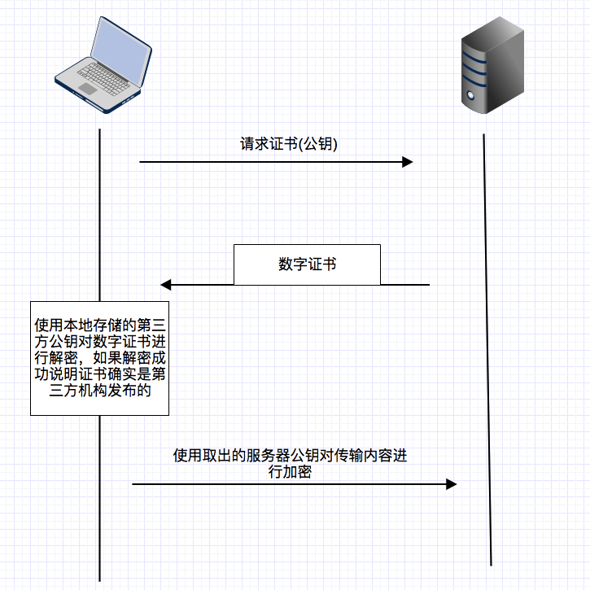
客户端可以确认证书是第三方机构颁发的，可以信任该证书。但上面的模型依然存在问题：客户端收到的证书是否是请求服务器的证书？
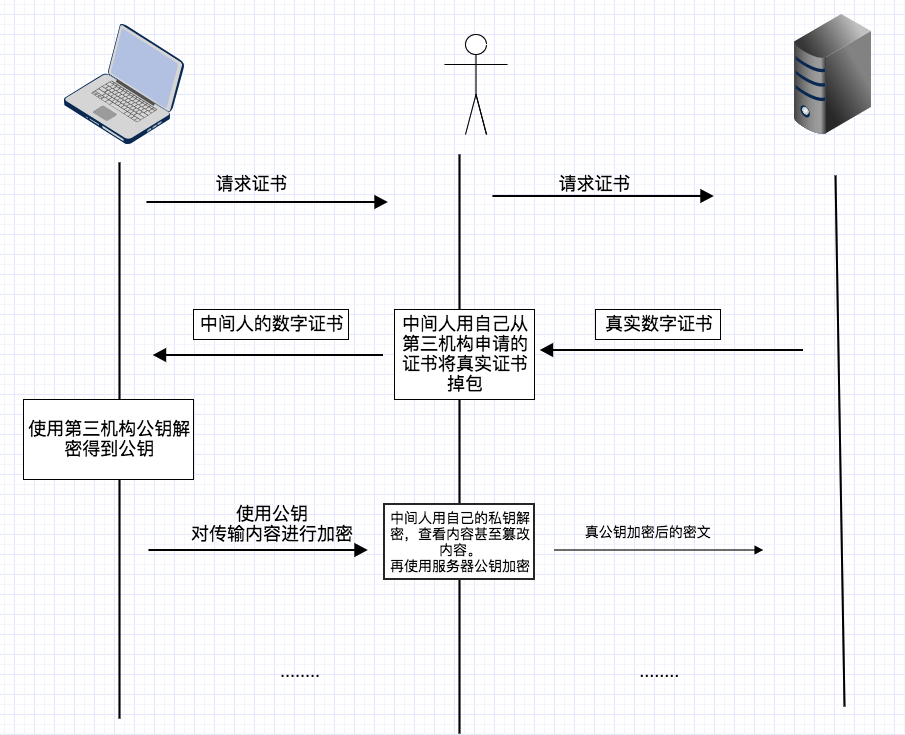

#### 数字签名——解决同一机构颁发的不同证书被篡改问题

第三方颁发的证书本身就已经告诉客户端怎么验证证书的真伪。也就是证书上写着如何根据证书的内容生成数字签名。客户端拿到证书后根据证书上的方法自己生成一个数字签名，如果生成的数字签名与证书上的证书数字签名相同，那么说明这个证书是真实的。

同时，为避免证书编号本身又被调包，所以使用第三方的私钥进行加密。

这地方有些抽象，我们来个图帮助理解：

证书的制作如图所示。证书中的“编号生成方法MD5”就是告诉客户端：你使用MD5对证书的内容求值就可以得到证书的签名。
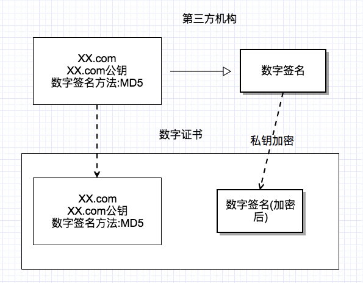

当客户端拿到证书后，开始对证书中的内容进行验证，如果客户端计算出来的数字签名与证书中的证书签名相同，则验证通过：
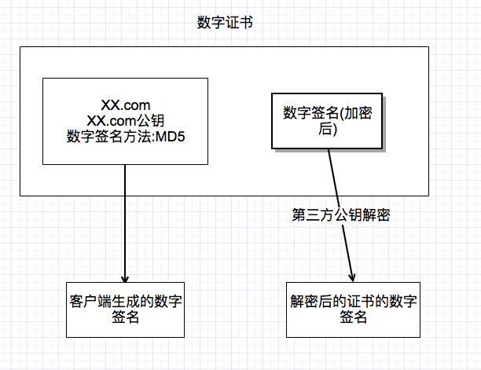
**证书**：一个包含公钥、证书所有者相关信息以及证书颁发者数字签名的数字文件。

### 第三方认证机构
维护一个权威的第三方机构列表（包括它们的公钥）。因为客户端接收到的证书中会写有颁发机构，客户端就根据这个颁发机构的值在本地找相应的公钥。

- 订阅人：那些需要使用证书来提供安全服务的团体
- 登记机构：（registration authority, RA）主要是完成一些证书签发的相关管理工作。例如：RA会首先对用户的身份进行验证，然后才去找CA签发证书。
- 证书签发机构：（certification authority, CA）指我们都信任的证书颁发机构，它会在确认申请用户的身份之后签发证书。同时CA会在线提供其所签发证书的最新吊销信息。
- 信赖方：是指那些证书使用者。从技术上说，一般是指那些执行证书验证的网页浏览器、其他程序以及操作系统。他们通过维护根可信证书库来执行验证，这些证书库包含某些CA的最终可信证书。

证书类别:

- 域名认证（Domain Validation， DV）：最低级别认证，可以确认申请人拥有这个域名。对于这种证书，浏览器会在地址栏显示一把锁。
- 组织认证（Organization Validation， OV）：认证的域名和公司信息，需要提交公司资料认证，证书里面会包含公司信息。
- 扩展认证（Extended Validation，EV）：最高级别的认证，浏览器地址栏会显示公司名。
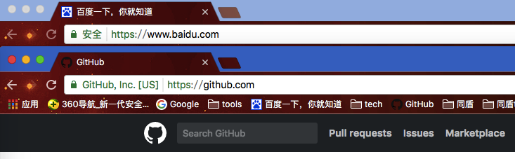

***证书生命周期***
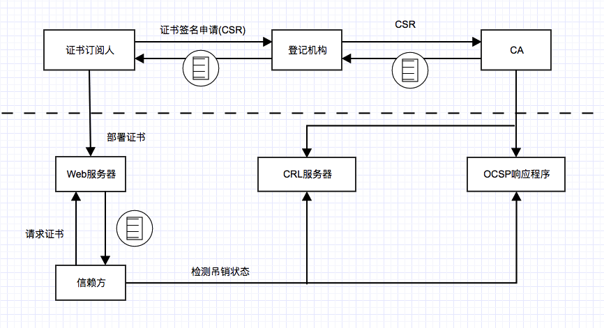
证书覆盖范围：

- 单域名证书：只能用于单一域名，foo.com的证书不能用于www.foo.com
- 通配符证书：可以用于某个域名及其所有一级子域名，比如*.foo.com的证书可以用于foo.com，也可以用于www.foo.com
- 多域名证书：可以用于多个域名，比如foo.com和bar.com

## 客户端验证证书步骤：
#### 第一，检查SSL证书是否是由浏览器中“受信任的根证书颁发机构”颁发。

检查到如果网站部署的SSL证书不是浏览器受信任的根证书颁发机构，则会有安全警告。
该步骤中涉及的概念：

- 证书链:
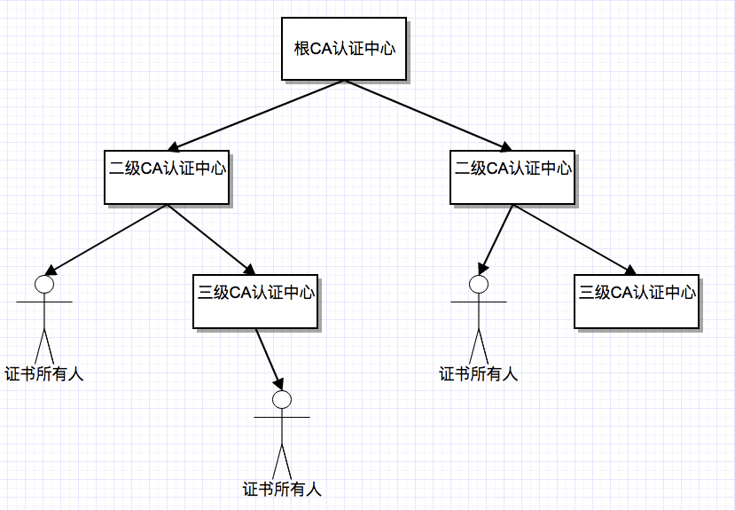
从图中可以看到，CA认证中心之间是一个树状结构，根CA认证中心可以授权多个二级的CA认证中心，同理二级CA认证中心也可以授权多个3级的CA认证中心...如果你是数字证书申请人(比如说：交通银行)，你可以向根CA认证中心，或者二级，三级的CA认证中心申请数字证书，这是没有限制的，当你成功申请后，你就称为了数字证书所有人。值得注意的是，根CA认证中心是有多个的，也就是说会有多棵这样的结构树。
- 根证书:自己可以证明自己是可靠的。根证书是整个证书认证体系的根本，如果根证书的被攻破(私钥泄露)，所有基于根证书认证的证书都不可靠。 根证书是有系统或者浏览器内置的。

#### 第二，检查SSL证书中的证书吊销列表，检查证书是否被证书颁发机构吊销。

检查SSL证书中的证书吊销列表，如果已经被吊销，则该证书是无效的。浏览器会显示警告信息。 
验证吊销有CRL和OCSP两种方法。 

- 其中CRL即证书吊销列表。证书被吊销后，会被记录在CRL中，CA会定期发布CRL。客户端可以依靠CRL来检查证书是否被吊销了。 
CRL的缺点：CRL的可能会比较大，下载麻烦（使用增量CRL方案解决）；CRL有滞后性，就算证书被吊销也只能等CRL发布之后才能知道。 
- OCSP即在线证书状态检查。客户端按照要求发送一个查询请求，之后服务器(CA的服务器)返回证书状态。OCSP也存在缺点：可用性和性能问题，并且客户端会忽略OCSP的响应(连接不可用)
- OCSP stapling：允许服务器只从CA获取一次OCSP响应，在每次SSL握手的同时提供证书的有效信息。

#### 第三，检查此SSL证书是否过期。

检查网站SSL证书的有效期限，如果证书已经过了有效期，则会显示警告信息：“此网站出具的安全证书已过期或还未生效。安全证书问题可能显示试图欺骗您或截获您向服务器发送的数据。建议关闭此网页，并且不要继续浏览该网站。”

#### 第四，检查部署此SSL证书的网站的域名是否与证书中的域名一致。

检查部署此SSL证书的网站的域名是否与证书中的域名一致，如果不一致，则浏览器也会显示警告信息：“此网站出具的安全证书是为其他网站地址颁发的。安全证书问题可能显示试图欺骗您或截获您向服务器发送的数据。建议关闭此网页，并且不要继续浏览该网站。”

## 握手协议
常见的握手流程主要有以下三种:

- 完整的握手——对服务器进行验证
- 恢复之前的会话采用的简短握手
- 对客户端和服务器都进行身份验证的握手
  
### 完整的握手
如果客户端第一次与服务器建立会话，那么双方会执行一次完整的握手流程。在握手流程中，双方完成以下四个主要步骤：

1. 交换各自支持的功能，对需要的连接参数达成一致；
- 验证出示的证书，或使用其他方式进行身份验证；
- 对将用于保护会话的密码达成一致；
- 验证握手消息并没有被第三方篡改

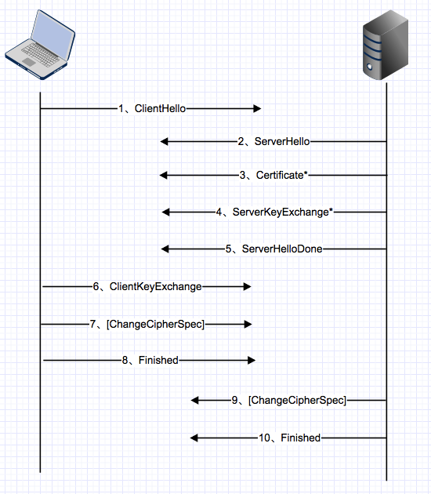

1. 客户端开始新的握手，并将自身支持的功能提交给服务器
2. 服务器选择连接参数
3. 服务器发送其证书链（仅当需要服务器验证身份验证时）
4. 根据选择的密钥交换方式，服务器发送生成密钥的额外信息
5. 服务器通知客户端自己完成了协议过程
6. 客户端发送生成密钥所需要的额外信息
7. 客户端切换加密方式并通知服务器
8. 客户端计算并发送收到的握手消息的散列
9. 服务器切换加密方式并通知客户端
10. 服务器计算并发送接收的握手消息的散列

各个握手阶段的详细说明：

- ClientHello，第一次握手或收到服务器的HelloRequest消息时，发送这条消息。在这一步，客户端主要想服务器提供一下信息：

	1. 支持的协议版本，比如tls1.0
	2. 一个客户端生成的随机数——用于生成主密钥
	3. 支持的加密算法
	4. 支持的压缩算法
	
- ServerHello, 服务器向客户端发出的回应，包含一下信息

	1. 确认使用的加密通信的协议版本，比如tls1.0版本。如果客户端与服务器支持的协议版本不一致，服务器关闭加密通信
	2. 服务器生成的一个随机数——用于生成主密钥
	3. 确认使用的加密算法
	
- Certificate, 服务器将证书链发送给客户端。服务器必须保证它发送的证书与选择的加密方式保持一致。证书要符合X.509证书规范。
- ServerKeyChange, 携带密钥交换的额外数据。消息内容对不同的密钥交换算法存在差异，在某些场景中，服务器不需要发送任何内容，意味着不发送ServerKeyChange消息。
- ServerHelloDone, 表明服务器已经将所有预计的握手消息发送完毕
- ClientkeyChange, 证书合法性验证通过后，客户端计算产生随机数字Pre-master(预主密钥)，并用证书公钥加密，发送给服务器;
- ClientCipherSpec, 表明客户端已得到用以生成主密钥的足够信息，已经生成加密密钥，并且将切换到加密模式。
- Finshed，握手结束通知，这一项同时也是前面发送的所有内容的hash值，用来供对端校验。

### 客户端身份验证
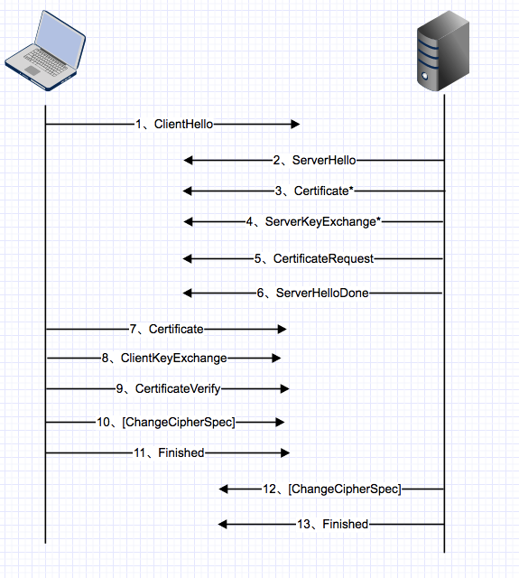

作为响应，客户端发送自己Certificate消息(使用与服务器发送证书相同的格式)，并附上证书。
CertificateVerify消息，证明自己拥有对应的私钥

### 会话恢复
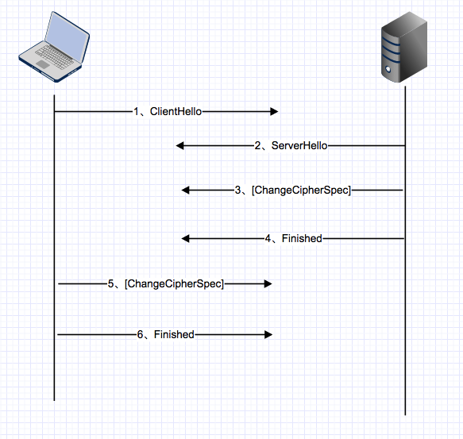
最初的会话恢复机制是：在一次完整的协商的连接断开时，客户端和服务器都会将会话的安全参数保存一段时间，希望使用会话恢复的服务器会为会话指定唯一的标示，称为会话ID。服务器在ServerHello消息中将会话ID发回客户端。

希望恢复早先会话的客户端会将适当的会话ID放入ClientHello消息中，服务器如果愿意恢复会话，就将相同的会话ID放入ServerHello消息返回，接着使用之前协商的密钥生成一套新的密钥，再切换到加密模式，发送Finished消息。客户端收到会话已恢复消息后，也进行相同的操作。

## 密钥交换
密钥交换是握手过程中最核心的部分。在ssl/tls中，会话的安全性取决于主密钥。密钥交换的目的是计算另一个值即预主密钥，这个值是组成主密钥的来源。
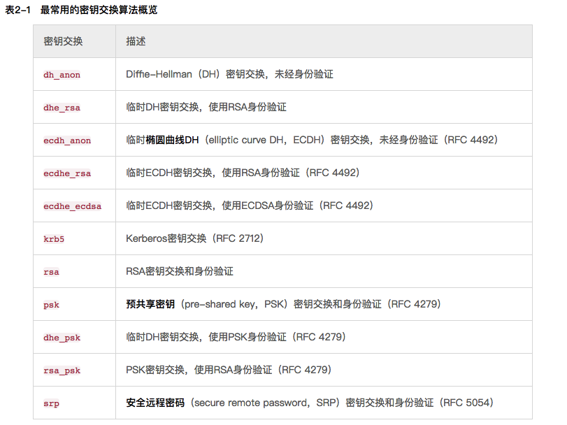

选择哪一种密钥交换算法是由ssl握手时的选择确定的。密钥交换是一种密钥传输算法，这种算法是由客户端生成预主密钥，并以服务器公钥加密传送给服务器。

##### RSA
RSA是一种标准密钥交换算法，得到了广发的支持。

客户端直接生成预主密钥，使用服务器的公钥加密，将其包含在ClientKeyExchange消息中，发送给服务器，服务器解密ClientKeyExchange消息提取预主密钥，生成主密钥。

但它有一个严重的隐患：一旦服务器的私钥泄露，被动攻击者就可以解码所有加密传输的数据。即RSA不支持 ***前向保密***
##### DHE_RSA
临时Diffie-Hellman（ephemerial Diffie-Hellman,DHE）密钥交换是一种构造完备的算法。
优点是支持前向加密，缺点是执行缓慢。DHE是一种密钥协定算法，进行协商的团体都对密钥的生成产生作用，并对公共密钥达成一致。在ssl中，DHE通常与RSA身份验证联合使用。
##### ECDHE_RSA 和 ECDHE_ECDSA
临时椭圆曲线(ECDHE)密钥交换算法建立在椭圆曲线加密的基础之上。椭圆曲线加密算法是比较新的算法，执行速度很快而且提供了前向保证。ECDHE理论原理与DHE类似。在ssl中，ECDHE可以与RSA和ECDSA身份验证一起使用。

服务器的ServerKeyExchange消息
	
	struct {
		select (KeyExchangeAlgorithm) {
			case dh_anon:
				ServerDHParams	params;
			case dhe_rsa:
				ServerDHParams	params;
				Signature			params_signature;
			case ecdh_anon:
				ServerECDHParams	params;
			case ecdhe_rsa:
			case ecdhe_ecdsa:
				ServerECDHParams params;
				Signature			params_signature;
			case ras:
			case dh_rsa:
		};
	} ServerKeyExchange;
	
从上面的结构中，可以看到在某些算法内，服务器不发送任何消息。原因是在使用这些算法的握手过程中，所有需要的信息已经通过其他消息得到；不然，服务器就会在此发送其密钥交换的参数。服务器也会发送参数的签名(使用证书对应的私钥进行签名)用于身份验证。使用签名，客户端得意确认它正在与持有私钥对应证书的公钥的服务器进行通信。

客户端会发送ClientKeyExchange消息传送它的密钥交换参数，这个消息是必需发送的。消息的结构
	
	struct {
		select (KeyExchangeAlgorithm) {
			case rsa:
				EncrytedPreMasterSecret;
			case dhe_dss:
			case dhe_rsa:
			case dh_dss:
			case dh_anon:
				ClientDiffieHellmanPublic;
			case ecdhe:
			case ecdhe_ecdsa:
				ClientECDiffieHellmanPublic;
			case ras:
			case dh_rsa:
		} exchange_keys;
	} ClientKeyExchange;
	
#### Diffie-Hellman 密钥交换
DH是使用了一种正向计算简单、逆向计算困难的数学函数。即使交换中的某些因子被知道，逆向计算也是困难的。

DH密钥交换需要6个参数，其中两个参数有服务器选取，成为域参数（dh_p和dh_g）。协商过程中，客户端和服务器各自生成另外两个参数，相互发送其中一个参数(dh_Ys和dh_Yc)到对端，在经过计算，最终得到密钥。

临时Diffie-Hellman（DHE）密钥交换中没有任何参数被重复使用。与之相对，在一些DH密钥交换方式中，某些参数是静态的，并被嵌入到服务器和客户端的证书中。这样的话，密钥交换的结果是一直不变的密钥，不具备前向保密的能力。

ssl支持静态DH密钥交换，但无人使用。在协商DHE套件时，服务器将其所有的参数填入ServerDHParams块并发送。客户端响应并发送其公开参数(dh_Yc)。
DH交换存在的问题:

- DH参数的安全性。DH密钥的安全性取决于域参数的安全性，服务器发送弱的或者不安全的参数，将对回话的安全性造成损害。
- DH参数协商。ssl没有为客户端提供传递期望使用的DH参数的强度的设置。服务器传递的参数，客户端有可能选择的是较弱的参数。
- 参数强度不够。

#### 椭圆曲线Diffie-Hellman 密钥交换
临时椭圆曲线Diffie-Hellman(ECDHE)密钥交换原理与DH相似，但它的核心使用了不同的数学基础。
ECDHE密钥交换发生在一条有服务器定义的特定的椭圆曲线上。这条曲线代替了DH中域的参数的角色。理论上ECDH支持静态的密钥交换，但实际使用时，只使用了这种临时的变种(ECDHE)。

密钥交换由服务器发起，它选择一条椭圆曲线和公开参数并提交。然后客户端提交自己的公开参数。

## HTTPS攻击
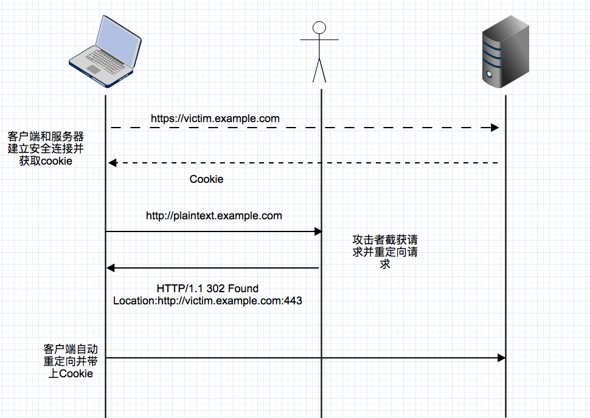

针对上述的缓解的方法：使用HSTS机制

***HSTS***:是一种强制浏览器获取安全资源的机制，即使在面对用户错误以及实现错误依然有效。