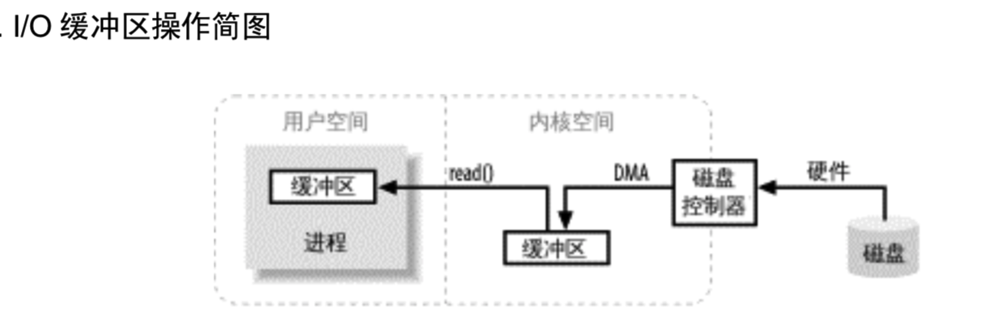
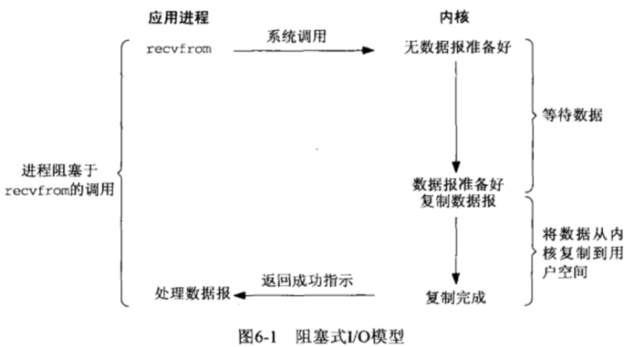
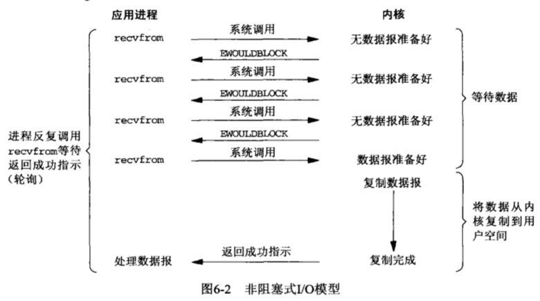
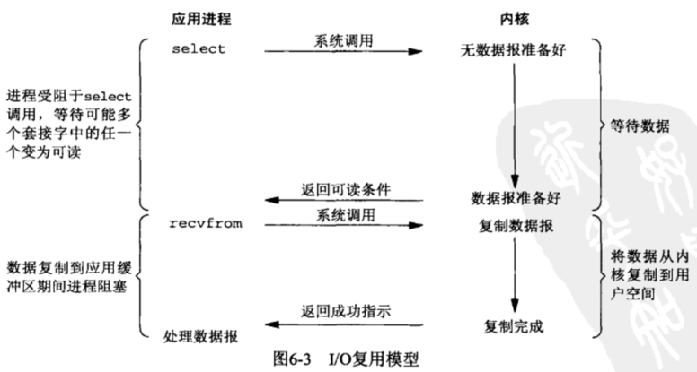
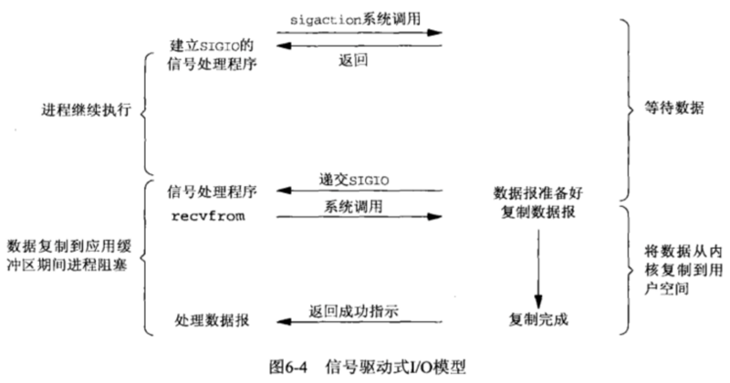
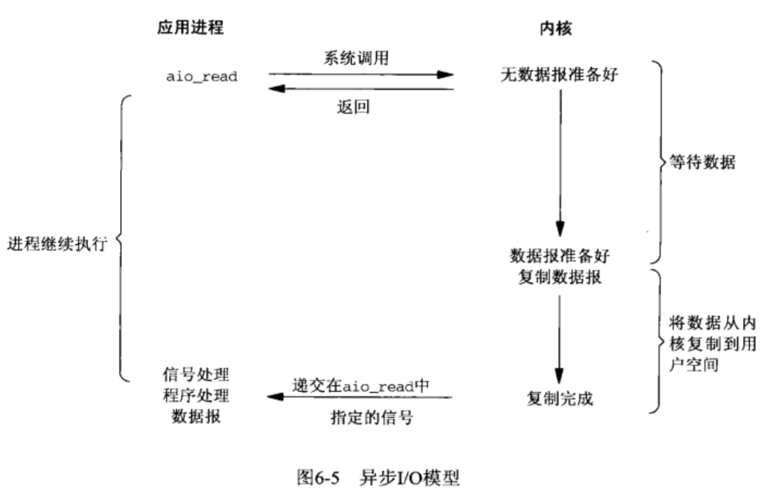

### 第 1 章 Java I/O 模型

### 1.1 什么是同步与异步、阻塞与非阻塞

关于这个概念的区分，引用[知乎上的回答](https://www.zhihu.com/question/19732473/answer/23434554)，这个回答形象生动的说明它们之前的联系和区别。

>老张爱喝茶，废话不说，煮开水。
>出场人物：老张，水壶两把（普通水壶，简称水壶；会响的水壶，简称响水壶）。
>
>1. 老张把水壶放到火上，立等水开。（同步阻塞）
>
>老张觉得自己有点傻
>
>2. 老张把水壶放到火上，去客厅看电视，时不时去厨房看看水开没有。（同步非阻塞）
>
>老张还是觉得自己有点傻，于是变高端了，买了把会响笛的那种水壶。水开之后，能大声发出嘀~~~~的噪音。
>
>3. 老张把响水壶放到火上，立等水开。（异步阻塞）
>
>老张觉得这样傻等意义不大
>
>4. 老张把响水壶放到火上，去客厅看电视，水壶响之前不再去看它了，响了再去拿壶。（异步非阻塞）
>
>老张觉得自己聪明了。
>
>所谓同步异步，只是对于水壶而言。
>普通水壶，同步；响水壶，异步。
>虽然都能干活，但响水壶可以在自己完工之后，提示老张水开了。这是普通水壶所不能及的。
>同步只能让调用者去轮询自己（情况2中），造成老张效率的低下。
>
>所谓阻塞非阻塞，仅仅对于老张而言。
>立等的老张，阻塞；看电视的老张，非阻塞。
>情况1和情况3中老张就是阻塞的，媳妇喊他都不知道。虽然3中响水壶是异步的，可对于立等的老张没有太大的意义。所以一般异步是配合非阻塞使用的，这样才能发挥异步的效用。

### 1.2 I/O 模型

Java 中的 I/O 模型，归根结底还是操作系统 I/O 的体现，目前 Unix下有5 中可用的I/O 模型：

- 阻塞式 I/O（blocking I/O）
- 非阻塞式 I/O（nonblocking I/O）
- I/O 复用（I/O multiplexing）
- 信号驱动 I/O（singal driven I/O）
- 异步 I/O（asynchronous I/O）

理解 I/O，先要理解缓冲区的概念以及缓冲区如何工作的。所谓 I/O — 输入 / 输出，无非就是把数据移进或移出缓冲区。进程执行 I/O 操作，归结起来，也就是向操作系统发出请求，让它要么把缓冲区里的数据排干——写，要么用数据把缓冲区填满——读。

图中忽略了很多细节，仅显示涉及的基本步骤。

#### 1.2.1 阻塞式 I/O

阻塞IO是最常用的IO模型，我们在java中调用传统BIO(InputStream、OutpuytStream)的读写方法都是这种IO模型。

在进程空间中调用recvfrom，其系统调用直到数据从硬件设备拷贝到内核缓冲区并且从内核拷贝到用户进程空间时才会返回，在此期间一直是阻塞的，进程在从调用recvfrom到返回这段时间一直都是阻塞的，故称为阻塞IO。

#### 1.2.2 非阻塞式 I/O

如上图所示，前三次调用 recvfrom 时，没有数据可返回，因此内核转而立即返回一个 EWOULDBLOCK 错误。 第四次调用 recvfrom 时，已经有数据了，此时，recvfrom 会阻塞住，等待内核将数据赋值到应用进程的缓冲区中，然后再返回。(注意，当有数据时，recvfrom 是阻塞的，它会等待内核将数据复制到应用进程的缓冲区后，才返回)。

当一个应用进程像这样对一个非阻塞描述符循环调用 recvfrom 时，我们称之为轮询(polling)。 应用进程持续轮询内核，以查看某个操作是否完成，这么做会消耗大量的 CPU 时间，不过这种模型偶尔也会遇到，通常是专门提供某一种功能的系统中才有。

#### 1.2.3 I/O 复用模型

如上图所示, 当调用了 select 后，select 会阻塞住，等待数据报套接字变为可读。当 select 返回套接字可读这一条件时，我们就可以调用 recvfrom 把所读取的数据报复制到应用进程缓冲区。

对比阻塞式 I/O，I/O 复用模型优势并不明显, 并且从使用方式来说，I/O 复用模型还需要多调用一次 select，因此从易用性上来说，比阻塞式 I/O 还略有不足。不过 select 的杀手锏在于它可以监听多个文件描述符，大大减小了阻塞线程的个数。

#### 1.2.4 信号驱动 I/O

信号驱动模型如上图所示。 当文件描述符就绪时，我们可以让内核以信号的方式通知我们。我们首先需要开启套接字的信号驱动式 I/O 功能，并通过 sigaction 系统调用安装一个信号处理函数。 sigaction 系统调用是异步的，它会立即返回。 当有数据时，内核会给此进程发送一个 SIGIO 信号，进而我们的信号处理函数就会被执行，我们就可以在这个函数中调用 recvfrom 读取数据。

#### 1.2.5 异步 I/O

异步 I/O (asynchronous I/O) 由 POSIX 规范定义，在 POSIX 中定义了若干个异步 I/O 的操作函数。这个函数的工作原理是：告知内核启动某个动作，并让内核在整个操作（包括将数据从内核复制到应用进程缓冲区）完成后通知我们的应用进程。

异步 I/O 模型和信号驱动的 I/O 模型的主要区别在于: 信号驱动 I/O 是由内核通知我们何时可以启动一个 I/O 操作，而异步 I/O 模型是由内核通知我们 I/O 操作何时完成。

### 1.3 总结

上述五中 I/O 模型中，前四种模型（阻塞 I/O、非阻塞 I/O、I/O 复用、信号驱动 I/O）的主要区别在于第一阶段，因为他们的第二阶段是一样的：在数据从内核复制到调用者的缓冲区期间，进程阻塞于 recvfrom 调用。而第五种，即异步 I/O 模型中，两个阶段都不需要应用进程处理，内核为我们处理好了数据的等待和数据的复制过程。