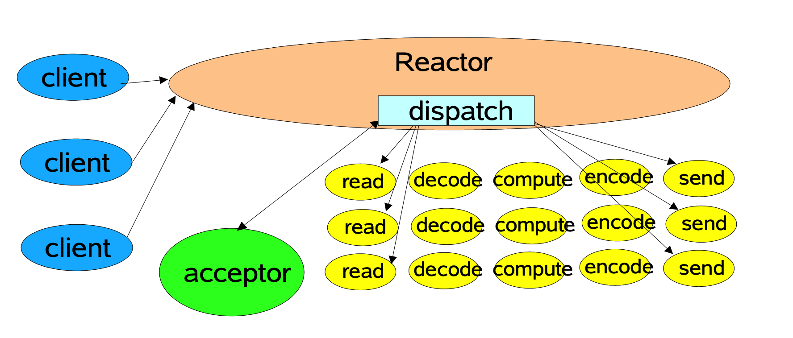
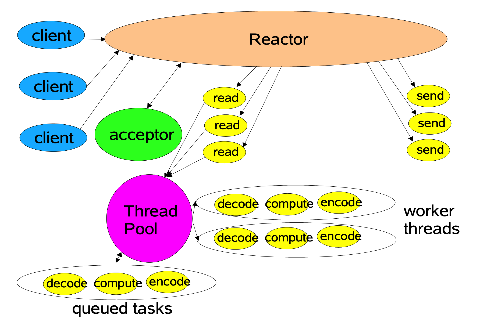
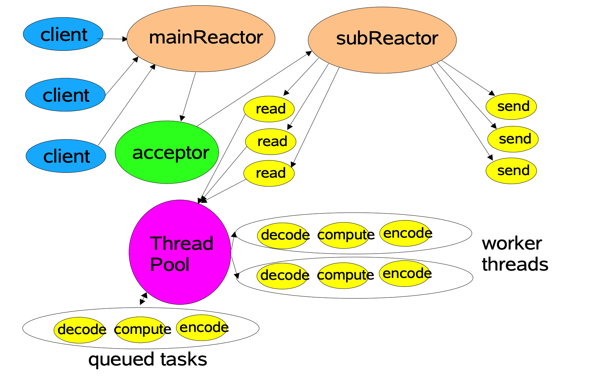

### 第 2 章 I/O 模型的具体实现

上一章节讲了 Unix 的 5 种 I/O 模型，接下来将 I/O 模型的 Java 中的具体实现。本章节的[源码地址](https://github.com/oneET/network)。

### 2.1 阻塞式 I/O

Java 中实现阻塞是 I/O，直接使用 Socket 套接字即可。

```java
/**
 * 服务端多线程实现
 *
 * @author leexm
 * @date 2019-10-24 23:40
 */
public class SocketServer {

    private static final int PORT = 8088;

    private static AtomicInteger atomicInteger = new AtomicInteger();

    public static void main(String[] args) throws IOException {
        ExecutorService executors = Executors.newFixedThreadPool(5, (Runnable r) -> {
            Thread thread = new Thread(r, "server-" + atomicInteger.incrementAndGet());
            thread.setUncaughtExceptionHandler((Thread t, Throwable e) -> {
                System.out.println("非I/O异常");
                e.printStackTrace();
            });
            return thread;
        });

        ServerSocket serverSocket = new ServerSocket();
        serverSocket.bind(new InetSocketAddress(PORT));

        System.out.println("服务器启动，等待客户端连接...");
        while (true) {
            Socket socket = serverSocket.accept();

            executors.execute(() -> {
                try {
                    InputStream inputStream = socket.getInputStream();
                    byte[] bytes = inputStream.readAllBytes(); // 这是jdk11的api，低版本不支持
                    String message = new String(bytes, "UTF-8");
                    System.out.println(String.format("线程%s，收到客户端信息:%s", Thread.currentThread().getName(), message));

                    OutputStream outputStream = socket.getOutputStream();
                    outputStream.write(String.format("[%s]", message).getBytes("UTF-8"));

                    outputStream.close();
                    socket.close();
                } catch (IOException e) {
                    e.printStackTrace();
                }
            });

        }
    }

}
```

### 2.2 非阻塞式 I/O

JDK1.4 提供了新的 I/O api，即 nio。

```java
/**
 * nio实现服务端单线程版本
 *
 * @author lxm
 * @date 2019/10/25 13:09
 */
public class NioServer {

    private static final int PORT = 8088;

    public static void main(String[] args) throws IOException {
        ServerSocketChannel serverChannel = ServerSocketChannel.open();
        serverChannel.configureBlocking(false);
        serverChannel.bind(new InetSocketAddress(PORT));

        Selector selector = Selector.open();
        serverChannel.register(selector, SelectionKey.OP_ACCEPT);

        System.out.println("服务器启动，等待客户端连接...");
        while (true) {
            if (selector.select() <= 0) {
                continue;
            }
            Set<SelectionKey> keys = selector.selectedKeys();
            Iterator<SelectionKey> iter = keys.iterator();
            while (iter.hasNext()) {
                SelectionKey key = iter.next();

                if (!key.isValid()) {
                    key.channel().close();
                }

                if (key.isAcceptable()) {
                    ServerSocketChannel serverSocketChannel = (ServerSocketChannel) key.channel();
                    SocketChannel socketChannel = serverSocketChannel.accept();
                    socketChannel.configureBlocking(false);
                    socketChannel.register(selector, SelectionKey.OP_READ);
                } else if (key.isReadable()) {
                    SocketChannel socketChannel = (SocketChannel) key.channel();
                    ByteBuffer byteBuffer = ByteBuffer.allocate(1024);
                    socketChannel.read(byteBuffer);
                    byteBuffer.flip();
                    String message = new String(byteBuffer.array(), 0, byteBuffer.limit(), "UTF-8");
                    System.out.println(String.format("线程%s，收到客户端信息:%s", Thread.currentThread().getName(), message));

                    message = String.format("[%s]", message);
                    byteBuffer.clear();
                    byteBuffer.put(message.getBytes("UTF-8"));
                    byteBuffer.flip();
                    socketChannel.write(byteBuffer);
                    socketChannel.close();
                }
                iter.remove();
            }
        }
    }

}
```

nio的核心：Channel（通道），Buffer（缓存）， Selector（选择器）。

***nio 与 bio 的区别：***

- bio 是面向流（Stream）的，nio 是面向缓存区（Buffer）的。

  bio 面向流意味着每次从流中读一个或多个字节，直至读取所有字节，没有缓存在任何地方；nio 则可以读取到一个可处理的缓冲区，并以 channe 的形式进行数据拷贝；同时 nio 可以的 buffer 等可以减少数据在内核态和用户态之间的拷贝。

- bio 是阻塞的，bio 是非阻塞的。

  bio 中一个线程读取或者写入的时候，直到数据读取或者写入完成之前，该线程都是阻塞的；nio 的非阻塞模式中，一个线程读取或者写入的时候，只会得到目前可用的数据，在数据读取或者写入完成之前，线程不阻塞，可以继续做其他的事。

- nio 有选择器，bio 没有。
  选择器是 nio 可以非阻塞进行 I/O 操作的关键。通过选择器，一个线程可以监听多个通道的IO事件，当我们向一个选择器注册了 socketChannel，选择器就可以自动不断地查询这些注册了的通道是否有准备好的IO事件( 比如可读，可写)，如果有就进行IO操作。这样通过选择器，一个线程就可以高效地管理多个通道了。

### 2.3 Reactor 线程模型

Doug Lea 在 [Scalable IO in Java](http://gee.cs.oswego.edu/dl/cpjslides/nio.pdf) 的 PPT 中描述了 Reactor 编程模型的思想，大部分 NIO 框架和一些中间件的NIO 编程都与它一样或是它的变体。本文结合 PPT 按照自己的理解整理而来，最终编写了一个简单的 NIO 回显服务。

#### 2.3.1 Reactor 单线程模型



```java
/**
 * 经典 Reactor 模型，I/O 读写主线程负责
 * 根据 handler 的不同实现，数据处理可以和 I/O 读写在一个线程内或使用另外的线程处理
 *
 * @author leexm
 * @date 2019-10-26 16:31
 */
public class Reactor {

    private final Selector selector;

    private final ServerSocketChannel serverChannel;

    public Reactor(int port) throws IOException {
        serverChannel = ServerSocketChannel.open();
        serverChannel.configureBlocking(false);
        serverChannel.bind(new InetSocketAddress(port));

        selector = Selector.open();
        serverChannel.register(selector, SelectionKey.OP_ACCEPT, new Acceptor());
    }

    public void kickOff() {
        System.out.println("服务器启动，等待连接中......");
        try {
            while (!Thread.interrupted()) {
                selector.select();
                Set<SelectionKey> selectedKeys = selector.selectedKeys();
                Iterator<SelectionKey> iter = selectedKeys.iterator();
                while (iter.hasNext()) {
                    this.dispatch(iter.next());
                }
                selectedKeys.clear();
            }
        } catch (IOException e) {
            e.printStackTrace();
        }
    }

    private void dispatch(SelectionKey selectionKey) {
        Runnable runnable = (Runnable) selectionKey.attachment();
        // 这里是同步调用
        if (runnable != null) {
            runnable.run();
        }
    }

    private class Acceptor implements Runnable {
        @Override
        public void run() {
            try {
                SocketChannel socketChannel = serverChannel.accept();
                if (socketChannel != null) {
                  	// 同一个线程进行 I/O 读写和数据处理
                    new Handler(selector, socketChannel);
//                  // 线程池处理数据，防止影响 I/O 读写
//                    new ThreadPoolHandler(selector, socketChannel);
                }
            } catch (IOException e) {
                e.printStackTrace();
            }
        }
    }

}
```

Reactor 单线程模型仅使用一个线程来处理所有的事情，包括客户端的连接和到服务器的连接，以及所有连接产生的读写事件，这种线程模型需要使用异步非阻塞 I/O，使得每一个操作都不会发生阻塞，Handler 为具体的处理事件的处理器，而 Acceptor 为连接的接收者，作为服务端接收来自客户端的链接请求。这样的线程模型理论上可以仅仅使用一个线程就完成所有的事件处理，显得线程的利用率非常高，而且因为只有一个线程在工作，所有不会产生在多线程环境下会发生的各种多线程之间的并发问题，架构简单明了，线程模型的简单性决定了线程管理工作的简单性。但是这样的线程模型存在很多不足，比如：

- 仅利用一个线程来处理事件，对于目前普遍多核心的机器来说太过浪费资源
- 一个线程同时处理 N 个连接，管理起来较为复杂，而且性能也无法得到保证，这是以线程管理的简洁换取来的事件管理的复杂性，而且是在性能无 法得到保证的前提下换取的，在大流量的应用场景下根本没有实用性
- 根据第二条，当处理的这个线程负载过重之后，处理速度会变慢，会有大量的事件堆积，甚至超时，而超时的情况下，客户端往往会重新发送请求，这样的情况下，这个单线程的模型就会成为整个系统的瓶颈
- 单线程模型的一个致命缺钱就是可靠性问题，因为仅有一个线程在工作，如果这个线程出错了无法正常执行任务了，那么整个系统就会停止响应，也就是系统会因为这个单线程模型而变得不可用，这在绝大部分场景（所有）下是不允许出现的

#### 2.3.2 Reactor 多线程模型



```java
/**
 * 多线程处理，将 I/O 读写和耗时的数据处理逻辑分离
 *
 * @author leexm
 * @date 2019-10-26 23:15
 */
public class ThreadPoolHandler extends Handler {

    private static final int PROCESSING = 2;

    private static final ExecutorService executors = Executors.newFixedThreadPool(4, (Runnable r) -> {
        Thread thread = new Thread(r);
        thread.setUncaughtExceptionHandler((Thread t, Throwable e) -> {
            System.out.println("非I/O异常");
            e.printStackTrace();
        });
        return thread;
    });

    private final Selector selector;

    public ThreadPoolHandler(Selector selector, SocketChannel socketChannel) throws IOException {
        super(selector, socketChannel);
        this.selector = selector;
    }
  ...
}
```

从上面的代码中，我们可以发现在多线程模型下，使用线程池来进行数据处理。连接、读、写依然有一个线程来处理，那如果这个线程挂了，那整个系统任然会变为不可用，而且，因为仅仅由一个线程来负责客户端的连接请求，如果连接之后要做一些验证之类复杂耗时操作再提交给handler线程来处理的话，就会出现性能问题。

#### 2.3.3 Reactor 主从多线程模型



Reactor多线程模型解决了Reactor单线程模型和Reactor多线程模型中存在的问题，解决了handler的性能问题，以及Acceptor的安全以及性能问题，Netty就使用了这种线程模型来处理事件。

```java
public class MultiReactor {

    private static final int CORE = 4;

    /**
     * 主 Reactor，接收连接，把 SocketChannel 注册到从 Reactor 上
     */
    private final Selector selector;

    private final ServerSocketChannel serverChannel;

    /**
     * 从 selector，用于处理 I/O，可使用 Handler 和  ThreadPoolHandler 两种处理方式
     */
    private final Reactor[] reactors = new Reactor[CORE];

    public MultiReactor(int port) throws IOException {
        serverChannel = ServerSocketChannel.open();
        serverChannel.configureBlocking(false);
        serverChannel.bind(new InetSocketAddress(port));

        this.selector = Selector.open();
        serverChannel.register(selector, SelectionKey.OP_ACCEPT, new Acceptor());

        for (int i = 0; i < reactors.length; i++) {
            reactors[i] = new Reactor();
        }
    }

    public void kickOff() {
        System.out.println("服务器启动，等待连接中......");
        for (int i = 0; i < reactors.length; i++) {
            Thread thread = new Thread(reactors[i], "Reactor-" + i);
            thread.setUncaughtExceptionHandler((Thread t, Throwable e) -> {
                System.out.println("非I/O异常");
                e.printStackTrace();
            });
            thread.start();
        }
        try {
            while (!Thread.interrupted()) {
                selector.select();
                Set<SelectionKey> selectedKeys = selector.selectedKeys();
                Iterator<SelectionKey> iter = selectedKeys.iterator();
                while (iter.hasNext()) {
                    this.dispatch(iter.next());
                }
                selectedKeys.clear();
            }
        } catch (IOException e) {
            e.printStackTrace();
        }
    }

    private void dispatch(SelectionKey selectionKey) {
        Runnable runnable = (Runnable) selectionKey.attachment();
        // 这里是同步调用
        if (runnable != null) {
            runnable.run();
        }
    }

    private int next = 0;

    private class Acceptor implements Runnable {
        @Override
        public void run() {
            try {
                SocketChannel socketChannel = serverChannel.accept();
                if (socketChannel != null) {
                    reactors[next].register(socketChannel);
                    if (++next == CORE) {
                        next = 0;
                    }
                }
            } catch (IOException e) {
                e.printStackTrace();
            }
        }
    }

    private class Reactor implements Runnable {

        private final Selector selector;

        Reactor() throws IOException {
            this.selector = Selector.open();
        }

        void register(SocketChannel socketChannel) {
            try {
//                new Handler(selector, socketChannel);
                new ThreadPoolHandler(selector, socketChannel);
            } catch (IOException e) {
                e.printStackTrace();
            }
        }

        @Override
        public void run() {
            System.out.println("从 Reactor 启动，等待分配连接.....");
            try {
                while (!Thread.interrupted()) {
                    selector.select();
                    Set<SelectionKey> selectedKeys = selector.selectedKeys();
                    Iterator<SelectionKey> iter = selectedKeys.iterator();
                    while (iter.hasNext()) {
                        this.dispatch(iter.next());
                    }
                    selectedKeys.clear();
                }
            } catch (IOException e) {
                e.printStackTrace();
            }
        }

        private void dispatch(SelectionKey selectionKey) {
            Runnable runnable = (Runnable) selectionKey.attachment();
            if (runnable != null) {
                runnable.run();
            }
        }
    }

}
```

这里说明一下，对于 handler 实现的选择。如果选择线程池实现的版本，完全符合 Reactor 主从多线程模型。同时我们也可以选择单线程实现的 handler，单线程实现中对于一个连接的读写、数据处理操作都在一个线程中处理，减少了线程的切换并且拥有不错的性能。