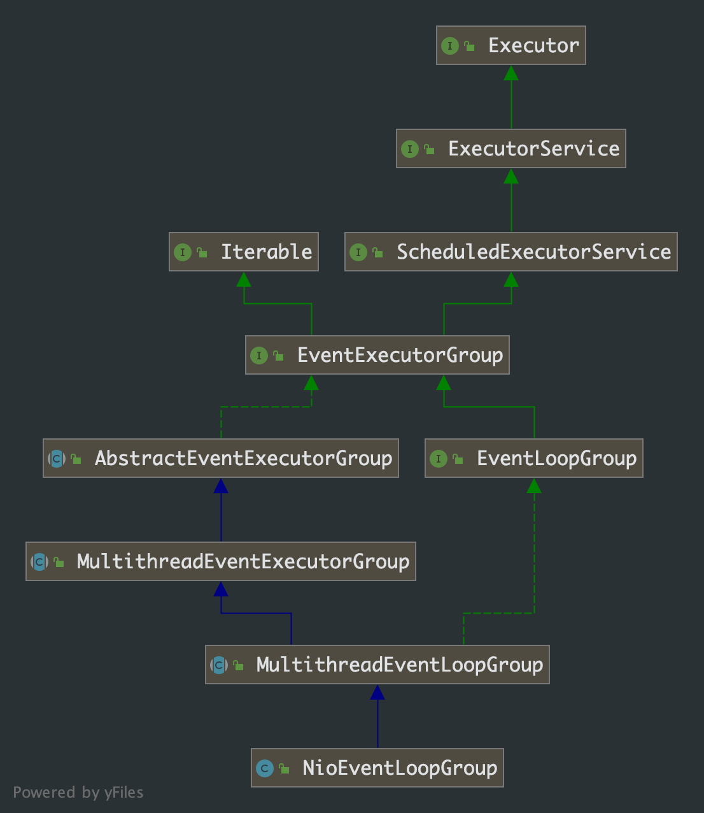

## 第 4 章 NioEventLoopGroup 分析

### 4.1 NioEventLoopGroup 类图



从 `NioEventLoopGroup`  的类继承关系中，我们知道 `NioEventLoopGroup` 本质是一个线程池，并且继承 Java 并发包中的 `ScheduledExecutorService` 接口，所以 `NioEventLoopGroup` 除了具备一般的线程池功能外还具备周期性调度线程的能力。

### 4.2 源码分析

我们看下抽象类 `AbstractEventExecutorGroup`，其中包含了我们熟悉的 `submit`、`execute` 方法，还有`schedule`、`scheduleAtFixedRate`、`scheduleWithFixedDelay`定时调度方法。源码分析中，我们发现上述方法没有被重写，这意味着子类或扩展抽象类执行任务提交或任务调度最终都会调用到`AbstractEventExecutorGroup`中的方法。

```java
public abstract class AbstractEventExecutorGroup implements EventExecutorGroup {
    @Override
    public Future<?> submit(Runnable task) {
        return next().submit(task);
    }

    @Override
    public <T> Future<T> submit(Runnable task, T result) {
        return next().submit(task, result);
    }

    @Override
    public <T> Future<T> submit(Callable<T> task) {
        return next().submit(task);
    }

    @Override
    public ScheduledFuture<?> schedule(Runnable command, long delay, TimeUnit unit) {
        return next().schedule(command, delay, unit);
    }

    @Override
    public <V> ScheduledFuture<V> schedule(Callable<V> callable, long delay, TimeUnit unit) {
        return next().schedule(callable, delay, unit);
    }

    @Override
    public ScheduledFuture<?> scheduleAtFixedRate(Runnable command, long initialDelay, long period, TimeUnit unit) {
        return next().scheduleAtFixedRate(command, initialDelay, period, unit);
    }

    @Override
    public ScheduledFuture<?> scheduleWithFixedDelay(Runnable command, long initialDelay, long delay, TimeUnit unit) {
        return next().scheduleWithFixedDelay(command, initialDelay, delay, unit);
    }

    ....

    @Override
    public void execute(Runnable command) {
        next().execute(command);
    }
}
```

从源码中我们还可以发现，`AbstractEventExecutorGroup` 通过调用接口`EventExecutorGroup` 的 `next`方法获得`EventExecutor`来执行。

```java
public interface EventExecutorGroup extends ScheduledExecutorService, Iterable<EventExecutor> {
		...
    /**
     * Returns one of the {@link EventExecutor}s managed by this {@link EventExecutorGroup}.
     */
    EventExecutor next();
  	...
}
```

`next`方法需要在子类中实现，根据类图关系，我们可以找到最终的实现方法`MultithreadEventExecutorGroup.next()`，虽然`MultithreadEventLoopGroup`抽象类中也实现了该方法，但只是调用父类方法即最终还是调用了`MultithreadEventExecutorGroup`的`next`方法。

```java
public abstract class MultithreadEventExecutorGroup extends AbstractEventExecutorGroup {
    private final EventExecutorChooserFactory.EventExecutorChooser chooser;
    @Override
    public EventExecutor next() {
        return chooser.next();
    }
}
```

这里我们能知道，`chooser`是挑选出一个执行线程来执行任务。至于具体`chooser`如何实现我们先放着。

到这里我们对 `NioEventLoopGroup`类有了比较深刻理解：`NioEventLoopGroup` 维护了一组线程资源，当有任务被提交或周期性任务需要被执行时，就依据某种算法从线程资源中挑选一个来执行任务。

自然而然，我们就面临着以下问题：

- 何时何处触发任务提交
- `NioEventLoopGroup`如何维护维护线程资源
- 线程的挑选算法


我们带着上面三个问题继续看源码，这里我们从创建`NioEventLoopGroup`的实例对象跟踪 debug 源码。

```java
NioEventLoopGroup workers = new NioEventLoopGroup();
```

我们一步步跟踪下来，`new`方法最终调用到

```java
public NioEventLoopGroup(int nThreads, Executor executor, final SelectorProvider selectorProvider,
                             final SelectStrategyFactory selectStrategyFactory) {
        super(nThreads, executor, selectorProvider, selectStrategyFactory, RejectedExecutionHandlers.reject());
}
```

继而调用到父类`MultithreadEventLoopGroup`的构造方法

```java
public abstract class MultithreadEventLoopGroup extends MultithreadEventExecutorGroup implements EventLoopGroup {
    private static final int DEFAULT_EVENT_LOOP_THREADS;
    static {
        DEFAULT_EVENT_LOOP_THREADS = Math.max(1, SystemPropertyUtil.getInt(
                "io.netty.eventLoopThreads", NettyRuntime.availableProcessors() * 2));
        if (logger.isDebugEnabled()) {
            logger.debug("-Dio.netty.eventLoopThreads: {}", DEFAULT_EVENT_LOOP_THREADS);
        }
    }

    /**
     * @see MultithreadEventExecutorGroup#MultithreadEventExecutorGroup(int, Executor, Object...)
     */
    protected MultithreadEventLoopGroup(int nThreads, Executor executor, Object... args) {
        super(nThreads == 0 ? DEFAULT_EVENT_LOOP_THREADS : nThreads, executor, args);
    }
}
```

从构造方法里我们也得知，`nThreads` 线程数参数，如果构造方法里没传的话，会使用`io.netty.eventLoopThreads`配置的数据，如果这也没有，则取 CPU 核心数的两倍作为默认值。

***由此我们知道了，`NioEventLoopGroup`维护了一组线程资源，线程的数量如果没有指定或配置，则使用两倍CPU 核心数。***

继续跟踪`NioEventLoopGroup`的初始化方法，跟踪到`MultithreadEventExecutorGroup`抽象类中，如下：

```java
public abstract class MultithreadEventExecutorGroup extends AbstractEventExecutorGroup {
  	private final EventExecutor[] children;
    private final Set<EventExecutor> readonlyChildren;
    private final AtomicInteger terminatedChildren = new AtomicInteger();
    private final Promise<?> terminationFuture = new DefaultPromise(GlobalEventExecutor.INSTANCE);
    private final EventExecutorChooserFactory.EventExecutorChooser chooser;
		
  	/**
     * Create a new instance.
     *
     * @param nThreads          the number of threads that will be used by this instance.
     * @param executor          the Executor to use, or {@code null} if the default should be used.
     * @param args         arguments which will passed to each {@link #newChild(Executor, Object...)} call
     */
    protected MultithreadEventExecutorGroup(int nThreads, Executor executor, Object... args) {
      	/**
      	 * 这里的 DefaultEventExecutorChooserFactory.INSTANCE，就是我们上面问题中线程资源的挑选算法。
      	 * 并且该类使用了懒汉模式的单例模式
      	 */
        this(nThreads, executor, DefaultEventExecutorChooserFactory.INSTANCE, args);
    }

    /**
     * Create a new instance.
     *
     * @param nThreads          the number of threads that will be used by this instance.
     * @param executor          the Executor to use, or {@code null} if the default should be used.
     * @param chooserFactory    the {@link EventExecutorChooserFactory} to use.
     * @param args           arguments which will passed to each {@link #newChild(Executor, Object...)} call
     */
    protected MultithreadEventExecutorGroup(int nThreads, Executor executor,
                                            EventExecutorChooserFactory chooserFactory, Object... args) {
        // nThreads 参数，指定线程资源的数量
      	if (nThreads <= 0) {
            throw new IllegalArgumentException(String.format("nThreads: %d (expected: > 0)", nThreads));
        }
				// 我们初始构造方法中没指定线程池，则这里是 null 值
        if (executor == null) {
            executor = new ThreadPerTaskExecutor(newDefaultThreadFactory());
        }
				// 线程资源数组，由此我们知道是使用数组来管理线程资源的
        children = new EventExecutor[nThreads];

      	/**
      	 * 初始化线程
      	 * 这里与 Java 中线程池的不同之处：Java 线程池是直到真正开始使用才初始化线程(当然也可以提前初始化)。
      	 */
        for (int i = 0; i < nThreads; i ++) {
            boolean success = false;
            try {
              	// newChild 方法才最终调用线程初始化方法，具体请看下面
                children[i] = newChild(executor, args);
                success = true;
            } catch (Exception e) {
                // TODO: Think about if this is a good exception type
                throw new IllegalStateException("failed to create a child event loop", e);
            } finally {
              	// 线程资源初始化失败，则将它们关闭掉
                if (!success) {
                    for (int j = 0; j < i; j ++) {
                        children[j].shutdownGracefully();
                    }

                    for (int j = 0; j < i; j ++) {
                        EventExecutor e = children[j];
                        try {
                            while (!e.isTerminated()) {
                                e.awaitTermination(Integer.MAX_VALUE, TimeUnit.SECONDS);
                            }
                        } catch (InterruptedException interrupted) {
                            // Let the caller handle the interruption.
                            Thread.currentThread().interrupt();
                            break;
                        }
                    }
                }
            }
        }

      	/**
      	 * 这里的 chooserFactory 就是 DefaultEventExecutorChooserFactory
      	 * 根据 NioEventLoop 的数量选择具体的线程选择算法
      	 */
        chooser = chooserFactory.newChooser(children);

        final FutureListener<Object> terminationListener = new FutureListener<Object>() {
            @Override
            public void operationComplete(Future<Object> future) throws Exception {
                if (terminatedChildren.incrementAndGet() == children.length) {
                    terminationFuture.setSuccess(null);
                }
            }
        };
				
      	// 线程注册终止监听
        for (EventExecutor e: children) {
            e.terminationFuture().addListener(terminationListener);
        }

        Set<EventExecutor> childrenSet = new LinkedHashSet<EventExecutor>(children.length);
        Collections.addAll(childrenSet, children);
        readonlyChildren = Collections.unmodifiableSet(childrenSet);
    }
}
```

由上面的分析，线程初始化调用`MultithreadEventExecutorGroup.newChild(...)`方法，该方法是抽象方法，在`NioEventLoopGroup`中进行具体实现

```java
public class NioEventLoopGroup extends MultithreadEventLoopGroup {
    @Override
    protected EventLoop newChild(Executor executor, Object... args) throws Exception {
        EventLoopTaskQueueFactory queueFactory = args.length == 4 ? (EventLoopTaskQueueFactory) args[3] : null;
        return new NioEventLoop(this, executor, (SelectorProvider) args[0],
            ((SelectStrategyFactory) args[1]).newSelectStrategy(), (RejectedExecutionHandler) args[2], queueFactory);
    }
}
```

***在这里我们终于见到了线程资源的具体形式：`NioEventLoop`。***`NioEventLoop`的具体分析将在后面的章节分析。

构造函数传递的相关参数：`SelectProvider`是默认方法 `SelectorProvider.provider()`生成的，从名字我们也很容易知道是 `Selector`选择器提供者。

### 4.3 问题

关于上面的三个问题，目前我们还有一个没有解决：何时何处向线程池`NioEventLoopGroup`提交任务，后面章节分析。

