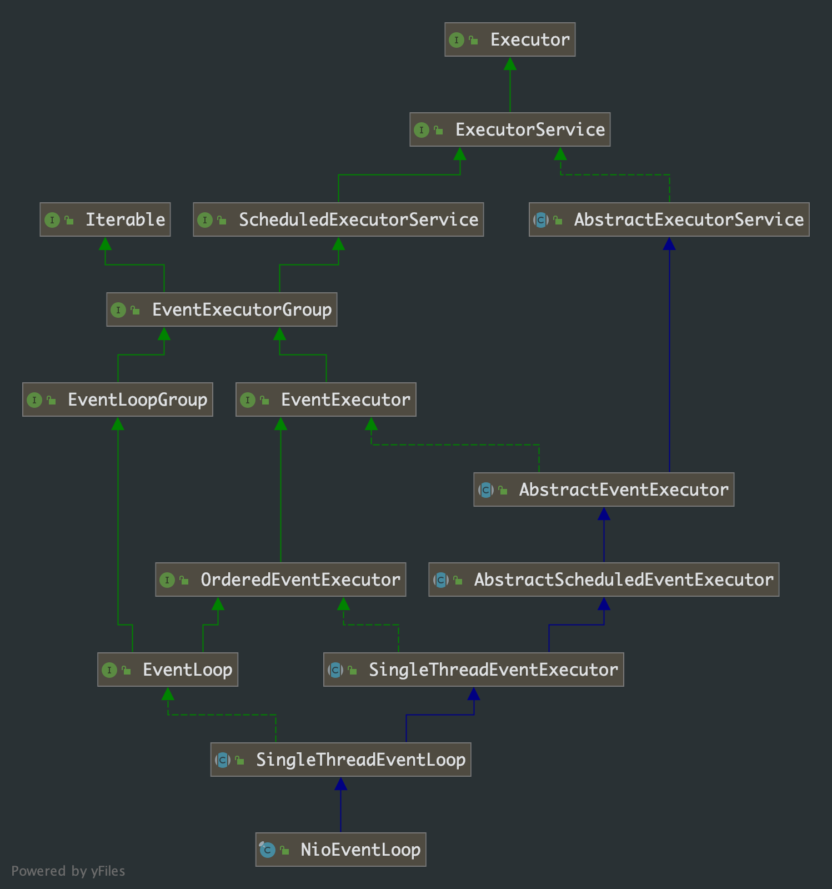
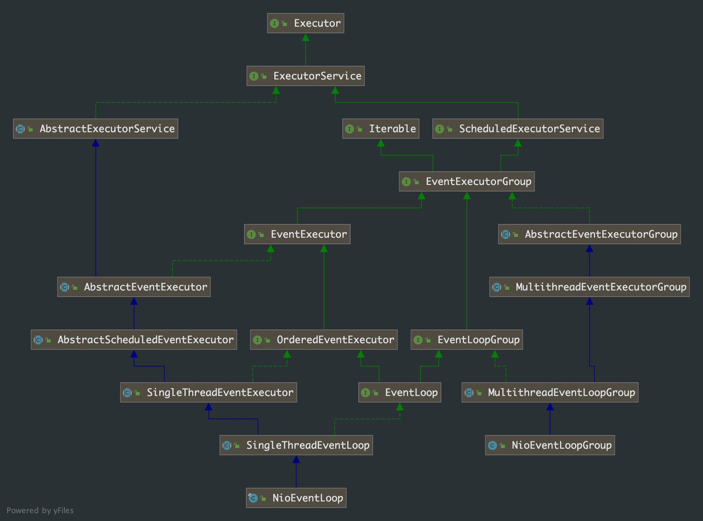

## 第 5 章 NioEventLoop 分析

### 5.1 NioEventLoop 类图

在第 4 章里，我们知道了 NioEventLoop 本质就是一个线程资源，我们来看下类的继承关系：



从类图中，我们可以发现 NioEventLoop 的还是比较复杂的，通过源码我们可以发现 `SingleThreadEventExecutor`在`NioEventLoop`的类关系中是一个重要的抽象类，该类名也表明了是一个单线程的 `EventExecutor`。

`NioEventLoop`和上一章的`NioEventLoopGroup`有部分重叠的类，我们看它们的共同类图：



我们结合代码分析上面这张类图中涉及公共部分，我们可以发现：

- `NioEventLoop`是接口`EventLoop`的实现类
- `EventLoop`是接口`EventLoopGroup`  的子接口
- `NioEventLoopGroup`是`EventLoopGroup`的实现类
- `NioEventLoop` 和 `NioEventLoopGroup`从类的继承关系上，都继承了`ScheduledExecutorService`接口，提供了周期性调度任务的能力
- 在上一章中，我们分析出`NioEventLoopGroup`使用数组的方式管理一批`NioEventLoop`对象
- 分析`NioEventLoop`左边部分，`NioEventLoop`是一个单线程的 ***EventExecutor***——通过 ***Thread*** 来执行任务，***Thread***对象在`SingleThreadEventExecutor`中

### 5.2 源码分析

`NioEventLoop`虽然复杂，但其本质是一个单线程的线程池资源。我们直接看它入口方法—— `run`，代码如下：

```java
@Override
protected void run() {
  for (;;) {
    try {
      try {
        switch (selectStrategy.calculateStrategy(selectNowSupplier, hasTasks())) {
          case SelectStrategy.CONTINUE:
            continue;

          case SelectStrategy.BUSY_WAIT:
            // fall-through to SELECT since the busy-wait is not supported with NIO

          case SelectStrategy.SELECT:
            select(wakenUp.getAndSet(false));
            
            if (wakenUp.get()) {
              selector.wakeup();
            }
            // fall through
          default:
        }
      } catch (IOException e) {
        rebuildSelector0();
        handleLoopException(e);
        continue;
      }

      cancelledKeys = 0;
      needsToSelectAgain = false;
      final int ioRatio = this.ioRatio;
      if (ioRatio == 100) {
        try {
          processSelectedKeys();
        } finally {
          // Ensure we always run tasks.
          runAllTasks();
        }
      } else {
        final long ioStartTime = System.nanoTime();
        try {
          processSelectedKeys();
        } finally {
          // Ensure we always run tasks.
          final long ioTime = System.nanoTime() - ioStartTime;
          runAllTasks(ioTime * (100 - ioRatio) / ioRatio);
        }
      }
    } catch (Throwable t) {
      handleLoopException(t);
    }
    // Always handle shutdown even if the loop processing threw an exception.
    try {
      if (isShuttingDown()) {
        closeAll();
        if (confirmShutdown()) {
          return;
        }
      }
    } catch (Throwable t) {
      handleLoopException(t);
    }
  }
}
```

代码我们粗略的看下就会发现，方法体执行的逻辑就是在无限循环中执行任务

> Nio 单线程处理逻辑，参考下项目代码里的 NioServer 类

具体的逻辑先不深究，我们先看看该方法的调用链路：

`NioEventLoop.run()` --> `SingleThreadEventExecutor.doStartThread()` --> `SingleThreadEventExecuto.startThread()` --> `SingleThreadEventExecutor.execute(Runnable task)`

> methodA() --> methodB()，表示 methodB() 调用了 methodA() 方法。

```java
// 忽略其他的方法
public abstract class SingleThreadEventExecutor extends AbstractScheduledEventExecutor implements OrderedEventExecutor {
    @Override
    public void execute(Runnable task) {
        if (task == null) {
            throw new NullPointerException("task");
        }
				// 判断提交 task 的线程是否是 SingleThreadEventExecutor 关联的执行 thread
        boolean inEventLoop = inEventLoop();
        // task 任务入队
        addTask(task);
        if (!inEventLoop) {
          	// 触发 SingleThreadEventExecutor 关联的 thread 运行
            startThread();
            if (isShutdown()) {
                boolean reject = false;
                try {
                    if (removeTask(task)) {
                        reject = true;
                    }
                } catch (UnsupportedOperationException e) {
                }
                if (reject) {
                    reject();
                }
            }
        }

        if (!addTaskWakesUp && wakesUpForTask(task)) {
            wakeup(inEventLoop);
        }
    }
  
    private void startThread() {
      	// 如果线程没有启动，则标识线程状态属性置为 已启动；线程已经启动，则直接返回
        if (state == ST_NOT_STARTED) {
            if (STATE_UPDATER.compareAndSet(this, ST_NOT_STARTED, ST_STARTED)) {
                boolean success = false;
                try {
                    doStartThread();
                    success = true;
                } finally {
                    if (!success) {
                        STATE_UPDATER.compareAndSet(this, ST_STARTED, ST_NOT_STARTED);
                    }
                }
            }
        }
    }
  
  	/**
  	 * 由上面的分析，我们知道 doStartThread 方法，只是在第一次提交任务时执行
  	 */
    private void doStartThread() {
      	// 第一次执行时，thread 对象还没有分配，必定为 null
        assert thread == null;
      	/**
      	 * 这里 executor 对象，是创建 NioEventLoop 对象时由构造函数传递进来的并加了一层封装
      	 * 但这里 executor 对象 execute 方法还是调用了传入的 executor 对象的 execute 方法来执行
      	 * 结合我们上一章，我们知道 NioEventLoop 的创建是在 NioEventLoopGroup 初始化时完成的
         * 分析 NioEventLoopGroup 的初始化方法，不难知道 Executor 对象就是 ThreadPerTaskExecutor 对象
         * executor = new ThreadPerTaskExecutor(newDefaultThreadFactory())
         * 参看下面对 ThreadPerTaskExecutor 对象、newDefaultThreadFactory() 对的分析
      	 */
        executor.execute(new Runnable() {
            @Override
            public void run() {
              	// 这里将 DefaultThreadFactory 对象创建的 thread 对象赋值给 NioEventLoop 的属性 thread
              	// 即到这里才将 NioEventLoop 与线程实例对象进行了绑定
                thread = Thread.currentThread();
                if (interrupted) {
                    thread.interrupt();
                }

                boolean success = false;
                updateLastExecutionTime();
                try {
                  	// 由于 run 方式是 for(::)循环的
                    // 只要 run 方法被调用就线程就会一直运行下去直到遇到退出条件或异常状态退出
                    SingleThreadEventExecutor.this.run();
                    success = true;
                } catch (Throwable t) {
                    logger.warn("Unexpected exception from an event executor: ", t);
                } finally {
                    for (;;) {
                        int oldState = state;
                        if (oldState >= ST_SHUTTING_DOWN || STATE_UPDATER.compareAndSet(
                                SingleThreadEventExecutor.this, oldState, ST_SHUTTING_DOWN)) {
                            break;
                        }
                    }

                    // Check if confirmShutdown() was called at the end of the loop.
                    if (success && gracefulShutdownStartTime == 0) {
                        ....
                    }

                    try {
                        // Run all remaining tasks and shutdown hooks.
                        for (;;) {
                            if (confirmShutdown()) {
                                break;
                            }
                        }
                    } finally {
                        try {
                            cleanup();
                        } finally {
                            FastThreadLocal.removeAll();
                            STATE_UPDATER.set(SingleThreadEventExecutor.this, ST_TERMINATED);
                            threadLock.countDown();
                            if (logger.isWarnEnabled() && !taskQueue.isEmpty()) {
                                logger.warn("An event executor terminated with " +
                                        "non-empty task queue (" + taskQueue.size() + ')');
                            }
                            terminationFuture.setSuccess(null);
                        }
                    }
                }
            }
        });
    }
}
```

**ThreadPerTaskExecutor 对象 和 newDefaultThreadFactory() 分析 **

```java
protected ThreadFactory newDefaultThreadFactory() {
  // 这里的 getClass 根据调用关系可以判断就是 NioEventLoopGroup
  return new DefaultThreadFactory(getClass());
}

public final class ThreadPerTaskExecutor implements Executor {
    private final ThreadFactory threadFactory;

    public ThreadPerTaskExecutor(ThreadFactory threadFactory) {
        if (threadFactory == null) {
            throw new NullPointerException("threadFactory");
        }
        this.threadFactory = threadFactory;
    }

    @Override
    public void execute(Runnable command) {
      	// 这里的 threadFactory 就是 DefaultThreadFactory 实例，这里就是创建一个线程实例对象，由线程对象来执行 runnable
        threadFactory.newThread(command).start();
    }
}

@Override
public Thread newThread(Runnable r) {
  Thread t = newThread(FastThreadLocalRunnable.wrap(r), prefix + nextId.incrementAndGet());
  try {
    if (t.isDaemon() != daemon) {
      t.setDaemon(daemon);
    }

    if (t.getPriority() != priority) {
      t.setPriority(priority);
    }
  } catch (Exception ignored) {
    // Doesn't matter even if failed to set.
  }
  return t;
}
```

到这里我们就比较清楚 `NioEventLoop`内部方法的调用链路了，我们现在面临的问题是 `NioEventLoop.execute(Runnable task)`方法被谁调用了？

如果对上一章分析 `NioEventLoopGroup`还记得比较清楚的话，就会知道 `NioEventLoopGroup`内部使用数组维护 `NioEventLoop`资源，通过一定的挑选算法来选出一个 `NioEventLoop`来执行 `runnable`。

调用方法就是 `AbstractEventExecutorGroup.execute(Runnable command)`。

### 5.3 问题

所以我们接下来分析的重点就是 ：

- NioEventLoop.execute(Runnable task) 方法被谁调用了？
-  NioEventLoopGroup(NioEventLoopGroup 是 AbstractEventExecutorGroup 实现类) 的 execute 方法是被谁在什么时机触发的？

这个问题有回到第 4 章最后的问题上了。