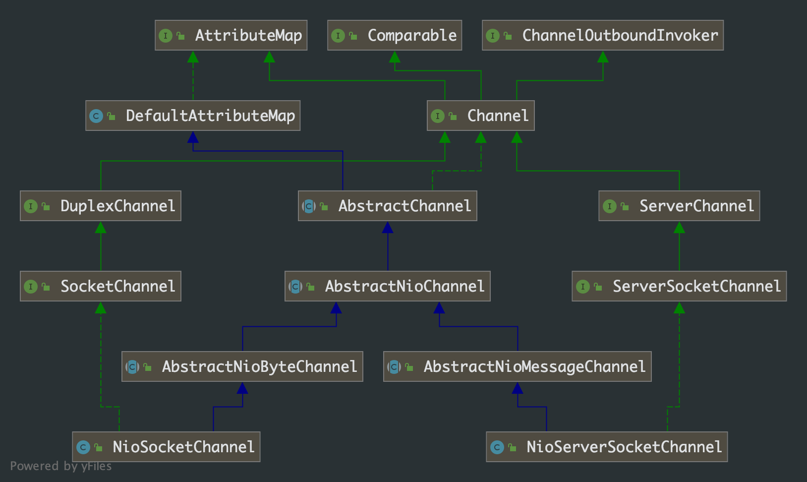

## 第 6 章 ServerBootstrap分析

### 6.1 ServerBootstrap 类图


从类图中，我们也能发现 ServerBootstrap 类与 NioEventLoop 和 NioEventLoopGroup 相比，是比较简单和容易理解的。

### 6.2 ServerBootstrap 类的使用

```java
public class NettyServer {

    private static final int PORT = 8088;

    public static void main(String[] args) {
        NioEventLoopGroup boss = new NioEventLoopGroup(1);
        NioEventLoopGroup workers = new NioEventLoopGroup();

        ServerBootstrap serverBootstrap = new ServerBootstrap();
        serverBootstrap.group(boss, workers)
                .channel(NioServerSocketChannel.class)
                .childHandler(new ChannelInitializer<>() {
                    @Override
                    protected void initChannel(Channel ch) throws Exception {
                        ch.pipeline().addLast(new ServerHandler());
                    }
                });

        serverBootstrap.bind(PORT).addListener(future -> {
            System.out.println("服务器启动，等待连接中......");
        });
    }

}
```

结合 ServerBootstrap 类的使用和类中的方法，我们知道 ServerBootstrap 类主要作用是在初始化时给各个属性赋值。我们挑选其中重要的几个方法来讲

```java
public ServerBootstrap group(EventLoopGroup parentGroup, EventLoopGroup childGroup) {
  super.group(parentGroup);
  ObjectUtil.checkNotNull(childGroup, "childGroup");
  if (this.childGroup != null) {
    throw new IllegalStateException("childGroup set already");
  }
  this.childGroup = childGroup;
  return this;
}
```

根据方法中的注解说明并结合 Reactor 线程模型，我们可以明确 parentGroup 用于接受连接，childGroup 线程用于处理连接上的读写请求等。

```java
public B channel(Class<? extends C> channelClass) {
  return channelFactory(
    new ReflectiveChannelFactory<C>(ObjectUtil.checkNotNull(channelClass,"channelClass"))
  );
}
```

结合 Reactor 线程模型，这个方法用于服务端等效于 Nio 中设置 ServerSocketChannel 实例，用于接受 http 客户端的接入。

### 6.3 ServerBootstrap 启动分析

在分析之前先看下比较重要的几个类的类图:



从名字 NioServerSocketChannel、NioSocketChannel 我们也能看出它们一个就是服务端用户接收客户端连接的 Channel 和一个表示客户端的连接 Channel。

我们接下来分析下 ServerBootstrap 的启动流程，入口方法 `bind`

```java
serverBootstrap.bind(PORT);
```

一路跟踪下来，最终调用到`AbstractBootstrap.doBind(final SocketAddress localAddress)` 方法

```java
private ChannelFuture doBind(final SocketAddress localAddress) {
  final ChannelFuture regFuture = initAndRegister();
  // 此处的 channel 是服务端 channel
  final Channel channel = regFuture.channel();
  if (regFuture.cause() != null) {
    return regFuture;
  }

  if (regFuture.isDone()) {
    ChannelPromise promise = channel.newPromise();
    doBind0(regFuture, channel, localAddress, promise);
    return promise;
  } else {
    final PendingRegistrationPromise promise = new PendingRegistrationPromise(channel);
    regFuture.addListener(new ChannelFutureListener() {
      @Override
      public void operationComplete(ChannelFuture future) throws Exception {
        Throwable cause = future.cause();
        if (cause != null) {
          promise.setFailure(cause);
        } else {
          promise.registered();
          doBind0(regFuture, channel, localAddress, promise);
        }
      }
    });
    return promise;
  }
}

final ChannelFuture initAndRegister() {
  Channel channel = null;
  try {
    /**
     * 这里的 channelFactory 就是上面 channel() 方法里 ReflectiveChannelFactory<C>
     * 其中泛型 C 就是 NioServerSocketChannel.class
     * newChannel()方法就是反射调用 NioServerSocketChannel 的构造方法
     */
    channel = channelFactory.newChannel();
    // 这个方法
    init(channel);
  } catch (Throwable t) {
    if (channel != null) {
      channel.unsafe().closeForcibly();
      return new DefaultChannelPromise(channel, GlobalEventExecutor.INSTANCE).setFailure(t);
    }
    return new DefaultChannelPromise(new FailedChannel(), GlobalEventExecutor.INSTANCE).setFailure(t);
  }
	/**
   * 这里的 group() 得到的就是 bossGroup
   * 这里的 bossGroup 是资源池，里面只有一个 NioEventLoop
   * 这里就是将服务端的 NioServerSocketChannel 与 bossGroup 里的 NioEventLoop 绑定起来
   * 这个 NioEventLoop 资源专门用于处理 NioServerSocketChannel 的各种事件、任务
   * 这里会触发线程资源，具体分析看下面
   */
  ChannelFuture regFuture = config().group().register(channel);
  if (regFuture.cause() != null) {
    if (channel.isRegistered()) {
      channel.close();
    } else {
      channel.unsafe().closeForcibly();
    }
  }
  return regFuture;
}

@Override
void init(Channel channel) {
  // 给 NioServerSocketChannel 设置各种属性值
  setChannelOptions(channel, options0().entrySet().toArray(newOptionArray(0)), logger);
  setAttributes(channel, attrs0().entrySet().toArray(newAttrArray(0)));

  ChannelPipeline p = channel.pipeline();

  // 这里的属性值就和 NioServerSocketChannel 接受的http连接 NioSocketChannel 有关了
  final EventLoopGroup currentChildGroup = childGroup;
  final ChannelHandler currentChildHandler = childHandler;
  final Entry<ChannelOption<?>, Object>[] currentChildOptions =
    childOptions.entrySet().toArray(newOptionArray(0));
  final Entry<AttributeKey<?>, Object>[] currentChildAttrs = childAttrs.entrySet().toArray(newAttrArray(0));

  p.addLast(new ChannelInitializer<Channel>() {
    @Override
    public void initChannel(final Channel ch) {
      // ch 指的就是 NioServerSocketChannel 的对象
      final ChannelPipeline pipeline = ch.pipeline();
      /*
       * 这里的 config 指定是 ServerBootstrapConfig
       * handler() 获取的是指定作用在 NioServerSocketChannel 上的 ChannelHandler。我们代码里没写，这里就是空值
       */
      ChannelHandler handler = config.handler();
      if (handler != null) {
        pipeline.addLast(handler);
      }

      ch.eventLoop().execute(new Runnable() {
        @Override
        public void run() {
          pipeline.addLast(new ServerBootstrapAcceptor(
            ch, currentChildGroup, currentChildHandler, currentChildOptions, currentChildAttrs));
        }
      });
    }
  });
}
```

### 6.4 线程资源的触发

我们回顾下上一章的问题，这里我们可以明确的回答，NioEventLoop 的 execute 方法被调用的时机就是在 ServerBootstrap 的bind() 的初始化流程中。具体的请看这行方法：

```java
ChannelFuture regFuture = config().group().register(channel);
```

这里的 `config()`方法得到是服务器端的config，即 ServerBootstrapConfig 对象。

`Group()`方法得到是用于处理服务端 ServerSocketChannel 对象的连接事件的线程资源，即我们代码里 

NioEventLoopGroup bossGroup = new NioEventLoopGroup(1)，new 出来的对象。我们来仔细分析下 register(Channel) 方法。

```java
/**
 * NioEventLoopGroup 是抽象类 MultithreadEventLoopGroup 的子类
 * 分析时不要忘记 NioEventLoopGroup 的类图
 */
public abstract class MultithreadEventLoopGroup extends MultithreadEventExecutorGroup implements EventLoopGroup {
	  @Override
    public ChannelFuture register(Channel channel) {
      	/**
      	 * next()方法我们在前面章节中有讲，忘记的可以往前翻翻
      	 * 由于我们在new 对象时，赋值是 1，意味着线程资源只有一个即 next()方法只有一个 NioEventLoop 对象可以选择
      	 * NioEventLoop 与 NioEventLoopGroup 的关系，看名字就能知晓，如果还不清楚，可以翻翻第5章的内容
      	 */
        return next().register(channel);
    }
}
```

```java
/**
 * 这里调用的是 NioEventLoop 的 register 方法，对象主体已经是 NioEventLoop
 */
public abstract class SingleThreadEventLoop extends SingleThreadEventExecutor implements EventLoop { 		
		@Override
    public ChannelFuture register(Channel channel) {
      	/**
         * 由于我们是服务端调用，这里的 channel 指的是 NioServerSocketChannel 对象
         * this 指的是对象本身，即 NioEventLoop 对象
         * new DefaultChannelPromise() 方法，本质是将 channel 和 nioeventLoop 对象进行绑定
         * 这么做的目的是：在 channel 的生命周期内，它只会被交给一个 NioEventLoop 对象进行处理，这样就避免线程的切换
         */
        return register(new DefaultChannelPromise(channel, this));
    }
  
  	@Override
    public ChannelFuture register(final ChannelPromise promise) {
        ObjectUtil.checkNotNull(promise, "promise");
      	/**
      	 * channel() 方法得到就是 NioServerSocketChannel 对象
      	 * unsafe() 方法的调用路径一路追踪到抽象类 AbstractNioChannel 对象中，继而发现调用的 AbstractChannel 中的方法
      	 */
        promise.channel().unsafe().register(this, promise);
        return promise;
    }
  
}
```


```java
public abstract class AbstractChannel extends DefaultAttributeMap implements Channel {
    @Override
    public final void register(EventLoop eventLoop, final ChannelPromise promise) {
      if (eventLoop == null) {
        throw new NullPointerException("eventLoop");
      }
      if (isRegistered()) {
        promise.setFailure(new IllegalStateException("registered to an event loop already"));
        return;
      }
      if (!isCompatible(eventLoop)) {
        promise.setFailure(
          new IllegalStateException("incompatible event loop type: " + eventLoop.getClass().getName()));
        return;
      }

      AbstractChannel.this.eventLoop = eventLoop;

      /**
       * if (eventLoop.inEventLoop()) {
       *     doSomething();
       * } else {
       *     eventLoop.execute(new Runnable() {
       *         doSomething();
       *     }
       * }
       * 我们在阅读 netty 源码的时候可以发现上面的代码结构大量出现
       * 这代码主要就是让 eventLoop 线程资源“干活”！
       * 如果是其他线程让 eventLoop “干活”，则需要把任务提交到 eventLoop 的任务队列中，具体如何调度由 eventLoop 自己负责
       * 如果是 eventLoop 自身运行这段逻辑，则直接处理，不需要在添加到任务队列中
       */
      if (eventLoop.inEventLoop()) {
        register0(promise);
      } else {
        try {
         	/**
           * 这里进行了任务提交，首次向 NioEventLoop 提交任务，到这里我们解答了上一章的问题。
           * 这里会调用到 SingleThreadEventExecutor.execute() 方法，关于该方法的分析参考第 5 章的内容
           * 继而触发了 NioEventLoop.run() 方法，run 方法是 for(::) 循环的
           * 这里的 Runnable 会放入到 NioEventLoop 的任务队列中
           */
          eventLoop.execute(new Runnable() {
            @Override
            public void run() {
              register0(promise);
            }
          });
        } catch (Throwable t) {
          logger.warn(
            "Force-closing a channel whose registration task was not accepted by an event loop: {}",
            AbstractChannel.this, t);
          closeForcibly();
          closeFuture.setClosed();
          safeSetFailure(promise, t);
        }
      }
    }
}
```


关于 AbstractChannel 我们有必要看以下：

```java
/**
 * AbstractChannel 是 NioServerSocketChannel 和 NioSocketChannel 的底层抽象类
 * 该类涉及到大量的线程 socket 操作的底层属性信息
 * 其中需要子类覆写的 newUnsafe()，需要各子类中实现，Unsafe 类才是真正操作底层 socket 连接的入口类
 * 根据类图关系针对 NioServerSocketChannel 而言，newUnsafe() 方法在 AbstractNioMessageChannel 中被覆写，使用内部类 AbstractNioMessageChannel
 */
public abstract class AbstractChannel extends DefaultAttributeMap implements Channel {

    private static final InternalLogger logger = InternalLoggerFactory.getInstance(AbstractChannel.class);

    private final Channel parent;
    private final ChannelId id;
    private final Unsafe unsafe;
    private final DefaultChannelPipeline pipeline;
    private final VoidChannelPromise unsafeVoidPromise = new VoidChannelPromise(this, false);
    private final CloseFuture closeFuture = new CloseFuture(this);

    private volatile SocketAddress localAddress;
    private volatile SocketAddress remoteAddress;
    private volatile EventLoop eventLoop;
    private volatile boolean registered;
    private boolean closeInitiated;
    private Throwable initialCloseCause;

    /** Cache for the string representation of this channel */
    private boolean strValActive;
    private String strVal;
  	
  	/**
     * Create a new {@link AbstractUnsafe} instance which will be used for the life-time of the {@link Channel}
     */
    protected abstract AbstractUnsafe newUnsafe();
  	......
}
```

