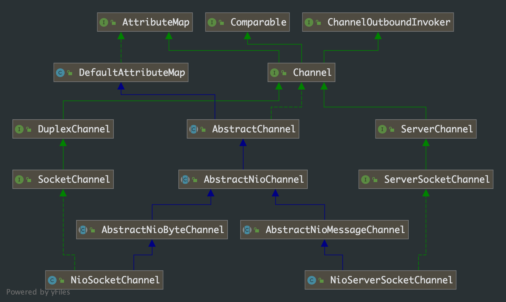

## 第 7 章 Netty 线程模型的运行

### 7.1 服务端源码分析

在上一章中我们知道在 ServerBootstrap 的 bind()流程中注册 NioServerSocketChannel

```java
ChannelFuture regFuture = config().group().register(channel);
```

源码分析中我们发现最终是调用了 register0() 这个方法，

```java
public abstract class AbstractChannel extends DefaultAttributeMap implements Channel {
  private void register0(ChannelPromise promise) {
    try {
      if (!promise.setUncancellable() || !ensureOpen(promise)) {
        return;
      }
      boolean firstRegistration = neverRegistered;
      doRegister();
      neverRegistered = false;
      registered = true;
      
      pipeline.invokeHandlerAddedIfNeeded();

      safeSetSuccess(promise);
      pipeline.fireChannelRegistered();
      if (isActive()) {
        if (firstRegistration) {
          pipeline.fireChannelActive();
        } else if (config().isAutoRead()) {
          beginRead();
        }
      }
    } catch (Throwable t) {
      closeForcibly();
      closeFuture.setClosed();
      safeSetFailure(promise, t);
    }
  }
}
```

代码跟踪，`doRegister()`方法在 AbstractNioChannel 类中

```java
public abstract class AbstractNioChannel extends AbstractChannel {
	@Override
  protected void doRegister() throws Exception {
    boolean selected = false;
    for (;;) {
      try {
        /**
         * 到这里我们就有种似曾相识的感觉，和我们使用nio的实现非常像，我们debug进去看看
         * 这个地方我们可以确认和nio 实现方式是一致的，都是调用了 nio 的底层实现
         */
        selectionKey = javaChannel().register(eventLoop().unwrappedSelector(), 0, this);
        return;
      } catch (CancelledKeyException e) {
        if (!selected) {
          // Force the Selector to select now as the "canceled" SelectionKey may still be
          // cached and not removed because no Select.select(..) operation was called yet.
          eventLoop().selectNow();
          selected = true;
        } else {
          // We forced a select operation on the selector before but the SelectionKey is still cached
          // for whatever reason. JDK bug ?
          throw e;
        }
      }
    }
  }
}
```

***但是在这里我们遇到了一个新的问题：nio 中服务端的 ServerSocketChannel 注册 selector 是使用的是 SelectionKey.OP_ACCEPT(这个值是 16)，而这里服务端 channel 注册 selector 使用的是 0。如果是 intOps这和我们的认知有些差距，我们先保留问题，继续分析源码***

### 7.2 NioServerSocketChannel 源码分析

我们带着上面的问题来分析 NioServerSocketChannel



有上面的分析我们知道在 doRegister0() 的代码逻辑里，针对 NioServerSocketChannel  register 时 interestOps 是 0，没有使用 SelectionKey.OP_CONNECT，有 Reactor 线程模型我们知道 NioServerSocketChannel 必须针对 SelectionKey.OP_CONNECT 才能接受客户端的连接，那 Netty 是在哪里处理 SelectionKey.OP_CONNECT 的呢？

我们看一下 AbstractNioChannel 的源码

```java
public abstract class AbstractNioChannel extends AbstractChannel {
  
    private final SelectableChannel ch;
    protected final int readInterestOp;
    volatile SelectionKey selectionKey;
    boolean readPending;
  
 		......
    
   /**
     * Create a new instance
     *
     * @param parent      the parent {@link Channel} by which this instance was created. May be {@code null}
     * @param ch                the underlying {@link SelectableChannel} on which it operates
     * @param readInterestOp    the ops to set to receive data from the {@link SelectableChannel}
     * 这个构造方法表明在 new 一个实例时可以指定感兴趣的 SelectionKey 的事件
     * 根据上一章，我们知道 ServerBootstrap 的启动时会初始化一个 NioServerSocketChannel
     * 分析 NioServerSocketChannel 的初始化源码流程，我们可以知道在初始化时就赋值了 SelectionKey.OP_ACCEPT
     * 具体代码看 NioServerSocketChannel 的源码
     */
    protected AbstractNioChannel(Channel parent, SelectableChannel ch, int readInterestOp) {
        super(parent);
        this.ch = ch;
      	// 这里如果是 NioServerSocketChannel 的话，就是 SelectionKey.OP_ACCEPT
        this.readInterestOp = readInterestOp;
        try {
          	// 设置为非阻塞
            ch.configureBlocking(false);
        } catch (IOException e) {
            try {
                ch.close();
            } catch (IOException e2) {
                logger.warn("Failed to close a partially initialized socket.", e2);
            }
            throw new ChannelException("Failed to enter non-blocking mode.", e);
        }
    }

  	@Override
    protected void doRegister() throws Exception {
        boolean selected = false;
        for (;;) {
            try {
                selectionKey = javaChannel().register(eventLoop().unwrappedSelector(), 0, this);
                return;
            } catch (CancelledKeyException e) {
                if (!selected) {
                    eventLoop().selectNow();
                    selected = true;
                } else {
                    throw e;
                }
            }
        }
    }
  
    @Override
    protected void doBeginRead() throws Exception {
        // Channel.read() or ChannelHandlerContext.read() was called
        final SelectionKey selectionKey = this.selectionKey;
        if (!selectionKey.isValid()) {
            return;
        }

        readPending = true;

        final int interestOps = selectionKey.interestOps();
      	// 这里就将初始化的 SelectionKey 事件赋值给了 channel 的 interestOps
        if ((interestOps & readInterestOp) == 0) {
            selectionKey.interestOps(interestOps | readInterestOp);
        }
    }
  
}
```

到这里我们清楚的 NioServerSocketChannel 的 interestOps 的赋值两次操作。上一章节中我们在分析 NioEventLoop 的触发启动过程中随带分析出 NioServerSocketChannel 的 register 的过程，我们接下来分析 doBeginRead() 的触发过程。

借助 Idea 的进行 debug 调试分析，doBeginRead() 的调用路径：

```java
DefaultChannelPipeline.fireChannelActive() -> AbstractChannelHandlerContext.invokeChannelActive() -> AbstractChannelHandlerContext.invokeChannelActive() -> DefaultChannelPipeline$HeadContext.channelActive() -> DefaultChannelPipeline$HeadContext.readIfIsAutoRead() -> AbstractChannel.read() -> DefauleChannelPipeline.read() -> AbstractChannelHandlerContext.read() -> AbstractChannelHandlerContext.invokeRead() -> DefaultChannelPipeline$HeadContext.read() -> AbstractChannel$AbstaractUnsafe.beginRead() -> AbstractNioMessgaeChannel.doBeginRead() -> AbstractNioChannel.doBeginRead()
```

上面的调用链路看起来挺烦的，其实就是 `ChannelPipeline.fireChannelActive() `被调用了。根据调用链溯源，我们找到真正调用的地方

```java
public abstract class AbstractChannel extends DefaultAttributeMap implements Channel {
  protected abstract class AbstractUnsafe implements Unsafe {
  	@Override
    public final void bind(final SocketAddress localAddress, final ChannelPromise promise) {
      assertEventLoop();

      if (!promise.setUncancellable() || !ensureOpen(promise)) {
        return;
      }

      if (Boolean.TRUE.equals(config().getOption(ChannelOption.SO_BROADCAST)) &&
          localAddress instanceof InetSocketAddress &&
          !((InetSocketAddress) localAddress).getAddress().isAnyLocalAddress() &&
          !PlatformDependent.isWindows() && !PlatformDependent.maybeSuperUser()) {
        // Warn a user about the fact that a non-root user can't receive a
        // broadcast packet on *nix if the socket is bound on non-wildcard address.
        logger.warn(
          "A non-root user can't receive a broadcast packet if the socket " +
          "is not bound to a wildcard address; binding to a non-wildcard " +
          "address (" + localAddress + ") anyway as requested.");
      }

      boolean wasActive = isActive();
      try {
        doBind(localAddress);
      } catch (Throwable t) {
        safeSetFailure(promise, t);
        closeIfClosed();
        return;
      }

      if (!wasActive && isActive()) {
        /**
         * 这里的 invokerLater(Runnable task)方法
         * 代码分析发现还是调用了 eventLoop().execute(Runnable task)
         * 在我们的代码里就是 NioEventLoop，即将 task 提交到任务队列中
         */
        invokeLater(new Runnable() {
          @Override
          public void run() {
            // 这里是调用链路被触发的起点
            pipeline.fireChannelActive();
          }
        });
      }
      
      safeSetSuccess(promise);
    }
  }
}
```

Netty 的代码风格中 Unsafe 是真正涉及 Socket 的各种动作的，其他方法需要借助 Unsafe 来操作 Socket 的各种操作。借助 Idea 的 debug 功能，我们可以找到调用 Unsafe.bind() 方法的调用链：

```Java
AbstractChannel.bind() -> DefaultChannelPipeline.bind() -> AbstractChannelHandlerContext.bind() -> AbstractChannelHandlerContext.invokeBind() -> DefaultChannelPipeline$HeadContext.bind() -> AbstractChannel$AbstractUnsafe.bind()
  
public abstract class AbstractBootstrap<B extends AbstractBootstrap<B, C>, C extends Channel> implements Cloneable {
  private static void doBind0(
    final ChannelFuture regFuture, final Channel channel,
    final SocketAddress localAddress, final ChannelPromise promise) {

    /**
     * Netty 中提交 task 任务的经典写法
     */
    channel.eventLoop().execute(new Runnable() {
      @Override
      public void run() {
        if (regFuture.isSuccess()) {
          /**
           * 这里调用了 AbstractChannel.bind() -> AbstractChannel.AbstractUnsafe.bind()
           */
          channel.bind(localAddress, promise).addListener(ChannelFutureListener.CLOSE_ON_FAILURE);
        } else {
          promise.setFailure(regFuture.cause());
        }
      }
    });
  }
  
  private ChannelFuture doBind(final SocketAddress localAddress) {
    final ChannelFuture regFuture = initAndRegister();
    final Channel channel = regFuture.channel();
    if (regFuture.cause() != null) {
      return regFuture;
    }

    if (regFuture.isDone()) {
      // At this point we know that the registration was complete and successful.
      ChannelPromise promise = channel.newPromise();
      doBind0(regFuture, channel, localAddress, promise);
      return promise;
    } else {
      // Registration future is almost always fulfilled already, but just in case it's not.
      final PendingRegistrationPromise promise = new PendingRegistrationPromise(channel);
      regFuture.addListener(new ChannelFutureListener() {
        @Override
        public void operationComplete(ChannelFuture future) throws Exception {
          Throwable cause = future.cause();
          if (cause != null) {
            promise.setFailure(cause);
          } else {
            promise.registered();
						// channel 绑定 地址端口，并且更新注册成功的 channel 的感兴趣的事件
            doBind0(regFuture, channel, localAddress, promise);
          }
        }
      });
      return promise;
    }
  }
}
```

### 7.3 总结

结合前面几个章节，总结下服务端 NioServerSocketChannel 的注册要点

- ChannelFuture regFuture = config().group().register(channel) 方法的调用链，将 NioServerSocketChannel 注册到 Selector 上，并触发 NioEventLoop 运行
- doBind0(regFuture, channel, localAddress, promise) 方法将更新已经注册 channel 的感兴趣的事件