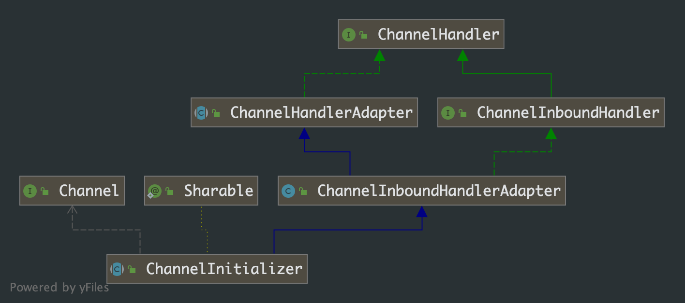
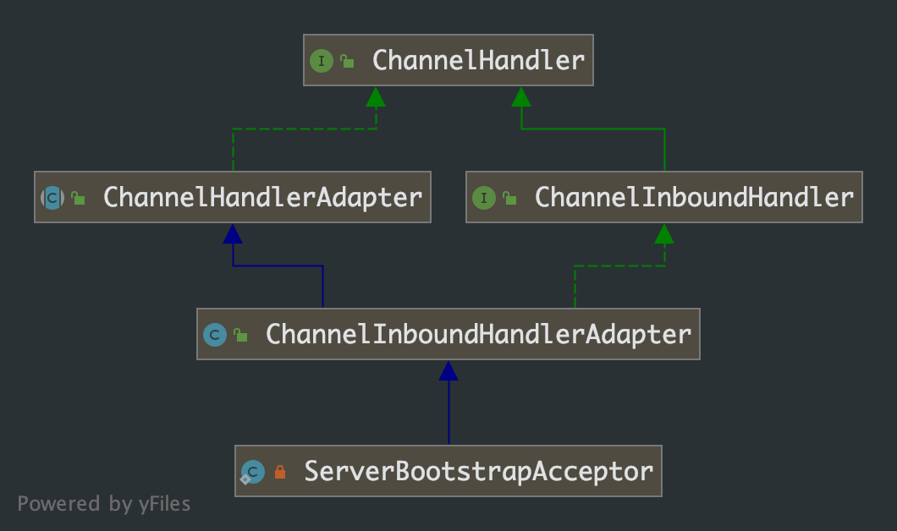

## 第 9 章 服务端处理客户端流程

前面几章节中，我们分析了服务端 ServerBootstrap 的启动过程、NioEventLoop 的触发以及运行、ServerSocketChannel 的初始化以及注册 Selector 的过程，还有最重要的就是服务端如何处理客户端的连接、读和写事件。这就是我们接下来需要分析的事情。

先看下服务端代码

```java
public static void main(String[] args) {
  NioEventLoopGroup boss = new NioEventLoopGroup(1);
  NioEventLoopGroup workers = new NioEventLoopGroup();

  ServerBootstrap serverBootstrap = new ServerBootstrap();
  serverBootstrap.group(boss, workers)
    .channel(NioServerSocketChannel.class)
    .handler(new ChannelInitializer<NioServerSocketChannel>() {
      @Override
      protected void initChannel(NioServerSocketChannel ch) throws Exception {
        System.out.println("进入boss 线程的 handler");
      }
    })
    .childHandler(new ChannelInitializer<NioSocketChannel>() {
      @Override
      protected void initChannel(NioSocketChannel ch) throws Exception {
        ch.pipeline().addLast("server-handler", new ServerHandler());
      }
    });

  serverBootstrap.bind(PORT).addListener(future -> {
    System.out.println("服务器启动，等待连接中......");
  });
}
```

### 9.1 ChannelHandler 的组装流程

ServerBootstrap 中的 childOption()、childAttr()、childHandler() 等方法，我们从名字上就能知道是针对客户端的连接的，在前几章分析 ServerBootstrap 的初始化流程中有有着一段代码，我们当时没有深究，现在来看看：

```java
public class ServerBootstrap extends AbstractBootstrap<ServerBootstrap, ServerChannel> {
  @Override
  void init(Channel channel) {
    setChannelOptions(channel, options0().entrySet().toArray(newOptionArray(0)), logger);
    setAttributes(channel, attrs0().entrySet().toArray(newAttrArray(0)));
		// 这里的 pipeline 是在 channel = channelFactory.newChannel(); 中分配的
    ChannelPipeline p = channel.pipeline();

    // childGroup 就是在服务端代码里的 workers
    final EventLoopGroup currentChildGroup = childGroup;
    // 服务端代码里的匿名 ChannelInitializer 类实例
    final ChannelHandler currentChildHandler = childHandler;
    final Entry<ChannelOption<?>, Object>[] currentChildOptions =
      childOptions.entrySet().toArray(newOptionArray(0));
    final Entry<AttributeKey<?>, Object>[] currentChildAttrs = childAttrs.entrySet().toArray(newAttrArray(0));

    // 在服务端 ChannelPipeline 处理链末尾添加一个 ChannelInitializer
    p.addLast(new ChannelInitializer<Channel>() {
      @Override
      public void initChannel(final Channel ch) {
        // 这里的 channel 指的是服务端 channel
        final ChannelPipeline pipeline = ch.pipeline();
        ChannelHandler handler = config.handler();
        // 这里处理的 handler 就是我们服务端代码中 handler()方法的代码(即打印输出代码)，针对的是服务端 channel
        if (handler != null) {
          pipeline.addLast(handler);
        }

        ch.eventLoop().execute(new Runnable() {
          @Override
          public void run() {
            /**
             * 这里的参数 childOption、ChildAttr 都是针对客户端连接的
             * 我们可以猜测 ServerBootstrapAcceptor 就和客户端 channel 有关了
             * 这个地方的 pipeline 指的任然给是服务端 channel 分配的 handlerPipeline
             */
            pipeline.addLast(new ServerBootstrapAcceptor(
              ch, currentChildGroup, currentChildHandler, currentChildOptions, currentChildAttrs));
          }
        });
      }
    });
  }
}
```

代码中涉及 ChannelPipeline、ChannelHandler、ChannelHandlerContext 相关的会简单分析下，具体的在后续章节分析。



从类和接口的继承关系，我们知道 ChannelInitializer 是 ChannelHandler 的实现

继续分析之前，以下几点我们就不详细分析了，直接告诉大家：

- ChannelPipeline 使用了默认实现类 DefaultChannelPipeline
- ServerBootstrap 初始化流程中初始化 ServerSocketChannel 实例时，会给它 channel 分配一个 channelPipeline


***ChannelPipeline.addLast(...) 分析***

```java
public class DefaultChannelPipeline implements ChannelPipeline {
  
  	// 保存未注册完成之前的 handler
    private PendingHandlerCallback pendingHandlerCallbackHead;
  
  @Override
  public final ChannelPipeline addLast(EventExecutorGroup group, String name, ChannelHandler handler) {
    final AbstractChannelHandlerContext newCtx;
    synchronized (this) {
      checkMultiplicity(handler);

      newCtx = newContext(group, filterName(name, handler), handler);

      addLast0(newCtx);
			
      /**
       * 服务端 ServerBootstrap 启动流程中 init(channel) 时还未完成 channel 的注册
       * handler 添加流程会进入这个 if 分支
       * 任务被暂存起来并没加添加进 NioEventLoop 的任务队列中，就不会触发 NioEventLoop 的自旋
       */
      if (!registered) {
        newCtx.setAddPending();
        callHandlerCallbackLater(newCtx, true);
        return this;
      }

      EventExecutor executor = newCtx.executor();
      if (!executor.inEventLoop()) {
        callHandlerAddedInEventLoop(newCtx, executor);
        return this;
      }
    }
   
   	// NioEventLoop 自旋运行时会处理这段代码逻辑，具体的后面章节在分析
    callHandlerAdded0(newCtx);
    return this;
  }
  
  /**
   * 这段代码方式我们已经非常熟悉了，就是构造 task 任务提交到 NioEventLoop 的任务队列中
   */
  private void callHandlerAddedInEventLoop(final AbstractChannelHandlerContext newCtx, EventExecutor executor) {
    newCtx.setAddPending();
    executor.execute(new Runnable() {
      @Override
      public void run() {
        callHandlerAdded0(newCtx);
      }
    });
  }
  
  private void callHandlerCallbackLater(AbstractChannelHandlerContext ctx, boolean added) {
        assert !registered;

        PendingHandlerCallback task = added ? new PendingHandlerAddedTask(ctx) : new PendingHandlerRemovedTask(ctx);
        PendingHandlerCallback pending = pendingHandlerCallbackHead;
        if (pending == null) {
            pendingHandlerCallbackHead = task;
        } else {
            // Find the tail of the linked-list.
            while (pending.next != null) {
                pending = pending.next;
            }
            pending.next = task;
        }
    }
}
```

上面分析中我们说 **ServerBootstrap 初始的 init(Channel channel) 方法中并不会真正将 ChannelInitializer 包装成 task 添加到 NioEventLoop 的任务队列中，那么什么时候触发 ChannelInitializer 的执行？**

结合我们上面的分析和借助 Idea 的 debug 工具，我们可以分析出触发的调用链路：

```java
AbstractBootstrap.initAndRegister -> ... -> AbstractChannel.register -> AbstractChannel.register0 -> DefaultChannelPipeline.invokeHandlerAddedIfNeeded
```

AbstractBootstrap.initAndRegister() 中具体的位置是

***ChannelFuture regFuture = config().group().register(channel);***

由第 7 章的分析我们知道这里的调用会将 NioServerSocketChannel 注册到 Selector 上，具体分析可以参看第 7 章节。到这里

`p.addLast(new ChannelInitializer<Channel>() {....})`如何生效我们已经分析完了。

### 9.2 ServerBootstrapAcceptor 的作用

我们接下来就是分析 `pipeline.addLast(new ServerBootstrapAcceptor(...))` 中 ServerBootstrapAcceptor 在客户端连接时起作用。

ServerBootstrapAcceptor 是 ServerBootstrap 的内部类，类图关系如下：



类图关系已经清晰的表明 ServerBootstrapAcceptor 是 ChannelHandler 的实现，具有父类应有的功能。

```java
private static class ServerBootstrapAcceptor extends ChannelInboundHandlerAdapter {

  private final EventLoopGroup childGroup;
  private final ChannelHandler childHandler;
  private final Entry<ChannelOption<?>, Object>[] childOptions;
  private final Entry<AttributeKey<?>, Object>[] childAttrs;
  private final Runnable enableAutoReadTask;

  ServerBootstrapAcceptor(
    final Channel channel, EventLoopGroup childGroup, ChannelHandler childHandler,
    Entry<ChannelOption<?>, Object>[] childOptions, Entry<AttributeKey<?>, Object>[] childAttrs) {
    this.childGroup = childGroup;
    this.childHandler = childHandler;
    this.childOptions = childOptions;
    this.childAttrs = childAttrs;

    enableAutoReadTask = new Runnable() {
      @Override
      public void run() {
        channel.config().setAutoRead(true);
      }
    };
  }

  /**
   * 结合 ChannelPipeline 的运作流程，channelRead 方法是这个类中最重要的方法
   * 每次服务端收到客户端连接请求是就会被触发
   */
  @Override
  @SuppressWarnings("unchecked")
  public void channelRead(ChannelHandlerContext ctx, Object msg) {
    // 客户端连接 channel 对象
    final Channel child = (Channel) msg;

    // 给每个客户端连接 channel 对象设置具体 handler
    // 我们代码中的 ChannelInitializer 就是在这里被塞到 channelPipeline 中的
    child.pipeline().addLast(childHandler);

    setChannelOptions(child, childOptions, logger);
    setAttributes(child, childAttrs);

    try {
      // 客户端 channel 的注册过程加监听；如果注册失败，则强制终结客户端 channel
      // 这里的 register 方法是重要的方法
      childGroup.register(child).addListener(new ChannelFutureListener() {
        @Override
        public void operationComplete(ChannelFuture future) throws Exception {
          if (!future.isSuccess()) {
            forceClose(child, future.cause());
          }
        }
      });
    } catch (Throwable t) {
      forceClose(child, t);
    }
  }

  private static void forceClose(Channel child, Throwable t) {
    child.unsafe().closeForcibly();
    logger.warn("Failed to register an accepted channel: {}", child, t);
  }

  @Override
  public void exceptionCaught(ChannelHandlerContext ctx, Throwable cause) throws Exception {
    final ChannelConfig config = ctx.channel().config();
    if (config.isAutoRead()) {
      config.setAutoRead(false);
      ctx.channel().eventLoop().schedule(enableAutoReadTask, 1, TimeUnit.SECONDS);
    }
    ctx.fireExceptionCaught(cause);
  }
}
```

我们借助 Idea 的 debug 功能分析 `childGroup.register(child)` 具体做了些什么。跟踪调用链路最终调用了这个方法：

```java
public abstract class AbstractChannel extends DefaultAttributeMap implements Channel {
  
  protected abstract class AbstractUnsafe implements Unsafe {
    @Override
    public final void register(EventLoop eventLoop, final ChannelPromise promise) {
      if (eventLoop == null) {
        throw new NullPointerException("eventLoop");
      }
      if (isRegistered()) {
        promise.setFailure(new IllegalStateException("registered to an event loop already"));
        return;
      }
      if (!isCompatible(eventLoop)) {
        promise.setFailure(
          new IllegalStateException("incompatible event loop type: " + eventLoop.getClass().getName()));
        return;
      }

      AbstractChannel.this.eventLoop = eventLoop;

      if (eventLoop.inEventLoop()) {
        register0(promise);
      } else {
        try {
          eventLoop.execute(new Runnable() {
            @Override
            public void run() {
              register0(promise);
            }
          });
        } catch (Throwable t) {
          logger.warn(
            "Force-closing a channel whose registration task was not accepted by an event loop: {}",
            AbstractChannel.this, t);
          closeForcibly();
          closeFuture.setClosed();
          safeSetFailure(promise, t);
        }
      }
    }

    /**
     * 这个方法在 NioServerSocketChannel 和 NioSocketChannel 时的处理是一样的
     */
    private void register0(ChannelPromise promise) {
      try {
        if (!promise.setUncancellable() || !ensureOpen(promise)) {
          return;
        }
        boolean firstRegistration = neverRegistered;
        /**
         * 这个地方是真正将 channel 注册到 selector 上
         * 但是这里注册 channel 的感兴趣的事件是 0
         */
        doRegister();
        neverRegistered = false;
        registered = true;

        pipeline.invokeHandlerAddedIfNeeded();

        safeSetSuccess(promise);
        pipeline.fireChannelRegistered();
        /**
         * 这个分支需要注意下：
         * 在处理服务器端 channel 时，isActive() 返回 false，分支是进不去的
         * 在处理客户端 channel 时，isActive() 返回 true，得以进入分支，触发 pipeline.fireChannelActive() 方法
         * 服务器端如何向 selector 注册自己感兴趣的 SelectionKey，参考第 7 章的内容
         */
        if (isActive()) {
          if (firstRegistration) {
            /**
             * 这个方法中会将 channel 真正感兴趣的事件告知 selector
             * 这个对客户端 channel 有效
             */
            pipeline.fireChannelActive();
          } else if (config().isAutoRead()) {
            beginRead();
          }
        }
      } catch (Throwable t) {
        closeForcibly();
        closeFuture.setClosed();
        safeSetFailure(promise, t);
      }
    }
  }
  
}
```

这里就和前面分析 ServerSocketChannel 的过程是一样的了，就不具体分析了。

**ServerBootstrapAcceptor 这个 handler 的作用就是给接收到的客户端连接 channel 分配一个 NioEventLoop，并执行客户端 channel 注册 selector 的过程。**

### 9.3 服务端如何接收客户端连接

这个问题，我们可以直接看 NioEventLoop.run()方法中

```java
private void processSelectedKey(SelectionKey k, AbstractNioChannel ch) {
  final AbstractNioChannel.NioUnsafe unsafe = ch.unsafe();
  if (!k.isValid()) {
    final EventLoop eventLoop;
    try {
      eventLoop = ch.eventLoop();
    } catch (Throwable ignored) {
      return;
    }
    if (eventLoop != this || eventLoop == null) {
      return;
    }
    unsafe.close(unsafe.voidPromise());
    return;
  }

  try {
    int readyOps = k.readyOps();
    if ((readyOps & SelectionKey.OP_CONNECT) != 0) {
      int ops = k.interestOps();
      ops &= ~SelectionKey.OP_CONNECT;
      k.interestOps(ops);

      unsafe.finishConnect();
    }

    if ((readyOps & SelectionKey.OP_WRITE) != 0) {
      ch.unsafe().forceFlush();
    }

    if ((readyOps & (SelectionKey.OP_READ | SelectionKey.OP_ACCEPT)) != 0 || readyOps == 0) {
      // 跟踪这个方法，就可以了
      unsafe.read();
    }
  } catch (CancelledKeyException ignored) {
    unsafe.close(unsafe.voidPromise());
  }
}
```

read()方法是调用服务端 channel 的方法实现的

```java
public abstract class AbstractNioMessageChannel extends AbstractNioChannel {
  private final class NioMessageUnsafe extends AbstractNioUnsafe {

    private final List<Object> readBuf = new ArrayList<Object>();

    @Override
    public void read() {
      assert eventLoop().inEventLoop();
      final ChannelConfig config = config();
      final ChannelPipeline pipeline = pipeline();
      final RecvByteBufAllocator.Handle allocHandle = unsafe().recvBufAllocHandle();
      allocHandle.reset(config);

      boolean closed = false;
      Throwable exception = null;
      try {
        try {
          do {
            /**
             * 这个方法是逻辑所在，NioServerSocketChannel 中实现了该逻辑
             * 这个方法就是从服务端 channel 中得到客户端连接，并给客户端连接绑定一些初始属性，如pipeline、SelectionKey.OP_READ 等
             */
            int localRead = doReadMessages(readBuf);
            if (localRead == 0) {
              break;
            }
            if (localRead < 0) {
              closed = true;
              break;
            }

            allocHandle.incMessagesRead(localRead);
          } while (allocHandle.continueReading());
        } catch (Throwable t) {
          exception = t;
        }

        int size = readBuf.size();
        for (int i = 0; i < size; i ++) {
          readPending = false;
          /**
           * 这个地方开始过服务端的 pipeline 链，并调用 ServerBootstrapAcceptor.channelRead()方法
           * channelRead()方法内会调用 register()方法，注册客户端 channel
           */
          pipeline.fireChannelRead(readBuf.get(i));
        }
        readBuf.clear();
        allocHandle.readComplete();
        pipeline.fireChannelReadComplete();

        if (exception != null) {
          closed = closeOnReadError(exception);
          pipeline.fireExceptionCaught(exception);
        }

        if (closed) {
          inputShutdown = true;
          if (isOpen()) {
            close(voidPromise());
          }
        }
      } finally {
        if (!readPending && !config.isAutoRead()) {
          removeReadOp();
        }
      }
    }
  }
}
```

到这里我们把服务端的流程分析了一遍。