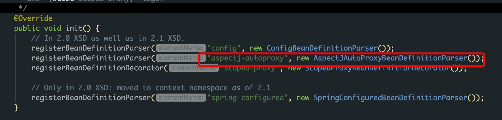
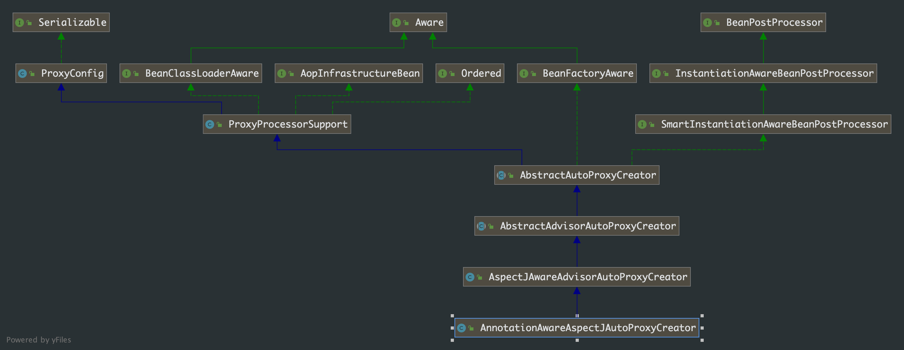
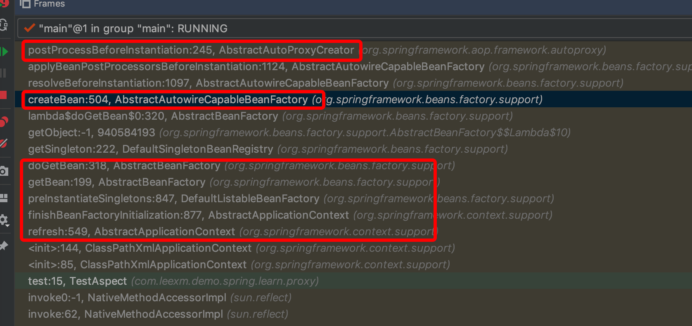

## 第 2 章 Spring Aop 解析

### 2.1 Aop 使用

Spring Aop 的使用，就不详细写了。我们知道 Spring 项目中要使用 aop，需要在 xml 配置文件中加`<aop:aspectj-autoproxy/>` 并且还要使用 `@Aspect`来定义相关切面类，当然对于这一点可以有不同的实现。

`<aop>` 使用到了自定义注解，对于自定义注解按照前一章中对自定义注解的讲解，可以快速定位到 Spring-aop 包中的 `spring.handlers` 文件：

```xml-dtd
http\://www.springframework.org/schema/aop=org.springframework.aop.config.AopNamespaceHandler
```



我们可以得知，在解析配置文件的时候， 一旦遇到 `aspectj-autoproxy` 注解时就会使用解析器 `AspectJAutoProxyBeanDefinitionParser` 进行解析。

###  2.2 aop 的创建过程解析

#### 2.2.1  AspectJAutoProxyBeanDefinitionParser

```java
class AspectJAutoProxyBeanDefinitionParser implements BeanDefinitionParser {

    @Override
    @Nullable
    public BeanDefinition parse(Element element, ParserContext parserContext) {
        // 向 Spring 容器中注册 AnnotationAwareAspectJAutoProxyCreator.class
      	AopNamespaceUtils.registerAspectJAnnotationAutoProxyCreatorIfNecessary(parserContext, element);
        // 对于注册中子类的处理
      	extendBeanDefinition(element, parserContext);
        return null;
    }
		
  	// 省略其他方法
    ....

}
```

详细看下 registerAspectJAnnotationAutoProxyCreatorIfNecessary 函数

```java
public abstract class AopNamespaceUtils {
    
    public static void registerAspectJAnnotationAutoProxyCreatorIfNecessary(
            ParserContext parserContext, Element sourceElement) {
				/**
         * 注册或升级 AutoProxyCreator 
         * 定义 beanName 为 org.Springframework.aop.config.internalAutoProxyCreator 的 BeanDefinition
         */
        BeanDefinition beanDefinition = AopConfigUtils.registerAspectJAnnotationAutoProxyCreatorIfNecessary(
                parserContext.getRegistry(), parserContext.extractSource(sourceElement));
        // 对于 proxy-target-class 以及 expose-proxy 属性的处理
      	useClassProxyingIfNecessary(parserContext.getRegistry(), sourceElement);
        // 注册组件并通知，便于监听器做进一步处理
      	registerComponentIfNecessary(beanDefinition, parserContext);
    }

}

public abstract class AopConfigUtils {
    
    @Nullable
    public static BeanDefinition registerAspectJAnnotationAutoProxyCreatorIfNecessary(
            BeanDefinitionRegistry registry, @Nullable Object source) {

        return registerOrEscalateApcAsRequired(AnnotationAwareAspectJAutoProxyCreator.class, registry, source);
    }

    @Nullable
    private static BeanDefinition registerOrEscalateApcAsRequired(
            Class<?> cls, BeanDefinitionRegistry registry, @Nullable Object source) {

        Assert.notNull(registry, "BeanDefinitionRegistry must not be null");
				/**
				 * public static final String AUTO_PROXY_CREATOR_BEAN_NAME =
			"org.springframework.aop.config.internalAutoProxyCreator";
				 * 如果已经存在 自动代理创建器 并且其与现在的不一致，则需要根据优先级来判断需要使用哪一个
				 */
        if (registry.containsBeanDefinition(AUTO_PROXY_CREATOR_BEAN_NAME)) {
            BeanDefinition apcDefinition = registry.getBeanDefinition(AUTO_PROXY_CREATOR_BEAN_NAME);
            if (!cls.getName().equals(apcDefinition.getBeanClassName())) {
                int currentPriority = findPriorityForClass(apcDefinition.getBeanClassName());
                int requiredPriority = findPriorityForClass(cls);
                if (currentPriority < requiredPriority) {
                    // 改变 bean 最重要的就是改变 bean 所对应的 className 属性
                  	apcDefinition.setBeanClassName(cls.getName());
                }
            }
          	// 如果已经存在且与将要创建的一致，那么无需再次创建
            return null;
        }

        RootBeanDefinition beanDefinition = new RootBeanDefinition(cls);
        beanDefinition.setSource(source);
        beanDefinition.getPropertyValues().add("order", Ordered.HIGHEST_PRECEDENCE);
        beanDefinition.setRole(BeanDefinition.ROLE_INFRASTRUCTURE);
        registry.registerBeanDefinition(AUTO_PROXY_CREATOR_BEAN_NAME, beanDefinition);
        return beanDefinition;
    }

}
```

**处理 Proxy-target-class 以及 expose-proxy 属性**

useClassProxyinglfNecessary实现了 proxy-target-class 属性以及 expose-proxy 属性的处理。

```java
public abstract class AopNamespaceUtils {
    
    private static void useClassProxyingIfNecessary(BeanDefinitionRegistry registry, @Nullable Element sourceElement) {
        if (sourceElement != null) {
          	// 对于 proxy-target-class 属性的处理
            boolean proxyTargetClass = Boolean.parseBoolean(sourceElement.getAttribute(PROXY_TARGET_CLASS_ATTRIBUTE));
            if (proxyTargetClass) {
                AopConfigUtils.forceAutoProxyCreatorToUseClassProxying(registry);
            }
          	// 对于 expose-proxy 属性的处理
            boolean exposeProxy = Boolean.parseBoolean(sourceElement.getAttribute(EXPOSE_PROXY_ATTRIBUTE));
            if (exposeProxy) {
                AopConfigUtils.forceAutoProxyCreatorToExposeProxy(registry);
            }
        }
    }

}

public abstract class AopConfigUtils {

    public static void forceAutoProxyCreatorToUseClassProxying(BeanDefinitionRegistry registry) {
        if (registry.containsBeanDefinition(AUTO_PROXY_CREATOR_BEAN_NAME)) {
            BeanDefinition definition = registry.getBeanDefinition(AUTO_PROXY_CREATOR_BEAN_NAME);
     				// 设置 proxyTargetClass 属性
          	definition.getPropertyValues().add("proxyTargetClass", Boolean.TRUE);
        }
    }

    public static void forceAutoProxyCreatorToExposeProxy(BeanDefinitionRegistry registry) {
        if (registry.containsBeanDefinition(AUTO_PROXY_CREATOR_BEAN_NAME)) {
            BeanDefinition definition = registry.getBeanDefinition(AUTO_PROXY_CREATOR_BEAN_NAME);
            // 设置 exposeProxy 属性
          	definition.getPropertyValues().add("exposeProxy", Boolean.TRUE);
        }
    }

}
```

- ***proxy-target-class***：Spring AOP 部分使用 JDK 动态代理或者 CGLIB 来为目标对象创建代理(建议尽量使用 JDK 的动态代理)。 如果被代理的目标对象实现了至少一个接口， 则会使用 JDK 动态代理。 所有该目标类型实现的接口都将被代理。 若该目标对象没有实现任何接口，则创建一个 CGLIB 代理 。 如果你希望强制使用 CGLIB 代理(例如希望代理目标对象的所有方法，而不只是实现自接口的方法)，那也可以。 但是需要考虑 以下两个问题
  - 无法通知(advise) final 方法，因为它们不能被覆写
  - 需要将CGLIB二进制发行包放在classpath下面

与之相比，JDK 本身就提供了动态代理，强制使用 CGLIB 代理需要将 <aop:config>的 proxy-target-class 属性设为 true:

```xml
<aop:config proxy-target-class=”true”> . . </aop:config>
```

当需要使用 CGLIB 代理和 @AspectJ 自动代理支持，可以按照以下方式设置<aop:aspectj­-autoproxy>的 proxy-target-class 属性:

```xml
<aop:aspectj-autoproxy proxy-target-class="true" />
```

- JDK 动态代理:其代理对象必须是某个接口的实现，它是通过在运行期间创建一个接口的实现类来完成对目标对象的代理。

- CGLIB 代理:实现原理类似于 JDK 动态代理，只是它在运行期间生成的代理对象是针对目标类扩展的子类。 CGLIB 是高效的代码生成包，底层是依靠 ASM (开源的 Java 字节码编辑类库)操作字节码实现的，性能比 JDK 强。

- expose-proxy:有时候目标对象内部的自我调用将无法实施切面中的增强，如下示例:

  ```java
  public interface AService {
      public void a(); 
      public void b();
  }
  
  @Service ()
  public class AServiceimpl implements AService {
      @Transactional (propagation =Propagation.REQUIRED) 
      public void a() {
          this.b();
      }
  
      @Transactional (propagation = Propagation.REQUIRES_NEW)
      public void b () {
      }
  }
  ```

  此处的 this 指向目标对象，因此调用 this.b()将不会执行 b 事务切面，即不会执行事务增强，因业 b 方法的事务定义 “@Transactional(propagation = Propagation.REQUIRES_NEW)” 将不会实施，为了解决这个问题，我们可以这样做:

  ```xml
  <aop:aspectj-autoproxy expose-proxy=”true”/>
  ```

  然后将以上代码中的 “this.b();” 修改为 “((AService) AopContext.currentProxy()).b();” 即可。通过以上的修改便可以完成对 a 和 b方法的同时增强。

#### 2.2.2 创建 AOP 代理

上面一小节我们只是分析 spring aop 为创建 aop 的准备工作，接下来具体分析 aop 代理的创建过程。上面小节中大量的准备工作中最重要的是，向 Spring 容器中注入了 `AnnotationAwareAspectJAutoProxyCreator.class` 这个类。先看下该类的类图：



从继承关系中，我们发现该类继承了 `BeanPostProcessor` 及其子接口 `InstantiationAwareBeanPostProcessor` 。接口方法说明

| 方法                            | 描述                                                         |
| ------------------------------- | ------------------------------------------------------------ |
| postProcessBeforeInitialization | BeanPostProcessor接口中的方法，在Bean的自定义初始化方法之前执行 |
| postProcessAfterInitialization  | BeanPostProcessor接口中的方法，在Bean的自定义初始化方法执行完成之后执行 |
| postProcessBeforeInstantiation  | 自身方法，是最先执行的方法，它在目标对象实例化之前调用，该方法的返回值类型是Object，我们可以返回任何类型的值。由于这个时候目标对象还未实例化，所以这个返回值可以用来代替原本该生成的目标对象的实例(比如代理对象)。如果该方法的返回值代替原本该生成的目标对象，后续只有postProcessAfterInitialization方法会调用，其它方法不再调用；否则按照正常的流程走 |
| postProcessAfterInstantiation   | 在目标对象实例化之后调用，这个时候对象已经被实例化，但是该实例的属性还未被设置，都是null。因为它的返回值是决定要不要调用postProcessPropertyValues方法的其中一个因素（因为还有一个因素是mbd.getDependencyCheck()）；如果该方法返回false,并且不需要check，那么postProcessPropertyValues就会被忽略不执行；如果返回true，postProcessPropertyValues就会被执行 |
| postProcessPropertyValues       | 对属性值进行修改，如果postProcessAfterInstantiation方法返回false，该方法可能不会被调用。可以在该方法内对属性值进行修改 |

>instantiation：实例化，对象的创建过程。比如使用构造方法 new 对象，为对象在内存中分配空间
>
>initialization：初始化，是为对象中的属性赋值的过程

结合类图，`AbstractAutoProxyCreator` 类中实现上述接口的方法，我们在相关方法上打断点，进行 debug 分析。




上述红框圈出的就是调用链路，熟悉 IOC 容器的一眼就可以看出这就是 IOC 容器中 bean 的创建过程。我们来分析创建代理对象的过程，主要从 `AbstractAutoProxyCreator.postProcessAfterInitialization` 入手， 下代码。

```java
public abstract class AbstractAutoProxyCreator extends ProxyProcessorSupport
        implements SmartInstantiationAwareBeanPostProcessor, BeanFactoryAware {

    @Override
    public Object postProcessAfterInitialization(@Nullable Object bean, String beanName) {
        if (bean != null) {
            // 根据给定的 bean 的 class 和 name 构建出一个缓存用的 key
          	Object cacheKey = getCacheKey(bean.getClass(), beanName);
            if (this.earlyProxyReferences.remove(cacheKey) != bean) {
                // 如果它适合被代理的话，则需要包装该 bean
              	return wrapIfNecessary(bean, beanName, cacheKey);
            }
        }
        return bean;
    }
  	
  	protected Object wrapIfNecessary(Object bean, String beanName, Object cacheKey) {
        // 如果已经被处理过，则直接返回
      	if (StringUtils.hasLength(beanName) && this.targetSourcedBeans.contains(beanName)) {
            return bean;
        }
      	// 如果该 bean 无须增强，也返回
        if (Boolean.FALSE.equals(this.advisedBeans.get(cacheKey))) {
            return bean;
        }
      	/**
      	 * 这里也是重要的处理节点
      	 * 这两个方法在 AbstractAutoProxyCreator.postProcessBeforeInstantiation 方法中也被调用过
      	 * 在 postProcessBrforeInstantiation 中 shouldSkip 的作用除了用于判断 bean 是否可以不用被代理之外，还处理切面类，并提取所有切面类里的所有切面方法，并将切面方法进行了缓存
         * 给定的 bean 类是否代表一个基础设施类，基础设施类不应代理；或者配置了指定 bean 不需要自动代理
         */ 
        if (isInfrastructureClass(bean.getClass()) || shouldSkip(bean.getClass(), beanName)) {
            this.advisedBeans.put(cacheKey, Boolean.FALSE);
            return bean;
        }

        // 如果存在适合该 bean 的增强方法，则创建该 bean 的代理
        Object[] specificInterceptors = getAdvicesAndAdvisorsForBean(bean.getClass(), beanName, null);
        if (specificInterceptors != DO_NOT_PROXY) {
            this.advisedBeans.put(cacheKey, Boolean.TRUE);
            // 创建代理
          	Object proxy = createProxy(
                    bean.getClass(), beanName, specificInterceptors, new SingletonTargetSource(bean));
            this.proxyTypes.put(cacheKey, proxy.getClass());
            return proxy;
        }

        this.advisedBeans.put(cacheKey, Boolean.FALSE);
        return bean;
    }

}
```

函数中我们已经看到了代理创建的雏形。 当然，真正开始之前还需要经过一些判断，比如是否已经处理过或者是否是需要跳过的，而真正创建代理对象的过程是从 getAdvicesAndAdvisorsForBean 开始的。

```java
public abstract class AbstractAdvisorAutoProxyCreator extends AbstractAutoProxyCreator {

    @Override
    @Nullable
    protected Object[] getAdvicesAndAdvisorsForBean(
            Class<?> beanClass, String beanName, @Nullable TargetSource targetSource) {
				// 查找适合该 bean 的增强器
        List<Advisor> advisors = findEligibleAdvisors(beanClass, beanName);
        if (advisors.isEmpty()) {
            return DO_NOT_PROXY;
        }
        return advisors.toArray();
    }
  
  	protected List<Advisor> findEligibleAdvisors(Class<?> beanClass, String beanName) {
        /*
         * 获取所有注册的增强方法
         * 这里 findCandidateAdvisors 是 AnnotationAwareAspectJAutoProxyCreator 中的方法
         */
      	List<Advisor> candidateAdvisors = findCandidateAdvisors();
      	// 找到适用于该 bean 的增强方法
        List<Advisor> eligibleAdvisors = findAdvisorsThatCanApply(candidateAdvisors, beanClass, beanName);
        // 空方法，留给子类扩展
      	extendAdvisors(eligibleAdvisors);
      	// 对增强器以 order 的进行排序
        if (!eligibleAdvisors.isEmpty()) {
            eligibleAdvisors = sortAdvisors(eligibleAdvisors);
        }
        return eligibleAdvisors;
    }
}
```

##### 2.2.2.1  获取增强器

```java

    protected List<Advisor> findCandidateAdvisors() {
        Assert.state(this.advisorRetrievalHelper != null, "No BeanFactoryAdvisorRetrievalHelper available");
        /**
         * 这里的 advisorRetrievalHelper 是 AnnotationAwareAspectJAutoProxyCreator 的内部类 			
         * BeanFactoryAdvisorRetrievalHelperAdapter，注意其继承关系
         */
      	return this.advisorRetrievalHelper.findAdvisorBeans();
    }

}

public class AnnotationAwareAspectJAutoProxyCreator extends AspectJAwareAdvisorAutoProxyCreator {
    
    @Override
    protected List<Advisor> findCandidateAdvisors() {
        /**
         * 这里的使用 super 指定方法，就是上面的抽象类 AnnotationAwareAspectJAutoProxyCreator 中的方法
         */
        List<Advisor> advisors = super.findCandidateAdvisors();
        /*
         * 这里的 aspectJAdvisorsBuilder 也是 AnnotationAwareAspectJAutoProxyCreator 的内部类
         * BeanFactoryAdvisorRetrievalHelperAdapter
         */
        if (this.aspectJAdvisorsBuilder != null) {
            advisors.addAll(this.aspectJAdvisorsBuilder.buildAspectJAdvisors());
        }
        return advisors;
    }
    
  	/**
  	 * 内部类，其父类中有 buildAspectJAdvisors() 方法
  	 */
    private class BeanFactoryAdvisorRetrievalHelperAdapter extends BeanFactoryAdvisorRetrievalHelper {

        public BeanFactoryAdvisorRetrievalHelperAdapter(ConfigurableListableBeanFactory beanFactory) {
            super(beanFactory);
        }

        @Override
        protected boolean isEligibleBean(String beanName) {
            return AbstractAdvisorAutoProxyCreator.this.isEligibleAdvisorBean(beanName);
        }
    }

}
```

```java
public List<Advisor> buildAspectJAdvisors() {
    // 获取所有切面类的名称，即所有 @Aspect 注解的类
  	List<String> aspectNames = this.aspectBeanNames;

  	// 如果不为空，说明这个方法之前有被调用过
    if (aspectNames == null) {
        synchronized (this) {
            aspectNames = this.aspectBeanNames;
            if (aspectNames == null) {
                List<Advisor> advisors = new ArrayList<>();
                aspectNames = new ArrayList<>();
              	// 获取所有的 beanName
                String[] beanNames = BeanFactoryUtils.beanNamesForTypeIncludingAncestors(
                        this.beanFactory, Object.class, true, false);
                // 找出所有的增强方法
              	for (String beanName : beanNames) {
                    // 不合法的 bean 可以略过，由子类定义规则，默认返回 true
                  	if (!isEligibleBean(beanName)) {
                        continue;
                    }
                    // 获取 bean 的类型
                    Class<?> beanType = this.beanFactory.getType(beanName);
                    if (beanType == null) {
                        continue;
                    }
                  	// 是否存在 Aspect 注解
                    if (this.advisorFactory.isAspect(beanType)) {
                        // 缓存起来
                      	aspectNames.add(beanName);
                        AspectMetadata amd = new AspectMetadata(beanType, beanName);
                        if (amd.getAjType().getPerClause().getKind() == PerClauseKind.SINGLETON) {
                            MetadataAwareAspectInstanceFactory factory =
                                    new BeanFactoryAspectInstanceFactory(this.beanFactory, beanName);
                            // 解析切面类中的增强方法
                          	List<Advisor> classAdvisors = this.advisorFactory.getAdvisors(factory);
                            // 根据是否是单例进行相应的缓存
                          	if (this.beanFactory.isSingleton(beanName)) {
                                this.advisorsCache.put(beanName, classAdvisors);
                            }
                            else {
                                this.aspectFactoryCache.put(beanName, factory);
                            }
                            advisors.addAll(classAdvisors);
                        }
                        else {
                            // Per target or per this.
                            if (this.beanFactory.isSingleton(beanName)) {
                                throw new IllegalArgumentException("Bean with name '" + beanName +
                                        "' is a singleton, but aspect instantiation model is not singleton");
                            }
                            MetadataAwareAspectInstanceFactory factory =
                                    new PrototypeAspectInstanceFactory(this.beanFactory, beanName);
                            this.aspectFactoryCache.put(beanName, factory);
                            advisors.addAll(this.advisorFactory.getAdvisors(factory));
                        }
                    }
                }
                this.aspectBeanNames = aspectNames;
                return advisors;
            }
        }
    }

    if (aspectNames.isEmpty()) {
        return Collections.emptyList();
    }
    List<Advisor> advisors = new ArrayList<>();
    for (String aspectName : aspectNames) {
      	/*
         * 这里 advisorsCache 缓存，在 shouldSkip 方法中已经被填充，这里直接命中缓存 
         */
        List<Advisor> cachedAdvisors = this.advisorsCache.get(aspectName);
        if (cachedAdvisors != null) {
            advisors.addAll(cachedAdvisors);
        }
        else {
            MetadataAwareAspectInstanceFactory factory = this.aspectFactoryCache.get(aspectName);
            advisors.addAll(this.advisorFactory.getAdvisors(factory));
        }
    }
    return advisors;
}
```

至此，我们已经完成了 Advisor 的提取， 在上面的步骤中最为重要也最为繁杂的就是增强器的获取。 而这一功能委托给了 getAdvisors 方法去实现 `this.advisorFactorγ.getAdvisors(factory)`。上面方法中的 `advisorFactory` 属性是 `ReflectiveAspectJAdvisorFactory`的实例。这里的提取详细解析放在最后，继续按照 bean 代理类创建的过程解析下去。

##### 2.2.2.2 获取匹配的增强器

前面的函数已经完成了所有增强器的解析，但是对于所有增强来讲，并不一定都适用于当前的 Bean，还要挑选出适合的增强器，也就是满足我们配置的通配符的增强器。具体实现就在 `findAdvisorsThatCanApply` 中。

```java
public abstract class AbstractAdvisorAutoProxyCreator extends AbstractAutoProxyCreator {
    
    protected List<Advisor> findEligibleAdvisors(Class<?> beanClass, String beanName) {
        List<Advisor> candidateAdvisors = findCandidateAdvisors();
        // 过滤已经得到的 advisors
        List<Advisor> eligibleAdvisors = findAdvisorsThatCanApply(candidateAdvisors, beanClass, beanName);
        extendAdvisors(eligibleAdvisors);
        if (!eligibleAdvisors.isEmpty()) {
            eligibleAdvisors = sortAdvisors(eligibleAdvisors);
        }
        return eligibleAdvisors;
    }

    protected List<Advisor> findAdvisorsThatCanApply(
            List<Advisor> candidateAdvisors, Class<?> beanClass, String beanName) {

        ProxyCreationContext.setCurrentProxiedBeanName(beanName);
        try {
            return AopUtils.findAdvisorsThatCanApply(candidateAdvisors, beanClass);
        }
        finally {
            ProxyCreationContext.setCurrentProxiedBeanName(null);
        }
    }

}

public abstract class AopUtils {

    public static List<Advisor> findAdvisorsThatCanApply(List<Advisor> candidateAdvisors, Class<?> clazz) {
        if (candidateAdvisors.isEmpty()) {
            return candidateAdvisors;
        }
        List<Advisor> eligibleAdvisors = new ArrayList<>();
      	// 首先处理引介增强器 —— 这个我们之后在介绍
        for (Advisor candidate : candidateAdvisors) {
          	if (candidate instanceof IntroductionAdvisor && canApply(candidate, clazz)) {
                eligibleAdvisors.add(candidate);
            }
        }
        boolean hasIntroductions = !eligibleAdvisors.isEmpty();
        for (Advisor candidate : candidateAdvisors) {
          	// 引介增强器已经处理过了
            if (candidate instanceof IntroductionAdvisor) {
                continue;
            }
          	// 对于普通增强器的处理
            if (canApply(candidate, clazz, hasIntroductions)) {
                eligibleAdvisors.add(candidate);
            }
        }
        return eligibleAdvisors;
    }
  
  	public static boolean canApply(Advisor advisor, Class<?> targetClass, boolean hasIntroductions) {
        if (advisor instanceof IntroductionAdvisor) {
            return ((IntroductionAdvisor) advisor).getClassFilter().matches(targetClass);
        }
        else if (advisor instanceof PointcutAdvisor) {
            PointcutAdvisor pca = (PointcutAdvisor) advisor;
            return canApply(pca.getPointcut(), targetClass, hasIntroductions);
        }
        else {
            // It doesn't have a pointcut so we assume it applies.
            return true;
        }
    }
  
  	public static boolean canApply(Pointcut pc, Class<?> targetClass, boolean hasIntroductions) {
        Assert.notNull(pc, "Pointcut must not be null");
        // 这里就是那 aspect 类中 切点来匹配类
      	if (!pc.getClassFilter().matches(targetClass)) {
            return false;
        }

        MethodMatcher methodMatcher = pc.getMethodMatcher();
        if (methodMatcher == MethodMatcher.TRUE) {
            // No need to iterate the methods if we're matching any method anyway...
            return true;
        }

        IntroductionAwareMethodMatcher introductionAwareMethodMatcher = null;
        if (methodMatcher instanceof IntroductionAwareMethodMatcher) {
            introductionAwareMethodMatcher = (IntroductionAwareMethodMatcher) methodMatcher;
        }
				
      	// 这里处类以及其实现的所有接口
        Set<Class<?>> classes = new LinkedHashSet<>();
        if (!Proxy.isProxyClass(targetClass)) {
            classes.add(ClassUtils.getUserClass(targetClass));
        }
        classes.addAll(ClassUtils.getAllInterfacesForClassAsSet(targetClass));

        for (Class<?> clazz : classes) {
            Method[] methods = ReflectionUtils.getAllDeclaredMethods(clazz);
            for (Method method : methods) {
                if (introductionAwareMethodMatcher != null ?
                        introductionAwareMethodMatcher.matches(method, targetClass, hasIntroductions) :
                        methodMatcher.matches(method, targetClass)) {
                    return true;
                }
            }
        }

        return false;
    }

}
```

##### 2.2.2.3 创建代理

在获取了所有对应 bean 的增强器后，便可以进行代理的创建了。

```java
public abstract class AbstractAutoProxyCreator extends ProxyProcessorSupport
        implements SmartInstantiationAwareBeanPostProcessor, BeanFactoryAware {

    protected Object createProxy(Class<?> beanClass, @Nullable String beanName,
            @Nullable Object[] specificInterceptors, TargetSource targetSource) {

        if (this.beanFactory instanceof ConfigurableListableBeanFactory) {
            AutoProxyUtils.exposeTargetClass((ConfigurableListableBeanFactory) this.beanFactory, beanName, beanClass);
        }

        ProxyFactory proxyFactory = new ProxyFactory();
        /**
         * 获取当前类—— AnnotationAwareAspectJAutoProxyCreator 中相关属性
         */
      	proxyFactory.copyFrom(this);
				/**
				 * 决定对于给定的 bean 是否应该使用 targetClass 而不是它的接口代理
				 */
        if (!proxyFactory.isProxyTargetClass()) {
            if (shouldProxyTargetClass(beanClass, beanName)) {
                proxyFactory.setProxyTargetClass(true);
            }
            else {
              	// 对代理类继承的接口处理
                evaluateProxyInterfaces(beanClass, proxyFactory);
            }
        }

      	/**
      	 * 这里不仅仅涉及到 advisor 类型的增强器，还有拦截器 Interceptor、增强方法等
      	 * buildAdvisors 方法将它们统一封装成 Advisor
      	 */
        Advisor[] advisors = buildAdvisors(beanName, specificInterceptors);
        // 加入增强器
      	proxyFactory.addAdvisors(advisors);
        // 设置要代理的对象
      	proxyFactory.setTargetSource(targetSource);
        // 定制代理，空方法——子类可定制
      	customizeProxyFactory(proxyFactory);
				/**
				 * 用来控制代理工厂被配置之后，是否还允许修改通知
				 * 缺省值为 false (即在代理被配置之后，不允许修改代理的配置)
				 */
        proxyFactory.setFrozen(this.freezeProxy);
        if (advisorsPreFiltered()) {
            proxyFactory.setPreFiltered(true);
        }

      	// 创建并获取代理
        return proxyFactory.getProxy(getProxyClassLoader());
    }

}
```

对于代理类的创建及处理，Spring 委托给了 ProxyFactory 去处理，而在此函数中主要是对 ProxyFactory 的初始化操作，进而对真正的创建代理做准备，这些初始化操作包括如下内容：

- 获取当前类中的属性
- 添加代理接口
- 封装 Advisor并加入到 ProxyFactory 中
- 设置要代理的类
- 当然在 Spring 中还为子类提供了定制的函数 customizeProxyFactory，子类可以在此函数中进行对 ProxyFactory 的进一步封装
- 进行获取代理操作。

其中，封装 Advisor 并加入到 ProxyFactory 中以及创建代理是两个相对繁琐的过程，可以通过 ProxyFactory 提供的 addAdvisor方法直接将增强器置人代理创建工厂中，但是将拦截器封装为增强器还是需要一定的逻辑的。

```java
public class ProxyFactory extends ProxyCreatorSupport {

    public Object getProxy(@Nullable ClassLoader classLoader) {
        return createAopProxy().getProxy(classLoader);
    }

}

public class ProxyCreatorSupport extends AdvisedSupport {
    
    protected final synchronized AopProxy createAopProxy() {
        if (!this.active) {
            activate();
        }
        return getAopProxyFactory().createAopProxy(this);
    }

    public AopProxyFactory getAopProxyFactory() {
      	// 这里的 aopProxyFactory 是默认实现 DefaultAopProxyFactory
        return this.aopProxyFactory;
    }

}

public class DefaultAopProxyFactory implements AopProxyFactory, Serializable {

    @Override
    public AopProxy createAopProxy(AdvisedSupport config) throws AopConfigException {
        if (config.isOptimize() || config.isProxyTargetClass() || hasNoUserSuppliedProxyInterfaces(config)) {
            Class<?> targetClass = config.getTargetClass();
            if (targetClass == null) {
                throw new AopConfigException("TargetSource cannot determine target class: " +
                        "Either an interface or a target is required for proxy creation.");
            }
            if (targetClass.isInterface() || Proxy.isProxyClass(targetClass)) {
                return new JdkDynamicAopProxy(config);
            }
            return new ObjenesisCglibAopProxy(config);
        }
        else {
            return new JdkDynamicAopProxy(config);
        }
    }

    /**
     * Determine whether the supplied {@link AdvisedSupport} has only the
     * {@link org.springframework.aop.SpringProxy} interface specified
     * (or no proxy interfaces specified at all).
     */
    private boolean hasNoUserSuppliedProxyInterfaces(AdvisedSupport config) {
        Class<?>[] ifcs = config.getProxiedInterfaces();
        return (ifcs.length == 0 || (ifcs.length == 1 && SpringProxy.class.isAssignableFrom(ifcs[0])));
    }

}
```

到此已经完成了代理的创建，从 if 中的判断条件可以看到 3 个方面影响 Spring 代理的创建：

- optimize：用来控制通过 CGLIB 创建的代理是否使用激进的优化策略。除非完全了解 AOP 代理如何优化的，否则不推荐使用这个配置，对于 JDK 动态代理该配置无效
- proxyTargetClass：属性为 true 时，目标类本身被代理而不是目标类的接口
- hasNoUserSuppliedProxyInterfaces：是否存在代理接口

##### 2.2.2.4 获取代理

JDK 动态代理进行分析

```java
final class JdkDynamicAopProxy implements AopProxy, InvocationHandler, Serializable {

    @Override
    public Object getProxy(@Nullable ClassLoader classLoader) {
        if (logger.isTraceEnabled()) {
            logger.trace("Creating JDK dynamic proxy: " + this.advised.getTargetSource());
        }
      	// 实现接口的处理
        Class<?>[] proxiedInterfaces = AopProxyUtils.completeProxiedInterfaces(this.advised, true);
        // 特殊方法的处理，如 equals、hashCode
      	findDefinedEqualsAndHashCodeMethods(proxiedInterfaces);
        return Proxy.newProxyInstance(classLoader, proxiedInterfaces, this);
    }

}
```

#### 2.2.3 代理的调用过程 —— JDK 动态代理的调用过程

JDK 动态代理，重要的是创建 `InvocationHandler`，而 `InvocationHandler` 接口的 `invoke`方法是调用的入口方法。我们在 `JdkDynamicAopProxy.invoke`方法上打断点分析。

```java
public Object invoke(Object proxy, Method method, Object[] args) throws Throwable {
    Object oldProxy = null;
    boolean setProxyContext = false;

    TargetSource targetSource = this.advised.targetSource;
    Object target = null;

    try {
      	// equals 方法的处理
        if (!this.equalsDefined && AopUtils.isEqualsMethod(method)) {
            return equals(args[0]);
        }
      	// hashCode 方法的处理
        else if (!this.hashCodeDefined && AopUtils.isHashCodeMethod(method)) {
            return hashCode();
        }
        else if (method.getDeclaringClass() == DecoratingProxy.class) {
            return AopProxyUtils.ultimateTargetClass(this.advised);
        }
        else if (!this.advised.opaque && method.getDeclaringClass().isInterface() &&
                method.getDeclaringClass().isAssignableFrom(Advised.class)) {
            // Service invocations on ProxyConfig with the proxy config...
            return AopUtils.invokeJoinpointUsingReflection(this.advised, method, args);
        }

        Object retVal;
				// exposeProxy，调用自身内部方法切面失效的处理
        if (this.advised.exposeProxy) {
            oldProxy = AopContext.setCurrentProxy(proxy);
            setProxyContext = true;
        }

        target = targetSource.getTarget();
        Class<?> targetClass = (target != null ? target.getClass() : null);

        // 获取当前方法的拦截器链
        List<Object> chain = this.advised.getInterceptorsAndDynamicInterceptionAdvice(method, targetClass);

      	// 拦截连器是空链，则直接调用切点的方法
        if (chain.isEmpty()) {
            Object[] argsToUse = AopProxyUtils.adaptArgumentsIfNecessary(method, args);
            retVal = AopUtils.invokeJoinpointUsingReflection(target, method, argsToUse);
        }
        else {
          	// 将拦截器封装成 ReflectiveMethodinvocation，以便于使用其 proceed 方法调用整个拦截器连
            MethodInvocation invocation =
                    new ReflectiveMethodInvocation(proxy, target, method, args, targetClass, chain);
            // 执行拦截器链
            retVal = invocation.proceed();
        }

      	// 返回结果
        Class<?> returnType = method.getReturnType();
        if (retVal != null && retVal == target &&
                returnType != Object.class && returnType.isInstance(proxy) &&
                !RawTargetAccess.class.isAssignableFrom(method.getDeclaringClass())) {
            retVal = proxy;
        }
        else if (retVal == null && returnType != Void.TYPE && returnType.isPrimitive()) {
            throw new AopInvocationException(
                    "Null return value from advice does not match primitive return type for: " + method);
        }
        return retVal;
    }
    finally {
        if (target != null && !targetSource.isStatic()) {
            targetSource.releaseTarget(target);
        }
        if (setProxyContext) {
            AopContext.setCurrentProxy(oldProxy);
        }
    }
}
```

拦截器链的生成

```java
public class AdvisedSupport extends ProxyConfig implements Advised {

    public List<Object> getInterceptorsAndDynamicInterceptionAdvice(Method method, @Nullable Class<?> targetClass) {
      	// 缓存方法的拦截器链，避免每次方法调用都重新创建
        MethodCacheKey cacheKey = new MethodCacheKey(method);
        List<Object> cached = this.methodCache.get(cacheKey);
        if (cached == null) {
          	/**
          	 * 这里还要针对增强器进行过滤，找出适合调用方法的增强器并包装成拦截器对象
          	 * 适合类的 advisor，不一定适合特定的方法，要看具体接口情况
          	 */
            cached = this.advisorChainFactory.getInterceptorsAndDynamicInterceptionAdvice(
                    this, method, targetClass);
            this.methodCache.put(cacheKey, cached);
        }
        return cached;
    }

}
```

拦截器链的调用过程

```java
public class ReflectiveMethodInvocation implements ProxyMethodInvocation, Cloneable {

    public Object proceed() throws Throwable {
      	/**
      	 * currentInterceptorIndex 下标，初始值为 -1。用来标记拦截器链走到第几个拦截器了
      	 * 如果拦截器链最有一个节点已经被调用，则直接调用被切点自身方法
      	 */
        if (this.currentInterceptorIndex == this.interceptorsAndDynamicMethodMatchers.size() - 1) {
            return invokeJoinpoint();
        }

        Object interceptorOrInterceptionAdvice =
                this.interceptorsAndDynamicMethodMatchers.get(++this.currentInterceptorIndex);
        if (interceptorOrInterceptionAdvice instanceof InterceptorAndDynamicMethodMatcher) {
            // Evaluate dynamic method matcher here: static part will already have
            // been evaluated and found to match.
            InterceptorAndDynamicMethodMatcher dm =
                    (InterceptorAndDynamicMethodMatcher) interceptorOrInterceptionAdvice;
            Class<?> targetClass = (this.targetClass != null ? this.targetClass : this.method.getDeclaringClass());
            if (dm.methodMatcher.matches(this.method, targetClass, this.arguments)) {
                return dm.interceptor.invoke(this);
            }
            else {
                // Dynamic matching failed.
                // Skip this interceptor and invoke the next in the chain.
                return proceed();
            }
        }
        else {
            // It's an interceptor, so we just invoke it: The pointcut will have
            // been evaluated statically before this object was constructed.
            return ((MethodInterceptor) interceptorOrInterceptionAdvice).invoke(this);
        }
    }
    
}
```

上面就是整个 AOP 的创建和调用过程，对 JDK 动态代理的调用进行详细分析。