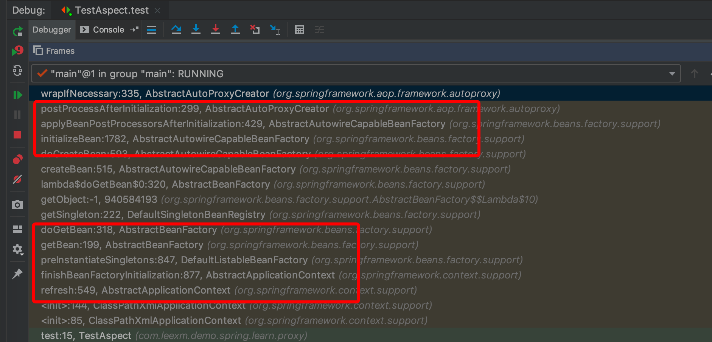

## 第 2 章 Spring Aop 解析

### 2.1 Aop 使用

Spring Aop 的使用，就不详细写了。我们知道 Spring 项目中要使用 aop，需要在 xml 配置文件中加`<aop:aspectj-autoproxy/>` 并且还要使用 `@Aspect`来定义相关切面类，当然对于这一点可以有不同的实现。

`<aop >` 使用到了自定义注解，对于自定义注解按照前一章中对自定义注解的讲解，可以快速定位到 Spring-aop 包中的 `spring.handlers` 文件：

```xml-dtd
http\://www.springframework.org/schema/aop=org.springframework.aop.config.AopNamespaceHandler
```


我们可以得知，在解析配置文件的时候， 一旦遇到 `aspectj-autoproxy` 注解时就会使用解析器 `AspectJAutoProxyBeanDefinitionParser` 进行解析。

###  2.2 aop 的创建过程解析

#### 2.2.1  AspectJAutoProxyBeanDefinitionParser

```java
class AspectJAutoProxyBeanDefinitionParser implements BeanDefinitionParser {

    @Override
    @Nullable
    public BeanDefinition parse(Element element, ParserContext parserContext) {
        // 向 Spring 容器中注册 AnnotationAwareAspectJAutoProxyCreator.class
      	AopNamespaceUtils.registerAspectJAnnotationAutoProxyCreatorIfNecessary(parserContext, element);
        // 对于注册中子类的处理
      	extendBeanDefinition(element, parserContext);
        return null;
    }
		
  	// 省略其他方法
    ....

}
```

详细看下 registerAspectJAnnotationAutoProxyCreatorIfNecessary 函数

```java
public abstract class AopNamespaceUtils {
    
    public static void registerAspectJAnnotationAutoProxyCreatorIfNecessary(
            ParserContext parserContext, Element sourceElement) {
				/**
         * 注册或升级 AutoProxyCreator 
         * 定义 beanName 为 org.Springframework.aop.config.internalAutoProxyCreator 的 BeanDefinition
         */
        BeanDefinition beanDefinition = AopConfigUtils.registerAspectJAnnotationAutoProxyCreatorIfNecessary(
                parserContext.getRegistry(), parserContext.extractSource(sourceElement));
        // 对于 proxy-target-class 以及 expose-proxy 属性的处理
      	useClassProxyingIfNecessary(parserContext.getRegistry(), sourceElement);
        // 注册组件并通知，便于监听器做进一步处理
      	registerComponentIfNecessary(beanDefinition, parserContext);
    }

}

public abstract class AopConfigUtils {
    
    @Nullable
    public static BeanDefinition registerAspectJAnnotationAutoProxyCreatorIfNecessary(
            BeanDefinitionRegistry registry, @Nullable Object source) {

        return registerOrEscalateApcAsRequired(AnnotationAwareAspectJAutoProxyCreator.class, registry, source);
    }

    @Nullable
    private static BeanDefinition registerOrEscalateApcAsRequired(
            Class<?> cls, BeanDefinitionRegistry registry, @Nullable Object source) {

        Assert.notNull(registry, "BeanDefinitionRegistry must not be null");
				/**
				 * public static final String AUTO_PROXY_CREATOR_BEAN_NAME =
			"org.springframework.aop.config.internalAutoProxyCreator";
				 * 如果已经存在 自动代理创建器 并且其与现在的不一致，则需要根据优先级来判断需要使用哪一个
				 */
        if (registry.containsBeanDefinition(AUTO_PROXY_CREATOR_BEAN_NAME)) {
            BeanDefinition apcDefinition = registry.getBeanDefinition(AUTO_PROXY_CREATOR_BEAN_NAME);
            if (!cls.getName().equals(apcDefinition.getBeanClassName())) {
                int currentPriority = findPriorityForClass(apcDefinition.getBeanClassName());
                int requiredPriority = findPriorityForClass(cls);
                if (currentPriority < requiredPriority) {
                    // 改变 bean 最重要的就是改变 bean 所对应的 className 属性
                  	apcDefinition.setBeanClassName(cls.getName());
                }
            }
          	// 如果已经存在且与将要创建的一致，那么无需再次创建
            return null;
        }

        RootBeanDefinition beanDefinition = new RootBeanDefinition(cls);
        beanDefinition.setSource(source);
        beanDefinition.getPropertyValues().add("order", Ordered.HIGHEST_PRECEDENCE);
        beanDefinition.setRole(BeanDefinition.ROLE_INFRASTRUCTURE);
        registry.registerBeanDefinition(AUTO_PROXY_CREATOR_BEAN_NAME, beanDefinition);
        return beanDefinition;
    }

}
```

**处理 Proxy-target-class 以及 expose-proxy 属性**

useClassProxyinglfNecessary实现了 proxy-target-class 属性以及 expose-proxy 属性的处理。

```java
public abstract class AopNamespaceUtils {
    
    private static void useClassProxyingIfNecessary(BeanDefinitionRegistry registry, @Nullable Element sourceElement) {
        if (sourceElement != null) {
          	// 对于 proxy-target-class 属性的处理
            boolean proxyTargetClass = Boolean.parseBoolean(sourceElement.getAttribute(PROXY_TARGET_CLASS_ATTRIBUTE));
            if (proxyTargetClass) {
                AopConfigUtils.forceAutoProxyCreatorToUseClassProxying(registry);
            }
          	// 对于 expose-proxy 属性的处理
            boolean exposeProxy = Boolean.parseBoolean(sourceElement.getAttribute(EXPOSE_PROXY_ATTRIBUTE));
            if (exposeProxy) {
                AopConfigUtils.forceAutoProxyCreatorToExposeProxy(registry);
            }
        }
    }

}

public abstract class AopConfigUtils {

    public static void forceAutoProxyCreatorToUseClassProxying(BeanDefinitionRegistry registry) {
        if (registry.containsBeanDefinition(AUTO_PROXY_CREATOR_BEAN_NAME)) {
            BeanDefinition definition = registry.getBeanDefinition(AUTO_PROXY_CREATOR_BEAN_NAME);
     				// 设置 proxyTargetClass 属性
          	definition.getPropertyValues().add("proxyTargetClass", Boolean.TRUE);
        }
    }

    public static void forceAutoProxyCreatorToExposeProxy(BeanDefinitionRegistry registry) {
        if (registry.containsBeanDefinition(AUTO_PROXY_CREATOR_BEAN_NAME)) {
            BeanDefinition definition = registry.getBeanDefinition(AUTO_PROXY_CREATOR_BEAN_NAME);
            // 设置 exposeProxy 属性
          	definition.getPropertyValues().add("exposeProxy", Boolean.TRUE);
        }
    }

}
```

- ***proxy-target-class***：Spring AOP 部分使用 JDK 动态代理或者 CGLIB 来为目标对象创建代理(建议尽量使用 JDK 的动态代理)。 如果被代理的目标对象实现了至少一个接口， 则会使用 JDK 动态代理。 所有该目标类型实现的接口都将被代理。 若该目标对象没有实现任何接口，则创建一个 CGLIB 代理 。 如果你希望强制使用 CGLIB 代理(例如希望代理目标对象的所有方法，而不只是实现自接口的方法)，那也可以。 但是需要考虑 以下两个问题
  - 无法通知(advise) final 方法，因为它们不能被覆写
  - 需要将CGLIB二进制发行包放在classpath下面

与之相比，JDK 本身就提供了动态代理，强制使用 CGLIB 代理需要将 <aop:config>的 proxy-target-class 属性设为 true:

```xml
<aop:config proxy-target-class=”true”> . . </aop:config>
```

当需要使用 CGLIB 代理和 @AspectJ 自动代理支持，可以按照以下方式设置<aop:aspectj­-autoproxy>的 proxy-target-class 属性:

```xml
<aop:aspectj-autoproxy proxy-target-class="true" />
```

- JDK 动态代理:其代理对象必须是某个接口的实现，它是通过在运行期间创建一个接口的实现类未完成对目标对象的代理。

- CGLIB 代理:实现原理类似于 JDK 动态代理，只是它在运行期间生成的代理对象是针对目标类扩展的子类。 CGLIB 是高效的代码生成包，底层是依靠 ASM (开源的 Java 字节码编辑类库)操作字节码实现的，性能比 JDK 强。

- expose-proxy:有时候目标对象内部的自我调用将无法实施切面中的增强，如下示例:

  ```java
  public interface AService {
      public void a(); 
      public void b();
  }
  
  @Service ()
  public class AServiceimpl implements AService {
      @Transactional (propagation =Propagation.REQUIRED) 
      public void a() {
          this.b();
      }
  
      @Transactional (propagation = Propagation.REQUIRES_NEW)
      public void b () {
      }
  }
  ```

  此处的 this 指向目标对象，因此调用 this.b()将不会执行 b 事务切面，即不会执行事务增强，因业 b 方法的事务定义 “@Transactional(propagation = Propagation.REQUIRES_NEW)” 将不会实施，为了解决这个问题，我们可以这样做:

  ```xml
  <aop:aspectj-autoproxy expose-proxy=”true”/>
  ```

  然后将以上代码中的 “this.b();” 修改为 “((AService) AopContext.currentProxy()).b();” 即可。通过以上的修改便可以完成对 a 和 b方法的同时增强。

#### 2.2.2 创建 AOP 代理

上面一小节我们只是分析 spring aop 为创建 aop 的准备工作，接下来具体分析 aop 代理的创建过程。上面小节中大量的准备工作中最重要的是，向 Spring 容器中注入了 `AnnotationAwareAspectJAutoProxyCreator.class` 这个类。先看下该类的类图：


从继承关系中，我们发现该类继承了 `BeanPostProcessor` 及其子接口 `InstantiationAwareBeanPostProcessor` 。接口方法说明

| 方法                            | 描述                                                         |
| ------------------------------- | ------------------------------------------------------------ |
| postProcessBeforeInitialization | BeanPostProcessor接口中的方法，在Bean的自定义初始化方法之前执行 |
| postProcessAfterInitialization  | BeanPostProcessor接口中的方法，在Bean的自定义初始化方法执行完成之后执行 |
| postProcessBeforeInstantiation  | 自身方法，是最先执行的方法，它在目标对象实例化之前调用，该方法的返回值类型是Object，我们可以返回任何类型的值。由于这个时候目标对象还未实例化，所以这个返回值可以用来代替原本该生成的目标对象的实例(比如代理对象)。如果该方法的返回值代替原本该生成的目标对象，后续只有postProcessAfterInitialization方法会调用，其它方法不再调用；否则按照正常的流程走 |
| postProcessAfterInstantiation   | 在目标对象实例化之后调用，这个时候对象已经被实例化，但是该实例的属性还未被设置，都是null。因为它的返回值是决定要不要调用postProcessPropertyValues方法的其中一个因素（因为还有一个因素是mbd.getDependencyCheck()）；如果该方法返回false,并且不需要check，那么postProcessPropertyValues就会被忽略不执行；如果返回true，postProcessPropertyValues就会被执行 |
| postProcessPropertyValues       | 对属性值进行修改，如果postProcessAfterInstantiation方法返回false，该方法可能不会被调用。可以在该方法内对属性值进行修改 |

>instantiation：实例化，对象的创建过程。比如使用构造方法 new 对象，为对象在内存中分配空间
>
>initialization：初始化，是为对象中的属性赋值的过程

结合类图，`AbstractAutoProxyCreator` 类中实现上述接口的方法，我们在相关方法上打断点，进行 debug 分析。




上述红框圈出的就是调用链路，熟悉 IOC 容器的一眼就可以看出就只 IOC 容器的创建过程。我们来分析创建代理对象的过程，主要从 `AbstractAutoProxyCreator.postProcessAfterInitialization` 入手， 下代码。

```java
public abstract class AbstractAutoProxyCreator extends ProxyProcessorSupport
        implements SmartInstantiationAwareBeanPostProcessor, BeanFactoryAware {

    @Override
    public Object postProcessAfterInitialization(@Nullable Object bean, String beanName) {
        if (bean != null) {
            // 根据给定的 bean 的 class 和 name 构建出一个缓存用的 key
          	Object cacheKey = getCacheKey(bean.getClass(), beanName);
            if (this.earlyProxyReferences.remove(cacheKey) != bean) {
                // 如果它适合被代理的话，则需要包装该 bean
              	return wrapIfNecessary(bean, beanName, cacheKey);
            }
        }
        return bean;
    }
  	
  	protected Object wrapIfNecessary(Object bean, String beanName, Object cacheKey) {
        // 如果已经被处理过，则直接返回
      	if (StringUtils.hasLength(beanName) && this.targetSourcedBeans.contains(beanName)) {
            return bean;
        }
      	// 如果该 bean 无须增强，也返回
        if (Boolean.FALSE.equals(this.advisedBeans.get(cacheKey))) {
            return bean;
        }
      	/**
      	 * 这里也是重要的处理节点
      	 * 这两个方法在 AbstractAutoProxyCreator.postProcessBeforeInstantiation 方法中也被调用过
      	 * 在 postProcessBrforeInstantiation 中 shouldSkip 的作用除了用于判断 bean 是否可以不用被代理之外，还处理切面类，并提取所有切面类里的所有切面方法，并将切面方法进行了缓存
         * 给定的 bean 类是否代表一个基础设施类，基础设施类不应代理；或者配置了指定 bean 不需要自动代理
         */ 
        if (isInfrastructureClass(bean.getClass()) || shouldSkip(bean.getClass(), beanName)) {
            this.advisedBeans.put(cacheKey, Boolean.FALSE);
            return bean;
        }

        // 如果存在适合该 bean 的增强方法，则创建该 bean 的代理
        Object[] specificInterceptors = getAdvicesAndAdvisorsForBean(bean.getClass(), beanName, null);
        if (specificInterceptors != DO_NOT_PROXY) {
            this.advisedBeans.put(cacheKey, Boolean.TRUE);
            // 创建代理
          	Object proxy = createProxy(
                    bean.getClass(), beanName, specificInterceptors, new SingletonTargetSource(bean));
            this.proxyTypes.put(cacheKey, proxy.getClass());
            return proxy;
        }

        this.advisedBeans.put(cacheKey, Boolean.FALSE);
        return bean;
    }

}
```

函数中我们已经看到了代理创建的雏形。 当然，真正开始之前还需要经过一些判断，比如是否已经处理过或者是否是需要跳过的，而真正创建代理对象的过程是从 getAdvicesAndAdvisorsForBean 开始的。

```java
public abstract class AbstractAdvisorAutoProxyCreator extends AbstractAutoProxyCreator {

    @Override
    @Nullable
    protected Object[] getAdvicesAndAdvisorsForBean(
            Class<?> beanClass, String beanName, @Nullable TargetSource targetSource) {
				// 查找适合该 bean 的增强器
        List<Advisor> advisors = findEligibleAdvisors(beanClass, beanName);
        if (advisors.isEmpty()) {
            return DO_NOT_PROXY;
        }
        return advisors.toArray();
    }
  
  	protected List<Advisor> findEligibleAdvisors(Class<?> beanClass, String beanName) {
        // 获取所有注册的增强方法
      	List<Advisor> candidateAdvisors = findCandidateAdvisors();
      	// 找到适用于该 bean 的增强方法
        List<Advisor> eligibleAdvisors = findAdvisorsThatCanApply(candidateAdvisors, beanClass, beanName);
        extendAdvisors(eligibleAdvisors);
        if (!eligibleAdvisors.isEmpty()) {
            eligibleAdvisors = sortAdvisors(eligibleAdvisors);
        }
        return eligibleAdvisors;
    }

    protected List<Advisor> findCandidateAdvisors() {
        Assert.state(this.advisorRetrievalHelper != null, "No BeanFactoryAdvisorRetrievalHelper available");
        return this.advisorRetrievalHelper.findAdvisorBeans();
    }

}

public class AnnotationAwareAspectJAutoProxyCreator extends AspectJAwareAdvisorAutoProxyCreator {
    
    @Override
    protected List<Advisor> findCandidateAdvisors() {
        // Add all the Spring advisors found according to superclass rules.
        List<Advisor> advisors = super.findCandidateAdvisors();
        // Build Advisors for all AspectJ aspects in the bean factory.
        if (this.aspectJAdvisorsBuilder != null) {
            advisors.addAll(this.aspectJAdvisorsBuilder.buildAspectJAdvisors());
        }
        return advisors;
    }

}

public class AnnotationAwareAspectJAutoProxyCreator extends AspectJAwareAdvisorAutoProxyCreator {
    
    @Override
    protected List<Advisor> findCandidateAdvisors() {
        // Add all the Spring advisors found according to superclass rules.
        List<Advisor> advisors = super.findCandidateAdvisors();
        // 这里的 aspectJAdvisorsBuilder 就是 AnnotationAwareAspectJAutoProxyCreator 类的实例
        if (this.aspectJAdvisorsBuilder != null) {
            advisors.addAll(this.aspectJAdvisorsBuilder.buildAspectJAdvisors());
        }
        return advisors;
    }

    
  	/**
  	 * 内部类，其父类中有 buildAspectJAdvisors() 方法
  	 */
    private class BeanFactoryAdvisorRetrievalHelperAdapter extends BeanFactoryAdvisorRetrievalHelper {

        public BeanFactoryAdvisorRetrievalHelperAdapter(ConfigurableListableBeanFactory beanFactory) {
            super(beanFactory);
        }

        @Override
        protected boolean isEligibleBean(String beanName) {
            return AbstractAdvisorAutoProxyCreator.this.isEligibleAdvisorBean(beanName);
        }
    }

}
```

```java
public List<Advisor> buildAspectJAdvisors() {
    // 获取所有切面类的名称，即所有 @Aspect 注解的类
  	List<String> aspectNames = this.aspectBeanNames;

  	// 如果不为空，说明这个方法之前有被调用过
    if (aspectNames == null) {
        synchronized (this) {
            aspectNames = this.aspectBeanNames;
            if (aspectNames == null) {
                List<Advisor> advisors = new ArrayList<>();
                aspectNames = new ArrayList<>();
              	// 获取所有的 beanName
                String[] beanNames = BeanFactoryUtils.beanNamesForTypeIncludingAncestors(
                        this.beanFactory, Object.class, true, false);
                // 找出所有的增强方法
              	for (String beanName : beanNames) {
                    // 不合法的 bean 可以略过，由子类定义规则，默认返回 true
                  	if (!isEligibleBean(beanName)) {
                        continue;
                    }
                    // 获取 bean 的类型
                    Class<?> beanType = this.beanFactory.getType(beanName);
                    if (beanType == null) {
                        continue;
                    }
                  	// 是否存在 Aspect 注解
                    if (this.advisorFactory.isAspect(beanType)) {
                        // 缓存起来
                      	aspectNames.add(beanName);
                        AspectMetadata amd = new AspectMetadata(beanType, beanName);
                        if (amd.getAjType().getPerClause().getKind() == PerClauseKind.SINGLETON) {
                            MetadataAwareAspectInstanceFactory factory =
                                    new BeanFactoryAspectInstanceFactory(this.beanFactory, beanName);
                            // 解析切面类中的增强方法
                          	List<Advisor> classAdvisors = this.advisorFactory.getAdvisors(factory);
                            // 根据是否是单例进行相应的缓存
                          	if (this.beanFactory.isSingleton(beanName)) {
                                this.advisorsCache.put(beanName, classAdvisors);
                            }
                            else {
                                this.aspectFactoryCache.put(beanName, factory);
                            }
                            advisors.addAll(classAdvisors);
                        }
                        else {
                            // Per target or per this.
                            if (this.beanFactory.isSingleton(beanName)) {
                                throw new IllegalArgumentException("Bean with name '" + beanName +
                                        "' is a singleton, but aspect instantiation model is not singleton");
                            }
                            MetadataAwareAspectInstanceFactory factory =
                                    new PrototypeAspectInstanceFactory(this.beanFactory, beanName);
                            this.aspectFactoryCache.put(beanName, factory);
                            advisors.addAll(this.advisorFactory.getAdvisors(factory));
                        }
                    }
                }
                this.aspectBeanNames = aspectNames;
                return advisors;
            }
        }
    }

    if (aspectNames.isEmpty()) {
        return Collections.emptyList();
    }
    List<Advisor> advisors = new ArrayList<>();
    for (String aspectName : aspectNames) {
        List<Advisor> cachedAdvisors = this.advisorsCache.get(aspectName);
        if (cachedAdvisors != null) {
            advisors.addAll(cachedAdvisors);
        }
        else {
            MetadataAwareAspectInstanceFactory factory = this.aspectFactoryCache.get(aspectName);
            advisors.addAll(this.advisorFactory.getAdvisors(factory));
        }
    }
    return advisors;
}
```

至此，我们已经完成了 Advisor 的提取， 在上面的步骤中最为重要也最为繁杂的就是增强器的获取。 而这一功能委托给了 getAdvisors 方法去实现 `this.advisorFactorγ.getAdvisors(factory)`。上面方法中的 `advisorFactory` 属性是 `ReflectiveAspectJAdvisorFactory`的实例。

```java
public class ReflectiveAspectJAdvisorFactory extends AbstractAspectJAdvisorFactory implements Serializable {

    @Override
    public List<Advisor> getAdvisors(MetadataAwareAspectInstanceFactory aspectInstanceFactory) {
        // 获取 Aspect 标记的类
      	Class<?> aspectClass = aspectInstanceFactory.getAspectMetadata().getAspectClass();
        // 获取标记了 Aspect 的name
      	String aspectName = aspectInstanceFactory.getAspectMetadata().getAspectName();
        // 验证
      	validate(aspectClass);

        // We need to wrap the MetadataAwareAspectInstanceFactory with a decorator
        // so that it will only instantiate once.
        MetadataAwareAspectInstanceFactory lazySingletonAspectInstanceFactory =
                new LazySingletonAspectInstanceFactoryDecorator(aspectInstanceFactory);
				
      	// 切点信息
        List<Advisor> advisors = new ArrayList<>();
        for (Method method : getAdvisorMethods(aspectClass)) {
          	Advisor advisor = getAdvisor(method, lazySingletonAspectInstanceFactory, advisors.size(), aspectName);
            if (advisor != null) {
                advisors.add(advisor);
            }
        }

        // 如果寻找的增强不为空而且又配置了增强延迟初始化， 那么需要在首位加入同步实例化增强器
        if (!advisors.isEmpty() && lazySingletonAspectInstanceFactory.getAspectMetadata().isLazilyInstantiated()) {
            Advisor instantiationAdvisor = new SyntheticInstantiationAdvisor(lazySingletonAspectInstanceFactory);
            advisors.add(0, instantiationAdvisor);
        }

      	// 获取 DeclareParents 注解
        for (Field field : aspectClass.getDeclaredFields()) {
            Advisor advisor = getDeclareParentsAdvisor(field);
            if (advisor != null) {
                advisors.add(advisor);
            }
        }

        return advisors;
    }
  
  	@Override
    @Nullable
    public Advisor getAdvisor(Method candidateAdviceMethod, MetadataAwareAspectInstanceFactory aspectInstanceFactory, int declarationOrderInAspect, String aspectName) {

        validate(aspectInstanceFactory.getAspectMetadata().getAspectClass());
				// 切点信息的获取
        AspectJExpressionPointcut expressionPointcut = getPointcut(
                candidateAdviceMethod, aspectInstanceFactory.getAspectMetadata().getAspectClass());
        if (expressionPointcut == null) {
            return null;
        }

        return new InstantiationModelAwarePointcutAdvisorImpl(expressionPointcut, candidateAdviceMethod,
                this, aspectInstanceFactory, declarationOrderInAspect, aspectName);
    }
  
  	/**
  	 * 这里获取切点信息，就是指定注解表达式信息的获取，如 @Before("test()")
  	 */
  	@Nullable
    private AspectJExpressionPointcut getPointcut(Method candidateAdviceMethod, Class<?> candidateAspectClass) {
      	// 获取方法上的注解
        AspectJAnnotation<?> aspectJAnnotation =
                AbstractAspectJAdvisorFactory.findAspectJAnnotationOnMethod(candidateAdviceMethod);
        if (aspectJAnnotation == null) {
            return null;
        }
				// 使用 AspectJExpressionPointcut 实例对注解进行封装
        AspectJExpressionPointcut ajexp =
                new AspectJExpressionPointcut(candidateAspectClass, new String[0], new Class<?>[0]);
        /**
         * 提取得到的注解中的表达式，
         * 如 @Pointcut(”execution(**.*test*(..))”)中的 execution (**.*test*(..))
         */
      	ajexp.setExpression(aspectJAnnotation.getPointcutExpression());
        if (this.beanFactory != null) {
            ajexp.setBeanFactory(this.beanFactory);
        }
        return ajexp;
    }
  	
  	/**
  	 * 获取 Aspect 类中切面方法
  	 * @Pointcut 标注的方法不是增强方法
  	 */
  	private List<Method> getAdvisorMethods(Class<?> aspectClass) {
        final List<Method> methods = new ArrayList<>();
        ReflectionUtils.doWithMethods(aspectClass, method -> {
            // Exclude pointcuts
            if (AnnotationUtils.getAnnotation(method, Pointcut.class) == null) {
                methods.add(method);
            }
        });
        methods.sort(METHOD_COMPARATOR);
        return methods;
  }

    
}


public abstract class AbstractAspectJAdvisorFactory implements AspectJAdvisorFactory {
    
  	/**
  	 * ASPECTJ_ANNOTATION_CLASSES = new Class<?>[] {
			Pointcut.class, Around.class, Before.class, After.class, AfterReturning.class, AfterThrowing.class};
  	 */
    @Nullable
    protected static AspectJAnnotation<?> findAspectJAnnotationOnMethod(Method method) {
        for (Class<?> clazz : ASPECTJ_ANNOTATION_CLASSES) {
            AspectJAnnotation<?> foundAnnotation = findAnnotation(method, (Class<Annotation>) clazz);
            if (foundAnnotation != null) {
                return foundAnnotation;
            }
        }
        return null;
    }

}
```

