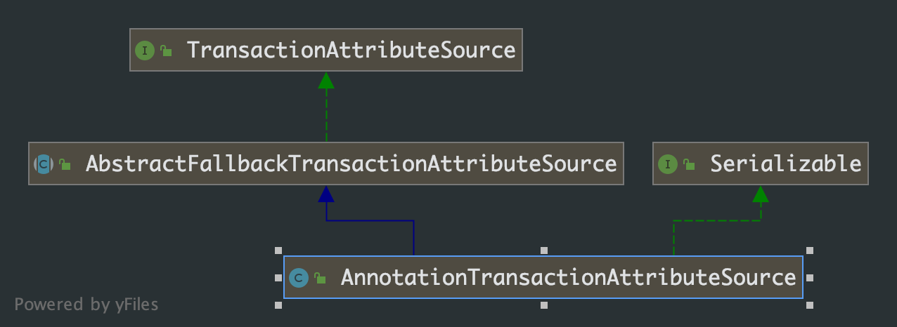
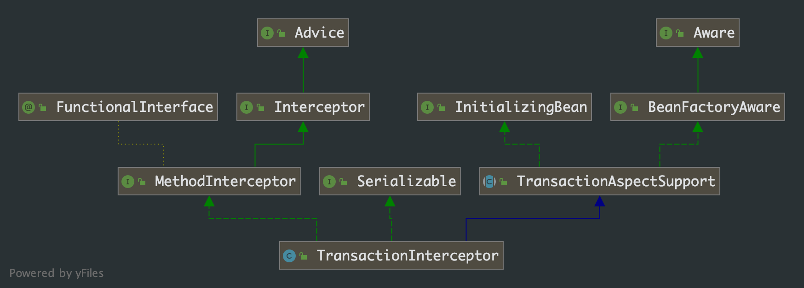
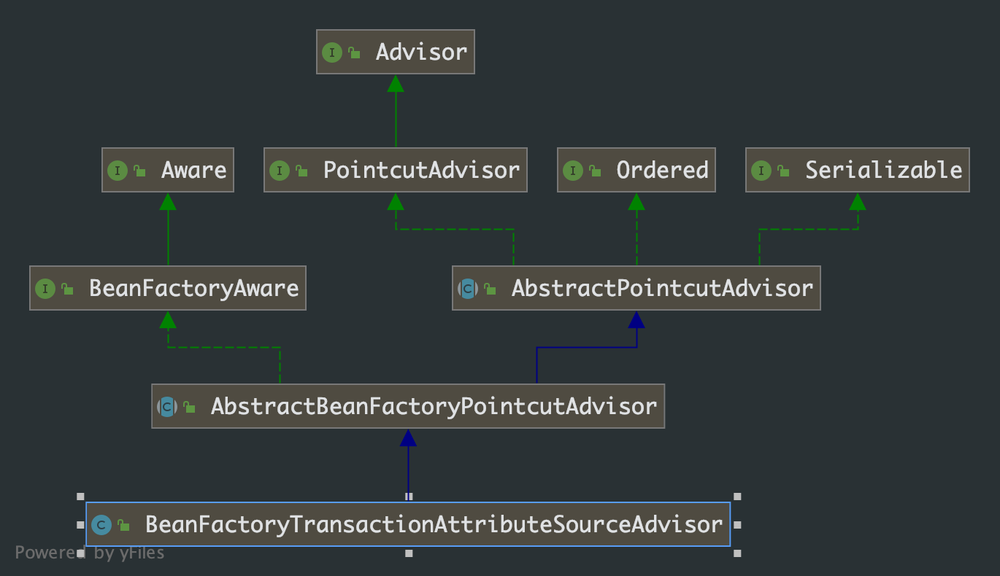
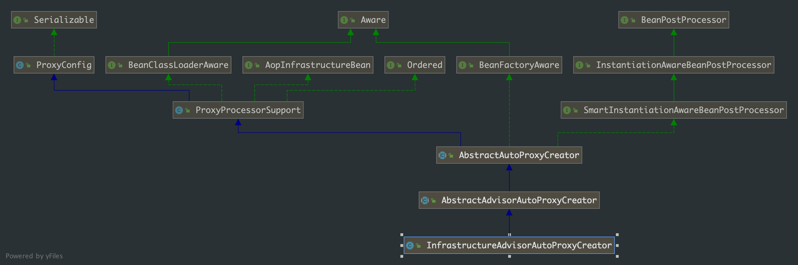

## 第 3 章 Spring 事务

事务，作为后端工程师不可避免的话题，相关的介绍已经相当的多了，从最基础的手动获取连接、开启事务、提交和回滚等等，就不在详细说了。关于 Spring 中设置为各种设置，各个配置的含义等也不再具体说明，具体的可以查查资料。这篇文章主要分析 Spring 事务的创建和调用过程。

### 3.1 Spring 事务的创建过程

配置文件

```xml
<tx:annotation-driven/>

<bean id="transactionManager" class="org.springframework.jdbc.datasource.DataSourceTransactionManager">
		<property name="dataSource" ref="dataSource"/>
</bean>
```

从配置文件中，我们很容易知道 `<tx:annotation-driven/>`配置是事务的开关，对它 的处理需要自定义处理 handler。在 `spring-tx`包中找到配置文件

```java
http\://www.springframework.org/schema/tx=org.springframework.transaction.config.TxNamespaceHandler
```

```java
public class TxNamespaceHandler extends NamespaceHandlerSupport {

    static final String TRANSACTION_MANAGER_ATTRIBUTE = "transaction-manager";

    static final String DEFAULT_TRANSACTION_MANAGER_BEAN_NAME = "transactionManager";


    static String getTransactionManagerName(Element element) {
        return (element.hasAttribute(TRANSACTION_MANAGER_ATTRIBUTE) ?
                element.getAttribute(TRANSACTION_MANAGER_ATTRIBUTE) : DEFAULT_TRANSACTION_MANAGER_BEAN_NAME);
    }


    @Override
    public void init() {
        registerBeanDefinitionParser("advice", new TxAdviceBeanDefinitionParser());
        registerBeanDefinitionParser("annotation-driven", new AnnotationDrivenBeanDefinitionParser());
        registerBeanDefinitionParser("jta-transaction-manager", new JtaTransactionManagerBeanDefinitionParser());
    }

}
```

Spring 使用 `AnnotationDrivenBeanDefinitionParser` 来处理对 `<tx:annotation-driven/>`进行解析。

```java
public BeanDefinition parse(Element element, ParserContext parserContext) {
		registerTransactionalEventListenerFactory(parserContext);
		String mode = element.getAttribute("mode");
		if ("aspectj".equals(mode)) {
			// mode="aspectj"
			registerTransactionAspect(element, parserContext);
			if (ClassUtils.isPresent("javax.transaction.Transactional", getClass().getClassLoader())) {
				registerJtaTransactionAspect(element, parserContext);
			}
		}
		else {
			// mode="proxy"
      // 重点对这个分支进行分析
			AopAutoProxyConfigurer.configureAutoProxyCreator(element, parserContext);
		}
		return null;
}
```

在解析中存在对于 mode 属性的判断，根据代码，如果我们需要使用 AspectJ 的方式进行事务切入(Spring 中的事务是以 AOP 为基础的)，那么可以使用这样的配置：

```xml
<tx:annotation-driven mode="aspectj"/>
```

#### 3.1.1 注册 InfrastructureAdvisorAutoProxyCreator

```java
public static void configureAutoProxyCreator(Element element, ParserContext parserContext) {
    // 这个和 aop 有关
  	AopNamespaceUtils.registerAutoProxyCreatorIfNecessary(parserContext, element);

    String txAdvisorBeanName = TransactionManagementConfigUtils.TRANSACTION_ADVISOR_BEAN_NAME;
    if (!parserContext.getRegistry().containsBeanDefinition(txAdvisorBeanName)) {
        Object eleSource = parserContext.extractSource(element);

      	// 创建 AnnotationTransactionAttributeSource 的 bean
        RootBeanDefinition sourceDef = new RootBeanDefinition(
                "org.springframework.transaction.annotation.AnnotationTransactionAttributeSource");
        sourceDef.setSource(eleSource);
        sourceDef.setRole(BeanDefinition.ROLE_INFRASTRUCTURE);
      	// 注册 bean，并使用Spring中定义规则生成 beanname
        String sourceName = parserContext.getReaderContext().registerWithGeneratedName(sourceDef);

      	// 创建 TransactionInterceptor 的 bean
        RootBeanDefinition interceptorDef = new RootBeanDefinition(TransactionInterceptor.class);
        interceptorDef.setSource(eleSource);
        interceptorDef.setRole(BeanDefinition.ROLE_INFRASTRUCTURE);
        registerTransactionManager(element, interceptorDef);
        interceptorDef.getPropertyValues().add("transactionAttributeSource", new RuntimeBeanReference(sourceName));
        String interceptorName = parserContext.getReaderContext().registerWithGeneratedName(interceptorDef);

      	// 创建 BeanFactoryTransactionAttributeSourceAdvisor 的 bean
        RootBeanDefinition advisorDef = new RootBeanDefinition(BeanFactoryTransactionAttributeSourceAdvisor.class);
        advisorDef.setSource(eleSource);
        advisorDef.setRole(BeanDefinition.ROLE_INFRASTRUCTURE);
      	// 将 sourceName 的 bean 注入 advisorDef 的 transactionAttributeSource 属性中
        advisorDef.getPropertyValues().add("transactionAttributeSource", new RuntimeBeanReference(sourceName));
      	// 将 interceptorName 的 bean 注入 advisorDef 的 adviceBeanName 属性中
        advisorDef.getPropertyValues().add("adviceBeanName", interceptorName);
      	// 如果配置了 order属性，则加入到 bean 中
        if (element.hasAttribute("order")) {
            advisorDef.getPropertyValues().add("order", element.getAttribute("order"));
        }
      	/**
      	 * 注册，注意名字 TransactionManagementConfigUtils.TRANSACTION_ADVISOR_BEAN_NAME
      	 * 即 org.springframework.transaction.config.internalTransactionAdvisor
      	 */
        parserContext.getRegistry().registerBeanDefinition(txAdvisorBeanName, advisorDef);

      	// 创建 CompositeComponentDefinition
        CompositeComponentDefinition compositeDef = new CompositeComponentDefinition(element.getTagName(), eleSource);
        compositeDef.addNestedComponent(new BeanComponentDefinition(sourceDef, sourceName));
        compositeDef.addNestedComponent(new BeanComponentDefinition(interceptorDef, interceptorName));
        compositeDef.addNestedComponent(new BeanComponentDefinition(advisorDef, txAdvisorBeanName));
        parserContext.registerComponent(compositeDef);
    }
}
```

上面的方法，主要做两件事：一个和 aop 有关，另一个就是注册了三个 bean。我们具体看下这三个bean：

- `AnnotationTransactionAttributeSource` 看名字猜测和事务的各种属性有关
- `TransactionInterceptor`，这个看名字也知道是事务处理的拦截器
- `BeanFactoryTransactionAttributeSourceAdvisor`，看名字和事务增强方法有些关系

看下这三个类的继承关系：







从类图上看，它们和我们的猜测差不多。继续看代码，方法的第一行处理虽然篇幅少但是却很重要。跟踪这个行数调用

```java
/**
 * 有了第 2 章我们的 aop 的创建过程，我们知道这个就是注册处理 aop 代理相关的类
 */
public static void registerAutoProxyCreatorIfNecessary(
			ParserContext parserContext, Element sourceElement) {

		BeanDefinition beanDefinition = AopConfigUtils.registerAutoProxyCreatorIfNecessary(
				parserContext.getRegistry(), parserContext.extractSource(sourceElement));
		useClassProxyingIfNecessary(parserContext.getRegistry(), sourceElement);
		registerComponentIfNecessary(beanDefinition, parserContext);
}

/**
 * 注册 InfrastructureAdvisorAutoProxyCreator 类型的 bean
 */
public static BeanDefinition registerAutoProxyCreatorIfNecessary(
			BeanDefinitionRegistry registry, @Nullable Object source) {

		return registerOrEscalateApcAsRequired(InfrastructureAdvisorAutoProxyCreator.class, registry, source);
}
```



从上面的层次结构中可以看到， InfrastructureAdvisorAutoProxyCreator 间接实现了 SmartlnstantiationAwareBeanPostProcessor，而 SmartlnstantiationAwareBeanPostProcessm 又继承自 InstantiationAwareBeanPostProcessor，也就是说在 Spring 中，所有 bean 实例化时 Spring 都会 保证调用其 postProcessAfterInitialization 方法，其实现是在父类 AbstractAutoProxyCreator 类中实现。

#### 3.1.2 spring 容器初始化时对 @Transactional 的处理

根据上面的分析，我们知道事务的处理和 aop 有关，我们直接在 `postProcessAfterInitialization `方法上打断点，结合上一章中对 aop 的分析过程。

```java
@Override
public Object postProcessAfterInitialization(@Nullable Object bean, String beanName) {
		if (bean != null) {
      	// 根据给定的 bean 的 class 和 name 构建出个 key, beanClassName_beanName
        Object cacheKey = getCacheKey(bean.getClass(), beanName);
        // 是否由于避免循环依赖而创建的 bean 代理
      	if (this.earlyProxyReferences.remove(cacheKey) != bean) {
            return wrapIfNecessary(bean, beanName, cacheKey);
        }
		}
		return bean;
}

/**
 * 找出指定 bean 对应的增强器
 * 根据找出的增强器创建代理
 */
protected Object wrapIfNecessary(Object bean, String beanName, Object cacheKey) {
    // 已经创建过
  	if (StringUtils.hasLength(beanName) && this.targetSourcedBeans.contains(beanName)) {
        return bean;
    }
    if (Boolean.FALSE.equals(this.advisedBeans.get(cacheKey))) {
        return bean;
    }
  	// 给定的 bean 类是否代表一个基础设施类，不应代理，或者配置了指定 bean 不需要自动代理
    if (isInfrastructureClass(bean.getClass()) || shouldSkip(bean.getClass(), beanName)) {
        this.advisedBeans.put(cacheKey, Boolean.FALSE);
        return bean;
    }

    // 创建代理
    Object[] specificInterceptors = getAdvicesAndAdvisorsForBean(bean.getClass(), beanName, null);
    if (specificInterceptors != DO_NOT_PROXY) {
        this.advisedBeans.put(cacheKey, Boolean.TRUE);
      	Object proxy = createProxy(
                bean.getClass(), beanName, specificInterceptors, new SingletonTargetSource(bean));
        this.proxyTypes.put(cacheKey, proxy.getClass());
        return proxy;
    }

    this.advisedBeans.put(cacheKey, Boolean.FALSE);
    return bean;
}

protected Object[] getAdvicesAndAdvisorsForBean(
        Class<?> beanClass, String beanName, @Nullable TargetSource targetSource) {

    List<Advisor> advisors = findEligibleAdvisors(beanClass, beanName);
    if (advisors.isEmpty()) {
        return DO_NOT_PROXY;
    }
    return advisors.toArray();
}

protected List<Advisor> findEligibleAdvisors(Class<?> beanClass, String beanName) {
		List<Advisor> candidateAdvisors = findCandidateAdvisors();
		List<Advisor> eligibleAdvisors = findAdvisorsThatCanApply(candidateAdvisors, beanClass, beanName);
		extendAdvisors(eligibleAdvisors);
		if (!eligibleAdvisors.isEmpty()) {
				eligibleAdvisors = sortAdvisors(eligibleAdvisors);
		}
		return eligibleAdvisors;
}
```

**寻找可选的增强器：**

```java
protected List<Advisor> findCandidateAdvisors() {
		Assert.state(this.advisorRetrievalHelper != null, "No BeanFactoryAdvisorRetrievalHelper available");
		return this.advisorRetrievalHelper.findAdvisorBeans();
}

public List<Advisor> findAdvisorBeans() {
    // Determine list of advisor bean names, if not cached already.
    String[] advisorNames = this.cachedAdvisorBeanNames;
    /**
     * spring 容器创建第一个 bean 对象时，cachedAdvisorBeanNames 必然为空
     */
  	if (advisorNames == null) {
      	/**
      	 * 根据 Advisor 类型查找注册的 bean
      	 * 解析 tx 标签时，就往容器中注册了 名为 internalTransactionAdvisor，
      	 * 类型是 BeanFactoryTransactionAttributeSourceAdvisor 的 bean
      	 */
        advisorNames = BeanFactoryUtils.beanNamesForTypeIncludingAncestors(
                this.beanFactory, Advisor.class, true, false);
        this.cachedAdvisorBeanNames = advisorNames;
    }
    if (advisorNames.length == 0) {
        return new ArrayList<>();
    }

    List<Advisor> advisors = new ArrayList<>();
    for (String name : advisorNames) {
        if (isEligibleBean(name)) {
            if (this.beanFactory.isCurrentlyInCreation(name)) {
                if (logger.isTraceEnabled()) {
                    logger.trace("Skipping currently created advisor '" + name + "'");
                }
            }
            else {
                try {
                    advisors.add(this.beanFactory.getBean(name, Advisor.class));
                }
                catch (BeanCreationException ex) {
                    Throwable rootCause = ex.getMostSpecificCause();
                    if (rootCause instanceof BeanCurrentlyInCreationException) {
                        BeanCreationException bce = (BeanCreationException) rootCause;
                        String bceBeanName = bce.getBeanName();
                        if (bceBeanName != null && this.beanFactory.isCurrentlyInCreation(bceBeanName)) {
                            if (logger.isTraceEnabled()) {
                                logger.trace("Skipping advisor '" + name +
                                        "' with dependency on currently created bean: " + ex.getMessage());
                            }
                            // Ignore: indicates a reference back to the bean we're trying to advise.
                            // We want to find advisors other than the currently created bean itself.
                            continue;
                        }
                    }
                    throw ex;
                }
            }
        }
    }
    return advisors;
}
```

在候选增强器中找到匹配的增强器：

```java
protected List<Advisor> findAdvisorsThatCanApply(
        List<Advisor> candidateAdvisors, Class<?> beanClass, String beanName) {

    ProxyCreationContext.setCurrentProxiedBeanName(beanName);
    try {
        return AopUtils.findAdvisorsThatCanApply(candidateAdvisors, beanClass);
    }
    finally {
        ProxyCreationContext.setCurrentProxiedBeanName(null);
    }
}

public static List<Advisor> findAdvisorsThatCanApply(List<Advisor> candidateAdvisors, Class<?> clazz) {
    if (candidateAdvisors.isEmpty()) {
        return candidateAdvisors;
    }
    List<Advisor> eligibleAdvisors = new ArrayList<>();
    // 首选处理引介增强器
  	for (Advisor candidate : candidateAdvisors) {
        if (candidate instanceof IntroductionAdvisor && canApply(candidate, clazz)) {
            eligibleAdvisors.add(candidate);
        }
    }
    boolean hasIntroductions = !eligibleAdvisors.isEmpty();
    for (Advisor candidate : candidateAdvisors) {
        // 跳出引介增强器，上面已经处理过了
      	if (candidate instanceof IntroductionAdvisor) {
            // already processed
            continue;
        }
      	/**
         * 对于普通 bean 的处理
         * 这里的 candidate 就是 BeanFactoryTransactionAttributeSourceAdvisor
         */
        if (canApply(candidate, clazz, hasIntroductions)) {
            eligibleAdvisors.add(candidate);
        }
    }
    return eligibleAdvisors;
}


public static boolean canApply(Advisor advisor, Class<?> targetClass, boolean hasIntroductions) {
    if (advisor instanceof IntroductionAdvisor) {
        return ((IntroductionAdvisor) advisor).getClassFilter().matches(targetClass);
    }
  	// 根据 BeanFactoryTransactionAttributeSourceAdvisor 继承关系，走这个分支
    else if (advisor instanceof PointcutAdvisor) {
        PointcutAdvisor pca = (PointcutAdvisor) advisor;
        return canApply(pca.getPointcut(), targetClass, hasIntroductions);
    }
    else {
        return true;
    }
}

public static boolean canApply(Pointcut pc, Class<?> targetClass, boolean hasIntroductions) {
    Assert.notNull(pc, "Pointcut must not be null");
    // 判断 targetClass 是否可以被代理，不能的话直接返回
  	if (!pc.getClassFilter().matches(targetClass)) {
        return false;
    }

  	// 检查是否对所有方法都要进行代理
    MethodMatcher methodMatcher = pc.getMethodMatcher();
    if (methodMatcher == MethodMatcher.TRUE) {
        // No need to iterate the methods if we're matching any method anyway...
        return true;
    }

    IntroductionAwareMethodMatcher introductionAwareMethodMatcher = null;
    if (methodMatcher instanceof IntroductionAwareMethodMatcher) {
        introductionAwareMethodMatcher = (IntroductionAwareMethodMatcher) methodMatcher;
    }

  	// 被代理的类以及其实现的接口
    Set<Class<?>> classes = new LinkedHashSet<>();
    if (!Proxy.isProxyClass(targetClass)) {
        classes.add(ClassUtils.getUserClass(targetClass));
    }
    classes.addAll(ClassUtils.getAllInterfacesForClassAsSet(targetClass));

  	// 遍历类以及接口定义的方法，是否与当前的增强器匹配
    for (Class<?> clazz : classes) {
        Method[] methods = ReflectionUtils.getAllDeclaredMethods(clazz);
        for (Method method : methods) {
            if (introductionAwareMethodMatcher != null ?
                    introductionAwareMethodMatcher.matches(method, targetClass, hasIntroductions) :
                    methodMatcher.matches(method, targetClass)) {
                return true;
            }
        }
    }

    return false;
}
```

**检测方法的事务配置时的处理**

```java
abstract class TransactionAttributeSourcePointcut extends StaticMethodMatcherPointcut implements Serializable {

    @Override
    public boolean matches(Method method, Class<?> targetClass) {
        // 这里得到便是 TransactionAttributeSource 的 bean
        TransactionAttributeSource tas = getTransactionAttributeSource();
        return (tas == null || tas.getTransactionAttribute(method, targetClass) != null);
    }

}


public TransactionAttribute getTransactionAttribute(Method method, @Nullable Class<?> targetClass) {
    // Object 类型跳过
  	if (method.getDeclaringClass() == Object.class) {
        return null;
    }

  	/**
  	 * 尝试从缓存加载事务信息
  	 */
    Object cacheKey = getCacheKey(method, targetClass);
    TransactionAttribute cached = this.attributeCache.get(cacheKey);
    if (cached != null) {
        // Value will either be canonical value indicating there is no transaction attribute,
        // or an actual transaction attribute.
        if (cached == NULL_TRANSACTION_ATTRIBUTE) {
            return null;
        }
        else {
            return cached;
        }
    }
    else {
        // 缓存中没有，则进行解析
        TransactionAttribute txAttr = computeTransactionAttribute(method, targetClass);
        // 缓存解析的结果
        if (txAttr == null) {
            this.attributeCache.put(cacheKey, NULL_TRANSACTION_ATTRIBUTE);
        }
        else {
            String methodIdentification = ClassUtils.getQualifiedMethodName(method, targetClass);
            if (txAttr instanceof DefaultTransactionAttribute) {
                ((DefaultTransactionAttribute) txAttr).setDescriptor(methodIdentification);
            }
            if (logger.isTraceEnabled()) {
                logger.trace("Adding transactional method '" + methodIdentification + "' with attribute: " + txAttr);
            }
            this.attributeCache.put(cacheKey, txAttr);
        }
        return txAttr;
    }
}

/**
 * 获取事务信息
 */
protected TransactionAttribute computeTransactionAttribute(Method method, @Nullable Class<?> targetClass) {
    // Don't allow no-public methods as required.
    if (allowPublicMethodsOnly() && !Modifier.isPublic(method.getModifiers())) {
        return null;
    }

    // The method may be on an interface, but we need attributes from the target class.
    // If the target class is null, the method will be unchanged.
  	/**
     * method 代表接口中的方法
     * specificMethod 代表实现类里的方法
     */
    Method specificMethod = AopUtils.getMostSpecificMethod(method, targetClass);

  	// 首先，在方法中查找事务声明
    TransactionAttribute txAttr = findTransactionAttribute(specificMethod);
    if (txAttr != null) {
        return txAttr;
    }

  	// 方法中没有，则在类中查找事务声明
    txAttr = findTransactionAttribute(specificMethod.getDeclaringClass());
    if (txAttr != null && ClassUtils.isUserLevelMethod(method)) {
        return txAttr;
    }

  	// 如果存在接口，则尝试在接口层次查找
    if (specificMethod != method) {
      	// 在接口方法上查找事务声明
        txAttr = findTransactionAttribute(method);
        if (txAttr != null) {
            return txAttr;
        }
      	// 在接口的类中查找事务声明
        txAttr = findTransactionAttribute(method.getDeclaringClass());
        if (txAttr != null && ClassUtils.isUserLevelMethod(method)) {
            return txAttr;
        }
    }

    return null;
}
```

上面的方法就是获取事务属性的规则：如果方法中存在事务属性，则使用方法上的属性，否则使用方法所在类上的属性；如果所在类上还是没有找到事务属性，那么在去接口中的方法查找，还没有查找到，则最后去查询接口上面是否有事务声明。


```java
protected TransactionAttribute findTransactionAttribute(Method method) {
		return determineTransactionAttribute(method);
}

protected TransactionAttribute determineTransactionAttribute(AnnotatedElement element) {
    /**
     * 这里的 annotationParsers 是在当前类 AnnotationTransactionAttributeSource 初始化时初始化的
     * SpringTransactionAnnotationParser 被加入其中
     */
  	for (TransactionAnnotationParser parser : this.annotationParsers) {
        TransactionAttribute attr = parser.parseTransactionAnnotation(element);
        if (attr != null) {
            return attr;
        }
    }
    return null;
}

public class SpringTransactionAnnotationParser implements TransactionAnnotationParser, Serializable {


    @Override
    @Nullable
    public TransactionAttribute parseTransactionAnnotation(AnnotatedElement element) {
        AnnotationAttributes attributes = AnnotatedElementUtils.findMergedAnnotationAttributes(
                element, Transactional.class, false, false);
        if (attributes != null) {
            return parseTransactionAnnotation(attributes);
        }
        else {
            return null;
        }
    }

    public TransactionAttribute parseTransactionAnnotation(Transactional ann) {
        return parseTransactionAnnotation(AnnotationUtils.getAnnotationAttributes(ann, false, false));
    }

  	/**
  	 * 这个方法，看着应该属性。就是解析事务的各种属性：隔离级别、超时时间、回滚策略等
  	 */
    protected TransactionAttribute parseTransactionAnnotation(AnnotationAttributes attributes) {
        RuleBasedTransactionAttribute rbta = new RuleBasedTransactionAttribute();

        Propagation propagation = attributes.getEnum("propagation");
        rbta.setPropagationBehavior(propagation.value());
        Isolation isolation = attributes.getEnum("isolation");
        rbta.setIsolationLevel(isolation.value());
        rbta.setTimeout(attributes.getNumber("timeout").intValue());
        rbta.setReadOnly(attributes.getBoolean("readOnly"));
        rbta.setQualifier(attributes.getString("value"));

        List<RollbackRuleAttribute> rollbackRules = new ArrayList<>();
        for (Class<?> rbRule : attributes.getClassArray("rollbackFor")) {
            rollbackRules.add(new RollbackRuleAttribute(rbRule));
        }
        for (String rbRule : attributes.getStringArray("rollbackForClassName")) {
            rollbackRules.add(new RollbackRuleAttribute(rbRule));
        }
        for (Class<?> rbRule : attributes.getClassArray("noRollbackFor")) {
            rollbackRules.add(new NoRollbackRuleAttribute(rbRule));
        }
        for (String rbRule : attributes.getStringArray("noRollbackForClassName")) {
            rollbackRules.add(new NoRollbackRuleAttribute(rbRule));
        }
        rbta.setRollbackRules(rollbackRules);

        return rbta;
    }

}
```

至此，事务标签的解析过程完成，事务的初始化工作便结束了，即判断某个 bean适用于事务增强即 `BeanFactoryTransactionAttributeSourceAdvisor`。所以说，在解析标签 tx 时注入的这个类成为了整个事务的基础。`BeanFactoryTransactionAttributeSourceAdvisor` 作为 `Advisor` 的实现类，自然要遵从 `Advisor` 的处理方式，当代理被调用时会调用这个类的增强方法，也就是此  bean  的  `Advise`， 又因为在 解析事务定义标签时我们把 `Transactionlnterceptor` 类型的 bean 注入到了 `BeanFactory TransactionAttributeSourceAdvisor `中，所以，在调用事务增强器增强的代理类时会首先执行 `Transactionlnterceptor` 进行增强（优先执行拦截器），同时，也就是在 `Transactionlnterceptor` 类中的 `invoke`方法中完成了整个事务的逻辑。

### 3.2 事务增强器

`Transactionlnterceptor` 支撑着整个事务功能的架构，逻辑还是相对复杂的，定义了事务的处理流程。


`TransactionInterceptor` 继承 `MethodInterceptor`接口，拦截器接口的 `invoke`方法是调用的入口，首先预览下这个方法

```java
public class TransactionInterceptor extends TransactionAspectSupport implements MethodInterceptor, Serializable {

    public Object invoke(MethodInvocation invocation) throws Throwable {
        // Work out the target class: may be {@code null}.
        // The TransactionAttributeSource should be passed the target class
        // as well as the method, which may be from an interface.
        Class<?> targetClass = (invocation.getThis() != null ? AopUtils.getTargetClass(invocation.getThis()) : null);

        // Adapt to TransactionAspectSupport's invokeWithinTransaction...
        return invokeWithinTransaction(invocation.getMethod(), targetClass, invocation::proceed);
    }

}
```

事务执行委托给了父类 TransactionAspectSupport 中的方法

```java
public abstract class TransactionAspectSupport implements BeanFactoryAware, InitializingBean {

    protected Object invokeWithinTransaction(Method method, @Nullable Class<?> targetClass,
            final InvocationCallback invocation) throws Throwable {

        // If the transaction attribute is null, the method is non-transactional.
        TransactionAttributeSource tas = getTransactionAttributeSource();
        // 获取对应的事务属性
      	final TransactionAttribute txAttr = (tas != null ? tas.getTransactionAttribute(method, targetClass) : null);
      	// 获取 beanFactory 中 transactionManager
        final TransactionManager tm = determineTransactionManager(txAttr);

        // 反应式事务支持
      	if (this.reactiveAdapterRegistry != null && tm instanceof ReactiveTransactionManager) {
            ReactiveTransactionSupport txSupport = this.transactionSupportCache.computeIfAbsent(method, key -> {
                if (KotlinDetector.isKotlinType(method.getDeclaringClass()) && KotlinDelegate.isSuspend(method)) {
                    throw new TransactionUsageException(
                            "Unsupported annotated transaction on suspending function detected: " + method +
                            ". Use TransactionalOperator.transactional extensions instead.");
                }
                ReactiveAdapter adapter = this.reactiveAdapterRegistry.getAdapter(method.getReturnType());
                if (adapter == null) {
                    throw new IllegalStateException("Cannot apply reactive transaction to non-reactive return type: " +
                            method.getReturnType());
                }
                return new ReactiveTransactionSupport(adapter);
            });
            return txSupport.invokeWithinTransaction(
                    method, targetClass, invocation, txAttr, (ReactiveTransactionManager) tm);
        }

        PlatformTransactionManager ptm = asPlatformTransactionManager(tm);
        // 构造方法唯一标识 —— 类.方法
      	final String joinpointIdentification = methodIdentification(method, targetClass, txAttr);

      	// 声明式事务处理
        if (txAttr == null || !(ptm instanceof CallbackPreferringPlatformTransactionManager)) {
          	// 创建 TransactionInfo
            TransactionInfo txInfo = createTransactionIfNecessary(ptm, txAttr, joinpointIdentification);

            Object retVal;
            try {
                // This is an around advice: Invoke the next interceptor in the chain.
                // This will normally result in a target object being invoked.
                retVal = invocation.proceedWithInvocation();
            }
            catch (Throwable ex) {
                // target invocation exception
                completeTransactionAfterThrowing(txInfo, ex);
                throw ex;
            }
            finally {
                cleanupTransactionInfo(txInfo);
            }

            if (vavrPresent && VavrDelegate.isVavrTry(retVal)) {
                // Set rollback-only in case of Vavr failure matching our rollback rules...
                TransactionStatus status = txInfo.getTransactionStatus();
                if (status != null && txAttr != null) {
                    retVal = VavrDelegate.evaluateTryFailure(retVal, txAttr, status);
                }
            }
						// 提交事务
            commitTransactionAfterReturning(txInfo);
            return retVal;
        }
				// 编程式事务处理
        else {
            final ThrowableHolder throwableHolder = new ThrowableHolder();

            // It's a CallbackPreferringPlatformTransactionManager: pass a TransactionCallback in.
            try {
                Object result = ((CallbackPreferringPlatformTransactionManager) ptm).execute(txAttr, status -> {
                    TransactionInfo txInfo = prepareTransactionInfo(ptm, txAttr, joinpointIdentification, status);
                    try {
                        Object retVal = invocation.proceedWithInvocation();
                        if (vavrPresent && VavrDelegate.isVavrTry(retVal)) {
                            // Set rollback-only in case of Vavr failure matching our rollback rules...
                            retVal = VavrDelegate.evaluateTryFailure(retVal, txAttr, status);
                        }
                        return retVal;
                    }
                    catch (Throwable ex) {
                        if (txAttr.rollbackOn(ex)) {
                            // A RuntimeException: will lead to a rollback.
                            if (ex instanceof RuntimeException) {
                                throw (RuntimeException) ex;
                            }
                            else {
                                throw new ThrowableHolderException(ex);
                            }
                        }
                        else {
                            // A normal return value: will lead to a commit.
                            throwableHolder.throwable = ex;
                            return null;
                        }
                    }
                    finally {
                        cleanupTransactionInfo(txInfo);
                    }
                });

                // Check result state: It might indicate a Throwable to rethrow.
                if (throwableHolder.throwable != null) {
                    throw throwableHolder.throwable;
                }
                return result;
            }
            catch (ThrowableHolderException ex) {
                throw ex.getCause();
            }
            catch (TransactionSystemException ex2) {
                if (throwableHolder.throwable != null) {
                    logger.error("Application exception overridden by commit exception", throwableHolder.throwable);
                    ex2.initApplicationException(throwableHolder.throwable);
                }
                throw ex2;
            }
            catch (Throwable ex2) {
                if (throwableHolder.throwable != null) {
                    logger.error("Application exception overridden by commit exception", throwableHolder.throwable);
                }
                throw ex2;
            }
        }
    }
    
}
```

事务处理流程，在这个方法里定义的很清楚了。对于这个方法中具体的各个方法，读源码还是可以很容易的搞清楚它们的作用。就不在详细剖析了。