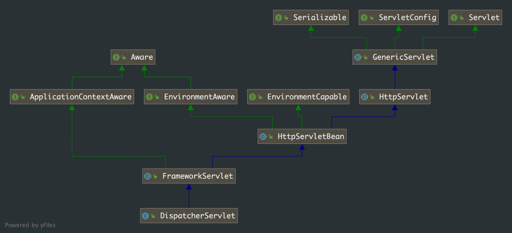

## 第 4 章 Spring MVC 解析

我们大部分人日常的开发工作可能就是 web 开发，web 开发中很重要的一块就是 Spring MVC。现在就从 Spring MVC 的原理、创建过程、使用等方面来解析下 Spring 的源码。

做过 web 开发的都知道，我们开的 web 应用最终是要部署在Tomcat、jetty 这类的 servlet容器中运行的。Spring 的 MVC 是基于Servlet功能实现的，通过实现 Servlet 接口的 DispatcherServlet 来封装其核心功能实现。

这篇文章对应的项目实例：

### 4.1 Spring MVC 请求流程详解


具体步骤：

1. 发起请求到前端控制器(DispatcherServlet)
2. 前端控制器请求HandlerMapping查找 Handler （可以根据xml配置、注解进行查找）
3. 处理器映射器HandlerMapping向前端控制器返回Handler，HandlerMapping会把请求映射为HandlerExecutionChain对象（包含一个Handler处理器（页面控制器）对象，多个HandlerInterceptor拦截器对象），通过这种策略模式，很容易添加新的映射策略
4. 前端控制器调用处理器适配器去执行Handler
5. 处理器适配器HandlerAdapter将会根据适配的结果去执行Handler
6. Handler执行完成给适配器返回ModelAndView
7. 处理器适配器向前端控制器返回ModelAndView （ModelAndView是springmvc框架的一个底层对象，包括 Model和view）
8. 前端控制器请求视图解析器去进行视图解析 （根据逻辑视图名解析成真正的视图(jsp)），通过这种策略很容易更换其他视图技术，只需要更改视图解析器即可
9. 视图解析器向前端控制器返回View
10. 前端控制器进行视图渲染 （视图渲染将模型数据(在ModelAndView对象中)填充到request域）
11. 前端控制器向用户响应结果

###  4.2 Spring MVC 源码解读

Spring MVC 项目中最重要的就是 web.xml 配置文件。我们先来看看文件的内容(以文章开头的项目作为探讨主题)

```xml
<!DOCTYPE web-app PUBLIC
        "-//Sun Microsystems, Inc.//DTD Web Application 2.3//EN" "http://java.sun.com/dtd/web-app_2_3.dtd" >

<web-app xmlns="http://xmlns.jcp.org/xml/ns/javaee"
         xmlns:xsi="http://www.w3.org/2001/XMLSchema-instance"
         xsi:schemaLocation="http://xmlns.jcp.org/xml/ns/javaee http://xmlns.jcp.org/xml/ns/javaee/web-app_3_1.xsd"
         version="3.1">
    <display-name>Archetype Created Web Application</display-name>

    <welcome-file-list>
        <welcome-file>index.jsp</welcome-file>
    </welcome-file-list>

    <context-param>
        <param-name>contextConfigLocation</param-name>
        <param-value>/WEB-INF/applicationContext.xml</param-value>
    </context-param>

    <listener>
        <listener-class>org.springframework.web.context.ContextLoaderListener</listener-class>
    </listener>

    <servlet>
        <servlet-name>dispatcher</servlet-name>
        <servlet-class>org.springframework.web.servlet.DispatcherServlet</servlet-class>
        <init-param>
            <!--配置dispatcher.xml作为mvc的配置文件-->
            <param-name>contextConfigLocation</param-name>
            <param-value>/WEB-INF/dispatcher-servlet.xml</param-value>
        </init-param>
        <load-on-startup>1</load-on-startup>
    </servlet>
    <servlet-mapping>
        <servlet-name>dispatcher</servlet-name>
        <url-pattern>/</url-pattern>
    </servlet-mapping>
</web-app>
```

web.xml 中各个配置的意义我们先不说，看源码时我们在讨论。从这份配置中，我们应该知道，最重要的就是`ContextLoaderListener` 和 `DispatcherServlet`这两个类。我们就主要从这两个类入手。

#### 4.2.1 ContextLoaderListener


从`ContextLoaderListener` 类图中我们知道

- 父类 `org.springframework.web.context.ContextLoader`
- 接口 `javax.servlet.ServlerContextListener`

到这里我们可以大胆的解释 `ContextLoader`和 Spring 容器有关，`ServeletContextListener`和 Servlet 容器（即和tomcat有关）

我们借助 Idea 使用 Tomcat 部署项目 debug 进行验证。下图是我打断点的位置


我们得到了调用栈：


从调用栈上我们知道 `org.apache.cataline.core.StandardContext.listenerStart()`方法肯定和 Tomcat 容器有关，在根据类和方法名我们大致可以知道该方法是在 Servlet 容器启动时触发对 Servlet 容器启动进行监听的方法。在 Spring MVC 里就是 `ContextLoaderListener`类的`contextInitialized`方法。

```java
/**
 * Initialize the root web application context.
 */
@Override
public void contextInitialized(ServletContextEvent event) {
    initWebApplicationContext(event.getServletContext());
}
```

从方法命名和注释我们知道这个方法是用来初始化 Spring 的 XmlApplicationContext 容器的。我们看下具体的方法

```java
public class ContextLoader {
    public WebApplicationContext initWebApplicationContext(ServletContext servletContext) {
        if (servletContext.getAttribute(WebApplicationContext.ROOT_WEB_APPLICATION_CONTEXT_ATTRIBUTE) != null) {
          	// web.xml 中存在多个 ContextLoaderListener 定义
            throw new IllegalStateException(
                    "Cannot initialize context because there is already a root application context present - " +
                    "check whether you have multiple ContextLoader* definitions in your web.xml!");
        }

        servletContext.log("Initializing Spring root WebApplicationContext");
        Log logger = LogFactory.getLog(ContextLoader.class);
        if (logger.isInfoEnabled()) {
            logger.info("Root WebApplicationContext: initialization started");
        }
        long startTime = System.currentTimeMillis();

        try {
            // Store context in local instance variable, to guarantee that
            // it is available on ServletContext shutdown.
            if (this.context == null) {
              	// 初始化 Spring web 容器
                this.context = createWebApplicationContext(servletContext);
            }
            if (this.context instanceof ConfigurableWebApplicationContext) {
                ConfigurableWebApplicationContext cwac = (ConfigurableWebApplicationContext) this.context;
                if (!cwac.isActive()) {
                    // The context has not yet been refreshed -> provide services such as
                    // setting the parent context, setting the application context id, etc
                    if (cwac.getParent() == null) {
                        // The context instance was injected without an explicit parent ->
                        // determine parent for root web application context, if any.
                        ApplicationContext parent = loadParentContext(servletContext);
                        cwac.setParent(parent);
                    }
                    configureAndRefreshWebApplicationContext(cwac, servletContext);
                }
            }
          	// 将 webApplicationContext 容器添加到 Servlet 容器的上下文
            servletContext.setAttribute(WebApplicationContext.ROOT_WEB_APPLICATION_CONTEXT_ATTRIBUTE, this.context);

            ClassLoader ccl = Thread.currentThread().getContextClassLoader();
            if (ccl == ContextLoader.class.getClassLoader()) {
                currentContext = this.context;
            }
            else if (ccl != null) {
                currentContextPerThread.put(ccl, this.context);
            }

            if (logger.isInfoEnabled()) {
                long elapsedTime = System.currentTimeMillis() - startTime;
                logger.info("Root WebApplicationContext initialized in " + elapsedTime + " ms");
            }

            return this.context;
        }
        catch (RuntimeException | Error ex) {
            logger.error("Context initialization failed", ex);
            servletContext.setAttribute(WebApplicationContext.ROOT_WEB_APPLICATION_CONTEXT_ATTRIBUTE, ex);
            throw ex;
        }
    }
}
```

上述方法功能也比较容易理解：ServletContext 容器启动时，新建一个 WebApplicationContext 的 spring 容器并将它添加到 ServletContext 的上下文中，这里存在 webApplicationContext 的唯一性检测。

**创建 WebApplicationContext**

```java
/**
 * 创建并实例化 WebApplicationContext 容器
 */
protected WebApplicationContext createWebApplicationContext(ServletContext sc) {
    Class<?> contextClass = determineContextClass(sc);
    if (!ConfigurableWebApplicationContext.class.isAssignableFrom(contextClass)) {
        throw new ApplicationContextException("Custom context class [" + contextClass.getName() +
                "] is not of type [" + ConfigurableWebApplicationContext.class.getName() + "]");
    }
    return (ConfigurableWebApplicationContext) BeanUtils.instantiateClass(contextClass);
}

protected Class<?> determineContextClass(ServletContext servletContext) {
    String contextClassName = servletContext.getInitParameter(CONTEXT_CLASS_PARAM);
    if (contextClassName != null) {
        try {
            return ClassUtils.forName(contextClassName, ClassUtils.getDefaultClassLoader());
        }
        catch (ClassNotFoundException ex) {
            throw new ApplicationContextException(
                    "Failed to load custom context class [" + contextClassName + "]", ex);
        }
    }
    else {
        contextClassName = defaultStrategies.getProperty(WebApplicationContext.class.getName());
        try {
            return ClassUtils.forName(contextClassName, ContextLoader.class.getClassLoader());
        }
        catch (ClassNotFoundException ex) {
            throw new ApplicationContextException(
                    "Failed to load default context class [" + contextClassName + "]", ex);
        }
    }
}
```

#### 4.2.2 DispatcherServlet

我们接下来分析下`DispatcherServlet` 的初始化过程。先看类图



`DispatcherServlet`的继承关系就比较复杂，一时难以找到分析的入口。`DispatcherServlet`虽然继承关系复杂，但在  web  应用场景中它最重要的角色是 `Servlet` 的实现类。

我们知道 Servlet 容器中 Servlet 的初始化时会调用 `init()`方法，关于 `Servlet.init()`方法有如下知识点：

- init 方式初始化有两个方式
  - 启动 tomcat 后，当第一次访问 servlet 类的时候，会调用 init 方法
  - 启动 tomcat 直接调用 init 方法，这种方式需要配置 web.xml 文件
- 配置方式由 tomcat 直接调用，需要配置 `<load-on-startup>1</load-on-startup>`:
  - 标记容器是否在启动的时候就加载这个 servlet
  - 当值为0或者大于0时，表示容器在应用启动时就加载这个servlet
  - 当是一个负数时或者没有指定时，则指示容器在该 servlet 被使用时才加载
  - 正数的值越小，启动该 servlet 的优先级越高

我们项目里的配置如下：

```xml
<servlet>
    <servlet-name>dispatcher</servlet-name>
    <servlet-class>org.springframework.web.servlet.DispatcherServlet</servlet-class>
    <init-param>
        <!--配置dispatcher.xml作为mvc的配置文件-->
        <param-name>contextConfigLocation</param-name>
        <param-value>/WEB-INF/dispatcher-servlet.xml</param-value>
    </init-param>
    <load-on-startup>1</load-on-startup>
</servlet>
```

我们项目中是在 Servlet 容器启动时调用 `DispatcherServlet.init()`方法，通过类继承关系我们可以`HttpServletBean` 抽象类中找到具体的 `init()` 方法。我们在这个方法上打上端点， debug 看看 `init`调用都做了些什么。

```java
public abstract class HttpServletBean extends HttpServlet implements EnvironmentCapable, EnvironmentAware {
    @Override
    public final void init() throws ServletException {
        // 解析 web.xml 中 DispatcherServelt 的 init-param 配置
        PropertyValues pvs = new ServletConfigPropertyValues(getServletConfig(), this.requiredProperties);
        if (!pvs.isEmpty()) {
            try {
              	// 将当前的这个 servlet 类转化为一个 BeanWrapper，从而能够以 Spring 的方式来对 init-param 的值进行注入
                BeanWrapper bw = PropertyAccessorFactory.forBeanPropertyAccess(this);
                ResourceLoader resourceLoader = new ServletContextResourceLoader(getServletContext());
                // 注册自定义属性编辑器，一旦遇到 Resource 类型的属性将会使用 ResourceEditor 进行解析
              	bw.registerCustomEditor(Resource.class, new ResourceEditor(resourceLoader, getEnvironment()));
              	// 空实现，留给子类实现
                initBeanWrapper(bw);
              	// 属性注入
                bw.setPropertyValues(pvs, true);
            }
            catch (BeansException ex) {
                if (logger.isErrorEnabled()) {
                    logger.error("Failed to set bean properties on servlet '" + getServletName() + "'", ex);
                }
                throw ex;
            }
        }

        // 类给子类扩展
        initServletBean();
    }
}
```

这个方法明显是模板模式的运用，父类定义了整个初始化的流程，子类只需要实现特定的方法即可。从这个方法中我们可以知道 `initServletBean()` 是子类需要实现的方法。我们接着看看子类实现时都做了些什么。

```java
public abstract class FrameworkServlet extends HttpServletBean implements ApplicationContextAware {
    /**
     * 这个函数方法直接负责的功能比较简单，用来统计初始化的执行时间
     * 最重要的是：调用了自身类的 initWebApplicationContext() 方法来完成初始化工作
     */
  	@Override
    protected final void initServletBean() throws ServletException {
        getServletContext().log("Initializing Spring " + getClass().getSimpleName() + " '" + getServletName() + "'");
        if (logger.isInfoEnabled()) {
            logger.info("Initializing Servlet '" + getServletName() + "'");
        }
        long startTime = System.currentTimeMillis();

        try {
            this.webApplicationContext = initWebApplicationContext();
            initFrameworkServlet();
        }
        catch (ServletException | RuntimeException ex) {
            logger.error("Context initialization failed", ex);
            throw ex;
        }

        if (logger.isDebugEnabled()) {
            String value = this.enableLoggingRequestDetails ?
                    "shown which may lead to unsafe logging of potentially sensitive data" :
                    "masked to prevent unsafe logging of potentially sensitive data";
            logger.debug("enableLoggingRequestDetails='" + this.enableLoggingRequestDetails +
                    "': request parameters and headers will be " + value);
        }

        if (logger.isInfoEnabled()) {
            logger.info("Completed initialization in " + (System.currentTimeMillis() - startTime) + " ms");
        }
    }
  
  	/**
  	 * 这个方法是重点，我们详细分析下它做了些什么
  	 */
  	protected WebApplicationContext initWebApplicationContext() {
        // 这里的 rootContext 就是 ContextLoader 被触发时生成的 WebApplicationContext 对象
      	WebApplicationContext rootContext =
                WebApplicationContextUtils.getWebApplicationContext(getServletContext());
        WebApplicationContext wac = null;

        if (this.webApplicationContext != null) {
            /**
             * 这个分支是 WebApplicationContext 通过构造函数注入进行初始化的
             * ps -> 我们的初始化方式不走该分支
             */
            wac = this.webApplicationContext;
            if (wac instanceof ConfigurableWebApplicationContext) {
                ConfigurableWebApplicationContext cwac = (ConfigurableWebApplicationContext) wac;
                if (!cwac.isActive()) {
                    // The context has not yet been refreshed -> provide services such as
                    // setting the parent context, setting the application context id, etc
                    if (cwac.getParent() == null) {
                        // The context instance was injected without an explicit parent -> set
                        // the root application context (if any; may be null) as the parent
                        cwac.setParent(rootContext);
                    }
                  	// 刷新上下文环境
                    configureAndRefreshWebApplicationContext(cwac);
                }
            }
        }
        if (wac == null) {
            // 根据 contextAttribute 属性加载 WebApplicationContext
            wac = findWebApplicationContext();
        }
        if (wac == null) {
            /**
             * 没有找到任何一个 WebApplicatonContext，则创建一个
             * 我们 web.xml 的配置是走的这个分支
             */
            wac = createWebApplicationContext(rootContext);
        }

      	// 这个地方判断下是否接收到 contextRefresh 事件，具体可以往下看。多一层保险，确保 DispatcherServlet 的 onRefresh 方法一定会被调用
        if (!this.refreshEventReceived) {
            synchronized (this.onRefreshMonitor) {
                onRefresh(wac);
            }
        }

        if (this.publishContext) {
            // Publish the context as a servlet context attribute.
            String attrName = getServletContextAttributeName();
            getServletContext().setAttribute(attrName, wac);
        }

        return wac;
    }
  
  	protected WebApplicationContext createWebApplicationContext(@Nullable WebApplicationContext parent) {
        return createWebApplicationContext((ApplicationContext) parent);
    }
  
  	protected WebApplicationContext createWebApplicationContext(@Nullable ApplicationContext parent) {
        // 获取 servlet 的初始化参数 contextClass，如果没有配置默认为 XmlWebApplicationContext.class
      	Class<?> contextClass = getContextClass();
        if (!ConfigurableWebApplicationContext.class.isAssignableFrom(contextClass)) {
            throw new ApplicationContextException(
                    "Fatal initialization error in servlet with name '" + getServletName() +
                    "': custom WebApplicationContext class [" + contextClass.getName() +
                    "] is not of type ConfigurableWebApplicationContext");
        }
      	// 通过反射方式实例化
        ConfigurableWebApplicationContext wac =
                (ConfigurableWebApplicationContext) BeanUtils.instantiateClass(contextClass);
				// 设置环境变量
        wac.setEnvironment(getEnvironment());
      	// 此处的 parent 就是 ContextLoaderListener 创建的 WebApplicationContext 对象
        wac.setParent(parent);
      	/**
         * 获取 contextConfigLocation 属性，配置在 servlet 初始化参数中
         * 即 web.xml 中 DispatcherServlet 的初始化参数
         */
        String configLocation = getContextConfigLocation();
        if (configLocation != null) {
            wac.setConfigLocation(configLocation);
        }
      	/**
         * 这个地方就是 Spring 容器初始化的入口,也就是最终会调用到 AbstractApplicationContext.refresh() 方法
         * 注意：refresh() --> finishRefresh() --> publishEvent(new ContextRefreshedEvent(this))，会发出容器 refresh 事件
         */
        configureAndRefreshWebApplicationContext(wac);

        return wac;
    }
}
```

注意：`createWebApplicationContext()` 方法中会发出 `ContextRefreshedEvent` 的事件通知。由于 `DispatcherServlet` 注册了该事件的监听 （DispatcherServlet 继承了 FrameworkServlet），最后就会触发 `DispatcherServlet.onRefresh()` 方法的调用

```java
public abstract class FrameworkServlet extends HttpServletBean implements ApplicationContextAware {
    
    public void onApplicationEvent(ContextRefreshedEvent event) {
        // 这个地方将标记位置为 true，还记得上文中 refreshEventReceived 的判断么？就是这里做了改变
      	this.refreshEventReceived = true;
        synchronized (this.onRefreshMonitor) {
            onRefresh(event.getApplicationContext());
        }
    }
}

public class DispatcherServlet extends FrameworkServlet {
    
    @Override
    protected void onRefresh(ApplicationContext context) {
        initStrategies(context);
    }

    protected void initStrategies(ApplicationContext context) {
        initMultipartResolver(context);
        initLocaleResolver(context);
        initThemeResolver(context);
        initHandlerMappings(context);
        initHandlerAdapters(context);
        initHandlerExceptionResolvers(context);
        initRequestToViewNameTranslator(context);
        initViewResolvers(context);
        initFlashMapManager(context);
    }
}
```

至此我们完成 `DispatcherServlet` 的整个实例化过程。

#### 4.2.3 DispatcherServlet 实例化时做了些什么

我们重点分析的就是 `initStrategies` 方法

```java
public class DispatcherServlet extends FrameworkServlet {

    protected void initStrategies(ApplicationContext context) {
        /**
         * 初始化 MultipartResolver
         * 在 Spring 中，MultipartRsolver 主要用来处理文件上传
         */
      	initMultipartResolver(context);
      	/**
      	 * 初始化 LocaleResolver
      	 * LocaleResolver 用来处理国际化配置的
      	 */
        initLocaleResolver(context);
      	/**
      	 * 初始化 ThemeResolver
      	 * ThemeResolver 用来处理网页的风格的
      	 */
        initThemeResolver(context);
      	/**
      	 * 初始化 HandlerMappings
      	 */
        initHandlerMappings(context);
      	/**
      	 * 初始化 HandlerAdapters
      	 */
        initHandlerAdapters(context);
      	/**
      	 * 初始化 HandlerExceptionResolvers
      	 */
        initHandlerExceptionResolvers(context);
      	/**
      	 * 初始化 RequestToViewNameTranslator
      	 */
        initRequestToViewNameTranslator(context);
      	/**
      	 * 初始化 ViewResolvers
      	 */
        initViewResolvers(context);
      	/**
      	 * 初始化 FlashMapManager
      	 */
        initFlashMapManager(context);
    }
}
```

部分方法解释：

- 初始化 HandlerMappings

  当客户端发出 Request 时 DispatcherServlet 会将 Request 提交给 HandlerMapping， 然后 HanlerMapping根据 WebApplication Context的配置来回传给 DispatcherServlet相应的 Controller。
  在基于 SpringMVC 的 Web 应用程序中，我们可以为 DispatcherServlet 提供多个 HandlerMapping 供其使用。 DispatcherServlet 在选用 HandlerMapping 的过程中，将根据我们所指定的一系列 HandlerMapping 的优先级进行排序， 然后优先使用优先级在前的 HandlerMapping。 如果当前的 HandlerMapping 能够返 回可用的 Handler，DispatcherServlet 则使用当前返回的 Handler 进行 Web 请求的处理，而不再继续询问其他的 HandierMapping。 否则， DispatcherServlet将继续按照各个 HandlerMapping 的优先级进行询问，直到获取一个可用的 Handler为止。

  ```java
  private void initHandlerMappings(ApplicationContext context) {
      this.handlerMappings = null;
  
      if (this.detectAllHandlerMappings) {
        // Find all HandlerMappings in the ApplicationContext, including ancestor contexts.
        Map<String, HandlerMapping> matchingBeans =
          BeanFactoryUtils.beansOfTypeIncludingAncestors(context, HandlerMapping.class, true, false);
        if (!matchingBeans.isEmpty()) {
          this.handlerMappings = new ArrayList<>(matchingBeans.values());
          // We keep HandlerMappings in sorted order.
          AnnotationAwareOrderComparator.sort(this.handlerMappings);
        }
      }
      else {
        try {
          HandlerMapping hm = context.getBean(HANDLER_MAPPING_BEAN_NAME, HandlerMapping.class);
          this.handlerMappings = Collections.singletonList(hm);
        }
        catch (NoSuchBeanDefinitionException ex) {
          // Ignore, we'll add a default HandlerMapping later.
        }
      }
  
      // 这里还没有的话，会加载默认的 handlerMapper，默认的配置在 DispatcherServlet.properties 文件中
      if (this.handlerMappings == null) {
         this.handlerMappings = getDefaultStrategies(context, HandlerMapping.class);
         if (logger.isTraceEnabled()) {
           logger.trace("No HandlerMappings declared for servlet '" + getServletName() +
                     "': using default strategies from DispatcherServlet.properties");
          }
      }
  }
  ```

  默认情况下， SpringMVC 将加载当前系统中所有实现了 HandlerMapping 接口的 bean。 如
  果只期望 SpringMVC 加载指定的 handlermapping 时，可以修改 web.xml 中的 DispatcherServlet
  的初始参数 ， 将 detectAllHandlerMappings 的值设置为 false:

  ```xml
  <init-pararn>
      <pararn-narne>detectAllHandlerMappings</pararn-narne>
      <pararn-value>false</pararn-value> 
  </init-pararn>
  ```

  我们项目中的配置如下：

  ```xml
  <bean id="simpleUrlHandlerMapping" class="org.springframework.web.servlet.handler.SimpleUrlHandlerMapping">
    <property name="urlMap">
      <map>
        <entry key="/per" value-ref="personController"/>
        <entry key="/hello" value-ref="helloController"/>
      </map>
    </property>
  </bean>
  <mvc:default-servlet-handler/>
  ```

  `simpleUrlHandlerMapping` 这个 bean 看名字应该也知道是用来注册 url 和 controller 之间的隐射关系的。`<mvc:default-servlet-handler/>`这个是用来配置默认的 handlerMapper 的。根据 Spring 中解析 `<mvc>`的原理我们可以找到 `MvcNamespaceHandler` 这个类，进而找到这么一行代码

  ```java
  registerBeanDefinitionParser("default-servlet-handler", new DefaultServletHandlerBeanDefinitionParser());
  ```

  具体在分析 `DefaultServletHandlerBeanDefinitionParser()` 方法，我们知道这里将来是会像 Spring 容器中注册

  `DefaultServletHttpRequestHandler`和 `SimpleUrlHandlerMapping` 两个 handlerMapper 的。

- 初始化 HandlerAdapters

  从名字也能联想到这是一个典型的适配器模式的使用，在计算机编程中，适配器模式将一 个类的接口适配成用户所期待的。 使用适配器，可以便接口不兼容而无法在一起工作的类协同 工作，做法是将类自己的接口包裹在一个己存在的类中 。 那么在处理 handler 时为什么会使用适配器模式呢?回答这个问题我们首先要分析它的初始化逻辑。

  ```java
  private void initHandlerAdapters(ApplicationContext context) {
      this.handlerAdapters = null;
  
      if (this.detectAllHandlerAdapters) {
          // Find all HandlerAdapters in the ApplicationContext, including ancestor contexts.
          Map<String, HandlerAdapter> matchingBeans =
                  BeanFactoryUtils.beansOfTypeIncludingAncestors(context, HandlerAdapter.class, true, false);
          if (!matchingBeans.isEmpty()) {
              this.handlerAdapters = new ArrayList<>(matchingBeans.values());
              // We keep HandlerAdapters in sorted order.
              AnnotationAwareOrderComparator.sort(this.handlerAdapters);
          }
      }
      else {
          try {
              HandlerAdapter ha = context.getBean(HANDLER_ADAPTER_BEAN_NAME, HandlerAdapter.class);
              this.handlerAdapters = Collections.singletonList(ha);
          }
          catch (NoSuchBeanDefinitionException ex) {
              // Ignore, we'll add a default HandlerAdapter later.
          }
      }
  
      // 这个地方也会判断，没有这加载默认的配置
      if (this.handlerAdapters == null) {
          this.handlerAdapters = getDefaultStrategies(context, HandlerAdapter.class);
          if (logger.isTraceEnabled()) {
              logger.trace("No HandlerAdapters declared for servlet '" + getServletName() +
                      "': using default strategies from DispatcherServlet.properties");
          }
      }
  }
  ```

  同样在初始化的过程中涉及了一个变量 `detectAllHandlerAdapters,detectAllHandlerAdapters`

  作用和 `detectAI!HandlerMappings`类似，只不过作用对象为 `handlerAdapter`。 亦可通过如下配置

  来强制系统只加载 `beanname`为 `handlerAdapter` 的 `handlerAdapter` 对象。

  ```xml
  <1n1t-param>
      <param-name>detectAllHandlerAdapters</param-name>
      <param-value>false</param-value> 
  </init-param>
  ```

其他的方法就不在一一解析了，大同小异。我们来看下默认配置使用到的`DispatcherServlet.properties` 文件

```properties
org.springframework.web.servlet.LocaleResolver=org.springframework.web.servlet.i18n.AcceptHeaderLocaleResolver

org.springframework.web.servlet.ThemeResolver=org.springframework.web.servlet.theme.FixedThemeResolver

org.springframework.web.servlet.HandlerMapping=org.springframework.web.servlet.handler.BeanNameUrlHandlerMapping,\
	org.springframework.web.servlet.mvc.method.annotation.RequestMappingHandlerMapping,\
	org.springframework.web.servlet.function.support.RouterFunctionMapping

org.springframework.web.servlet.HandlerAdapter=org.springframework.web.servlet.mvc.HttpRequestHandlerAdapter,\
	org.springframework.web.servlet.mvc.SimpleControllerHandlerAdapter,\
	org.springframework.web.servlet.mvc.method.annotation.RequestMappingHandlerAdapter,\
	org.springframework.web.servlet.function.support.HandlerFunctionAdapter


org.springframework.web.servlet.HandlerExceptionResolver=org.springframework.web.servlet.mvc.method.annotation.ExceptionHandlerExceptionResolver,\
	org.springframework.web.servlet.mvc.annotation.ResponseStatusExceptionResolver,\
	org.springframework.web.servlet.mvc.support.DefaultHandlerExceptionResolver

org.springframework.web.servlet.RequestToViewNameTranslator=org.springframework.web.servlet.view.DefaultRequestToViewNameTranslator

org.springframework.web.servlet.ViewResolver=org.springframework.web.servlet.view.InternalResourceViewResolver

org.springframework.web.servlet.FlashMapManager=org.springframework.web.servlet.support.SessionFlashMapManager
```

### 4.3 DisnatcherServlet 的逻辑处理

`DispatcherServlet` 继承关系上就是了  servlet 的实现类，所以它必然要实现 `service()` 方法。根据类图关系，整个过程的调用栈如下：


我们直接看 `DispatcherServlet.doDispatch`方法

```java
protected void doDispatch(HttpServletRequest request, HttpServletResponse response) throws Exception {
    HttpServletRequest processedRequest = request;
    HandlerExecutionChain mappedHandler = null;
    boolean multipartRequestParsed = false;

    WebAsyncManager asyncManager = WebAsyncUtils.getAsyncManager(request);

    try {
        ModelAndView mv = null;
        Exception dispatchException = null;

        try {
          	// 如果是 MultipartContent 类型的 request 则将它转换为 MultipartHttpServletRequest 类型
            processedRequest = checkMultipart(request);
            multipartRequestParsed = (processedRequest != request);

            /** 
              * 根据 request 信息寻找对应的 Handler
              * 如果没有找到对应的 handler 则通过 response 反馈错误信息
              */
            mappedHandler = getHandler(processedRequest);
            if (mappedHandler == null) {
                noHandlerFound(processedRequest, response);
                return;
            }

            // 根据当前的 handler 寻找对应的 HandlerAdapter
            HandlerAdapter ha = getHandlerAdapter(mappedHandler.getHandler());

          	// 如果当前 handler 支持 last-modified 请求头处理
            String method = request.getMethod();
            boolean isGet = "GET".equals(method);
            if (isGet || "HEAD".equals(method)) {
                long lastModified = ha.getLastModified(request, mappedHandler.getHandler());
                if (new ServletWebRequest(request, response).checkNotModified(lastModified) && isGet) {
                    return;
                }
            }

          	// 拦截榕的 preHandler 方法的调用
            if (!mappedHandler.applyPreHandle(processedRequest, response)) {
                return;
            }

            // 调用 handler 并返回视图
            mv = ha.handle(processedRequest, response, mappedHandler.getHandler());

            if (asyncManager.isConcurrentHandlingStarted()) {
                return;
            }
						// 视图名称转换应用于需要添加前、后缀的情况
            applyDefaultViewName(processedRequest, mv);
          	// 应用所有拦截器的 postHandle 方法
            mappedHandler.applyPostHandle(processedRequest, response, mv);
        }
        catch (Exception ex) {
            dispatchException = ex;
        }
        catch (Throwable err) {
            dispatchException = new NestedServletException("Handler dispatch failed", err);
        }
        processDispatchResult(processedRequest, response, mappedHandler, mv, dispatchException);
    }
    catch (Exception ex) {
        triggerAfterCompletion(processedRequest, response, mappedHandler, ex);
    }
    catch (Throwable err) {
        triggerAfterCompletion(processedRequest, response, mappedHandler,
                new NestedServletException("Handler processing failed", err));
    }
    finally {
        if (asyncManager.isConcurrentHandlingStarted()) {
            // Instead of postHandle and afterCompletion
            if (mappedHandler != null) {
                mappedHandler.applyAfterConcurrentHandlingStarted(processedRequest, response);
            }
        }
        else {
            // Clean up any resources used by a multipart request.
            if (multipartRequestParsed) {
                cleanupMultipart(processedRequest);
            }
        }
    }
}
```

这个方法的逻辑就是在第一部分讲的请求流程的实现了。

对于注解方式，Spring MVC 是如何注册路径映射和查找的呢？我们先看下如何查找注解的 url 的路径的，打断点 debug 出调用栈，可以找出是通过  `org.springframework.web.servlet.mvc.method.annotation.RequestMappingHandlerMapping` 这个类来管理注解方式的路径的。


注解，我们应该知道 Spring 容器初始化时会实例化相关的 bean，并在方法里对注解进行处理。通过打断的方式，可以通过调用栈反推出，对于注解方式的 Controller 类来说，实例化 `RequestMappingHandlerMapping` 时会在执行 `afterPropertiesSet()` 方法，进而通过一系列方法调用将 url 路径与 Controller 里的特定方法进行绑定注册。

```java
@Override
public void afterPropertiesSet() {
    initHandlerMethods();
}

protected void initHandlerMethods() {
		for (String beanName : getCandidateBeanNames()) {
			if (!beanName.startsWith(SCOPED_TARGET_NAME_PREFIX)) {
				processCandidateBean(beanName);
			}
		}
		handlerMethodsInitialized(getHandlerMethods());
}

protected void processCandidateBean(String beanName) {
		Class<?> beanType = null;
		try {
			beanType = obtainApplicationContext().getType(beanName);
		}
		catch (Throwable ex) {
			// An unresolvable bean type, probably from a lazy bean - let's ignore it.
			if (logger.isTraceEnabled()) {
				logger.trace("Could not resolve type for bean '" + beanName + "'", ex);
			}
		}
		if (beanType != null && isHandler(beanType)) {
			detectHandlerMethods(beanName);
		}
}

protected void detectHandlerMethods(Object handler) {
		Class<?> handlerType = (handler instanceof String ?
				obtainApplicationContext().getType((String) handler) : handler.getClass());

		if (handlerType != null) {
			Class<?> userType = ClassUtils.getUserClass(handlerType);
			Map<Method, T> methods = MethodIntrospector.selectMethods(userType,
					(MethodIntrospector.MetadataLookup<T>) method -> {
						try {
							return getMappingForMethod(method, userType);
						}
						catch (Throwable ex) {
							throw new IllegalStateException("Invalid mapping on handler class [" +
									userType.getName() + "]: " + method, ex);
						}
					});
			if (logger.isTraceEnabled()) {
				logger.trace(formatMappings(userType, methods));
			}
			methods.forEach((method, mapping) -> {
				Method invocableMethod = AopUtils.selectInvocableMethod(method, userType);
				registerHandlerMethod(handler, invocableMethod, mapping);
			});
		}
}
```


