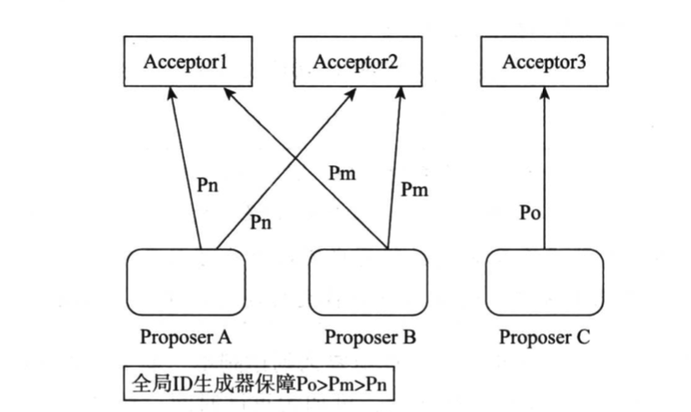
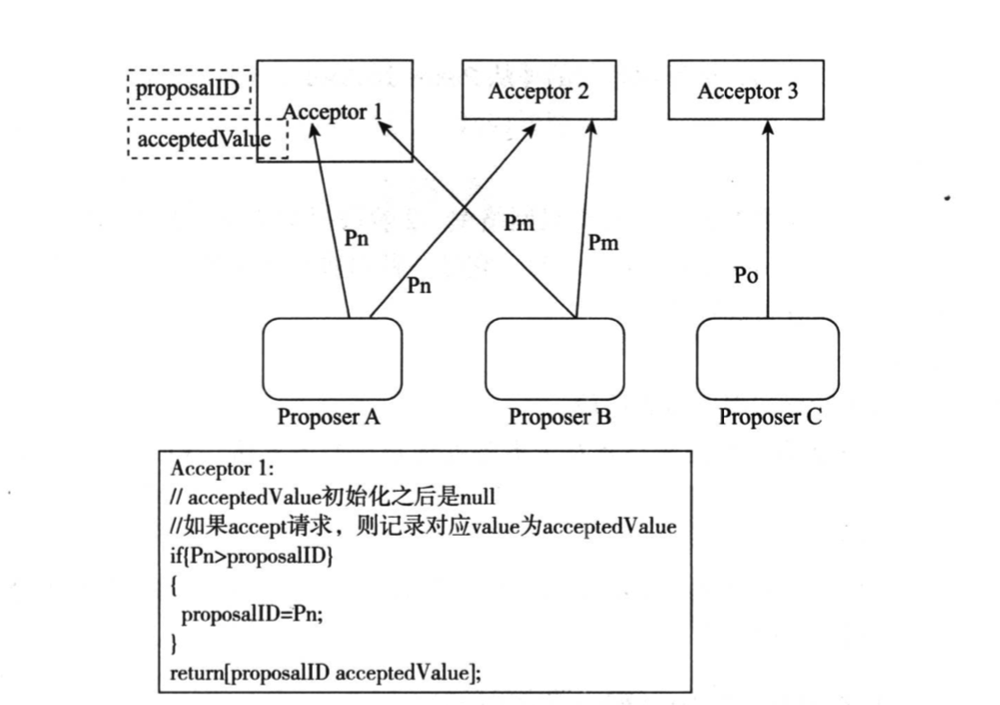
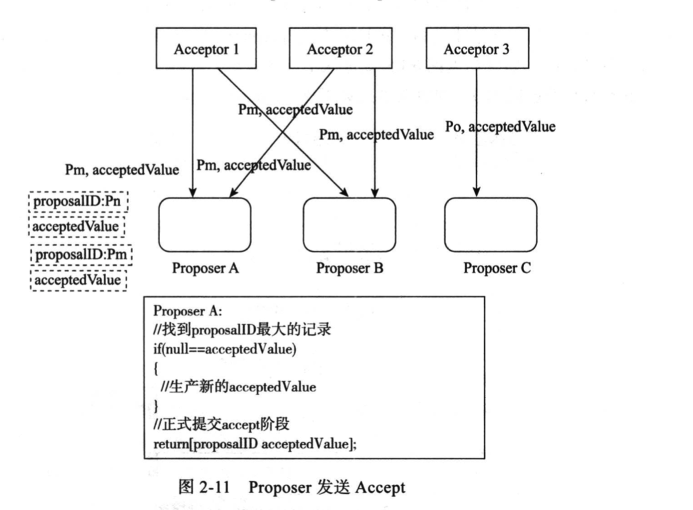
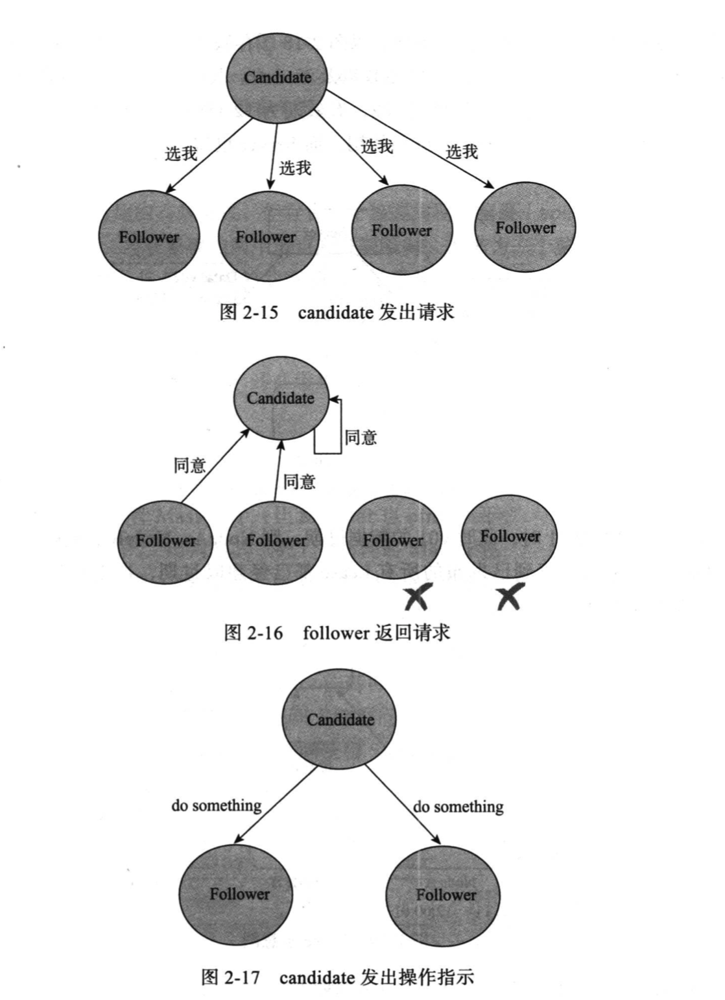

## 分布式协议

分布式一致性协议，主要有几下几种

### 1 二阶段提交协议

2PC，二阶段提交协议是将事务的提交过程分成了两个阶段来进行处理，其执行流程如下：

#### 1.1 流程

- 阶段一：投票阶段(提交事务请求)
  - 事务询问：协调者向所有的事务参与者发送事务内容，询问是否可以执行事务提交操作，并等待各参与者的响应
  - 执行事务：各事务参与者执行事务操作，并将 undo 和 redo 信息记入事务日志中
  - 各参与者向协调者反馈事务的响应：执行成功响应 yes，反之，反馈 no
- 阶段二：执行阶段(执行事务提交)
  - 执行事务提交：各参与者响应的都是 Yes，则执行事务提交
    - 发送提交请求：协调者向所有参与者发送 commit 请求
    - 事务提交：参与者收到 commit 请求后，会正式执行事务提交操作，并在完成提交之后释放在整个事务执行期间占用的事务资源
    - 反馈提交结果：参与者完成事务提交之后，向协调者发送 ack 消息
    - 完成事务：协调者收到所有参与者的 ack 反馈后，完成事务
  - 中断事务：加入第一阶段任何一个参与者反馈 No；或者等待超时之后，协调者尚无法接受到所有参与者的反馈响应，那么就会中断事务
    - 发送回滚请求：协调者向所有参与者发送 rollback 请求
    - 事务回滚：参与者接收到 rollback 请求后，会利用其在阶段一中记录的 undo 来执行事务回滚，并在完成之后释放整个事务期间占用的资源
    - 反馈事务回滚结果：参与者在完成事务回滚之后，向协调者发送 ack 请求
    - 中断事务：协调者收到所有参与者的反馈消息后，中断事务

#### 1.2 优缺点

	- 优点：原理简单，实现方便
 - 缺点
   	- 同步阻塞：在二阶段提交的执行阶段，所有参与者的逻辑都处于阻塞状态。也就是说，参与者在等待其他参与者响应的过程中，将无法进行其他任何操作
   	- 单点问题：协调者将会成为单点，更为严重的是，如果协调者在阶段二中出现问题的话，那么其他参与者将会一直处于锁定事务资源的状态中，而无法继续完成事务操作
   	- 数据不一致：假如在阶段二协调者向参与者发送 commit 请求，由于网络异常或者协调者崩溃等原因导致部分参与者收到了 commit 请求，则会导致部分参与者执行了事务提交，而另一部分无法提交事务，导致数据不一致
   	- 过于保守：整个事务过程中，如果参与者自身发送故障，协调者只能依赖超时机制来判断是否需要中断事务

### 2 三阶段提交协议

3PC，三阶段提交是二阶段提交的改进版。其将二阶段提交协议的投票阶段一分为二，形成 CanCommit、PreCommit、DoCommit 三个阶段。

#### 2.1 流程

- 阶段一：CanCommit
  - 事务询问：协调者向所有参与者发送一个包含事务内容的 canCommit 请求，询问是否可以执行事务提交操作，并开始等待参与者的反馈
  - 各参与者向协调者反馈 canCommit 请求：正常情况下，参与者收到 canCommit 请求后，如果其自身认为可以执行事务，那么返回 yes 并进入预备状态；反之，反馈 no。
- 阶段二：PreCommit
  - 执行事务预提交：协调者从所有参与者收到的反馈都是 yes
    - 发送预提交请求：协调者向所有参与者发送 preCommit 请求，并进入 Prepared 阶段
    - 事务预提交：参与者接收到 preCommit 请求后，会执行事务操作，并将 undo 和 redo 信息记录到事务日志中
    - 各参与者响应协调者的 preCommit请求：参与者如果成功执行，反馈 ack 响应，同时等待最终的 commit 或 abort 执令
  - 中断事务：协调者收到在阶段一收到任何一个 no 响应，或者在等待超时之后依然有参与者没有响应 canCommit 请求
    - 发送中断请求：abort 请求
    - 中断事务：参与者收到协调者的 abort 请求，或者等待超时了依然没有收到协调者的指令，参与者都会中断事务
- 阶段三：doCommit
  - 执行提交
    - 发送提交请求：协调者收到 preCommit 请求的 ack 响应，那么它将从"预提交"状态转换到”提交“状态，并向所有参与者发送 doCommit 请求
    - 事务提交：参与者收到 doCommit 请求后，会正式执行事务提交并释放事务资源
    - 反馈事务提交结果：参与者完成事务提交后，向协调者反馈 ack 消息
    - 完成事务：协调者收到所有参与者的 ack 反馈后，完成事务
  - 中断事务
    - 发送中断请求
    - 事务回滚
    - 反馈事务回滚结果
    - 中断事务

***注意：一旦进入阶段三，可能会存在以下故障：***

- 协调者故障
- 协调者和参与者之间的网络故障

***无论出现哪种情况，最终都会导致参与者无法及时收到协调者的 doCommit 或者 abort 请求，参与者在等待超时之后会继续进行事务提交***

#### 2.2 优缺点

与二阶段提交协议相比，三阶段提交协议最大的优点就是降低了参与的阻塞范围，并且能在协调者出现单点故障后继续达成一致。

缺点：参与者preCommit 阶段，由于出现网络故障导致无法接收到协调者的指令后，会继续执行事务提交，有可能导致把协调者取消的事务提交了，造成数据不一致。

### 3 Paxos 算法

Paxos 协议是一个解决分布式系统中，多个节点之间就某个值(提案)达成一致(决议)的通信协议，它能在少数节点离线的情况下，剩余节点仍能够达成一致。

Paxos 协议是一个二阶段协议，分为 Prepare 阶段和 Accept 阶段。协议涉及 2 个参与者角色：Proposer(提出提案)和 Acceptor(批准提案)，两者物理上可以是一个机器。

#### 3.1 流程

- Prepare阶段：

  - proposer 发送 prepare 请求

    Proposer 生成全局唯一且递增的提案 ID(生成方法很多，比如时间戳+IP+序列号)，向 paxos 集群的所有机器发送请求，这里无须携带提案内容，只携带提案 ID 即可(且把提案 ID 叫做 Pn，也有一种说法 ID 其实代表版本 version)，如下图所示:

    

  - acceptor 应答 prepare 请求

    Acceptor 收到提案请求后，做出以下约定：

    - 不再应答 <= Pn 的 prepare 请求
    - 对于 < Pn 的 accept 请求也不处理

    Acceptor 做出处理包括：

    - 应答前要在本地持久化当前提案的 ID

    - 如果现在请求的提案 ID(即文中的 Pn)大于此前存放的 proposalID，则做以下处理

      if Pn > proposalID then proposalID = Pn

      如果该 acceptor accept 过的提案，则返回提案中 proposalID 最大的那个提案的内容；没有accept 提案，返回空值

      

- Accept 阶段

  - Proposor 发送 Accept 请求

    Proposer 收到多数派应答 Prepare 请求的响应后，从中选择 proposalID 最大的提案内容，作为发起 Accept 请求的提案，如果这个提案为空值，则可以自己随意决定提案内容。然后携带上当前 proposalID，向 paxos 集群的所有机器发送 Accept 请求

    

  - Accept 应答 Accept 请求

    Acceptor 收到 accept 请求后，检查不违背自己之前做出约定的情况下，持久化当前 proposalID 和提案内容。最后 Proposer 收集到多数派应答后，形成决议。

### 4 Raft 算法

在 Raft 算法中，任何时候一个服务器可以扮演下面的角色之一：

- 领导者：处理所有客户端交互、日志复制等动作，一般一次只有一个领导者
- 选民：类似选民，完全被动角色，这样的服务器等待被通知投票
- 候选人：候选人就是在选举过程中提名自己的实体，一旦选举成功，则成为领导者

Raft 算法分为 2 个阶段，首先是选举过程，然后在选举出来的领导者带领下进行正常操作，比如日志复制等。下面用图示展示这个过程：

- 任何一个服务器都可以成为一个候选者，它向其他服务器(选民)发出要求选举自己的请求
- 其他服务器同意了，回复OK(同意)指令。此时如果有一个 follower 宕机，没有收到请求选举的要求，则只要达到半数以上的票数，获选人还是可以称为领导者的
- 这样，这个获选者就称为领导者，它可以向选民们发出要执行具体操作动作的指令，比如进行日志复制等

