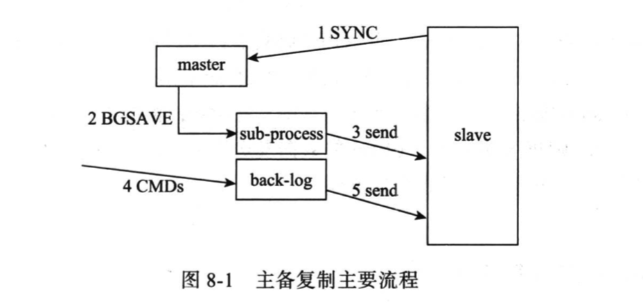
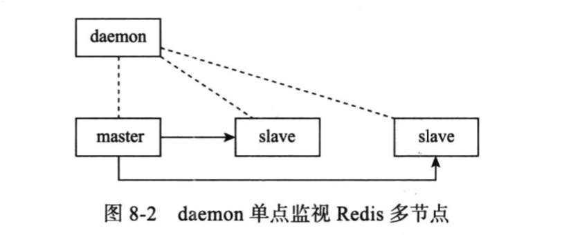
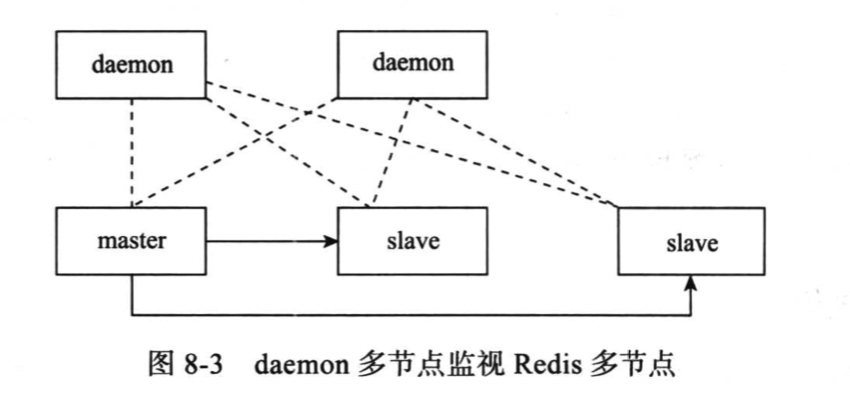
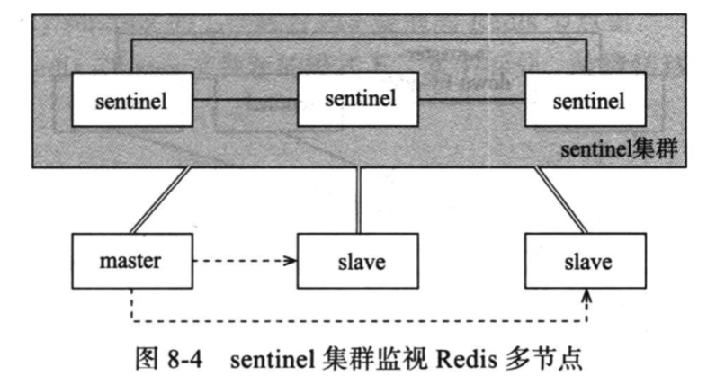
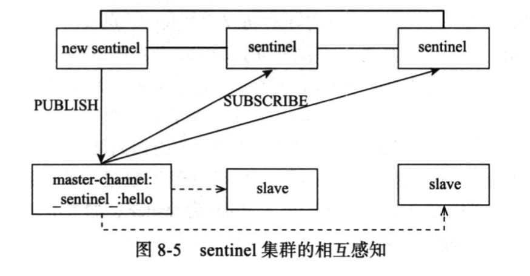
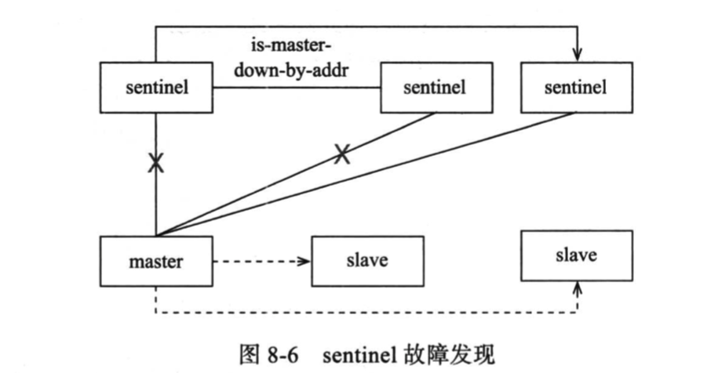
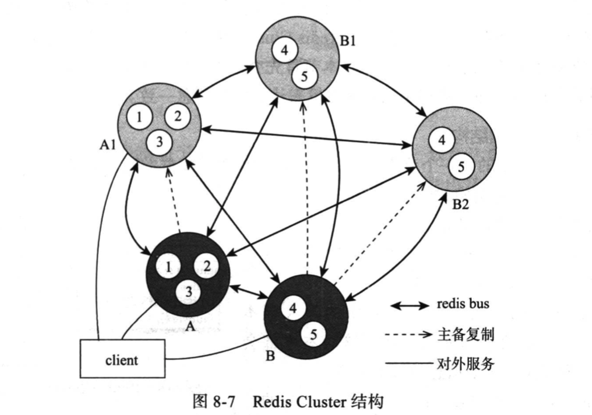
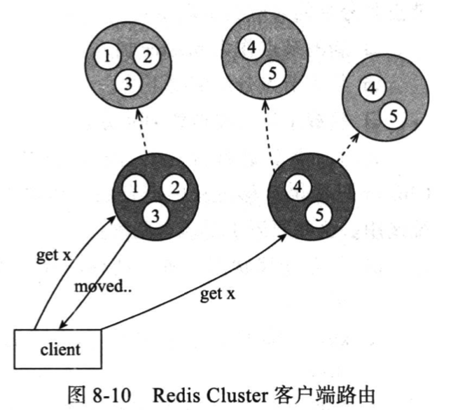
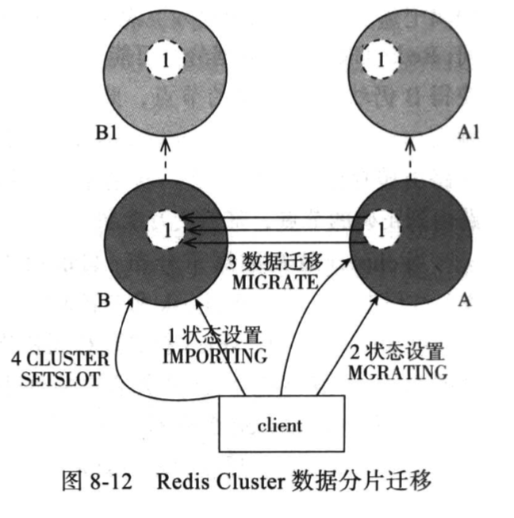

## Redis 总结

### 1 数据结构

常用的五种数据结构：

- string
- hash
- list
- set
- zset

不常用、拓展的数据结构：

- bitmap
- geohash
- HyperLogLog

#### 1.1 对象头

所有的 redis 对象都有下面的这个头结构：

```c
struct RedisObject {
  int4 type;					// 4bits
  int4 encoding;			// 4bits
  int24 lru;					// 24bits
  int32 refcount;			// 4bytes
  void *ptr;					// 8bytes，64-bit systems
} robj;
```

不同的对象具有不同的类型 type，同一个类型的 type 会有不同的存储形式 encoding。为了记录对象的 LRU 信息，使用了 24bits 来记录。每个对象都有个引用计数，当引用计数为零时，对象就会被销毁，内存被回收。ptr 指针将指向对象内容(body)的具体存储位置。这样一个 RedisObject 对象头结构需要占据 16 字节的存储空间。

***任何 redis 中的对象都要分配 16 字节的对象头***

#### 1.2 string — 字符串

redis 中字符串是动态字符串(Simple Dynamic String)，内容可以修改。内部使用 byte 数组来保存内容，并且带有长度信息。数据结构如下：

```c
struct SDS<T> {
  T capacity;			// 数组容量
  T len;					// 数组长度
  byte flags;			// 特殊标记位
  byte[] content;	// 数组内容
}
```

数据结构使用了泛型，redis 为了对内存做极致的优化，不同长度的 string 使用不同的数据结构：长度较短时，T 就可以使用 byte 或 short，较长时使用 int。redis 规定字符串长度不得超过 512M，如果字符串长度小于 1M，扩容是倍增；长度大于 1M，扩容则是增加 1M 的容量。

redis 字符串有两种存储方式：

- embstr — 长度较短时使用，此时对象头和SDS 对象将会在一次内存申请中分配到连续的内存空间进行存储

- raw — 长度超过 44 字节时，使用该数据结构；raw 将会进行两次内存分配申请，对象头和 SDS 对象的内存空间不连续

  ```shell
  127.0.0.1:6379> setex test 20  qwertyuioplkjhgfdsazxcvbnm0987654321qazxcvbg
  OK
  127.0.0.1:6379> debug object test
  Value at:0x7fb57af28dc0 refcount:1 encoding:embstr serializedlength:45 lru:13115596 lru_seconds_idle:11
  127.0.0.1:6379> setex test 20  qwertyuioplkjhgfdsazxcvbnm0987654321qazxcvbgi
  OK
  127.0.0.1:6379> debug object test
  Value at:0x7fb57ac00360 refcount:1 encoding:raw serializedlength:46 lru:13117927 lru_seconds_idle:3
  ```

注意：encoding 字段

#### 1.3 hash — 字典

redis的 hash 实现结构和 Java 的 HashMap 是一样的，都是使用数组+链表的二维结构，存储的元素是 key - value 组成的字典。

```c
struct dictEntry {
  void* key;
  void* val;
  dictEntry* next;			// 链接下一个 entry
}
```

字典是 redis 中出现最为频繁的复合数据结构，除了 hash 结构的数据会用到之外，整个 redis 数据库的所有 key - value 组成了一个全局字典，还有带有过期时间的 key 集合也是一个字典。zset 集合中的存储的 value-score值映射关系也是通过字典结构实现的。

```c
// redis 数据库实例对象
struct RedisDb {
  dict* dict;								// all keys key=>value
  dict* expires;						// all expired keys key=>long(timestamp)
  ...
}

struct zset {
  dict *dict;								// all keys value=>score
  zskiplist *zsl;
}
```

字典结构内部包含两个 hashtable，通常情况下只有一个 hashtable 是有值的，但是在字典扩容缩容时，需要分配新的额 hashtable，然后进行渐进式 rehash。这时两个 hashtable 存储的分别是旧 hashtable 和新的 hashtable，待 rehash 结束，旧的 hashtable 被删除，新的 hashtable 取而代之。

```c
struct dict {
  ...
  dictht ht[2]; 
}

struct dictht {
  dictEntry** table;						// 二级
  long size;										// 第一纬数组的长度
  long used;										// hash 表中的元素个数
  ...
}
```

#### 1.4 list - 列表

redis 中的列表相当于 Java 里的 LinkedList，使用的是链表而不是数组，意味着插入和删除操作非常快，索引定位很慢。列表是双向链表，支持前向、后向遍历，可以实现 FIFO 队列和FILF 的栈结构。

列表内部使用 quicklist 加 ziplist 实现，quicklist 是 ziplist 和 linkedlist 的混合体，它将 linkedlist 按段切分，每一段使用 ziplist 让存储紧凑，多个 ziplist 之间使用双向指针串连起来。

#### 1.5 set — 集合

redis 的集合相当于 Java 里面的 HashSet，它内部的键值对是无序的、唯一的。它的内部相当于一个特殊的字典，字典中所有的 value 都是一个值 NULL。

set 的结构底层实现也是字典，只不过所有的 value 值都是 NULL。

#### 1.6 zset — 有序列表

zset 是 redis 中最有特色的数据结构，它类似于 Java 中SortedSet 和 HashMap 的结合体，一方面它是一个 set，保证了内部 value 的唯一性，另一方面它可以给每个 value 赋予一个 score 值，代表这个 value 的权重。它的内部实现是用的是 skiplist — 跳跃列表 的数据结构。

**在元素比较少时，zset 和 hash 使用的 ziplist 数据结构**

> redis 5.0版，推出了 listpack 数据结构用于取代 ziplist

### 2 分布式锁

redis 分布式锁使用的命令：[set key value ex/px nx 指令](http://redisdoc.com/string/set.html)进行设置

redis 锁的缺点：

- 为了避免业务异常导致锁无法释放，需要给锁设置超时时间限制

- 锁设置了超时时间，无法避免业务处理时候不会超时，从而导致锁被提前释放，被另外的线程获取而当前线程还未执行完毕

- 以上两点，redis 锁不宜使用在耗时性的业务中

- 在 redis 集群环境下，容易导致获取多把锁的可能：当前线程在 master 节点获取了锁，此时 master 节点还未同步 slave 节点就宕机了；slave 节点升级成 master，另外一个线程在新的 master 节点上成功获得了锁

  > 为了解决集群中多把锁的问题，redis 提供了 RedLock 算法：提供 redis 集群，集群中 redis 节点都是独立的，没有主从关系。采用大多数机制来加锁和解锁

### 3 数据持久化

redis 数据持久化的方式：

- RDB — 快照，内存数据的二进制序列化，全量数据备份
- AOF 日志，内存数据的修改的指令记录文本

快照原理：

- 执行快照期间，redis 还在响应客户端请求，redis 的内存结构在持久化的同时还在变化。redis 使用操作系统的多进程**COW(Copy On Write)**机制来实现快照持久化
- 为了不阻塞线上业务，执行快照时 redis 会 fork 一个子进程，由子进程处理快照，父进程继续处理客户端的请求
- 子进程刚刚产生时，它和父进程共享内存里的代码段和数据段。redis 子进程做数据持久化时不会改变内存的数据结构，它只是对数据结构进行遍历读取，然后序列化写到磁盘中。
- 在子进程遍历内存数据时，父进程在持续响应外部请求，修改内存数据结构。此时会使用操作系统 COW 机制来进行数据段的分离（即将父、子进程共享的数据段复制一份），父进程修改复制出来的数据段，子进程看到的内存数据时没有变化的。

AOF ：

- AOF 重写：使用子进程对内存进行遍历，转换成一系列操作指令，序列化到新的 AOF 文件中并替换旧的 AOF 文件
- redis 对 AOF 文件进行写操作时，会将内容写内存缓存，再异步写到文件中

### 4 集群

#### 4.1 主从同步

redis 的主从同步满足 ***CAP*** 理论的 ***AP***，数据会满足最终一致性。

##### 4.1.1 同步方式

- 增量同步
  - redis 同步的是指令流，主节点将对自己状态产生修改性影响的指令记录在本地内存 buffer 中，然后异步同步到从节点
  - 从节点一边执行同步的指令流，一边向主节点反馈自己同步的到偏移量
  - 缺点：存储同步指令流的内存 buffer 大小是有限的（环形），如果同步不及时，新的指令会覆盖旧的还未同步的指令
- 快照同步
  - 非常消耗资源
  - 主节点执行 bgsave，将当前内存的数据全部快照到磁盘文件中，然后再将快照文件的内容全部传送到从节点
  - 从节点接受快照文件完毕后，立即执行一次全量加载
  - 从节点在加载快照文件之前，需要将当前内存的数据清空，加载完毕后通知主节点继续进行增量同步

快照同步死循环：快照同步期间，用于增量指令的内存 buffer 不足，指令被覆盖，这样会导致快照同步完毕后无法进行增量复制，然后会再次发起快照同步，极有可能陷入快照同步的死循环中。

##### 4.1.2 同步流程

主从同步由 slave 节点主动发起




1. 首先  slave 向 master 发起 SYNC 命令。这一步在 slave启动后触发，master被动得将新进的 slave 节点加入自己的主从同步集群
2. master 收到 SYNC 后，开启 bgsave 操作
3. bgsave 完成后，master 将快照信息发送给slave
4. 发送期间，master收到的来自客户端的新的写命令缓存在内存 buffer 中
5. 快照信息同步完成后，master 继续发送缓存的指令给 slave
6. 缓存指令发送完成后，后续的写操作同时发送给 slave，保持实时地异步同步

在 slave 侧，处理逻辑如下：

1. 发送完 SYNC 后，继续对外提供服务
2. 开始接收 master 的快照信息，此时 slave 将会清空数据并将 master的快照写入自身内存，加载完毕后通知 master 同步缓存的指令
3. 接受 master 同步的缓存指令并执行，期间对外提供读服务
4. 继续接收后续来自 master 的指令并执行，以保持和 master 一致

#### 4.2 哨兵模式—Sentinel

##### 4.2.1 sentinel 集群

主从同步方案上增加守护主节点的方案，自动完成故障转移(failover)。



单点监控 master-slave 节点，存在单点问题。



多节点监视，解决了单点问题，却存在一致性问题：多个 daemon 之间，如何就某个 master 是否可用达成一致。Redis 的sentinel  机制提供了多daemon间的交互机制，解决故障发现、failover决策协商机制等问题，如图：



多个 daemon 组成一个集群 — sentinel集群，其中daemon称为 sentinel 节点。这些节点相互间通信、选举、协商，在master节点故障发现、failover决策上表现出一致性。

##### 4.2.2 sentinel 节点间相互感知



sentinel 节点间因为共同监视同一个 master 节点从而相互关联起来，一个新加入的 sentinel节点需要和有相同监视的 master的其他sentinel 节点互相感知：

1. 所有需要相互感知的 sentinel 都向它们共同的master 节点上订阅相同的 channel:\_\_sentinel\_\_:hello
2. 新加入的 sentinel 节点向这个 channel 发布一条包含自己信息的消息，这个 channel 的其他订阅者就可以发现这个新节点
3. 其他节点和新 sentinel 节点建立长连接

##### 4.2.3 master 故障发现



- sentinel节点定期向 master发送心跳包判断状态
- 一旦发现 master 没有正确响应，则 sentinel 节点将此 master 置为“主观不可用状态”
- sentinel 节点将master 的“主观不可用状态”发送给其他所有的 sentinel 节点进行确认，当确认的 sentinel 节点数>=quorum(可配置)时，则判定该 master为“客观不可用”，随后进入故障转移流程

##### 4.2.4 failover 决策

当一台 master 真正宕机后，可能多个 sentinel 节点同时发现并交换“主观不可用状态”，同时达到“主观不可用状态”，同时发起failover，但最终只有一个sentinel 节点作为 failover 发起者，此时需要一个leader选举的过程：

- sentinelState的 epoch变量类似于raft 协议中的term(选举回合)
- 每一个确认了 master“客观不可用状态”的 sentinel 节点都会向周围广播自己的参选请求
- sentinel 节点接收到其他节点的参选请求，如果在本轮中它还没有发送过参选请求的话，它将本轮的选举意向置为收到的参选请求并回复对方；如果在本轮中它已经表达过意向了，则拒绝本轮中所有的其他参选意向，并回复之前的意向
- 每个发出参选意向的 sentinel 节点，如果收到超过半数的节点同意某个 sentinel 的参选请求，则确认该 sentinel 节点为本轮 leader
- leader 的 sentinel 节点确认后，由 leader 节点依据一定规则从 master 的slave 节点中选取一个作为新的 master，并告知其他的 slave

#### 4.3 Codis

Codis 方案解决的问题：

- 单个 redis 的内存大小不宜过大
  - 容易导致 RDB 文件过大
  - 进一步导致主从全量同步时间过长
  - 重启实例时也会消耗更长的时间来加载数据
- 单个 redis 无法利用多核 CPU 

Codis 原理：

- codis 是一个代理中间件，使用 redis 协议对外提供服务。负责将客户端的指令转发到服务端，同时将服务端的返回给客户端
- codis 对客户端的 key 值进行 hash 运算，再对槽位取模后将 key 值关联到特定的 redis 槽位上
- codis 中槽位与 redis 实例的是一对一的关系，redis 实例和槽位是一对多的关系，codis 内存中保存槽位与 redis 实例的映射关系
- codis 集群可使用 zookeeper 来在不同的 codis 节点之间同步槽位与 redis 实例的映射关系；并提供 dashboard 来监视和修改槽位关系，并会监听和同步。

扩容：

- 增加 redis 实例
  - 需要调整槽位映射关系
  - 槽位映射调整导致槽位对应的 key 值分布需要调整，在原 redis 实例与新增 redis 实例之间迁移数据
- 迁移过程中响应请求：对请求 key 值的数据立即进行迁移，完成后将请求转到新的实例上去

#### 4.4 Cluster

节点之间通过去中心化的方式提供了完整的sharding、replication、failover解决方案

##### 4.4.1 cluster 的拓扑结构



- 一个 redis cluster 由多个redis节点组构成
- 不同节点组服务的数据无交集，即每一个节点组对应数据 sharding的一个分片
- 节点组内分为主备两类节点，对应 master 和 slave，两者数据准实时一致
- 一个节点组内有且仅有一个 master，0 或多个 slave；master节点提供读写服务，slave 节点可以提供读服务

##### 4.4.2 sharding — 数据分片

- 数据分片

  - 不同的节点组服务于相互无交集的数据子集(分片，sharding)
  - redis cluster将所有数据根据 key 值计算后分布到16384的槽位上
  - 数据分布算法：slotId = crc16(key) % 16384，客户端根据softId决定将请求路由到哪个redis节点上。

- 客户端路由：

  

  - redis cluster的客户端相比单机redis需要具备路由语义的识别能力，且具备一定的路由缓存能力
  - 当一个client访问的 key不在访问的 redis 节点的 slots 中，redis返回给 client 一个 moved 命令，告知其正确的路由信息
  - client 得到 moved 命令，会向重定向节点发送指令。client 同时会更新其内部的路由缓存信息
  - 数据迁移进行中，引入 ask 重定向指令。client 响应 ask 指令不会更新其缓存的路由信息

- 分片迁移
  - 数据分片变更原因：新节点作为 master 加入集群、某个节点组需要下线、负载不均需要调增 slot 分布
  - 分片迁移的触发和过程控制由外部系统完成，redis cluster 只需提供迁移中需要api 供外部系统调用：节点迁移状态设置、key 迁移的原子化指令

数据分片迁移说明：如下图所示，期望将 slot1 从节点 A 迁移至节点 B。



迁移的简单流程：

1. 向节点 B 发送状态变更指令，将 B 的对应 slot 状态置为 importing，表示向其迁入数据

2. 向节点 A 发送状态变更指令，将 A 的对应 slot 状态置为 migrating，表示对应 slot 从其迁出

3. 迁移过程，迁移 slot 中数据按 key 挨个迁移：A 节点获取内容 —> 存到 B 节点 —> A 节点将对应的 key 删除

4. 迁移过程是同步的

5. 新旧两个节点对应的 slot 在迁移过程中都存在部分 key 数据。客户端先尝试访问旧节点，如果对应的数据还在，那么旧节点正常处理；如果对应的数据不在旧节点(在新节点中、根本不存在)中，那么它向客户端返回 ask 重定向指令

6. 客户端如果收到 ask 指令，先去目标节点执行一个不再任何参数的 asking 指令，然后在目标节点执行原来的操作命令

   > 为什么需要先执行不带参数的 ask 指令？
   >
   > 因为在迁移没有完成之前，这个槽位还是不归目标节点管理的，如果这个时候向目标节点发送该槽位的指令，目标节点是不认的，它会向客户端返回一个重定向 moved 指令告诉客户端取源节点执行，如此便形成了***重定向循环***。**asking**指令的目的就是告诉接收节点：下一条指令不能不理，而要当成自己的槽位来处理

##### 4.4.3 failover — 故障转移

同 sentinel 一样，redis cluster 也具备一套完整的节点故障发现、故障状态一致性保证、主备切换机制，failover完整过程：

- 故障发现：当某个 master 宕机时，宕机事件如何被集群其他节点感知
- 故障确认：多个节点就某个 master 是否宕机如何达成一致
- slave 选举：集群确认某个 master 确实宕机后，如何将它的 slave 升级为新的 master；有多个 slave，选择哪一个
- 集群结构变更：选举成功的 slave 升级为新的 master 后如何让集群中的其他节点知道以及变更它们缓存的集群结构信息

故障发现：

redis cluster 的节点间两两通过tcp 保持 redis cluster bus 长连接，当对端超过一定时间无 pong 响应时，将对端节点状态置为 pfail(possible fail) 状态，并通过 gossip 广播出去。

故障确认：

集群中每个节点既是 gossip 的发送者也是接收者。节点收到来自其他节点的 gossip 信息，被告知某个节点故障。该节点通过持续收集来自不同节点的 gossip 信息关于疑似故障节点的状态信息，当收到故障报告达到一定数量后该节点将疑似故障 pfail 升级为 故障 fail 并广播到其他节点

slave 选举：

故障 master 节点的一个或多个 slave 节点发起竞选，期望成为新的 master。为了减少 slave 竞选 master 的时间消耗，redis cluster会根据 slave 的优先级(slave 优先级是 slave 与 master 最后一次数据同步的时间，越新表示这个 slave 的数据越新，优先级越高)来决定哪个 slave 竞选成功。

slave 通过向其他 master 节点发送 failover_auth_request 消息发起竞选，其他 master 节点响应 failover_auth_request 信息，告知自己是否同意该 slave 成为新的 master。

集群结构变更通知：

当 slave 收到超过半数的 master 的同意回复时，该 slave 顺利替代原 master 升级为新的 master。此时它会广播自己成为 master 的信息，让集群中的其他节点尽快更新拓扑信息。

当该节点组的原 master 恢复时，它首先认为自己是 master，但逐渐通过 gossip 消息得知自己已经被取代后降级为 slave 节点