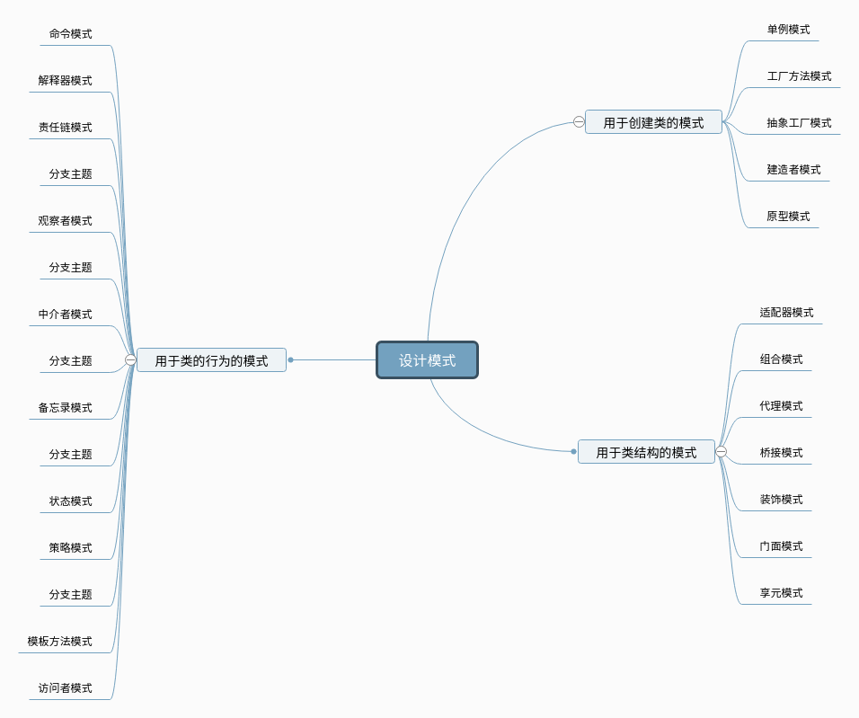

## 设计模式读书笔记
说明:此项目是我学习设计模式的所写,大部分的例子和说明参照了 秦小波著 《设计模式之禅》
>设计模式（Design pattern）是一套被反复使用、多数人知晓的、经过分类编目的、代码设计经验的总结。使用设计模式是为了可重用代码、让代码更容易被他人理解、保证代码可靠性。 毫无疑问，设计模式于己于他人于系统都是多赢的；设计模式使代码编制真正工程化；设计模式是软件工程的基石脉络，如同大厦的结构一样。

设计模式的分类图： 
