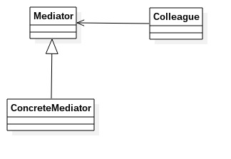
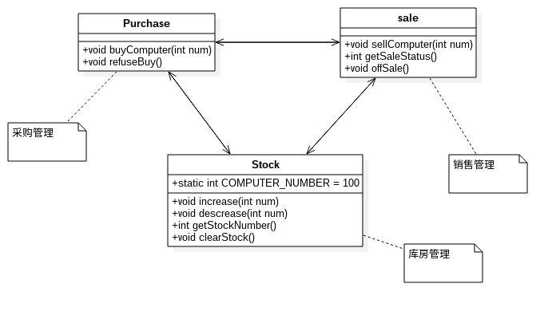
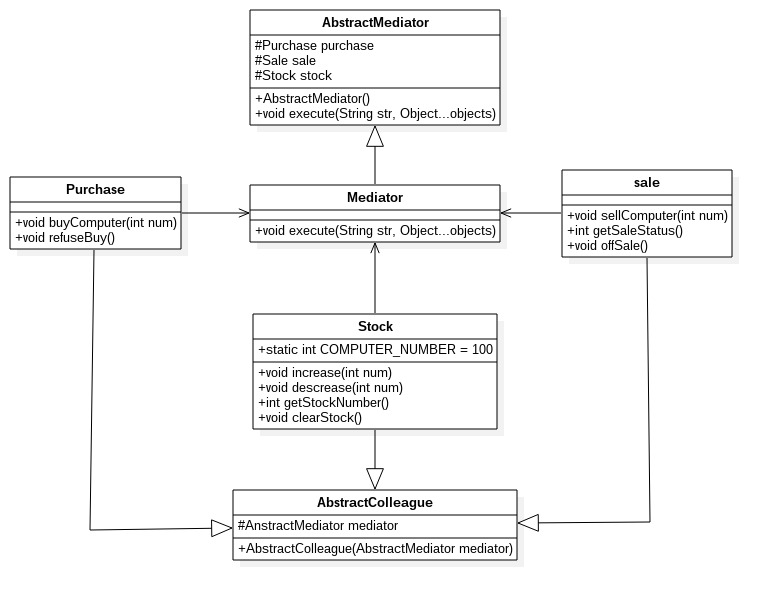

# 中介者模式
---
用一个中介对象封装一系列对象的交互，中介者使各个对象不需要显示地相互作用，从而使其耦合松散，而且可以独立地改变他们之间的交互。
**类图** 

从类图中看，中介者模式由以下几部分组成：
- Mediator抽象中介者角色：抽象中介者角色定义统一的接口，用于各同事之间的通信；
- ConcreteMediator具体中介者角色：具体的中介者角色通过协调各同事角色实现协同行为，因此它必须依赖于各个同时角色；
- Colleague同事角色：每一个同事角色都知道中介者角色，而且与其他的同事角色通信的时候，一定要通过中介者角色协作。每个同事类的行为分为两种：一种是自身的行为——自发行为、另一种是必须依赖中介者才能完成的行为——依赖方法。
		
        //通用抽象中介者
        public abstract class Mediator {
        	//定义同事类
            protected ConcreteColleague1 c1;
            protected ConcreteColleague2 c2;
            
            //getter/setter方法注入同事类
            ...
            
            //中介者业务逻辑
            public abstract void doSomethingA();
            public abstract void doSomethingB();
        }
        
        //具体中介者
        public class ConcreteMediator extends Mediator {
        	@Override
            public void doSomethingA() {
            	super.c1.selfMethod1();
                super.c2.selfMethod2();
            }
            
            @Override
            public void doSomethingB() {
            	super.c1.doMethod1();
                super.c2.doMethod2();
            }
        }
        
        //抽象同事类
        public abstract class Colleague {
        	protected Mediator mediator;
            public Colleague(Mediator mediator) {
            	this.mediator = mediator;
            }
        }
        
        //具体同事类
        public class ConcreteColleague1 extends Colleague {
        	//通过构造函数传递中介者
            public ConcreteColleague1(Mediator mediator) {
            	super(mediator);
            }
            
            //自有方法
            public void selfMethod1() {
            	//业务逻辑
            }
            
            //依赖方法
            public void depMethod1() {
            	//处理自己的业务逻辑
                ....
                //自己不能处理的，委托给中介者处理
            	super.mediator.doSomething1();
            }
        }
        
        public class ConcreteColleague2 extends Colleague {
        	//通过构造函数传递中介者
            public ConcreteColleague2(Mediator mediator) {
            	super(mediator);
            }
            
            //自有方法
            public void selfMethod2() {
            	//业务逻辑
            }
            
            //依赖方法
            public void depMethod2() {
            	//处理自己的业务逻辑
                ....
                //自己不能处理的，委托给中介者处理
            	super.mediator.doSomething2();
            }
        }
        
**注意**:中介者使用getter/setter方式注入同事类，而同事类使用构造函数注入中介者：因为中介者可以有部分的同事类，而同事类必须有中介者。

## 中介者模式的应用
**优点**
- 减少类间的依赖，把原来的一对多的依赖变成一对一依赖，同事类只依赖中介者。
- 同事依赖中介者，降低了类间的耦合。

**缺点**
中介者会膨胀的很大，而且逻辑复杂，同事类越多，中介者的逻辑就越复杂。

**建议使用场景**
- N各对象之间产生了相互的依赖关系(N > 2)
- 多个对象有依赖关系，但是依赖的行为尚不确定或者有发生变化的可能，在这种情况下建议采用中介者模式，降低变更引起的风险扩散。
- 产品开发。一个明显的例子就是MVC框架，把中介者模式应用到产品中，可以提升产品的性能和扩展性，但是对于项目开发就未必，因为项目是以交付投产为目标的，而产品则是以稳定、高效、扩展为宗旨。

举例说明中介者模式：
进销存管理
- 销售部：主要工作就是销售，同时给采购部反馈消息：畅销就多采购，滞销就少采购
- 库存部：产品出入库，同时给销售部和采购部反馈消息：库存充足，销售要抓紧，采购要放缓；库存不足，采购要抓紧，销售要改变销售策略。
- 采购部：根据销售部和库存部的反馈，决定采购策略。

先看通常思路的类图模型：

		
        //采购管理
        public class Purchase {
        	//访问库房
            private Stock stock = new Stock();
            //访问销售
            private Sale sale = new Sale();
            
            //相关方法
            public void buyComputer(int num) {
            	int saleStatus = sale.getSaleStatus();
            	if (saleStatus > 80) {
                	System.out.println("采购电脑：" + num + "台");
            		stock.increase(num);
                } else {
                	int buyNum = num / 2;  //折半采购
                    System.out.println("采购电脑：" + buyNum + "台");
                }
            }
            
            public void refuseBuyComputer() {
            	System.out.println("拒绝购买电脑");
            }
            
        }
        
        //销售管理
        public class Sale {
        	//访问库房
            private Stock stock = new Stock();
            //访问采购
            private Purchase purchase = new Purchase();
            
            public void sellComputer(int num) {
            	if (stock.getStockNumber() < num) {		//库存不足
                	purchase.buyComputer(num);
                }
                System.out.println("销售电脑：" + num + "台");
                stock.decrease(num)
            }

			//反馈销售情况，0~100之间变化，0没人买，100极其畅销
            public int getSaleStatus() {
            	Random rand = new Random(System.currentTimeMillis());
                int status = rand.nextInt(100);
                System.out.println("电脑销售情况：" + status);
                return status;
            }
            
            //打折销售
            public void offSale() {
            	//库存清光
            	System.out.println("打折销售电脑：" + stock.getStockNumber() + "台");
            }
         }
         
         //库存管理
         public class Stock {
         	//原始库存数量
         	private static int COMPUTER_NUMBER = 100;
            
            private Purchase purchase = new Purchase();
            private Sale sale = new Sale();
           	
            //增加库存
            public void increase(int num) {
            	COMPUTER_NUMBER = COMPUTER_NUMBER + num;
                System.out.println("库存数量：" + COMPUTER_NUMBER + "台");
            }
            
            //减少库存
            public void decrease(int num) {
            	COMPUTER_NUMBER = COMPUTER_NUMBER - num;
                System.out.println("库存数量：" + COMPUTER_NUMBER + "台");
            }
            
            //获取库存数量
            public int getStockNumber() {
            	return COMPUTER_NUMBER;
            }
            
            public void clearStock() {
            	System.out.println("清理库存数量：" + COMPUTER_NUMBER + "台");
                sale.offSale();		//打折销售
                purchase.refuseBuy();		//不再采购
            }
         }
         
各个类与其他两个类相关联，完成依赖行为。如果这些类越多，耦合性就越大，一个类的改动就得修改很多地方的代码。
我们加入一个中介者作为类间交流的核心，每个类间不在直接相互交流，而是通过中介者进行交流。每个类自负责自身的业务逻辑，不属于自己的行为交由中介者处理，来简化类间的耦合关系。

		
        //抽象中介者
        public abstract class AbstractMediator {
            //采购管理
            protected Purchase purchase;
            //销售管理
            protected Sale sale;
            //库存管理
            protected Stock stock;

            public AbstractMediator() {
                purchase = new Purchase(this);
                sale = new Sale(this);
                stock = new Stock(this);
            }

            //中介者最重要的方法叫做事件方法，处理多个对象之间的关系
            public abstract void execute(String str, Object...objects);
        }
        
        //抽象同事类
        public abstract class AbstractColleague {
            //中介者
            protected AbstractMediator mediator;

            public AbstractColleague(AbstractMediator mediator) {
                this.mediator = mediator;
            }
        }
        
        //具体中介者
        public class Mediator extends AbstractMediator {

            @Override
            public void execute(String str, Object... objects) {
                if (str.equals("purchase.buy")) {
                    this.buyComputer((Integer)objects[0]);
                } else if (str.equals("sale.sell")) {
                    this.sellComputer((Integer)objects[0]);
                } else if (str.equals("sale.offSell")) {
                    this.offSell();
                } else if (str.equals("stock.clear")) {
                    this.clearStock();
                }
            }

            //采购电脑
            private void buyComputer(int num) {
                int saleStatus = super.sale.getSaleStatus();
                if (saleStatus > 80) {	//销售良好
                    System.out.println("采购电脑：" + num + "台");
                    super.stock.increase(num);
                } else {
                    int buyNum = num / 2;  //折半采购
                    System.out.println("采购电脑：" + buyNum + "台");
                }
            }

            //销售电脑
            private void sellComputer(int num) {
                if (super.stock.getStockNumber() < num) {		//库存不足
                    super.purchase.buyComputer(num);
                }
                System.out.println("销售电脑：" + num + "台");
                super.stock.decrease(num);
            }

            //折价销售电脑
            private void offSell(){
                System.out.println("打折销售电脑：" + stock.getStockNumber() + "台");
            }

            //清仓处理
            private void clearStock() {
                super.sale.offSale();
                super.purchase.refuseBuy();
            }
        }
        
        //采购类
        public class Purchase extends AbstractColleague {

            public Purchase(AbstractMediator mediator) {
                super(mediator);
            }

            //采购电脑
            public void buyComputer(int num) {
                super.mediator.execute("purchase.buy", num);
            }

            //不再采购
            public void refuseBuy() {
                System.out.println("不再采购电脑");
            }
        }
        
        //销售类
        public class Sale extends AbstractColleague {

            public Sale(AbstractMediator mediator) {
                super(mediator);
            }

            public void sellComputer(int num) {
                super.mediator.execute("sale.sell", num);
                System.out.println("销售电脑：" + num + "台");
            }

            //反馈销售情况，0~100之间变化，0没人买，100极其畅销
            public int getSaleStatus() {
                Random rand = new Random(System.currentTimeMillis());
                int status = rand.nextInt(100);
                System.out.println("电脑销售情况：" + status);
                return status;
            }

            //打折销售
            public void offSale() {
                super.mediator.execute("sale.offSell");
            }
        }
        
        //库存类
        public class Stock extends AbstractColleague {
            //原始库存数量
            private static int COMPUTER_NUMBER = 100;

            public Stock(AbstractMediator mediator) {
                super(mediator);
            }

            //增加库存
            public void increase(int num) {
                COMPUTER_NUMBER += num;
                System.out.println("库存数量：" + COMPUTER_NUMBER + "台");
            }

            //降低库存
            public void decrease(int num) {
                COMPUTER_NUMBER -= num;
                System.out.println("库存数量：" + COMPUTER_NUMBER + "台");
            }

            //获取库存数量
            public int getStockNumber() {
                return COMPUTER_NUMBER;
            }

            //库存压力大，通知采购不要再采购，销售降价销售
            public void clearStock() {
                System.out.println("清理库存数量：" + COMPUTER_NUMBER + "台");
                super.mediator.execute("stock.clear");
            }
        }
        
        //场景类
        public class Client {
            public static void main(String[] args) {
                AbstractMediator mediator = new Mediator();
                //采购电脑
                System.out.println("----采购电脑----");
                Purchase purchase = new Purchase(mediator);
                purchase.buyComputer(100);

                //销售电脑
                System.out.println("----销售电脑----");
                Sale sale = new Sale(mediator);
                sale.sellComputer(50);

                //库存管理
                System.out.println("----清理库存----");
                Stock stock = new Stock(mediator);
                stock.clearStock();
            }
        }