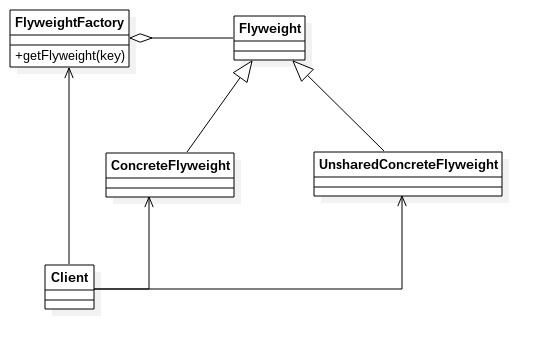

# 享元模式
---
享元模式：使用共享对象可以有效地支持大量的细粒度的对象。享元模式是池技术的重要实现方式。
享元模式的定义为我们提出了两个要求：细粒度的对象和共享对象。享元模式的共享技术避免了分配太多的对象到应用程序的内存中，有利于保证程序的性能和避免内存溢出。我们先来了解下对象的内部状态与外部状态
- 内部状态：内部状态是对象可共享出来的信息，存储在享元对象内部并且不会随环境改变而改变。
- 外部状态：外部状态是对象得以依赖的一个标记，是随环境改变而改变的、不可以共享的状态。

**类图** 

类图中角色说明：
- Flyweight 抽象享元角色：一个产品的抽象类，定义出对象的外部状态和内部状态的接口或实现
- ConcreteFlyweight 具体享元角色：具体的一个产品类，实现抽象角色定义的业务。该角色中应该注意的是内部状态处理应该与环境无关，不应该出现一个操作改变了内部状态，同时修改了外部状态。
- UnsharedConcreteFlyweight 不可共享的享元角色：不存在外部状态或者安全要求（如线程安全）不能够使用共享技术的对象，该对象一般不会出现在享元工厂中。
- FlyweightFactory 享元工厂：职责非常明确，就是构造一个池容器，同时提供从池中获得对象的方法。

享元模式的目的就在于运用共享技术，使得一些细粒度的对象可以共享。

	//抽象享元角色
	public abstract class Flyweight {
		//内部状态
		private String intrinsic;
		//外部状态
		protected final String Extrinsic;
		
		//要求享元角色必须接受外部状态
		public Flyweight(String extrinsic) {
			this.Extrinsic = extrinsic;
		}
		
		//定义业务操作
		public abstract void operate();
		
		public String getIntrinsic() {
			return this.intrinsic;
		}
		
		public void setIntrinsic(String intrinsic) {
			this.intrinsic = intrinsic;
		}
	}
	
	//具体享元角色
	public class ConcreteFlyweight1 extends Flyweight {
		//接受外部状态
		public ConcreteFlyweight1(String extrinsic) {
			super(extrinsic);
		}
		
		//根据外部状态进行逻辑处理
		public void operate() {
			//业务逻辑
			System.out.println("ConcreteFlyweight1 ---> operate");
		}
	}
	
	public class ConcreteFlyweight2 extends Flyweight {
		//接受外部状态
		public ConcreteFlyweight2(String extrinsic) {
			super(extrinsic);
		}
		
		//根据外部状态进行逻辑处理
		public void operate() {
			//业务逻辑
			System.out.println("ConcreteFlyweight2 ---> operate");
		}
	}
	
	public class FlyweightFactory {
		//定义一个池容器
		private static Map<String, Flyweight> pool = new HashMap<String, Flyweight>();
		//享元工厂
		public static Flyweight getFlyweight(String extrinsic) {
			//需要返回的对象
			Flyweight flyweight = null;
			
			if(pool.containsKey(extrinsic)) {
				flyweight = pool.get(extrinsic);
			} else {
				flyweight = new ConcreteFlyweight1(extrinsic);
				pool.put(extrinsic, flyweight);
			}
			return flyweight;
		}
	}
	
### 享元模式的优缺点和应用场景
**优点**
- 大大减少应用程序创建对象
- 降低程序的内存的占用，增强程序的性能

**缺点**
- 提高了系统的复杂度
- 需要分离出外部状态和内部状态，而且外部状态具有固化特性，不应该随内部状态的改变而改变，否则导致系统的逻辑混乱

**应用场景**
- 系统中存在大量的相似对象
- 细粒度的对象都具备较接近的外部状态，而且内部状态与环境无关，也就是说对象没有特定身份
- 需要缓冲池的场景
- 在JAVA语言中，String类型就是使用了享元模式。String对象是final类型，对象一旦创建就不可改变。在JAVA中字符串常量都是存在常量池中的，JAVA会确保一个字符串常量在常量池中只有一个拷贝

### 享元模式举例说明
例子代码参见flyweight文件夹
