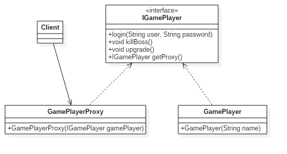

# 代理模式
---
代理模式：也叫委托模式。为其他对象提供一种代理以控制对这个对象的访问。

**类图** 

- Subject抽象主题角色 
抽象主题类可以是抽象类也可以是接口,是一个最普通的业务类型定义，无特殊要求。
- RealSubject具体主题类角色 
也叫做被委托角色、被代理角色，是业务逻辑的具体执行者
- Proxy代理主题角色 
也叫做委托类、代理类。它负责对真实角色的应用，把所有抽象主题类定义的方法限制委托给真实主题角色实现，并且在真实主题角色处理完毕前后做预处理和善后处理工作。

		//抽象主题接口
		public interface Subject {
			//定义一个方法
			public void request();
		}
	
		//真实主题类
		public class RealSubject implements Subject {
			//实现方法
			@Override
			public void request() {
				//业务处理逻辑
			}
		}
	
		//代理类
		public class Proxy implements Subject {
			//要代理的实现类
			private Subject subject = null;
			//默认被代理者
			public Proxy() {
				this.subject = new RealSubject();
			}

			//通过构造函数传递代理者
			public Proxy(Subject subject){
				this.subject = subject;
			}
			
			//实现接口中定义的方法
			@Override
			public void request() {
				this.before();
				this.subject.request();
				this.after();
			}

			//预处理方法
			private void before() {
				//doSomething
			}
			
			//后处理方法
			private void after() {
				//doSomething
			}
		}
		
## 代理模式的优点和使用场景
**优点**
- 职责清晰:真实角色就是实际的业务逻辑，不用关心其他的非本职责的事务。通过后期代理的代理完成一件事务，附带的结果就是编程简洁清晰。
- 高扩展性：具体角色是随时都变化的，只要它实现接口，代理类就可以不用做任何修改的情况下使用
- 智能化

**使用场景**
最经典的就是Spring的AOP,这是非常典型的动态代理模式。

例子代码参考，类图如下: 

## 代理类的个性化
代理类不仅仅可以实现主题类接口，也可以实现其他的接口完成不同的任务，而且代理的目的是在目标对象方法的基础上作增强，这种增强通常是对目标对象的方法进行拦截和过滤。

## 代理模式的扩展

### 普通代理
普通代理就是我们要知道代理的存在，也就是类似例子代码的GamePlayerProxy的存在，然会才能访问。
它的要求是客户端只能访问代理角色，而不能访问真实角色。代码见commonProxy文件夹 
**类图** 

### 强制代理
一般的思维是通过代理找到真实的角色，但是强制代理却是***强制***必须通过真实角色找到代理角色，否则不能访问。也就是说高层模块new一个真实角色，返回的却是代理角色。 
**类图** 

### 动态代理
动态代理是在实现阶段不用关心代理谁，而在运行阶段才指定代理哪一个对象。上面的例子都是静态代理。面向切面编程(AOP)，其核心就是采用动态代理机制。 
**类图** 

例子参考dynamicProxy文件夹，一个简单的AOP编程。对于日志、事务、权限等都可以在系统设计阶段不用考虑，而在设计后通过AOP的方法切过去，我们来看看通用的动态代理模型，类图如下 

上面的类图表示了两条发展的线路，动态代理实现代理的职责，业务逻辑Subject实现相关的逻辑功能，两者之间没有必然的相互耦合的关系。通知Advice从另一个切面切入，最终在高层模块也就是Clinet进行耦合，完成逻辑的封装。

	//抽象主题
	public interface Subject {
		//业务逻辑
		public void doSomething(String str);
	}

	//真实主题
	public class RealSubject implements Subject {
		//业务操作
		@Override
		public void doSomething(String str) {
			System.out.println("do something ----> " + str);
		}
	}

	//通知借口
	public interface IAdvice {
		public void exec();
	}
	
	public class BeforeAdvice implements IAdvice {
		@Override
		public void exec() {
			System.out.println("前置通知方法执行，方法发出通知");
		}
	}
重点是MyInvocationHandler类

	public class MyInvocationHander implements InvocationHandler {
		//被代理的对象
		public Object target;
		
		//通过构造函数传递一个对象
		public MyInvocationHandler(Object target) {
			this.target = target;
		}
	
		//代理方法
		public Object invoke(Object proxy, Method method, Object[] args)
						throws Throwable {
			//执行被代理的方法
			return method.invoke(this.target, args);
		}
	}
	
所有通过动态代理的方法全部通过invoke方法调用。DynamicProxy代码如下
	
	public class DynamicProxy<T> {
		public static <T> T newProxyInstance(ClassLoader loader, Class<?>[] interfaces, InvocationHander handler) {
			//寻找JoinPoint连接点，AOP框架使用元数据定义
			if(true) {
				//执行一个前置通知
				(new BeforeAdvice()).exec();
			}
			//执行目标方法，并返回结果
			return (T)Proxy.newProxyInstance(loader, interfaces, handler);
		}
	}
	
	//场景类
	public class Client {

	    public static void main(String[] args) {
	        //定义一个主题
	        Subject subject = new RealSubject();
	        //定义一个handler
	        InvocationHandler handler = new MyInvocationHandler(subject);
	        //获得class类的加载类loader
	        ClassLoader loader = subject.getClass().getClassLoader();
	        
	        //动态产生一个主题的代理
	        Subject proxy = (IGamePlayer) DynamicProxy.newProxyInstance(loader, subject.getClass().getInterfaces(), handler);
	        
	        //代理行为
			proxy.doSomething("proxy");
	    }
	}

运行结果如下所示： 
	
	前置通知方法执行，方法发出通知
	do something ----> proxy
动态类的调用过程

