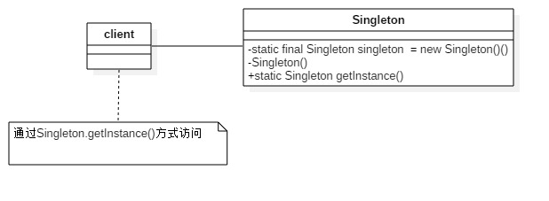

# 单例模式
---
## 单例模式的定义
**单例模式**（Singleton Pattern）是比较简单的模式,确保一个类只产生一个实例

**类图** 

### 单例模式的通用代码
	public class Singleton {
		private static final Singetlon = new Singelton();
		//设为私有方法（禁止其他类通过new生成新的实例）
		private Singelton() {
		}
		//通过该方法获得实例
		public Singelton getInstance() {
			return singelton;
		}
	}
## 单例模式的优缺点
**优点**： 
1、单例模式只有一个实例，减少内存开销。特别是一个对象频繁创建和销毁时，而且创建和销毁时性能又无法优化时，单例模式的优势就非常明显。 
2、 当一个对象的产生需要较多资源时（如读取配置、产生依赖关系等），则可以运用单例模式，永久驻留内存的方式来解决。 
3、避免对资源的多重占用。 
4、单例模式可以在系统设置全局的访问点，优化和共享资源访问。 
**缺点** 
1、单例模式没有借口，扩展困难。除了修改代码，没有其他途径。 
2、对测试不利。在并发环境中，单例没有完成，是不能进行测试的，没有借口也不能使用mock的方式虚拟一个对象。 
3、单例模式与单一职责原则有冲突。
## 单例的使用场景
在一个系统中，要求一个类有且仅有一个对象时，可以采用单例模式，例如:
- 要求生成唯一序列号的环境
- 在整个项目中需要一个共享访问点或共享数据
- 创建对象需要消耗太多资源
- 需要定义大量的静态常量和静态方法的环境(当然也可直接声明为static)

## 单例模式的注意事项
线程不安全的单例模式(懒汉模式)

	public class Singleton {
		private static Singleton singleton = null;

		private Singleton() {
		}

		public static Singleton getInstance() {
			if (singleton == null) {
				singleton = new Singleton();
			}
			return singleton;
		}
	}

## 单例模式的扩展
用于产生固定数量的实例，可以修正单例模式的性能问题，提高系统的响应速度。

	public class President {
		//总统的数量
	    private static int maxNum = 3;
	    //总统的集合
	    private static List<President> presidents = new ArrayList<President>();
	    //当前总统的编号
	    private static int index;
	    
	    static {
	        for (int i = 1; i <= maxNum; i++) {
	            presidents.add(new President("第" + i + "号总统"));
	        }
	    }
	    
	    //总统名字编号
	    private String name;
	    
	    private President(String name) {
	        this.name = name;
	    }
	    
	    public static President getInstance() {
	        Random random = new Random();
	        index = random.nextInt(maxNum);
	        return presidents.get(index);
	    }
	    
	    public void commond() {
	        System.out.println(this.name);
	    }
	
	    public String getName() {
	        return name;
	    }
	
	    public void setName(String name) {
	        this.name = name;
	    }
	}