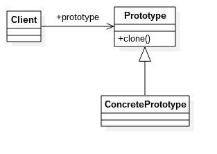

# 原型模式
---
原型模式：用原型实例指定创建对象的种类，并且通过拷贝这些原型创建新的对象,而不是new的方式。
原型模式的核心是一个clone方法，通过该方法进行对象的拷贝。Java本身提供了Cloneable接口用来标示对象是可拷贝的，对象实现该接口需要覆写clone()方法。
类图 

		public class Prototype implements Cloneable {
        	//覆写父类的方法
            @Override
            public Prototype clone() {
            	Prototype prototype = null;
                try {
                	prototype =(Prototype) super.clone();
                } catch (CloneNotSupportedException e) {
                	e.printStackTrace();
                }
                return prototype;
            }
        }
**注意**:super.clone()调用的是Object类的克隆方法。由于任何类都继承Object类，因此原型模式已经与Java紧密融合。

## 原型模式的优点和使用场景
**优点**
- 性能优良：原型模式是在内存二进制流的拷贝，要比直接new一个对象性能好很多，特别是要创建一个在循环内产生大量对象时，原型模式可以更好地体现其优点。
- 跳出构造函数的约束：***直接在内存中拷贝，构造函数不会执行***。优点是减少了构造函数的约束，缺点也是减少了构造函数的约束性。

**使用场景**
- 资源优化场景：类的初始化需要消耗非常多的资源(数据、硬件等)
- 性能和安全要求的场景：通过new产生一个对象需要非常繁琐的数据准备或访问权限，则可以使用原型模式。
- 一个对象多个修改者的场景：一个对象需要提供给其他对象访问时，而且各个调用者都可能修改其值时，可以考虑使用原型模式拷贝多个对象供调用者使用。

## 浅拷贝和深拷贝
通过例子来说明
	
    //浅拷贝
    public class People implements Cloneable {
    	int age = 20;
    	private ArrayList<String> alist = new ArrayList<String>();
        @Override
        public People clone() {
        	People people = null;
            try {
            	people = (People) super.clone();
            } catch (CloneNotSupportedException e) {
            	e.printStackTrace();
            }
            return people;
        }
        
        public void addValue(String value) {
        	this.alist.add(value);
        }
        
        public ArrayList<String> getValue() {
        	return this.alist;
        }
    }
    
    public class Client {
    	public static void main(String[] args) {
        	People people = new People();
            people.addValue("Tom");
            
            People p2 = people.clone();
            p2.addValue("Jack");
            p2.age = 22;
            
            System.out.println(people.getValue());
            
            System.out.println(people.age);
            System.out.println(p2.age);
        }
    }
运行结果:[Tom,Jack]
20
22
people类里之所以有Jack，是因为Object类提供的clone()方法只是拷贝了people类本身，people类内部的数组、引用对象等都不拷贝(还是指向people对象的内部元素的地址)——浅拷贝。换句话来讲：**浅拷贝——只拷贝基本数据类型和String类型，引用数据类型拷贝的只是内存地址。**一种不安全的方式。

		//深拷贝
        public class People implements Cloneable {
        	int age = 20;
            private ArrayList<String> alist = new ArrayList<String>();
            @Override
            public People clone() {
                People people = null;
                try {
                    people = (People) super.clone();
                    people.alist = (ArrayList<String>) this.alist.clone();
                } catch (CloneNotSupportedException e) {
                    e.printStackTrace();
                }
                return people;
            }

            public void addValue(String value) {
                this.alist.add(value);
            }

            public ArrayList<String> getValue() {
                return this.alist;
            }
        }
        
运行Client.java类的结果:[Tom] 
20
22
这就是深拷贝：引用对象分贝拷贝并赋值给拷贝对象。