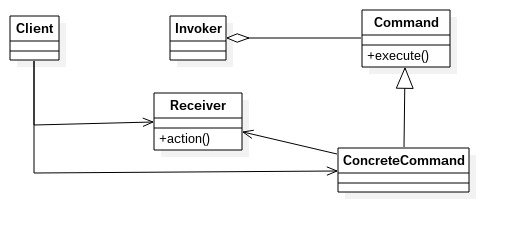
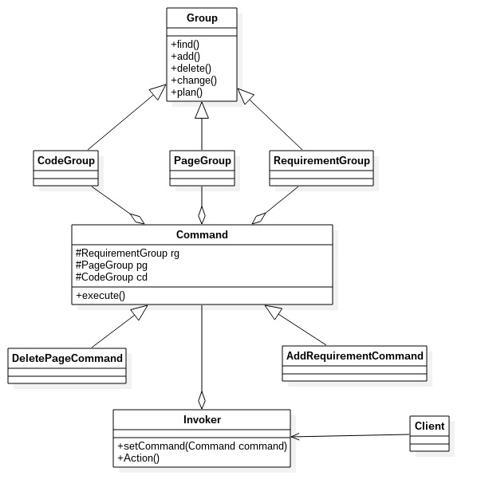

# 命令模式
---
### 命令模式的定义
命令模式是一个高内聚的模式，将一个请求封装成一个对象，从而让你使用不同的请求把客户端参数化，对请求排队或者记录请求日志，可以提供命令的撤销和恢复功能。
**类图**: 

在该类图中，我们看到三个角色
- Receiver——接收者角色：该角色就是干活的角色，命令传递到这里是应该被执行的。
- Command——命令角色：需要执行的所有命令都在这里声明。
- Invoker——调用者角色：收到命令，并执行命令。

### 通用代码
命令模式比较简单，但是在项目中非常频繁地使用，因为它的封装性非常好，把请求方和执行方分开，扩展性也有很好的保障，通用代码比较简单。
		
        //通用Receiver类
        public abstract class Receiver {
        	//抽象接受者，定义每个接受者都必须完成的业务
        	public abstract void doSomething();
        }
        
        //具体Receiver类
        public class ConcreteReceiver1 extends Receiver {
        	public void doSomething() {
            	System.out.println("doSomething1--->");
            }
        }
        
        public class ConcreteReceiver2 extends Receiver {
        	public void doSomething() {
            	System.out.println("doSomething2--->");
            }
        }

		//抽象的Command类
        public abstract class Command {
        	//每个命令都必须有一个执行命令的方法
            public abstract void execute();
        }
        
        //具体的Command类
        public class ConcreteCommand1 extends Command {
        	//对哪个Receiver类进行处理
            private Receiver receiver;
            
            //构造函数
            public CincreteCommand1(Receiver receiver) {
            	this.receiver = receiver;
            }
            
            //实现命令
            public void execute() {
            	this.receiver.doSomething();
            }
        }
        
        public class ConcreteCommand2 extends Command {
        	//对哪个Receiver类进行处理
            private Receiver receiver;
            
            //构造函数
            public CincreteCommand2(Receiver receiver) {
            	this.receiver = receiver;
            }
            
            //实现命令
            public void execute() {
            	this.receiver.doSomething();
            }
        }
        
        //调用类Invoker
        public class Invoker {
        	private Command command;
            
            //接收命令
            public void setCommand(Command command) {
            	this.command = command;
            }
            
            //执行命令
            public void action() {
            	this.command.execute();
            }
        }
        
        //场景类
        public class Client {
        	public static void main(String[] args) {
            	//首先声明调用者
                Invoker invoker = new Invoker();
                //定义接受者
                Receiver receiver = new ConcreteReceiver1();
                //定义一个关联接收者的命令
                Command command = new ConcreteCommand1(receiver);
                //命令由调用者去执行
                invoker.setCommand(command);
                invoker.action();
            }
        }
        
### 命令模式的优缺点
**优点**
- 类间解耦：调用者和接受者角色有没任何依赖关系
- 可扩展性：command子类非常容易扩展，而Invoker和Client不产生严重的代码耦合
- 命令模式与其他模式的结合会更优秀：可以和责任连模式结合，形成命令族解析任务；结合模板模式，可以减少Command子类的膨胀。

**缺点**
Command子类容易膨胀

### 命令模式例子
例子说明：软件公司给用户提供定制的ERP软件，软件公司内部为该项目配备了需求组(确认用户需求)、前端组(负责页面那和交互)、后端组(业务逻辑)来共同完成该项目。用户的负责人与软件公司的项目对接人协商，然后由对接人给各个小组发布命令——（增加需求、增加页面、增加功能）、（删除功能、删页面）、（修改页面）...等等。
例子代码参见command文件夹，例子类图如下:

