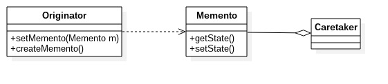
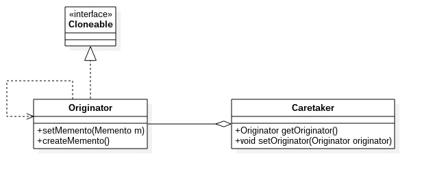
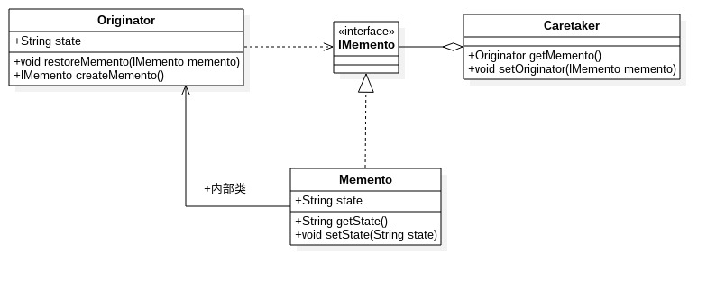

# 备忘录模式
---
备忘录模式：在不破坏封装性的前提下，破获一个对象的内部状态，并在该对象之外保存这个状态。这样以后就可将该对象恢复到原先保存的状态。备忘录模式就是一个对象的备份模式，提供了一种程序数据的备份方法。
**类图** 

类图中角色说明
- Originator发起人角色：记录当前时刻的内部状态，负责定义哪些属于备份范围的状态，负责创建和恢复备忘录数据
- Memento备忘录角色：负责存储Originator发起人对象的内部状态，再需要的时候提供发起人需要的内部状态
- Caretaker备忘录管理员角色：对备忘录进行管理、保存和提供备忘录。

        //发起人角色
        public class Originator {
            //内部状态
            private String state = "";

            public String getState() {
                return this.state;
            }

            public void setState(String state) {
                this.state = state;
            }

            //创建一个备忘录
            public Memento createMemento() {
                return new Memento(this.state);
            }

            //恢复一个备忘录
            public void restoreMemento(Memento menmento) {
                this.setState(memento.getState());
            }
        }

        //备忘录角色
        public class Memento {
            //发起人的内部状态
            private String state = "";

            //构造函数
            public Memento(String state) {
                this.state = state;
            }

            public String getState() {
                return this.state;
            }

            public void setState(String state) {
                this.state = state;
            }
        }

        //备忘录管理员角色
        public class Caretaker {
            //备忘录对象
            private Memento memento;

            public Memento getMemento() {
                return this.memento;
            }

            public void setMemento(Memento memento) {
                this.memento = memento;
            }
        }

        //场景类
        public class Client {
            public static void main(String[] args) {
                //定义发起人
                Originator origin = new Originator();
                //定义备忘录管理员
                Caretaker taker = new Caretaker();
                //创建一个备忘录
                taker.setMemento(origin.createMemento());
                //恢复一个备忘录
                origin.restoreMemento(taker.getMemento());
            }
        }

### 备忘录模式的应用
**应用场景**
- 需要保存和恢复数据的相关状态场景
- 提供一个可回滚的操作，比如Word中的ctrl+z组合键，浏览器中的回退按钮等
- 需要监控的副本场景中。例如要监控一个对象的属性，但是监控又不应该作为系统的主业务来调用，它只是边缘应用，即使出现监控不准、错误报警也影响不大，因此一般的做法是备份一个主线程中的对象，然后由分析程序分析
- 数据库连接的事务管理就是备忘录模式

**注意事项**
- 备忘录的生命周期：备忘录创建出来就要在“最近”的代码中使用，要主动管理它的生命周期，建立就要使用，不使用就要立即删除其引用，等待垃圾回收器对它的回收处理。
- 备忘录的性能：不要频繁建立备份的场景中使用备忘录，一、控制不了备忘录建立的对象数量；二、大对象的建立是要消耗资源的，系统性能需要考虑。

### 备忘录模式举例说明
实例：以保存游戏进度为例，在游戏角色大战Boss前将该角色的状态存储，与Boss作战后角色的各项能力会下降，如果没有通关，则可利用备忘录进行恢复到战前状态。
例子代码参见文件夹memento。

### 备忘录模式的扩展
##### clone方式的备忘录
**类图** 

类图中角色说明
- Originator发起人角色：从类图中可以看出，该角色融合了发起人和备忘录角色，具有双重功效。
- Carataker备忘录管理角色

        //融合备忘录角色的发起人角色
        public class Originator implements Cloneable {
            //内部状态
            private String state = "";

            public String getState() {
                return this.state;
            }

            public void setState(String state) {
                this.state = state;
            }

            //创建一个备忘录
            public Originator createMemento() {
                return this.clone();
            }

            //恢复一个备忘录
            public void restoreMemento(Originator originator) {
                this.setState(originator.getState());
            }

            //克隆当前对象
            @Override
            public Originator clone() {
                Originator originator = null;
                try {
                    originator = (Originator)super.clone();	//注意浅克隆和深克隆，状态都是基本数据类型，所以使用了浅克隆
                } catch (CloneNotSupportedException e) {
                    e.printStackTrace();
                }
                return originator;
			}
        }

        //备忘录管理员
        public class Caretaker {
            private Originator originator;

            public Originator getOriginator(){
                return this.originator;
            }

            public void setOriginator(Originator originator){
                this.originator = originator;
            }
        }
    
clone模式还可进一步优化

        //发起人自主备份和恢复
        public class Originator implements Cloneable {
            //发起人自己保存备份
            private Originator backup;
            //内部状态
            private String state = "";

            public String getState() {
                return this.state;
            }

            public void setState(String state) {
                this.state = state;
            }

            //创建一个备忘录
            public void createMemento() {
                this.backup = this.clone();
            }

            //恢复一个备忘录
            public void restoreMemento(Originator originator) throws NullPointerException {
                if(this.backup != null) {
                    this.setState(this.backup.getState());
                } else {
                    throw new NullPointerException();
                }
            }

            //克隆当前对象
            @Override
            public Originator clone() {
                Originator originator = null;
                try {
                    originator = (Originator)super.clone();	//注意浅克隆和深克隆，状态都是基本数据类型，所以使用了浅克隆
                } catch (CloneNotSupportedException e) {
                    e.printStackTrace();
                }
                return originator;
            }
        }

        //场景类
        public class Client {
            public static void main(String[] args) {
                //定义发起人
                Originator origin = new Originator();
                //建立初始状态
                origin.setState("状态良好");
                System.out.println("初始状态:" + origin.getState());

                //创建一个备忘录
                origin.createMemento();

                //修改状态
                origin.setState("状态还可以");
                System.out.println("修改后的状态:" + origin.getState());

                //恢复一个备忘录
                try {
                    origin.restoreMemento();
                } catch (NullPointerException e) {
                    e.printStackTrace();
                }
                System.out.println("恢复后的状态:" + origin.getState());
            }
        }

输出

        初始状态:状态良好
        修改后的状态:状态还可以
        恢复后的状态:状态良好

    
##### 多备份的备忘录模式
多状态的备份可以根据时间戳等信息，恢复制定的备份。

        public class Caretaker {
            //容纳备忘录的容器
            private Map<String, Memento> memMap = new HashMap<String, Memento>();

            public Memento getMemento(String idx) {
                return this.memMap.get(idx);
            }

            public void set(String idx, Memento memento) {
                this.memMap.put(idx, memento);
            }
		}

        //场景类
        public class Client {
            public static void main(String[] args) {
                //定义发起人
                Originator origin = new Originator();
                //定义备忘录管理员
                Caretaker taker = new Caretaker();
                //创建一个备忘录
                taker.setMemento("001", origin.createMemento());
                ...
                //一系列操作后在创建一个备忘录
                taker.setMemento("002", origin.createMemento());

                //恢复指定的备忘录
                origin.restoreMemento(taker.getMemento(“001”));
            }
        }

***注意***:内存溢出问题。该模式下备忘录一旦产生就装入内存，无法销毁回收。在系统设计时，要严格限定备忘录的创建，建议设置备忘录的上限数量，否则系统容易产生内存溢出情况！

##### 窄接口的备忘录模式
在系统管理上，一个备份的数据是安全。绝对不能修改的，它保证数据的洁净，避免数据污染而是备份失去意义。备份是不能被篡改的，也就说需要缩小备份出的备忘录的阅读权限，保证只能是发起人可读。
**类图** 

从类图中可以看出：
- 建立一个空接口IMemento——什么方法和属性都没有
- Originator发起人中建立一个private修饰的内置类Memento实现IMemento接口，同时也实现自己的业务逻辑

        //备忘录空接口
        public interface IMemento {
        }

        //发起人角色
        public class Originator {
            //内部状态
            private String state = "";

            public String getState() {
                return this.state;
            }

            public void setState(String state) {
                this.state = state;
            }

            //创建一个备忘录
            public Memento createMemento() {
                return new Memento(this.state);
            }

            //恢复一个备忘录
            public void restoreMemento(IMemento memento) {
                this.setState(((Memento)memento).getState());
            }

            //内置类
            private class Memento implements IMemento {
                //发起人的内部状态
                private String state = "";

                //构造函数
                public Memento(String state) {
                    this.state = state;
                }

                private String getState() {
                    return state;
                }

                private void setState(String state) {
                    this.state = state;
                }
            }
        }

         //备忘录管理员角色
        public class Caretaker {
            //备忘录对象
            private IMemento memento;

            public IMemento getMemento() {
                return this.memento;
            }

            public void setMemento(IMemento memento) {
                this.memento = memento;
            }
        }
    
在这里我们使用了一个新的设计方法：双接口设计。我们一个类可以实现多个接口，在系统设计时，如果考虑对象的安全问题，则可以提供两个接口，一个是业务的正常接口——实现必要的业务逻辑，叫做宽接口;另一个接口是一个空接口，什么方法都没有，其目的是提供给子系统外的模块使用，比如容器对象，这个叫做窄接口——窄接口中没有提供任何操作数据的方法，因此相对来说比较安全。