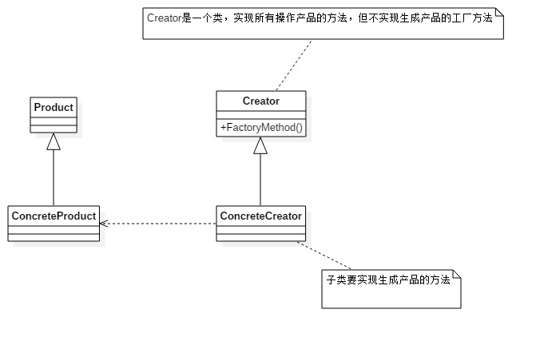

# 工厂方法模式
### 工厂方法模式的定义
>定义了一个创建对象的接口，但由子类决定要实例化的类是哪一个。工厂方法让类把实例化推迟到子类

类图 

**产品类**

	//抽象产品类
	public abstract class Product {
	    //产品类的公共方法
	    public void methodA() {
	        //业务逻辑
	        System.out.println("产品共有的方法");
	    }
	    
	    //抽象方法
	    public abstract void methodB();
	}

	//产品子类A
	public class ProductA extends Product {

	    @Override
	    public void methodB() {
	        //业务逻辑
	        System.out.println("产品A实现的方法");
	    }
	
	}

	//产品子类B
	public class ProductB extends Product {

	    @Override
	    public void methodB() {
	        //业务逻辑
	        System.out.println("产品B实现的方法");
	    }
	
	}
**工厂类**

	//抽象工厂
	Creator.javapublic abstract class Creator {

	    /**
	     * 创建一个产品对象，其输入参数类型可以自行设置，通常String,Enum,Class等，也可以为空
	     * @param c
	     * @return
	     */
	    public abstract <T extends Product> T createProduct(Class<T> c);
	    
	    public void request(Product product) {
	       product.methodB();
	    }
	}

	public class ConcreteCreator extends Creator {

	    @SuppressWarnings("unchecked")
	    @Override
	    public <T extends Product> T createProduct(Class<T> c) {
	        Product product = null;
	        try {
	            product = (Product) Class.forName(c.getName()).newInstance();
	        } catch (Exception e) {
	            //异常处理
	        }
	        return (T) product;
	    }
	
	}

**场景类**
	
	public class Client {
	    public static void main(String[] args) {
	        Creator creator = new ConcreteCreator();
	        Product product = creator.createProduct(ProductB.class);
	        creator.request(product);
	    }
	}

## 工厂模式的优点、应用场景

**优点**

- 良好的封装性，代码结果清晰
- 工厂方法模式扩展性非常优秀。在增加产品类的情况下，只需要设当的修改具体的工厂类或扩展一个工厂类。
- 屏蔽产品类。调用者不需要关心产品类的具体实现过程，只需关心产品的借口，只要借口保持不变，系统的上层模块就不需要发生变化。
- 工厂方法模式是典型的解耦框架。高层模块需要知道产品的抽象类，其他的实现类都不需要关心。

**应用场景**

- 当一个类不知道它所必须创建的对象的类的时候
- 当一个类希望由它的子类来指定它所创建的对象的时候
- 当类将创建对象的职责委托给多个帮助子类中的某一个，并且你希望将那一个帮助子类是代理者这一信息局部化的时候

## 工厂方法模式的扩展
### 缩小为简单工厂模式
**类图** 

	
从图中可以看得出简单工厂模式与标准的工厂模式仅有两个地方发生变化：

- 不需要再继承抽象工厂类
- 简单工厂模式的工厂类方法变为静态的（用static修饰）

		public class HumanFactory {
			public static <T extends Human> T createHuman(Class c) {
				Human human = null;
				try {
					human = (human) Class.forName(c.getName()).newInstance();
				} catch (Exception e) {
					e.printStackTrace();
				}
				return (T) human;
			}
		}
### 升级为多个工厂模式
**类图** 

- 项目复杂或产品类较多时，如果所有的产品类都方法一个工厂方法中初始化，会导致结构混杂不清和初始化方法巨大。此时可以针对产品类分类使用不同的工厂类来完成初始化的方法。
- 通过协调类来调用各个子工厂类（门面模式），对上层模块提供统一的访问接口。
	
		public class BlackHumanFactory extends AbstractHumanFactory {
			public Human createHuman() {
				return new BlackMan();
			}
		}

		public class BlackHumanFactory extends AbstractHumanFactory {
			public Human createHuman() {
				return new BlackMan();
			}
		}

		public class BlackHumanFactory extends AbstractHumanFactory {
			public Human createHuman() {
				return new BlackMan();
			}
		}

## 替代单例模式
	//单例类
	public class Singleton {
		private Singleton() {
		}
		public void doSomething() {
			//do something
		}
	}

	//单例工厂类
	public class SingletonFactory {
		private static Singleton singleton;
		if (singleton != null) {
			return singleton;
		}
		static {
			try {
				Class c1 = Class.forNmae(Singleton.class.getName());
				//获得无参构造方法
				Constructor method = c1.getDeclaredConstructor();
				//设置无参构造的访问权限
				method.setAccessible(true);
				//产生实例
				singleton = (singleton) c1.newInstance();
			} catch (Exception e) {
				e.printStackTrace();
			}
		}
	}

### 延迟初始化
延迟初始化:一个类被消费完毕后，并不立即释放，工厂类保持其初始化的状态，等待再次被使用。
延迟加载框架可以扩展，例如限制某一个产品类的最大实例化的数量，可以通过判断map中已有的对象数量来实现——JDBC连接数据库，都会设置MaxConnections最大连接数量，该数量就是内存中最大实例化的数量。
**类图**

	public class ProductFctory {
		private static final Map<String, Product> prMap = new HashMap<String, Product>();
		
		public static synchronized Product createProduct(String type) throws Exception {
			Product product = null;
			//如果Map中已经有这个对象
			if (prMap.containsKey(type)) {
				product = prMap.get(type);
			} else {
				if (type.equlas("ProductA")) {
					product = new ProductA();
				} else {
					product = new ProductB();
				}
				//同时把对象放到缓存容器中
				prMap.add(type, product);
			}
			return product;
		}
	}