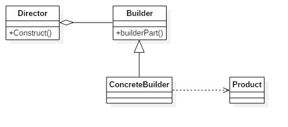
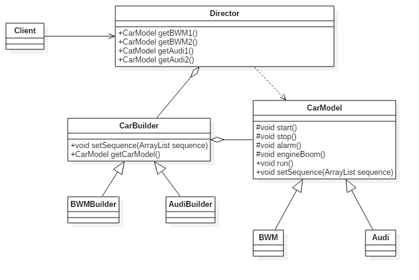

# 建造者模式
健在者模式：也叫生成器模式。定义：讲一个复杂对象的构建与它的表示分离，使得同样的构建过程可以创建不同的表示。 
建造者模式的通用类图：

在建造者模式中，有如下4个角色：
- Product产品类
通常是实现了模板方法模式，也就是有模板方法和基本方法，参照模板方法模式
- Builder抽象建造者
规范产品类的组建，一般是由子类实现。
- ConcreteBuilder具体建造者
实现抽象类定义的所有方法，并且返回一个组建好的对象。
- Director导演类
负责安排已有模板的顺序，然后告诉Builder开始建造。

		//产品类
		public class Product {
			public void doSomething() {
				//独立业务处理	
			}
		}

		//抽象建造者
		public abstract class Builder {
			//设置产品的不同部分，以获得不同的产品
			public abstract void setPart();

			//建造产品
			public abstract Product buildProduct();
		}
	
		//具体建造者
		public class ConcreteProduct extends Builder {
			private Product product = new Product();
			//设置产品零件
			public void setPart() {
				/*
				* 产品类的逻辑处理
				*/
			}
				
			//组建一个产品
			@Override
			public Product buildProduct() {
				return product;
			}
		}

	
		//导演类（场景类）
		public class Director {
			private Builder builder = new ConcreteProduct();
			//构建不同的产品
			public Product getProduct() {
				builder.setPart();
				/*
			 	* 设置不同的零件，产生不同的产品
				*/
				return builder.buildProduct();
			}
		}

## 建造模式的优点和使用场景
**优点**
- 封装性：使用建造者模式可以是客户端不必知道内部组成的细节。
- 建造者独立，容易扩展
- 便于控制细节风险：由于具体的建造者是独立的，因此对建造过程逐步细化，而不对其他模块产生任何影响

**使用场景**
- 相同的方法，不同的执行顺序，产生不同的事件结果时，可以采用建造者模式
- 多个部件或零件，都可以装配到一个对象中，但是产生的运行效果又不相同时，可以采用建造者模式
- 产品类非常复杂，或者产品类中的调用顺序不同产生不同效能，可以采用建造者模式
- 在对象的创建过程中会使用到系统中的一些其他对象，这些对象在产品对象的创建过程中不易得到时，也可以采用建造者模式封装该对象的创建过程。

**注意事项**
建造者模式关注的是对象的零件类型和装配工艺（顺序）—— 与工厂模式最大的不同 
例子：生产汽车，要求汽车的启动、发动机启动、警铃、停车可以自己定制化。例子代码参考文件夹builder

**类图** 
