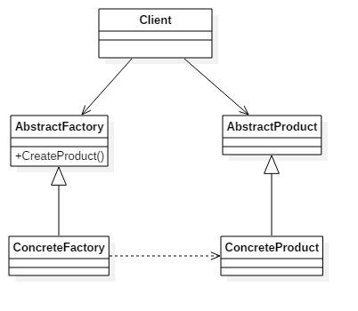
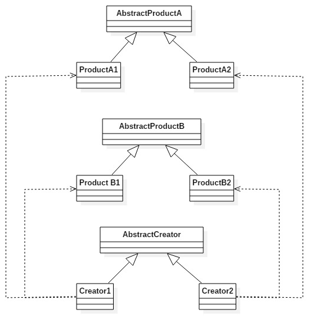

# 抽象工厂模式
**抽象工厂模式**：为创建一组相关或互相依赖的对象提供一个借口，而且无需指定它们的具体类。
抽象工厂模式是工厂模式的升级版本。 
**类图** 

我们来看看抽象工厂类的通用源代码，首先由两个互相影响的产品线（也叫产品族），例如制造汽车的左侧门和右侧门，这是数量相等的——两个对象之间的约束，每个型号的车门是不一样的，这是产品等级结构约束，两个产品族的类图如下： 

	
	//产品类
	public abstract class AbstractProductA {
	    //定义产品共有的方法
	    public void shareMethod() {
	    }
	    
	    //每个产品相同方法，不同实现
	    public abstract void doSomething();
	}

	public class ProductA1 extends AbstractProductA {
	
	    @Override
	    public void doSomething() {
	        System.out.println("ProductA1.doSomething()");
	    }
	
	}

	public class ProductA2 extends AbstractProductA {

	    @Override
	    public void doSomething() {
	        System.out.println("ProductA2.doSomething()");
	    }
	
	}
	
	...

	//工厂类
	public abstract class AbstractCreator {
	    //创建A产品族
	    public abstract AbstractProductA createProductA();
	    
	    //创建B产品族
	    public abstract AbstractProductB createProductB();
	}

	public class Creator1 extends AbstractCreator {

	    @Override
	    public AbstractProductA createProductA() {
	        return new ProductA1();
	    }
	
	    @Override
	    public AbstractProductB createProductB() {
	        return new ProductB1();
	    }
	
	}
	...

	//场景类
	public class Client {
	    public static void main(String[] args) {
	        AbstractCreator creator1 = new Creator1();
	        AbstractCreator creator2 = new Creator2();
	        //产生A1对象
	        AbstractProductA a1 = creator1.createProductA();
	        //产生A2对象
	        AbstractProductA a2 = creator2.createProductA();
	        //产生B1对象
	        AbstractProductB b1 = creator1.createProductB();
	        //产生B2对象
	        AbstractProductB b2 = creator2.createProductB();
	        /**
	         * 业务逻辑
	         */
	    }
	}

### 抽象工厂模式的优缺点
**优点** 
- 封装性，每个产品的实现类不是高层模块要关心的，高层模块之关心借口/抽象类；高层模块不需要关心对象是如何创建的，之需要调用相应的工厂类
- 产品族内的约束为非公开状态，高层模块不需要关心产品间的约束关系，具体的约束关系是在工厂内实现的。

**缺点** 
扩展非常困难——横向扩展容易，纵向扩展困难：增加产品类别AbstractProductC的产品族是容易的，只需在创建相应的工厂类；ProductA有相应的子类，扩展就困难了。