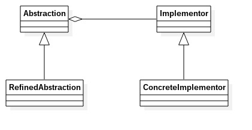
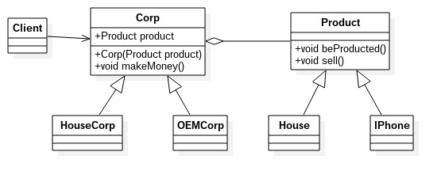

# 桥接模式
---
桥接模式：将抽象和实现解藕，使得两者可以独立地变化。桥接模式也叫桥梁模式。
**类图** 

类图中角色说明:
- Abstraction 抽象化角色
- Implmentor 实现化角色
- RefinedAbstraction 修正抽象化角色
- ConcreteImplementor 具体实现化角色

*注意：抽象角色引用实现角色，或者说抽象角色的部分实现是由实现角色完成的*

	//实现化角色
	public interface Implementor {
		//基本方法
		public void doSomething();
		public void doAnything();
	}

	public class ConcreteImplementor1 implements Implementor {
		@Override
		public void doSomething() {
			//业务逻辑
		}

		@Override
		public void doAnything() {
			//业务逻辑
		}
	}

	public class ConcreteImplementor2 implements Implementor {
		@Override
		public void doSomething() {
			//业务逻辑
		}

		@Override
		public void doAnything() {
			//业务逻辑
		}
	}

	public abstract class Abstraction {
		//定义对实现化角色的引用
		private Implementor imp;

		//约束子类必须实现该构造方法
		public Abstraction(Implementor imp) {
			this.imp = imp;
		}

		//定义自身的行为和属性
		public void request() {
			this.imp.doSomething();
		}

		public Implementor getImp() {
			return this.imp;
		}

		public void setImp(Implementor imp) {
			this.imp = imp;
		}
	}

	//集体抽象化角色
	public class RefinedAbstraction extends Abstraction {
		//覆写构造方法
		public RefinedAbstraction(Implementor imp) {
			super(imp);
		}

		@Override
		public void request() {
			//业务逻辑
			super.request();
			super.getImp().doAnything();
		}
	}

	//场景类
	public class Client {
		public static void main(String[] args) {
			//定义一个实现化角色
			Implementor imp = new ConcreteImplementor1();
			//定义一个抽象化角色
			Abstraction abs = new RefinedAbstraction(imp);
			//执行业务
			abs.request();
		}
	}
	
### 桥接模式的优缺点和应用场景
**优点**
- 抽象和实现分离：这是桥接模式的主要特点。实现可以不受抽象的约束，不用再绑定在一个固定的抽象层次上
- 优秀的扩充能力
- 实现细节对客户透明：客户不用关系细节的实现，它已经由抽象曾通过聚合关系完成封装

**应用场景**
- 不希望或者不适用使用继承方式的场景
- 接口或抽象类不稳定的场景
- 重要性要求较高的场景：设计的颗粒度越细，则被重用的可能性就越大，而采用继承则受到父类的限制，不能出现太细的颗粒度

**注意事项**
桥接模式比较简单，使用该模式时主要考虑如何拆分抽象和实现，并不是一涉及继承就要考虑使用该模式。桥接模式的意图还是对变化的封装，尽量把可能变化的因素封装到最细，最小的逻辑单元中，避免风险扩散。

### 桥接模式举例说明
有两个公式，一个是房企，一个是代工厂。房企的产品就是房子没啥变化，而代工厂的产品就有可能经常变化的，今天代工Iphone，明天代工小米，后天就有可能代工笔记本...
**类图** 

代码参见文件夹bridge