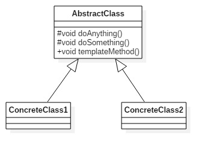
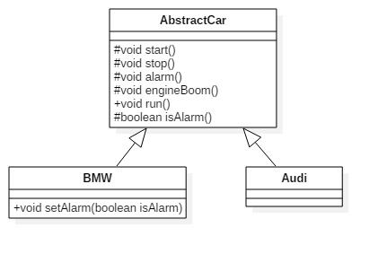

# 模板方法模式
定义一个操作中的算法的框架，而将一些步骤延迟到子类中。使得子类可以不变一个算法的结构即可重定义该算法的某些步骤。

**类图** 

模板方法模式非常简单，仅仅使用继承机制。其中AbstractClass叫做抽象模板，它的方法分为两类：

- 基本方法:也叫基本操作，是由子类实现的方法，并且在模板方法中被调用。
- 模板方法:实现对基本方法的调用，完成固定的逻辑。

**注意：为了防止恶意的操作，一般模板方法都加final关键字修饰，不允许被覆写**
	
	//抽象模板
	public abstract class AbstractClass {
		//基本方法
		protected abstract void doSomething();
		//基本方法
		protected abstract void doAnything();
		//模板方法
		public void templateMethod() {
			/*
			* 调用基本方法，完成相关逻辑
			×/
			this.doAnything();
			this.doSomething();
		}
	}

	//具体模板类
	public class ConcreteClass1 extends AbstractClass {
		//完成基本方法
		@Override
		protected void doAnything() {
			System.out.println("1类的doAnything()方法");
		}
		@Override
		protected void doSomething() {
			System.out.println("1类的doSomething()方法");
		}
	}

	//具体模板类
	public class ConcreteClass2 extends AbstractClass {
		//完成基本方法
		@Override
		protected void doAnything() {
			System.out.println("2类的doAnything()方法");
		}
		@Override
		protected void doSomething() {
			System.out.println("2类的doSomething()方法");
		}
	}

	//场景类
	public class Clinet {
		public static void main(String[] args) {
			AbstractClass class1 = new ConcreteClass1();
			AbstractClass class2 = new ConcreteClass2();
			//调用模板方法
			class1.templateMethod();
			class2.templateMethod();
		}
	}

**注意:抽象模板中的基本方法尽量设计为protected类型，符合迪米特法则，不需要暴露的属性或方法尽量不要设置为protected类型。实现类若非必要，尽量不要扩大父类中的访问权限。**

### 模板方法的优缺点
**优点** 

- 封装不变部分，扩展可变部分。把不变部分的算法封装到父类实现，而可变部分则可以通过继承来继续扩展。
- 提取公共部分代码，便于维护
- 行为由父类控制，子类实现

**使用场景**
 
- 多个子类共有的方法，并且逻辑基本相同；
- 重要、复杂的算法，可以把核心算法设计为模板方法，周边的相关细节功能则有各个子类实现；
- 重构时，模板方法模式是一个经常使用的模式，把相同的代码抽取到父类中，然后通过钩子函数（参见“模板方法模式的扩展”）约束其行为。

### 模板方法模式的扩展
钩子函数:由场景类或子类来决定模板方法中的基本方法是否起作用。
例如：汽车模板类 

	
	//抽象模板类
	public abstract class AbstractCar {
		protected abstract void start();
		protected abstract void stop();
		protected abstract void alarm();
		protected abstract void engineBoom();
		//模板方法
		public final void run() {
			//发动
			this.start();
			//引擎工作
			this.engineBoom();
			//要喇叭响就响，不响就不响
			if(this.isAlarm()) {
				this.alarm();
			}
			//停车
			this.stop();
		}

		//钩子方法，默认喇叭是会响的
		protected boolean isAlarm() {
			return true;
		}
	}
isAlarm()是钩子方法，其作用是模板方法根据其返回值决定是否要响喇叭，子类可以覆写该返回值。
	
	public class BWM {
		private boolean alarmFlag = true; //要喇叭响
	    @Override
	    protected void alarm() {
	        System.out.println("宝马鸣笛");
	    }
	    
	    @Override
	    protected void engineBoom() {
	        System.out.println("宝马发动机声音是这样的");
	    }
	
	    @Override
	    protected void start() {
	        System.out.println("宝马发动");
	    }
	    
	    @Override
	    protected void stop() {
	        System.out.println("宝马停车");
	    }
	    
	    //覆写钩子方法
	    @Override
	    protected boolean isAlarm() {
	        return this.alarmFlag;
	    }
	    
	    //要不要喇叭，是由高层模块决定
	    public void setAlarm(boolean isAlarm) {
	        this.alarmFlag = isAlarm;
	    }
	}

	public class Audi {
		
		@Override
	    protected void alarm() {
	        System.out.println("奥迪鸣笛");
	    }
	    
	    @Override
	    protected void engineBoom() {
	        System.out.println("奥迪发动机声音是这样的");
	    }
	
	    @Override
	    protected void start() {
	        System.out.println("奥迪发动");
	    }
	    
	    @Override
	    protected void stop() {
	        System.out.println("奥迪停车");
	    }
	    
	    //覆写钩子方法
	    @Override
	    protected boolean isAlarm() {
	        return false;   //默认不需要喇叭
	    }
	}

	//场景类
	public class Client {
		public static void main(String[] args) throws IOException {
			System.out.println("----宝马-----");
			System.out.println("宝马是否需要喇叭？0-不需要 1-需要");
			String type = (new BufferedReader(new InputStreamReader(System.in))).readLine();
			BWM bwm = new BWM();
			if(type.equals("0")) {
				bwm.setAlarm(false);
			}
			bwm.run();
			
			System.out.println("----奥迪-----");
			Audi audi = new Audi();
			audi.run();
		}
	}

输出

	----宝马-----
	宝马是否需要喇叭？0-不需要 1-需要
	1
	宝马发动
	宝马发动机声音是这样的
	宝马鸣笛
	宝马停车
	----奥迪-----
	奥迪发动
	奥迪发动机声音是这样的
	奥迪停车

	----宝马-----
	宝马是否需要喇叭？0-不需要 1-需要
	0
	宝马发动
	宝马发动机声音是这样的
	宝马停车
	----奥迪-----
	奥迪发动
	奥迪发动机声音是这样的
	奥迪停车

