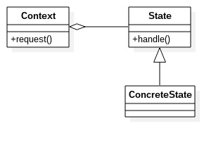
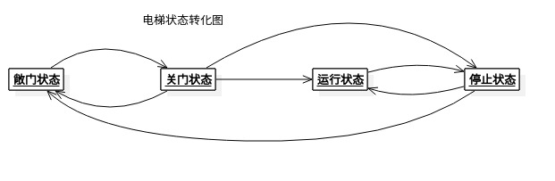
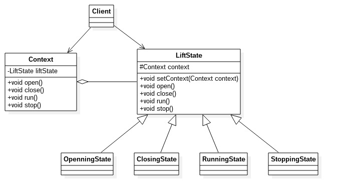

# 状态模式

- - -

状态模式：当一个对象内在状态改变时允许其改变行为，这个对象看起来像改变了类。状态模式的核心是封装，状态的变更引起了行为的变更，从外部看起来好像这个对象对应的类发生了改变一样。
**类图** 

类图中角色说明：
- State 抽象状态角色：接口或抽象类，负责对象状态定义，并且封装环境角色以实现状态的切换
- ConcreteState 具体状态角色：每一个具体状态必须完成的两个职责——本状态的行为管理以及趋向状态处理
- Context 环境角色：定义客户端角色，负责具体状态的切换

		//抽象状态角色
		public abstract class State {
			//定义一个环境角色
			protected Context context;

			//设置环境角色
			public void setContext(Context context) {
				this.context = context;
			}

			//行为
			public abstract void handleA();

			public abstract void handleB();
		}

		//具体状态角色
		public class ConcreteState1 extends State {
			@Override
			public void handleA() {
				//本状态下的业务逻辑
				System.out.println("ConcreteState1 ---> handleA");
			}

			@Override
			public void handleB() {
				//本状态下的业务逻辑
				System.out.println("ConcreteState1 ---> handleB");
			}
		}

		public class ConcreteState2 extends State {
			@Override
			public void handleA() {
				//本状态下的业务逻辑
				System.out.println("ConcreteState2 ---> handleA");
			}

			@Override
			public void handleB() {
				//本状态下的业务逻辑
				System.out.println("ConcreteState2 ---> handleB");
			}
		}

		//具体环境角色
		public class Context {
			//定义状态
			public final static State STATE1 = new ConcreteState1();
			public final static State STATE2 = new ConcreteState2();

			//当前状态
			private State current;

			public State getCurrent() {
				return this.current;
			}

			public void setCurrent(State state) {
				this.current = state;
			}

			//行为委托
			public void handleA() {
				this.current.handleA();
			}

			public void handleB() {
				this.current.handleB();
			}
		}

		//场景类
		public class Client {
			public static void main(String[] args) {
				//定义环境角色
				Context context = new Context();
				//初始化状态
				context.setCurrent(Context.STATE1);

				context.handleA();
				context.handleB();

				context.setCurrent(Context.STATE2);
				context.handleA();
				context.handleB();
			}
		}
	
### 状态模式的优缺点和应用场景
**优点**
- 结构清晰
- 遵循设计原则
- 封装性好

**缺点**
一个状态一个类，容易导致类的膨胀

**应用场景**
- 行为随状态改变而改变的场景
- 条件、分支判断语句的替代者

### 状态模式举例说明
电梯
- 敞门状态
- 关门状态
- 运行状态
- 停止状态

之所以拿电梯举例，是因为电梯的状态转换比单纯的链式状态(状态A --> 状态B --> 状态C --> 状态D )更有意义。
电梯各个状态的转化图: 

类图如下 

代码参见state文件夹
