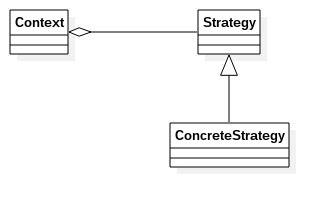

# 策略模式
---
策略模式:定义一组算法，将每个算法都封装起来，并且使它们之间可以互换。
类图: 

类图中角色说明:
- Context封装角色：也叫上下文角色，起承上启下的作用，屏蔽高层模块对策略、算法的直接访问，封装可能存在的变化。
- Strategy抽象策略角色：策略、算法家族的抽象，通常为接口。定义每个策略或算法必须有具体的方法和属性
- ConcreteStrategy具体的策略角色：实现抽象策略中的操作
		
        //抽象策略角色
        public interface Strategy {
        	//策略模式的运算法则
            public void doSomething();
        }
        
        //具体策略角色
        public class ConcreteStrategy1 implements Strategy {
        	@Override
            public void doSomething() {
            	System.out.println("具体策略1的运算法则");
            }
        }
        
        public class ConcreteStrategy2 implements Strategy {
        	@Override
            public void doSomething() {
            	System.out.println("具体策略2的运算法则");
            }
        }
        
        //封装角色
        public class Context {
        	//抽象角色
            private Strategy strategy = null;
            
            //构造函数
            public Context(Strategy strategy) {
            	this.strategy = strategy;
            }
            
            //封装后的策略方法
            public void doAnything() {
            	this.strategy.doSomething();
            }
            
            public void setStrategy(Strategy strategy) {
            	this.strategy = strategy;
            }
            
            public Strategy getStrategy() {
            	return this.strategy;
            }
        }
        
        
        //场景类
        public class Client {
        	public static void main(String[] args) {
            	//声明一个具体的策略
                Strategy strategy = new ConcreteStrategy1();
                //声明封装类
                Context context = new Context(strategy);
                //执行封装的方法
                context.doAnything();
            }
        }
        
### 策略模式的优缺点和使用场景
**优点**
- 算法可以自由切换
- 避免使用多重if...else...判断
- 扩展性良好

**缺点**
- 策略类数量增多
- 所以的策略都需要对外暴露

**使用场景**
- 多个类只有在算法或行为上稍有不同的场景
- 算法需要自由切换的场景
- 需要屏蔽算法规则的场景

策略模式举例说明:刘备去吴国迎娶孙尚香的故事中，在他们出发前，诸葛亮交给赵云三个锦囊妙计，并叮嘱赵云在适当的时机一次打开三个锦囊按机行动。这可以按策略模式来模拟，锦囊就是一个个的策略。例子代码参见strategy文件夹。

### 策略模式的扩展
主要是与枚举的联合使用。
举例子：加减乘除四则运算

		//计算策略
        public enum Calculator {
            //加法
            ADD("+") {

                @Override
                public int execute(int a, int b) {
                    return a + b;
                }

            }, 
            //减法
            SUB("-") {

                @Override
                public int execute(int a, int b) {
                    return a - b;
                }

            },
            //乘法
            mult("*") {

                @Override
                public int execute(int a, int b) {
                    return a * b;
                }

            },
            //除法
            div("/") {

                @Override
                public int execute(int a, int b) {
                    return a / b;
                }

            };

            private String symbol;

            public void setSymbol(String symbol) {
                this.symbol = symbol;
            }

            //私有构造方法
            private Calculator(String symbol) {
                this.symbol = symbol;
            }

            public static Calculator getCalculator(String symbol) {
                for(Calculator cal : Calculator.values()) {
                    if(cal.getSymbol().equals(symbol)) {
                        return cal;
                    }
                }
                return null;
            }

            //声明一个抽象方法（只演示int型的运算）
            public abstract int execute(int a, int b);

            public String getSymbol() {
                return symbol;
            }
        }
        
        public class Client {
            public static void main(String[] args) {
                System.out.println("输入形如 a op b 的运算式子");
                Scanner in = new Scanner(System.in);
                System.out.print("输入参数 a : ");
                int a = in.nextInt();

                System.out.print("输入运算符 op : ");
                String symbol = in.next();

                System.out.print("输入参数 b : ");
                int b = in.nextInt();

                Calculator cal = Calculator.getCalculator(symbol);
                System.out.println("计算结果:" + a + " " + symbol + " " + b + " = " + cal.execute(a, b));
            }
        }
