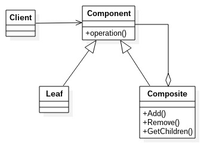

# 组合模式
---
组合模式:将对象组合成树形结构以表示“整体——部分“的层次结构，使得用户对单个对象和组合对象的使用具有一致性。组合模式也叫做合成模式或部分——整体模式，主要用来描述部分与整体的关系。

类图: 

类图中角色说明:
- Component抽象构件角色：定义参加组合对象的共有方法和属性，可以定义一些默认的行为或属性。
- Leaf叶子构件
- Composite树枝构件：它的作用是组合树枝节点和叶子节点形成一个树形结构。

		//抽象构件
        public abstract class Component {
        	//个体和整体都具有的共享
            public void doSomething(){
            	//业务逻辑
                System.out.println("component--->doSomething");
            }
        }
        
        //树枝构件
        public class Composite extends Component {
        	//构件集合
            private List<Component> list = new ArrayList<Component>();
            
            //增加一个叶子节点或树枝节点
            public void add(Component component) {
            	this.list.add(component);
            }
            
            //删除节点
            public void remove(Component component) {
            	this.list.remove(component);
            }
            
            //获取所有的节点
            public List<Component> getChildren() {
            	return this.list;
            }
        }
        
        //树叶节点
        public class Leaf extends Component {
        	@Override
            public void doSomething() {
            	System.out.println("Leaf--->doSomething");
            }
        }
        
        //场景类
        public class Client {
        	public static void main(String[] args) {
            	//创建一个根节点
                Composite root = new Composite();
                root.doSomething();
                //创建一个树枝节点
                Composite branch = new Composite();
                //创建一个叶子节点
                Leaf leaf = new Leaf();
                root.add(branch);
                branch.add(leaf);
                display(root);
            }
            
            public static void display(Composite root) {
            	for(Component c : root.getChildren()) {
                	if(c instanceof Leaf) {
                    	c.doSomething();
                    } else {
                    	display((Composite)c);
                    }
                }
            }
        }
        
### 组合模式的优缺点和使用场景
**优点**
- 高层模块调用简单：一个树形结构的所有节点都是Component，局部和整体对调用者来说没有区别。
- 节点自由增加：增减一个节点，只需知道父节点就可以操作

**缺点**
使用场景中，可以观察到树枝节点和树叶节点的使用是直接使用了实现类，没有面向接口或抽象类。

**使用场景**
- 维护和展示部分-整体关系的场景，如树形菜单、文件和文件夹管理
- 从一个整体中能够独立出部分模块或功能的场景

### 组合模式举例说明
以简单的公司架构来说明组合模式，相关代参见composite文件夹，
公司组织架构图如下:

程序类图： 

### 组合模式的扩展
**透明组合模式**
组合模式的实现：透明模式和安全模式(上面所讲的就是安全模式);
透明模式的类图: 

通过类图的对比，可以清楚的看出透明模式就是把用来组合树状结构使用的方法放到了抽象类中。因此Leaf和Composite具有了相同的结构。

		//抽象构件
        public abstract class Component {
        	//个体和整体都具有的共享
            public void doSomething(){
            	//业务逻辑
                System.out.println("component--->doSomething");
            }
            
            public abstract void add(Component component);
            public abstract void remove(Component component);
            public abstract void List<Component> getChildren();
        }
        
        //叶子节点
        public class Leaf extends Component {
        	
            @Override
            public void doSomething() {
            	System.out.println("Leaf--->doSomething");
            }
            
        	@Override
        	@Deprecated
            public void add(Component component) throws UnsupportedOperationException {
            	//空实现，抛出不支持异常
                throw new UnsupportedOperationException();
            }
            
            @Override
            @Deprecated
            public void remove(Component component) throws UnsupportedOperationException {
            	//空实现，抛出不支持异常
                throw new UnsupportedOperationException();
            }
            
            @Override
            @Deprecated
            public void getChildren(Component component) throws UnsupportedOperationException {
            	//空实现，抛出不支持异常
                throw new UnsupportedOperationException();
            }
        }
        
        //场景类
        public class Client {
        	public static void main(String[] args) {
            	...
            }
            
            public static void display(Component root) {
            	for(Component c : root.getChildren()) {
                	if(c instanceof Leaf) {
                    	c.doSomething();
                    } else {
                    	display(c);
                    }
                }
            }
        }
        
透明模式与安全模式相比是面向接口或抽象类的，但处理不当运行时需要解决异常问题。
