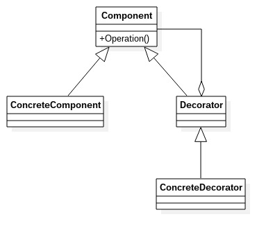

# 装饰模式
---
装饰模式：动态的给一个对象添加一些额外的职责。就增加功能来说，装饰模式比生成子类更加灵活。
**类图**： 

类图中角色说明:
- Component抽构件：接口或抽象类
- ConcreteComponent具体构件：是最核心、最原始、最基本的接口或抽象类的实现，我们就是要装饰它，给他赋予额外的功能
- Decorator装饰角色:抽象类，它的属性里有一个私有属性指向Component抽象构件
- ConcreteDecorator:具体的装饰者

		//抽象构件
        public abstract class Component {
        	//抽象方法
            public abstract void operate();
        }
        
        //具体构件
        public class ConcreteComponent extends Component {
        	//具体实现能
            @Override
            public void operate() {
            	System.out.println("do Something....");
            }
        }
        
        //装饰者通常都是抽象类
        public abstract class Decorator extends Component {
        	private Component component = null;
            //构造函数
            public Decorator(Component component) {
            	this.component = component;
            }
            
            //委托给被修饰者执行
            @Override
            public void operate() {
            	this.component.operate();
            }
        }
        
        //具体的装饰类
        public class ConcreteDecorator1 extends Decorator {
        	//定义被装饰者
            public class ConcreteDecorator1(Component component) {
            	super(component);
            }
            
            //定义自己的装饰方法
            private void method1() {
            	System.out.println("method1 修饰");
            }
            
            @Override
            public void operate() {
            	this.method1();
                super.operate();
            }
        }
        
        public class ConcreteDecorator2 extends Decorator {
        	//定义被装饰者
            public class ConcreteDecorator2(Component component) {
            	super(component);
            }
            
            //定义自己的装饰方法
            private void method2() {
            	System.out.println("method2 修饰");
            }
            
            @Override
            public void operate() {
            	this.method1();
                super.operate();
            }
        }
        
        //场景类
        public class Client {
        	public static void main(String[] args) {
            	Component component = new ConcreteComponent();
                
                Component d1 = new ConcreteDecorator1(component);
                Component d2 = new ConcreteDecorator2(d1);
                d2.operate();
            }
        }
        
### 装饰模式的优缺点和使用场景
**优点**
- 装饰类和被装饰类可以独立发展，而不会相互耦合。换句话说，Component类无须知道Decorator类，Decorator类是从外部扩展Component类的功能，而Decorator类也不用知道具体的构件。
- 装饰模式是继承关系的一个替代方案。
- 装饰模式可以动态地扩展一个实现类。

**缺点**
多层装饰比较复杂，应尽量减少装饰类的数量，以便降低系统的复杂度。

**使用场景**
- 需要动态扩展一个类，或给一个类增加附加功能
- 需要动态地给一个对象增加功能，这些功能可以动态地撤销
- 需要为一批的兄弟类进行改装或增加功能

现在来看装饰模式，就是静态代理。关于静态代理部分请参见代理模式中的代理模式(二).md文件，其中详细叙述了继承方式与聚合方式的比较。