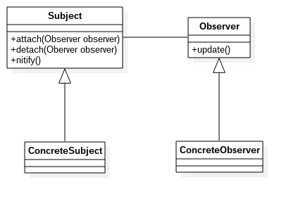

# 观察者模式
---
观察者模式:定义对象间一对多的依赖关系，使得每当一个对象改变状态，则所有依赖与它的对象都会得到通知并被自动更新。观察者模式也加发布订阅模式。 
**类图** 

类图中角色说明：
- Subject被观察者：它一般是抽象类或者是实现类，定义了被观察者必须实现的职责：管理观察者和通知观察者。
- Observer观察者：观察者收到消息后，立即对消息进行处理。
- ConcreteSubject具体的被观察者：定义自身的业务逻辑，同时定义对那些事件进行通知
- ConcreteObserver具体的观察者

        //被观察者
        public abstract class Subject {
            //定义一个观察者集合
            private Vector<Observer> observers = new Vector<Observer>();

            //增加观察者
            public void addObserver(Observer observer) {
                this.observers.add(observer);
            }

            //删除一个观察者
            public void removeObserver(Observer observer) {
                this.observers.remove(observer);
            }

            //通知所有的观察者
            public void notify() {
                for(Observer obs : observers) {
                    obs.update();
                }
            }
        }

        //具体被观察者
        public class ConcreteSubject extends Subject {

            public void doSomething() {
                //定义自身业务逻辑
                System.out.println("ConcreteSubject---->doSomething");

                //执行通知
                super.notify();
            }
        }

        //观察者
        public interface Observer {
            //更新方法
            public void update();
        }

        //具体观察者
        public class ConcreteObserver implements Observer {
            @Override
            public void update() {
                System.out.println("接收到信息，并进行处理!");
            }
        }

        //场景类
        public class Client {
            public static void main(String[] args) {
                //创建一个被观察者
                ConcreteSubject sub = new ConcreteSubject();
                //定义观察者
                Observer obs = new ConcreteObserver();
                //关联两者
                sub.addObserver(obs);

                sub.doSomething();
            }
        }
        
### 观察者模式的优缺点和应用场景
**优点**
- 观察者和被观察者之间是抽象耦合
- 建立一套触发机制

**缺点**
观察者模式需要考虑开发效率和运行效率问题，一个被观察者、多个观察者，开发和调试比较复杂。而且Java中消息的通知默认是顺序执行，一个观察者卡壳，会影响整体的执行效率。

**应用场景**
- 关联行为场景。
- 事件多级触发场景
- 跨系统的消息交换场景，如消息队列的处理机制

### 观察者模式举例说明
在java.util包中提供了Observable类和Observer接口，使用它们即可完成观察者模式。被观察者需要继承Observable类，Observable类的常用方法如下表

| 序 号 | 方  法 | 描 述 |
|:----:|:------|:-----|
|1|public void addObserver(Observer o)|添加一个观察者|
|2|public void deleteObserver(Observer o)|删除一个观察者|
|3|protected void setChanged()|被观察者状态发生变化|
|4|protected void notifyObservers(Object arg)|通知所有观察者状态改变|
Observer接口定义如下

    public interface Observer {
        void update(Observable o, Object arg);
    }
以房价为例子，用代码说明

	//房屋——被观察者
	public class House extends Observable {
    	//房屋价格
        private int price;

        public House(int price) {
            this.price = price;
        }

        public int getPrice() {
            return price;
        }

        public void setPrice(int price) {
            super.setChanged();		//设置变化点
            super.notifyObservers(price); 		//通知所有观察者价格变化
            this.price = price;
        }

        public String toString() {
            return "房子价格为：" + this.price;
        }
    }
    
    //消费者——观察者
    public class Consumer implements Observer {
        private String name;

        public Consumer(String name) {
            this.name = name;
        }

        @Override
        public void update(Observable o, Object arg) {
            System.out.println(name + "观察到价格变更为：" + arg);
        }

        public String getName() {
            return name;
        }

        public void setName(String name) {
            this.name = name;
        }
    }
    
    //场景类
    public class Client {
        public static void main(String[] args) {
            House house = new House(10000);
            Observer obs1 = new Consumer("购房者A");
            Observer obs2 = new Consumer("购房者B");
            Observer obs3 = new Consumer("购房者C");
			//关联观察者和被观察者
            house.addObserver(obs1);
            house.addObserver(obs2);
            house.addObserver(obs3);

            System.out.println("当前-->" + house);
            System.out.println("房子价格准备变动");
            house.setPrice(20000);
            System.out.println("变动后-->" + house);
        }
    }
    
输出

	当前-->房子价格为：10000
    房子价格准备变动
    购房者C观察到价格变更为：20000
    购房者B观察到价格变更为：20000
    购房者A观察到价格变更为：20000
    变动后-->房子价格为：20000
    