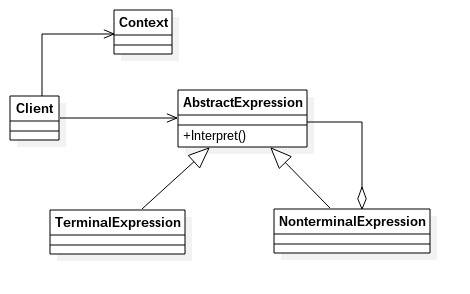
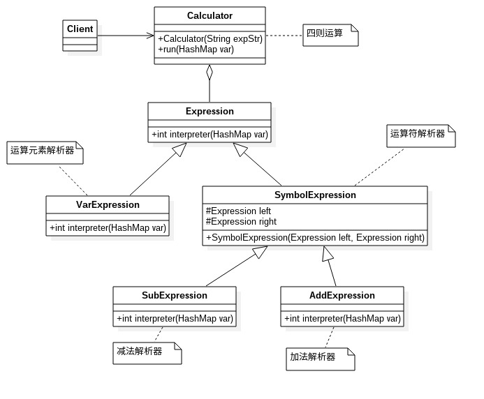

# 解释器模式
---
解释器模式：给定一门语言，定义它的文法的一种表示，并定义一个解释器，该解释器使用该表示来解释语言中的句子。也就是按照规定的语法进行解析的方案，在现在的项目中使用的较少。
** 类图 ** 

类图中角色说明：
- AbstractExpression 抽象解释器
- TeeminalExpression 终结符表达式：实现与文法中的操作相关联的解释操作，通常一个解释器模式中只有一个终结符表达式，但有多个实例。对应不同的终结符。
- NonterminalExpression 非终结符表达式：文法中的每条规则对应一个非终结表达式，非终结符表达式根据逻辑的复杂程度而增减，原则上每个文法规则都对应一个非终结符表达式
- Context 环境角色

		//抽象表达式
		public abstract class Expression {
			//每个表达式必须有一个解析任务
			public abstract Object interpreter(Context ctx);
		}
		
		//终结符
		public class TerminalExpression extends Expression {
			//通常终结符表达式只有一个，但有多个实例
			public Object interpreter(Context ctx) {
				return null;
			}
		}
		
		//非终结符
		public class NonterminalExpression extends Expression {
			//每个非终结符表达式都会对其他表达式产生依赖
			public NonterminalExpression(Expression... expression) {
				
			}
			
			public Object interpreter(Context ctx) {
				//进行文法处理逻辑
				// do something
				return null;
			}
		}
		
		//客户类
		public class Client {
			public static void main(String[] args) {
				Context ctx = new Context();
				//通常定一个语法容器，容纳一个具体的表达式
				Stack<Expression> stack = null;
				for(;;) {
					//进行语法判断，并产生递归调用
				}
				//产生一个完整的语法树，由各个具体的语法分析进行判断
				Expression exp = stack.pop();
				//具体元素进入场景
				exp.interpreter(ctx);
			}
		}

### 解释器模式的优缺点和应用场景
** 优点 **：扩展性：修改语法规则只需要修改相应的非终结符表达式就可以了;若扩展语法，则只要新增非终结符类就可以

** 缺点 **
- 解释器模式会引起类膨胀
- 采用递归调用
- 效率问题

** 应用场景**
- 重复发生的问题可以是使用解释器模式
- 一个简单语法需要解释的场景。一般用来解析比较标准的字符集，如SQL语法分析

** 注意事项 **
尽量不要在重要的模块中使用解释器模式。否则维护会是一个很大的问题

### 解释器模式举例说明
说明：实现加减法的运算，输入运算公式和参数，计算出结果。
类图： 

例子代码参见expression文件夹
结果输出
	
	请输入表达式：a-b+c
	2
	5
	9
	运算结果为：a-b+c=6